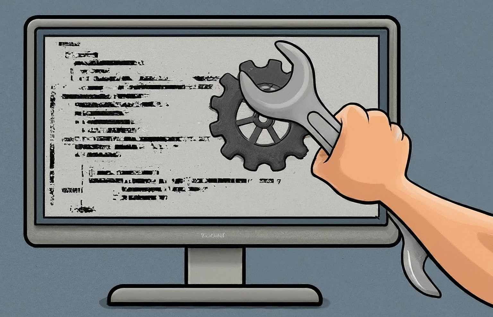

# Technical Properties of Sustainable Software

#### Contributed by [Roscoe A. Bartlett](https://github.com/bartlettroscoe)

#### Publication date: September 27, 2024

<!-- begin deck -->
While there are many different enablers or obstacles to software sustainability, some of the most important are related to the technical properties of the software itself, independent of any individual developer, development team, user community, or funding source.
<!-- end deck -->

While some authors have looked at software sustainability from primarily institutional and social perspectives,[5] here we consider vital technical properties of the software itself that help to improve sustainability and some development practices that aid in the creation and maintenance of sustainable software with these technical properties.

## Definitions of sustainable software

Various definitions of "software sustainability" exist in the software development community.
The Better Scientific Software (BSSw.io) community defines software sustainability as[1]:

> The ability of software to continue or evolve.
> Considerations often differ when viewed from various perspectives (user, developer, manager, funder), but generally relate to resources to maintain or evolve the code, as well as adaptability of the codebase to new uses and new computational platforms.

and as[2]:

> Sustainable software means that an existing product remains viable in the future such that it makes sense to continue using, adapting, and expanding its capabilities instead of replacing it with another new or existing product.

and:

> Sustainability is a measure of the cost to maintain and improve a product over its lifetime.

With this latter viability/cost perspective in mind, we define three different **levels of sustainable software**:

* **Weak definition**: The same team of developers who originally created the software can continue to add new features and fix bugs in the software at a reasonable cost (i.e., where starting from scratch would be more expensive, even in the long term).

* **Medium definition**: New developers can reasonably make contributions to the software, but these contributions are integrated back by the original development team.

* **Strong definition**: A different set of developers from the original developers can take over new feature development and bug fixes, and the original developers can go away (and the new team can do so cheaper than starting over from scratch).

The ultimate instance of the "strong definition" is the **extreme use case for sustainable software**:

> Your project uses some external software Package X in such a way that it would be very difficult and expensive to rip it out and/or change the code to use something else.
At some point, the developers of Package X go away, and no one is left in the development community to help extend or support Package X.
Therefore, your project is forced to sustain software Package X for its own usage for a reasonable time horizon.

What technical properties of Package X would make it so that your project could continue to sustain (with reasonable cost and risk) your own project's usage of Package X, which includes activities like adding some new features, porting to new platforms and compilers, and fixing bugs (i.e., that may be exposed by adding new features and porting to new platforms and upgrading upstream dependencies)?

## Key technical properties of sustainable software

The following technical properties have been widely recognized to lead to software that is less expensive to extend and maintain (and is therefore more sustainable).

**Open source license**:
Allow the user to change and use the software in any way that is needed for the success of their projects.
Note that this does not always require a fully open-source license in many cases (e.g., such as with export controlled or ITAR software).
The license just has to allow your project to change the source and use the software as needed for your project.
Selecting a software license can be a tricky task, and every open-source license is not equivalent.
For example, some open-source licenses, like the GNU Public License (GPL) and its variations, can actually restrict the maintenance and usage of the software in many cases.
Software licensing can be complex and requires careful consideration.[9]

**Documented history of development**:
The development history of the software (which can be captured in the version-control history and linked issue trackers) can answer many questions that are important to the future of the software.
What factors caused the software to be in its current state?
What requirements went into the development of the software? 
Might some of those requirements and features no longer be necessary for future versions of the software, which would allow breaking some backward compatibility?

**Clearly documented architecture and goals**:
A clear core domain model and architecture for the software has been documented (as represented in the code or a clear documented mapping of the domain model to software).[6]
This document and domain model are needed to constrain the scope of the software and to continue to improve software cohesion and internal consistency with future changes.

**Strong, portable, well-documented and robust tests**:
The software package has strong and robust unit, integration, and system-level tests that demonstrate and protect the important behaviors of the software.[4]
These tests should give the key use cases and embody the requirements of the code that demonstrate and protect the important features of the software.
These should primarily be verification and acceptance tests, instead of no-change regression tests that don't actually reveal the intent of the software.[3]
It must be made clear how to run the test suites and ensure they have a clear pass or fail.
The reason for why a test passes or fails must be obvious from the output of the test (without having to open a debugger or add extra print statements).
Quality tests like these can take the place of a lot of documentation that one would otherwise need to write, and such tests are, in a way, better than more standard documentation since automated tests are always checked after every change to the code (where standard documentation cannot).
These tests are needed to safely change or port the software and to understand the intended behavior of the software to support future usage or changes.

**Clean, logical, and understandable code interfaces and implementation**:
Properties of clean code include self-documenting code, other minimal necessary internal and external documentation, elimination of duplication, and other well-known design and implementation principles.[7],[8]

**Fast building code and fast running test suite**:
An important aspect of sustainable software that is often overlooked is the computational overhead needed to build the software and tests, and to run the test suite(s).
A software package that requires significant computational resources to rebuild and test the code after any change represents a huge technical debt that must be carried around by future maintainers and sponsors of the software package.
Software that is very computationally expensive to build and test, or requires special hardware (like GPUs), can impose a huge burden on its sustainability in the need to procure, set up, and maintain the computing resources and DevOps infrastructure needed to utilize them.
Alternatively, software that builds relatively quickly and where the tests can be run in less time can often take advantage of free cloud continuous testing services.
(For example, at the time of this writing, services like GitHub Actions and GitLab CI provide free cloud computing cycles to test software projects on these platforms, with relatively tight limits on the computational loads.)

**Well-defined and well-regulated internal and external dependencies**:
Reuse and sustainability are greatly aided by minimizing external dependencies and having well-structured internal dependencies within the software package itself (established using good design and build modularity).
For example, even if your project depends only on a small piece of a large external software package, if that smaller external piece cannot easily be targeted and extracted, then you may be stuck having to configure and build a large amount of software that you never use as you port to new platforms and perform other maintenance tasks.
The less code you have to configure and build, the easier it is to sustain if needed.

**All upstream dependencies are also sustainable software**:
If any of the upstream dependencies of a software package do not also have these key technical properties of sustainable software, then the downstream dependent packages cannot be sustainable.
(A chain is only as strong as its weakest link.)
This recursive requirement only stops at standard tools like major compilers and other ubiquitous tools and libraries that are guaranteed to be sustained and supported over the long term.
(This requirement is also another motivation for minimizing external dependencies.)

Software that satisfies the key technical properties listed above would tend to meet the **Strong Definition** of sustainable software.
In addition, especially smaller or extremely well-structured software packages that strongly possess these technical properties could be considered **Self-Sustaining Software**, since such software should not need a dedicated team to sustain it for your project's (limited) continued usage.
(If needed, you could sustain such an upstream package yourself for your project's usage at a reasonable cost.)

## Some key practices for creating and maintaining sustainable software

While this article has focused on the technical properties of the software itself, several key practices[7],[8] can aid in the creation and maintenance of sustainable software that possess these technical properties, including some of the following.

**Development and collaboration workflows practices:**
* For shared development, use a distributed version control tool (e.g., Git) to manage the source and use appropriate development and integration workflows according to well-established idioms appropriate for your project.
* To encourage peer contributions, use an open-source software development platform that facilitates collaborative workflows (e.g., GitHub, GitLab, BitBucket).

**Requirements tracking practices:**
* Every non-trivial change to the software should be driven by a clear requirement or other clearly defensible rationale.
* Create well-structured and well-documented version control (i.e., Git) commits for every change to the software, describing why the change was made and point to any requirements-related documentation (e.g., issue trackers).

**Clean understandable coding practices:**
* Favor languages that are more widely known and/or well-supported.
* Use domain-driven design for the key interfaces and implementation details.[5]
* Strive for self-documenting code (i.e., reduce the need for extra documentation that typically does not get maintained).
* Reduce or eliminate code duplication.
* Continuously refactor the code while adding new features and fixing bugs to maintain or improve the code, tests, and documentation.
* Reduce software complexity (e.g., deeply nested control structures, deep inheritance hierarchies, etc.).
* Use automatic code formatting tools (e.g., Clang-Format).
* Use static analysis tools to enforce coding standards (e.g., Clang-Tidy).
* Have all changes to the code, tests, or documentation reviewed by at least one other knowledgeable developer (focusing on issues that cannot be found and enforced by automated tools like Clang-Format and Clang-Tidy).

**Testing practices:**
* Favor verification and acceptance tests over no-change regression tests.[4]
* Use acceptance-test driven development (ATDD) and unit-test driven development (TDD) (because these tend to lead to better tests with higher code coverage and feature coverage than tests that get created after the code is written).
* Invest in making tests run as fast as possible (expensive tests are a significant form of technical debt).
* Use static analyzers (e.g., Clang-Tidy) and runtime memory checkers (e.g., Clang address/memory/leak sanitizers)[3] to look for software defects.

**DevOps practices:**
* Use build and test systems that are better known and/or supported that can create portable builds (e.g., CMake) and run tests on all target platforms (e.g., CTest).
* Make it easy to see summaries of test results and the ability to drill down into more details about what ran and what passed or failed and why (e.g., CTest and CDash).
* Set up automated builds that run tests before integrating changes to the main development branch (e.g., use continuous integration frameworks that are integrated into GitHub or GitLab).

## Summary

Some key technical properties of a software package (and its upstream dependencies) can have a major impact on reducing the cost of maintaining and extending a given software package, and therefore improving its sustainability.
In some cases, the software can be sufficiently clean, well-tested, well-structured, and well-documented, and with minimal-enough upstream dependencies, that it can be reasonably sustained by any motivated developer, even if the originating development team and/or organization disappear.
This is the extreme form of sustainable software that approaches the ideal of ***self-sustaining software*** and should be the goal for many essential software packages in a software ecosystem.
In identifying these desirable technical properties, projects can adopt and adapt development processes that help to produce and maintain these desirable technical properties.

<!--- ToDos:

* Mention pulls for (e.g., user demand, unique features, not easy to duplicate, little-to-no competition, high surface area interaction with the code, etc.) and drags on (the absences of these technical practices) for software sustainability?  => May not have room for this.  Article is already too long!

--->

## Author bio

Roscoe A. Bartlett earned a PhD in chemical engineering from Carnegie Mellon University, researching numerical approaches for solving large-scale constrained optimization problems applied to chemical process engineering.
At Sandia National Laboratories and Oak Ridge National Laboratory, he continued research and development in constrained optimization, sensitivity methods, and large-scale numerical software design and integration for computational science and engineering (CSE).
Dr. Bartlett currently focuses on software engineering challenges in CSE as well as the development of build, test, and integration software and processes for CSE.

<!---
Publish: Yes
Track: Deep Dive
Topics: Software sustainability
--->

<!--- References --->

[bssw-ss-sfer-ezikiw]: https://bssw.io/items?topic=software-sustainability "BSSw: Software Sustainability"

[bssw-whatis-ss-sfer-ezikiw]: https://bssw.io/items/what-is-software-sustainability "BSSw: What is Software Sustainability?"

[se2s-book-2016-sfer-ezikiw]: https://www.routledge.com/Software-Engineering-for-Science/Carver-ChueHong-Thiruvathukal/p/book/9780367574277?srsltid=AfmBOorz50aK1Mkuti9WCQOMdLz8QPohQpMnZw3HLsxcrYWHuGEyKvju "Testing of Scientific Software: Impacts on Research Credibility, Development Productivity, Maturation, and Sustainability{Bartlett, Roscoe A., Anshu Dubey, Xiaoye Sherry Li, J. David Moulton, James W. Willenbring, and Ulrike M. Yang. Software Engineering for Science. November 3, 2016}"

[ssi-ss-2018-sfer-ezikiw]: https://bssw.io/events/webinar-software-sustainability-lessons-learned-from-different-disciplines "Software Sustainability — Lessons Learned from Different Disciplines {Neil Chue Hong, HPC Best Practices Seminar Series, August 21, 2018}"

<!-- DO NOT EDIT BELOW HERE. THIS IS ALL AUTO-GENERATED (sfer-ezikiw) -->
[1]: #sfer-ezikiw-1 "BSSw: Software Sustainability"
[2]: #sfer-ezikiw-2 "BSSw: What is Software Sustainability?"
[3]: #sfer-ezikiw-3 "BSSw: How to Improve Testing for CSE Software"
[4]: #sfer-ezikiw-4 "BSSw: Definition and Categorization of Tests for CSE Software"
[5]: #sfer-ezikiw-5 "Software Sustainability — Lessons Learned from Different Disciplines"
[6]: #sfer-ezikiw-6 "Domain Driven Design"
[7]: #sfer-ezikiw-7 "Clean Code"
[8]: #sfer-ezikiw-8 "Code Complete: 2nd Edition"
[9]: #sfer-ezikiw-9 "BSSw: An Introduction to Choosing an Open Source Code License"
<!-- (sfer-ezikiw begin) -->
## References
<!-- (sfer-ezikiw end) -->
* 1[BSSw: Software Sustainability](https://bssw.io/items?topic=software-sustainability)
* 2[BSSw: What is Software Sustainability?](https://bssw.io/items/what-is-software-sustainability)
* 3[BSSw: How to Improve Testing for CSE Software](https://bssw.io/blog_posts/how-to-improve-testing-for-cse-software)
* 4[BSSw: Definition and Categorization of Tests for CSE Software](https://bssw.io/blog_posts/definition-and-categorization-of-tests-for-cse-software)
* 5[Software Sustainability — Lessons Learned from Different Disciplines Neil Chue Hong, HPC Best Practices Seminar Series, August 21, 2018](https://bssw.io/events/webinar-software-sustainability-lessons-learned-from-different-disciplines)
* 6[Domain Driven Design Eric Evans, Addison Wesley, 2004](https://martinfowler.com/bliki/DomainDrivenDesign.html)
* 7[Clean Code - A Handbook of Agile Software Craftsmanship Robert Martin, Prentice Hall, 2009, ISBN-13: 978-0-13-235088-4, ISBN-10: 0-13-235088-2](https://www.pearson.com/en-us/subject-catalog/p/clean-code-a-handbook-of-agile-software-craftsmanship/P200000009044/9780132350884)
* 8[Code Complete: Second Edition: A Practical Handbook of Software Construction Steve McConnell, 2009, ISBN: 9780735619678](https://www.microsoftpressstore.com/store/code-complete-9780735619678)
* 9[BSSw: An Introduction to Choosing an Open Source Code License](https://bssw.io/items/an-introduction-to-choosing-an-open-source-code-license)
