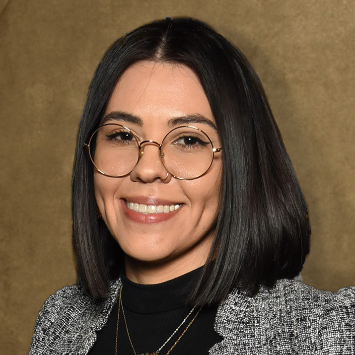

# Better Teams, Better Software, Stronger Community

#### Contributed by Heather Bourbeau and Sustainable Horizons Institute

#### Publication date: September 20, 2024

Meet 2024 BSSw Fellow Olivia Newton.  This article highlights her experiences in the BSSw Fellowship Program, including 
her work in improving the effectiveness of scientific software teams through collaborative learning.

 

This article is cross-posted at [Sustainable Horizons Institute](https://shinstitute.org/better-teams-better-software-stronger-community/).

 
[Olivia Newton]

 

Dr. Olivia Newton wants to help you build a better, more effective team. A postdoctoral scholar in the Institute for Simulation and Training at the University of Central Florida, she is among the latest BSSw Fellowship cohorts. She has been embedded in scientific software development projects and witnessed firsthand the need for knowledge, skills, and abilities related to team learning, and as a Fellow, Dr. Newton is developing guidelines and a toolkit to improve team learning in teams that develop scientific software. 

“For a very good reason, computational science and engineering focus on technical ability, but sometimes that focus comes at the cost of developing problem-solving and collaborative skills that are critical too,” says Dr. Newton. “One scientist may have more expertise on a topic, so other team members need to know how to listen and how to ask questions that really ensure everyone is understanding. On the other hand, that expert needs to know how to communicate their expertise and help others understand what it means and why it matters. Those types of knowledge, skills, and abilities can be cultivated.”

She is hoping to extend her toolkit beyond team learning and is talking with people at Argonne National Laboratory to potentially produce a broader toolkit for teamwork overall in scientific computing. “The fellowship has contributed to the growth of my network,” she says. “Through this fellowship I’ve met and spoken with people with whom I’m now working on research projects, particularly scientists at Argonne National Laboratory, with whom I am working on a project for the next couple of years that is related and complementary to the work I am doing under the Fellowship.” She and her collaborators at Argonne and Sandia National Labs and another university have also submitted a mini-symposium about teamwork in scientific software development for an upcoming conference. 

Her ultimate goals for the toolkits are to improve the way people work together so that teams work more cohesively and effectively towards their goals and to foster environments that are open and inclusive for a healthy, vibrant, and productive scientific software community. 

For researchers and scientists considering applying for the BSSw Fellowship, Dr. Newton offers this: “Don’t be scared to put your big idea out there. There are people in this BSSw community who want to go there with you and can support you.” She adds, “Engage before you even apply, submit a contribution request, check out the monthly digest, and reach out to folks. They really care about making sure that the computing community has a positive and sustainable future.”

### More info
Learn more about [Olivia Newton's work as a BSSw Fellow](https://bssw.io/fellows/olivia-newton).

The BSSw Fellowship Program gives recognition and funding to leaders and advocates of high-quality scientific software. See the [blog post](https://bssw.io/blog_posts/applications-open-for-the-2025-bssw-fellowship-program) by Elsa Gonsiorowski, coordinator of the BSSw Fellowship Program.

Application deadline: Monday, September 30, 2024; this is a firm deadline that will not be extended.

### Author bios
[Heather Bourbeau](https://www.linkedin.com/in/heatherbourbeau/) is a research analyst, communications strategist, and storyteller. 
[Sustainable Horizons Institute](https://shinstitute.org) is a partner in leading the BSSw Fellowship Program. 

 

<!---
Publish: yes
Track: bssw fellowship
Pinned: no
Topics: Funding sources and programs, projects and organizations
RSS update: 2024-09-22
OpenGraph image: OG_2408_BSSwFellowships.png
--->
