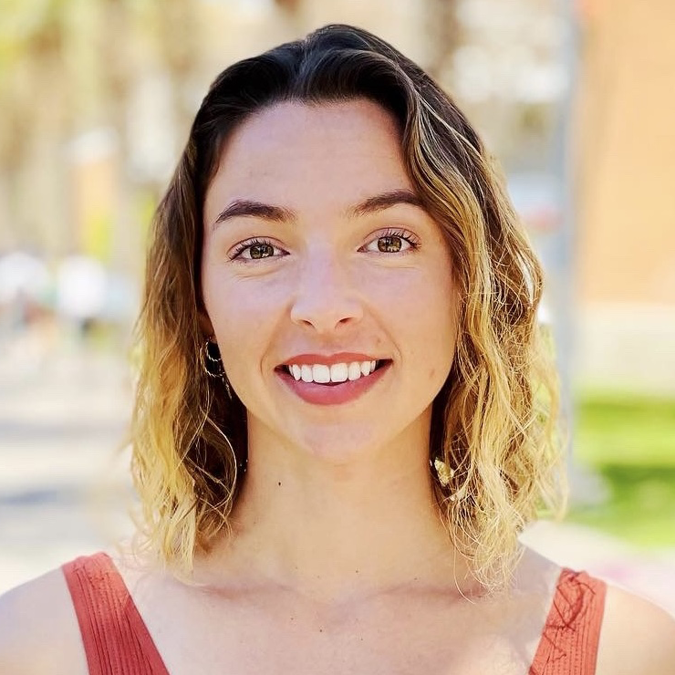

# Clarity and Community Gained

#### Contributed by Heather Bourbeau and Sustainable Horizons Institute

#### Publication date: September 9, 2024

Meet BSSw Fellow Nicole Brewer.  This article highlights her experiences in the BSSw Fellowship Program, 
including her work on improving accessibility of research data and software with scientific web applications in Jupyter notebooks.  

 

This article is cross-posted at [Sustainable Horizons Institute](https://shinstitute.org/clarity-and-community-gained/).

 
[Nicole Brewer]

 

Nicole Brewer is a graduate research assistant and Ph.D. student at Arizona State University, where she studies computational reproducibility of Jupyter Notebooks used in scientific contexts. When she started her Ph.D. program in History and Philosophy of Science, she was not sure how to connect her passion for making research code and data more accessible with Jupyter Notebooks and her interest in more philosophical questions about reproducibility in the high-performance computing space.

Brewer holds a Bachelor of Science in mathematics with computer science from Purdue University, where she was later a staff research software engineer who developed web applications in Jupyter Notebooks to help domain scientists make their work accessible and reproducible.

“The BSSw Fellowship gave me the space to continue doing my work on complex web applications in Jupyter Notebooks and explore the various dimensions of reproducibility that sometimes get ignored—the very human sides,” says Brewer. “The fellowship gave me the opportunity to align both my background and my interests in a way that I would not have otherwise.”

She took the summer to compile various example applications into tutorials to teach others how to use Notebooks to turn their scientific workflows into complex web apps. She presented that tutorial at the Scientific Python (SciPy) Conference in 2023 and again this year with collaborators. She also set up the Jupter4Science website, a knowledge base that includes the tutorials and other resources to improve accessibility of research data and software.

In addition, Brewer has also stayed engaged with people she met as a result of the Fellowship, including 2019 Fellow Dr. Tanu Malik, Associate Professor at DePaul University, who is also looking at the reproducibility of Notebooks. Dr. Malik mentored Brewer at the 2024 Summer of Reproducibility Fellowship through University of California, Santa Cruz. Together they are working on an empirical reproducibility study using containerization tools designed for reproducing interactive notebooks, which will become the first chapter of Brewer’s dissertation.

Another aspect of Brewer’s BSSw Fellowship experience was her ability to be a mentor herself. As part of her fellowship, she hired students to work with her on her project. After the fellowship ended, she was able to secure more funds to continue working together on collaborating on designing a curriculum for a course on better research software engineering practices in Jupyter Notebooks. Subsequently, one of her students did a research software engineering internship at Princeton. “I am just so proud of my students,” Brewer says. “I know I want to mentor now and that is something I would not have gotten to explore without the fellowship.”

## More info
Learn more about [Nicole Brewer's work as a BSSw Fellow](https://bssw.io/fellows/nicole-brewer).

See the [blog post](https://bssw.io/blog_posts/applications-open-for-the-2025-bssw-fellowship-program) by Elsa Gonsiorowski, coordinator of the BSSw Fellowship Program.

Application deadline: Monday, September 30, 2024; this is a firm deadline that will not be extended.

## Q&A webinar

Those interested in applying are encouraged to participate in an informational fellowship webinar and Q&A session scheduled for Tuesday, September 10, 2024, 2:00-3:00 PM EDT.  Webinar details will be sent to the BSSw mailing list.

## Author bios
[Heather Bourbeau](https://www.linkedin.com/in/heatherbourbeau/) is a research analyst, communications strategist, and storyteller. 
[Sustainable Horizons Institute](https://shinstitute.org) is a partner in leading the BSSw Fellowship Program. 

 

<!---
Publish: yes
Track: bssw fellowship
Pinned: no
Topics: Funding sources and programs, projects and organizations
RSS update: 2024-09-10
OpenGraph image: OG_2408_BSSwFellowships.png
--->
