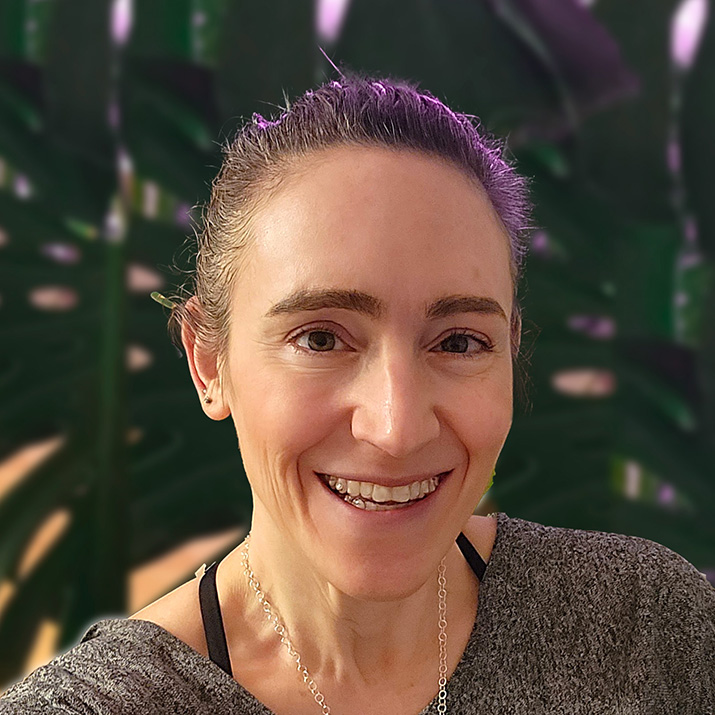

# Cultivating Collaboration Skills

#### Contributed by Heather Bourbeau and Sustainable Horizons Institute

#### Publication date: September 26, 2024

Meet 2024 BSSw Fellow Leah Wasser.  This article highlights her experiences in the BSSw Fellowship community, including her work 
in teaching essential collaboration skills for contributing to open source software.

 

This article is cross-posted at [Sustainable Horizons Institute](https://shinstitute.org/cultivating-collaboration-skills/).

 
[Leah Wasser]

 

Leah Wasser is the Executive Director and founder of an organization called pyOpenSci, a Python open source and open science community of practice. pyOpenSci supports the scientific Python tools that drive open science through peer review, training, and community building. Her BSSw Fellowship, however, offers her the chance to expand beyond Python and provide critical collaboration skills for scientists trying to create software, share their code, and work together collaboratively using GitHub. 

“There are communication and collaboration skills that everyone needs. For instance, understanding asynchronous communication can be really tricky, and the peer review process of code can be really intimidating,” says Leah. “I am excited to have the opportunity to fill those skills gaps in the ecosystem.”

A Remote Sensing Ecologist by training, she has taught data intensive science for nearly 20 years, with the last 10 devoted to open source software. During her BSSw Fellowship, she is expanding on the work she has done with pyOpenSci, creating a multi-lesson self-paced online module that teaches often-missed technical and social collaboration skills needed to contribute to open source software. 

Modules will focus on skills such as using constructive and specific language and code examples that simplify problem solving, building trust with volunteer maintainers, providing reproducible code for bug reports, and referencing issue history when submitting bugs. Modules will also cover fundamental GitHub collaboration skills, including forking, cloning, and pull requests. 

The lessons will be reviewed by the pyOpenSci community  to ensure they are community driven and then published online as free open education resources. The goal of the lessons is to make it easier for scientists to work together collaboratively and for anyone to contribute to open source software. “Even though I have been awarded the fellowship, I see this work as a community resource,” says Leah. “I am really grateful that BSSw empowered me to do more of this work for the broader community.”

## More info
The BSSw Fellowship Program gives recognition and funding to leaders and advocates of high-quality scientific software. See the [blog post](https://bssw.io/blog_posts/applications-open-for-the-2025-bssw-fellowship-program) by Elsa Gonsiorowski, coordinator of the BSSw Fellowship Program.

Application deadline: Monday, September 30, 2024; this is a firm deadline that will not be extended.

## Author bios
[Heather Bourbeau](https://www.linkedin.com/in/heatherbourbeau/) is a research analyst, communications strategist, and storyteller. 
[Sustainable Horizons Institute](https://shinstitute.org) is a partner in leading the BSSw Fellowship Program. 

 

<!---
Publish: yes
Track: bssw fellowship
Pinned: no
Topics: Funding sources and programs, projects and organizations
RSS update: 2024-09-27
OpenGraph image: OG_2408_BSSwFellowships.png
--->
