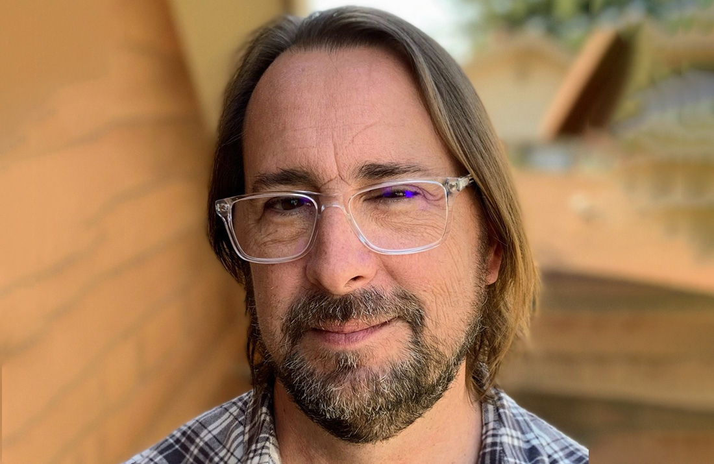

# Inspired Engagement

#### Contributed by Heather Bourbeau and Sustainable Horizons Institute

#### Publication date: September 13, 2024

Meet BSSw Honorable Mention Keith Beattie.  This article highlights his experiences in the BSSw Fellowship community, including his 
community engagement as a 2021 BSSw Honorable Mention.  

 

This article is cross-posted at [Sustainable Horizons Institute](https://shinstitute.org/inspired-engagement/).

 
[Keith Beattie]

 

Keith Beattie is a Group Lead and Computer Systems Engineer in Berkeley Lab’s Computing Sciences Area, who has dedicated the last 20 years to the intersection of scientific research and software engineering. His influence and engagement have grown in large part to the connections he made as a BSSw Honorable Mention five years ago.

“I was very happy to get an Honorable Mention because it introduced me to the community. I wanted to be more involved in not only the effort of stewardship of scientific software but also in creating connections with similarly minded organizations,” says Beattie, who worked briefly in the tech industry before returning to the Lab.

When he returned to the Lab, he noticed that the methods for developing research software were not the same as in the tech industry, which at the time had more thorough testing and aspects of version control and release management. As a result, some of the scientific software did not get developed as thoroughly and thus did not work as well as it might have in the private sector. “BSSw brought the direction in which I want to push the scientific software community more clearly into focus,” he says.

Beattie continues to attend BSSw discussions on a variety of topics and gatherings where Fellows and Honorable Mentions can meet. Two years ago, he also founded and now leads Sustainable Software Engineering, a group within the Lab’s Scientific Data Division that focuses on the tools, processes, people, and careers that are required to create and maintain software that supports scientific achievement with an emphasis on stability and reproducibility. Beattie is also on the Steering Committee for the United States Research Software Engineering Association (US-RSE).

“My personal goal is to see scientific software and those who develop and support it, be seen throughout the research community, as first class citizens in the scientific mission,” says Beattie. “The BSSw Fellowship Honorable Mention gave me inspiration and motivation to try and affect changes that will better support research software engineers and scientific software.”secure more funds to continue working together on collaborating on designing a curriculum for a course on better research software engineering practices in Jupyter Notebooks. Subsequently, one of her students did a research software engineering internship at Princeton. “I am just so proud of my students,” Brewer says. “I know I want to mentor now and that is something I would not have gotten to explore without the fellowship.”

## More info
The BSSw Fellowship Program gives recognition and funding to leaders and advocates of high-quality scientific software. See the [blog post](https://bssw.io/blog_posts/applications-open-for-the-2025-bssw-fellowship-program) by Elsa Gonsiorowski, coordinator of the BSSw Fellowship Program.

Application deadline: Monday, September 30, 2024; this is a firm deadline that will not be extended.

## Author bios
[Heather Bourbeau](https://www.linkedin.com/in/heatherbourbeau/) is a research analyst, communications strategist, and storyteller. 
[Sustainable Horizons Institute](https://shinstitute.org) is a partner in leading the BSSw Fellowship Program. 

 

<!---
Publish: yes
Track: bssw fellowship
Pinned: no
Topics: Funding sources and programs, projects and organizations
RSS update: 2024-09-13
OpenGraph image: OG_2408_BSSwFellowships.png
--->
