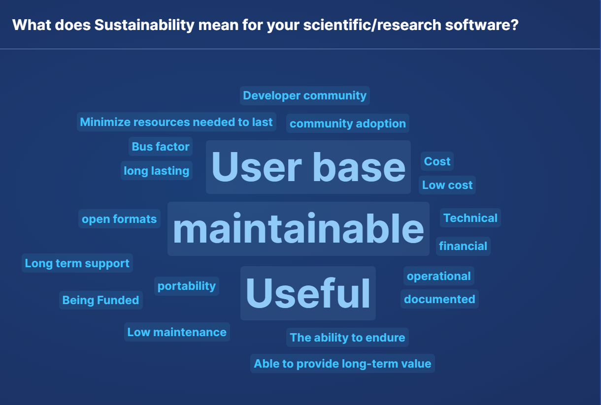
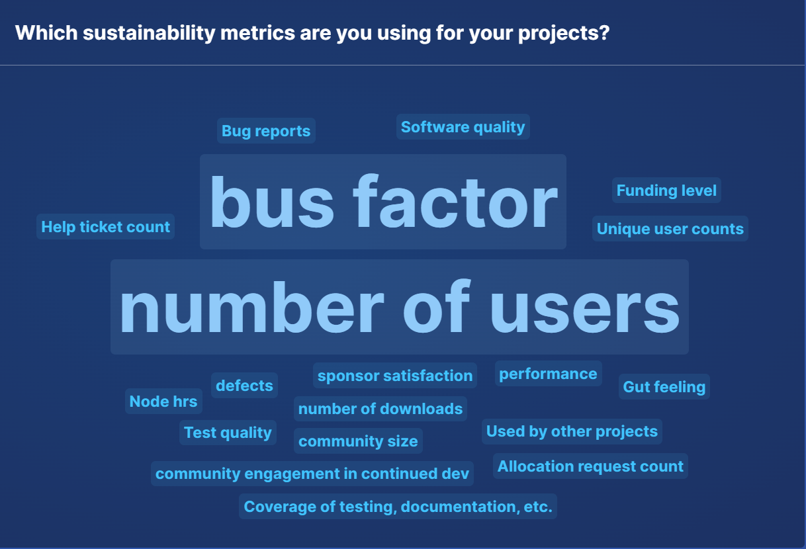

# Effective Metrics for Measuring and Enhancing Sustainability in Scientific Software

#### Contributed by [Addi Malviya-Thakur](https://github.com/AddiMT) and [Greg Watson](https://github.com/jarrah42)

#### Publication date: November 12, 2024

<!--deck start-->
This article summarizes the mini-workshop on *Effective Metrics for Measuring and Enhancing Sustainability in Scientific Software* held at the Sustainable Scientific Software Conference (S3C) 2024.
<!--deck end-->

In the complex world of scientific software development, it’s essential to understand the diverse factors that influence sustainability. From the health of the software community to the robustness of engineering practices, each element plays a pivotal role in the long-term viability of a project. The [Center for Open-Source Research Software Advancement](https://corsa.center/) (CORSA) is a community of practice that aims to address the long-term sustainability of scientific and research software by fostering collaboration among stakeholders, facilitating partnerships with open-source foundations, and educating the community regarding approaches to the stewardship and advancement of open-source software. CORSA is part of a larger initiative called the [Consortium for the Advancement of Scientific Software](https://cass.community/) (CASS), which includes stakeholders from a wide cross-section of the scientific computing and research software community.

## Workshop objectives

CORSA’s workshop was aligned with the Sustainable Scientific Software Conference’s (S3C) theme of "Software Engineering for Sustainable Scientific Software." Our workshop focused on the critical aspect of developing and applying effective metrics to measure and aid the sustainability of scientific software projects. The workshop’s goal was to bring together stakeholders from across the scientific and research software community in order to foster collaborative efforts to enhance our understanding for the development and utilization of metrics for assessing project sustainability, which in turn can guide the allocation to and use of resources. The workshop also aimed to explore and address crucial aspects of sustainability and stewardship that might be specific to scientific computing and research software.

## Workshop summary

The 100-minute workshop featured a mix of talks, breakout sessions, group readouts and discussions. The session began with a brief introduction to the concept of sustainability and various factors that influence it in the context of scientific software, setting the stage for deeper discussions on sustainability metrics. Attendees were then divided into smaller groups to discuss specific topics related to sustainability metrics. Each group explored questions such as the importance of sustainability in their projects, the key aspects they prioritize, and the metrics they currently use or wish to develop. Each breakout group summarized their discussions and presented key takeaways to the larger audience.

Representatives from Sandia National Laboratories, Lawrence Livermore National Laboratory, Oak Ridge National Laboratory, Lawrence Berkeley National Laboratory, and Princeton University participated in the workshop.

## Featured talk

After setting context of the workshop---sustainability and its importance in scientific software---we presented the vision and goals of the Center for Open-Source Research Software Stewardship and Advancement (CORSA). Key points included:

* Vision:
  * CORSA aspires to become a leading community of practice that provides pathways for open-source scientific software projects, ensuring their long-term growth, stewardship, advancement, and innovation.  
* Goals:  
  * *Create pathways to foundations:* establish pathways for projects and stakeholders to connect with resources and foundations that support sustainability.  
  * *Empower software communities:* utilize software sustainability metrics to empower communities, helping them maintain and improve their software over time.  
  * *Facilitate cross-cutting activities:* address the needs of diverse and unique software communities through collaborative and cross-cutting initiatives.  
  * *Provide objective guidance:* offer clear and objective guidance to software communities on best practices for sustainability.

Next, we introduced the concept of software sustainability, emphasizing the importance of ensuring that software remains operational, useful, and relevant over time. We discussed the purpose of developing software sustainability metrics, which are intended to measure how effectively scientific or research software can be maintained and evolved.

We posed critical questions to the audience, asking them to consider which metrics would be most effective and feasible to collect. We continued with a discussion on the summary of various factors to consider when evaluating software sustainability, from previous works and surveys by [this site](https://bssw.io/blog_posts/use-of-software-metrics-in-research-software), [CHAOSS](https://chaoss.community/kb-metrics-and-metrics-models/), the UK [Software Sustainability Institute](https://www.software.ac.uk/publication/better-software-better-research), and broader software research community.

We encouraged attendees to think about additional considerations and directed them to further resources on these, available in the Resources section.

During the introduction, we utilized Slido to conduct a survey of attendees on two questions.

[Figure 1: Slido results for: “What does Sustainability mean for your scientific/research software?]

The attendees' responses to the question **"What does Sustainability mean for your scientific research software?"** are captured in the word cloud in Figure 1. These results highlighted several key aspects of sustainability in scientific and research software. A strong and growing user base emerged as the most significant factor, indicating its critical role in ensuring the software remained relevant and continued to evolve. The maintainability of the software was also emphasized, reflecting the importance of ease in updates, bug fixes, and adaptability to new technologies. Additionally, the utility of the software to its intended audience was recognized as central to its sustainability, ensuring it continued to meet user needs over time. Respondents also underscored the importance of minimizing resources required for the software to last, particularly in environments with limited resources. Other important themes that surfaced included the need for long-term support, community adoption, a robust developer community, and considerations related to cost, funding, and the ability of the software to endure and provide long-term value.

[Figure 2: Slido results for: “Which sustainability metrics are you using for your projects?]

Responses to the question **"Which sustainability metrics are you using for your projects?"** are shown in the word cloud in Figure 2. These results highlighted the sustainability metrics that participants used for their projects. The most prominent metrics were the number of users and the bus factor. The number of users was identified as a key indicator of a project's sustainability, reflecting its adoption and ongoing relevance within the community. The bus factor, which measures the dependency on key individuals, was also emphasized, indicating concerns about the project's resilience in the face of potential loss of critical contributors. Other significant metrics included funding levels, software quality, bug reports, unique user counts, and help ticket counts, all of which provide insights into the health and sustainability of the software. Additionally, metrics such as community size, test quality, sponsor satisfaction, and the number of downloads were mentioned, highlighting the diverse approaches used to assess and ensure the longevity and effectiveness of software projects.

## Breakout sessions

We organized an interactive breakout session and split the participants into two groups. Each group discussed the questions below and reported back at the end of the workshop.

1. Why does sustainability matter to your work or projects?  
2. What aspects of sustainability are most important to you?  
3. How do you measure those aspects (which sustainability metrics do you collect)?  
4. What do you want to know that you can't measure today?
5. What does sustainability mean for your scientific/research software?  
6. Which sustainability metrics are you using or would like to use for your projects? And why?

The main takeaways from the discussions were:

* Sustainability is critical for ensuring that software projects continue to provide value over time, particularly in research and scientific contexts where software often supports complex, interdependent systems, and requires considerations of software dependencies, research impact, and the broader ecosystem in which it operates.  

* Important aspects of sustainability include software quality, community engagement, stakeholder relationships, and the ability to maintain and adapt the software in response to evolving research needs and technological advancements.  These aspects are crucial for both the immediate utility of the software and its long-term viability.  

* Metrics used to measure sustainability vary depending on the project’s goals and context. Common metrics include software performance, user base size, issue resolution rates, and community engagement.  

* There is a recognized need for more sophisticated metrics and theoretical frameworks to assess long-term sustainability, particularly in, but not limited to, environments where usage is difficult to track, such as closed systems and large-scale research facilities.

A key aspect of sustainability is the ability of the software to continue supporting scientific experiments and research operations, particularly in critical facilities where it plays a vital role. This means that the software must be robust enough to be handed over to new developers or teams without losing its core functionality or value, ensuring that it remains a valuable tool for the scientific community over time. Participants also stressed the importance of keeping the user community engaged and ensuring that the software can be sustained beyond the tenure of its original developers. This includes the ability to secure ongoing funding and support, making sure that the software can continue to generate new insights and findings.

The discussion revealed a broad view of sustainability, encompassing not just the technical aspects but also the social, environmental, and economic factors that influence the long-term success of research software. This multidimensional approach reflects the diverse challenges involved in sustaining software that is crucial for ongoing and future research efforts.

## Conclusions

Sustainability in software development, especially within scientific and research contexts, is a multifaceted challenge that demands careful consideration of both immediate and long-term needs. The workshop successfully brought together diverse perspectives, highlighting the importance of maintaining software quality, engaging user communities, and ensuring adaptability to future technological changes. While metrics like performance, user base size, and issue resolution are valuable, the discussions underscored the need for more nuanced and comprehensive measures that align with the diverse objectives of different projects. The breakout sessions were particularly engaging, with participants actively sharing their experiences, challenges, and strategies for sustaining software over time. 

We extend our gratitude to all participants, whose efforts made this workshop a success. The insights gathered will undoubtedly contribute to ongoing efforts to build more resilient and enduring software ecosystems, and we look forward to continuing these important conversations in future workshops and at the CASS Metrics Working Group led by CORSA.

## Resources 

* CHAOSS, [Metrics and Metrics Models](https://chaoss.community/kb-metrics-and-metrics-models/)  
* SSI, [Better Software, Better Research](https://www.software.ac.uk/publication/better-software-better-research)  
* BSSw.io, [Use of Software Metrics in Research Software](https://bssw.io/blog_posts/use-of-software-metrics-in-research-software)

## Author bios

Addi Malviya-Thakur is the group leader for the Software Engineering Group in the Computer Science and Mathematics Division’s Advanced Computing Systems Research Section at Oak Ridge National Laboratory (ORNL). Her research interests include scientific software for experimental and observational facilities, interconnected science and federated systems, research software engineering, operational workflows, software analytics, software frameworks, and ecosystems for science.

Gregory R. Watson is the group leader for the Application Engineering group in the Computer Science and Mathematics Division at ORNL. His research interests include programming tools and development environments for high-performance and scientific computing, software engineering practices, reproducibility, and education and training for scientists.

<!---
Publish: yes
Track: community
Topics: conferences and workshops, software engineering, software process improvement
--->
