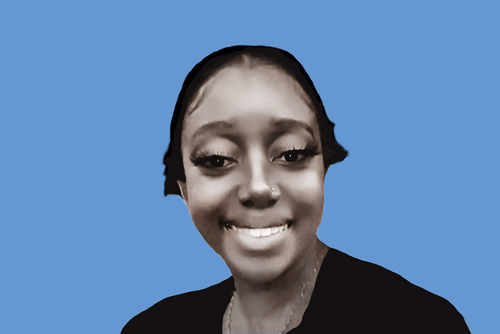
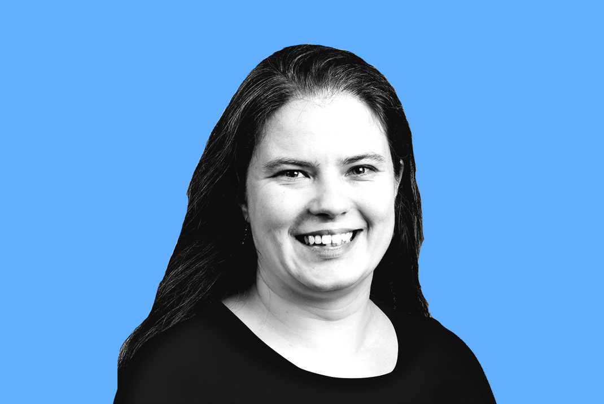
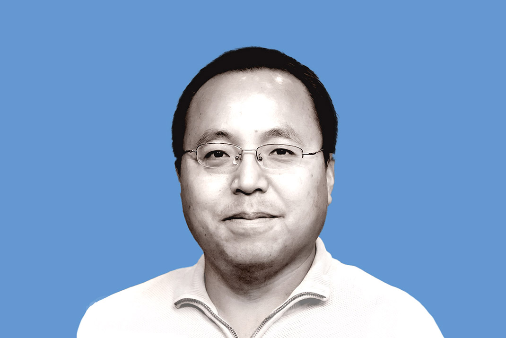
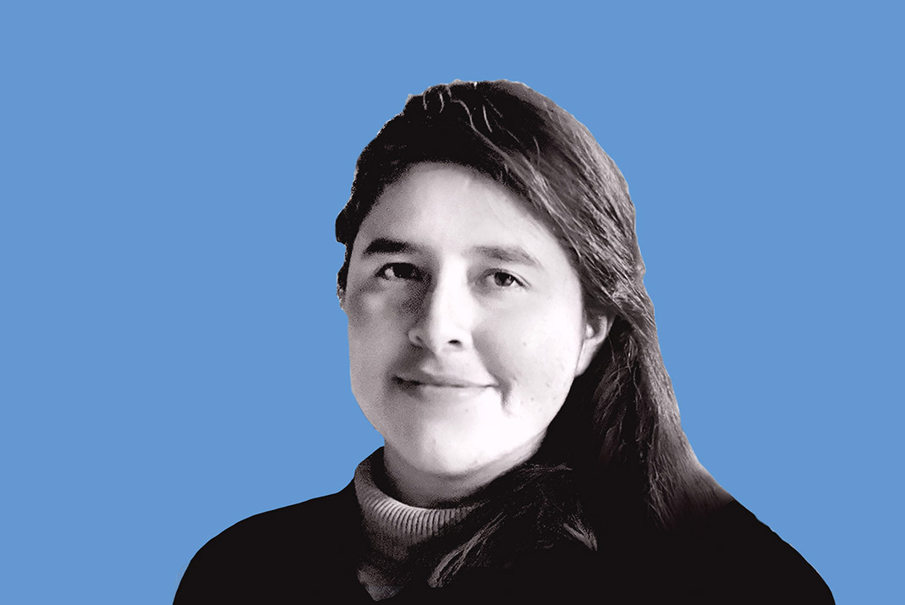
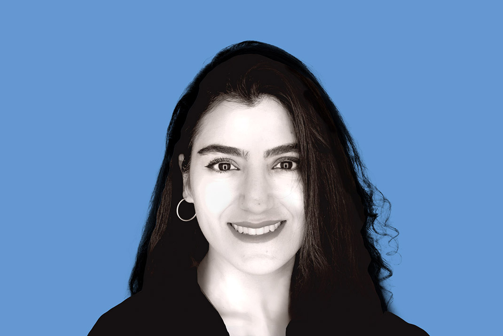
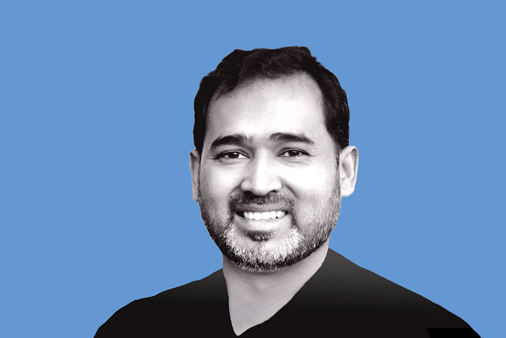

# Introducing the 2025 BSSw Fellows

#### Contributed by [Elsa Gonsiorowski](https://github.com/gonsie "Elsa Gonsiorowski GitHub Profile")

#### Publication date: December 16, 2024

We are pleased to announce the 2025 class of Better Scientific Software (BSSw) Fellows: five Fellows and five Honorable Mentions.

We sincerely thank _all_ fellowship applicants. The broad range of creative and interesting proposals made the selection process difficult.

The [BSSw Fellowship Program](https://bssw.io/fellowship) gives recognition and funding to leaders and advocates of high-quality scientific software. Each 2025 Fellow will receive up to $25,000 for an activity that promotes better scientific software, such as organizing a workshop, preparing a tutorial, or creating content to engage the scientific software community.

The BSSw Fellowship Program is supported by the U.S. Department of Energy (DOE, via the Office of Advanced Scientific Computing Research and the National Nuclear Security Administration's Advanced Simulation and Computing Program) and the National Science Foundation (NSF). The BSSw Fellowship Program enables a more robust approach toward pioneering the future of advanced computing ecosystems and leadership in science and engineering. The program enhances workforce development and pathways to NSF and DOE software communities, through nurturing a network of people who advance software practices as a fundamental aspect of increasing overall scientific productivity.

## 2025 BSSw Fellows

  <h3>Alper Altuntas, NSF National Center for Atmospheric Research</h3>
  
Software Engineer, Climate and Global Dynamics Laboratory

  
<i>BSSw focus</i>: Rigor and reasoning in research software: Tutorial on testing and verification methods

  <h3>Jasmine Buckley-Williams, San Diego State University</h3>
  
Graduate Student, Big Data Analytics

  
<i>BSSw focus</i>: Resource toolkit and outreach on scalable, reproducible software practices

  <h3>Brigitta Sipőcz, California Institute Of Technology</h3>
  
Developer, IPAC

  
<i>BSSw focus</i>: User-facing tutorials as code: Reproducible And reliable tutorials With CI/CD

  

  <h3>Peter K. G. Williams, Center for Astrophysics | Harvard & Smithsonian</h3>
  
Technical Lead, Minor Planet Center

  
<i>BSSw Focus</i>: Framework for architecting technical documentation

  <h3>Junchao Zhang, Argonne National Laboratory</h3>
  
Principal Software Engineer, Mathematics and Computer Science

  
<i>BSSw focus</i>: MPI debugging resources and community hub

## 2025 BSSw Honorable Mentions

  <h3>Emmanuel Atoleya Atindama, University of Toledo</h3>
  
Visiting Assistant Professor, Data Science and Mathematics

  <h3>Sierra Brown, Two Worlds Scientific, LLC</h3>
  
CEO and Research Software Engineer

  <h3>Alejandra Castillo, Pomona College</h3>
  
Instructor, Department of Mathematics and Statistics

  <h3>Zeinab Serhan, Arizona State University</h3>
  
Senior Software Engineer, Learning Engineering Institute

  <h3>Minhaz Zibran, Idaho State University</h3>
  
Associate Professor, Department of Computer Science

### About the BSSw Fellowship
The main goal of the [BSSw Fellowship Program](https://bssw.io/fellowship) is to foster and promote practices, processes, and tools to improve developer productivity and software sustainability of scientific codes. BSSw Fellows are selected annually based on an application process that includes the proposal of an activity that promotes better scientific software. Subscribe to the [BSSw email digest](https://bssw.io/pages/receive-our-email-digest) for notification about next year’s call for applications, which will be announced in summer 2025. More information:

- [BSSw Meet Our Fellows](https://bssw.io/pages/meet-our-fellows)
- [FAQ for the BSSw Fellowship Program](https://bssw.io/pages/bssw-fellowship-faq)

Stay tuned for more from the 2025 BSSw Fellows.

### Contribute to the BSSw Site
Also, we want and need contributions from the international community for the BSSw site.  If you have expertise that can help other scientific software teams, we encourage you to contribute an article or pointer to good work.  See details on [how to contribute to BSSw](https://bssw.io/pages/what-to-contribute-content-for-better-scientific-software).

### Author bio

Elsa Gonsiorowski is Coordinator of the BSSw Fellowship Program, a member of the [PESO Project](https://pesoproject.org) team, and HPC I/O support specialist at [Livermore Computing, LLNL](https://hpc.llnl.gov/about-us).

<!---
Publish: yes
Track: community, bssw fellowship
RSS update: 2024-12-XX
Categories: collaboration
Topics: projects and organizations
Tags: bssw-article
--->
