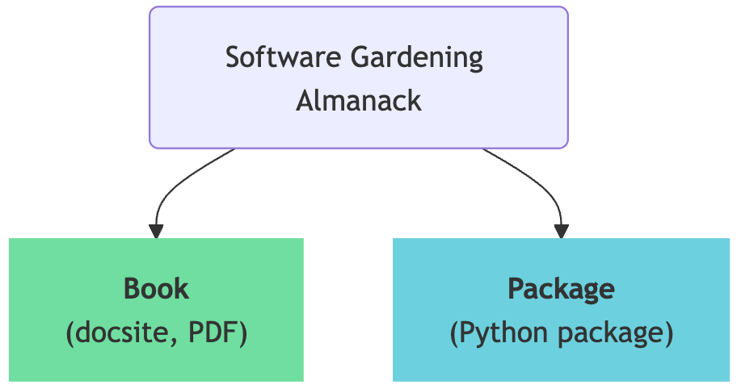
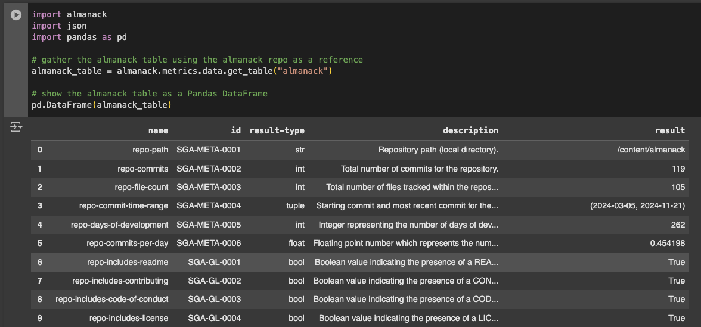
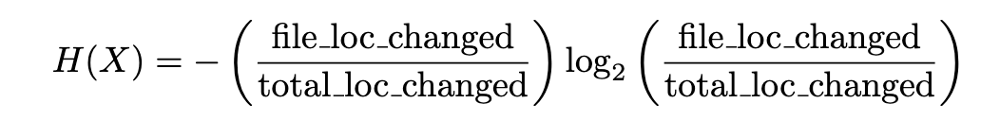
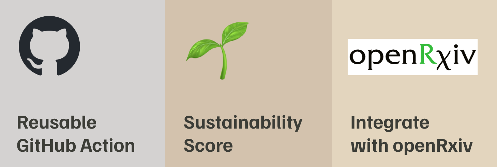

# Growing resilient scientific software ecosystems: Introducing the Software Gardening Almanack

#### Contributed by: [Dave Bunten](https://github.com/d33bs), [Will Davidson](https://github.com/willdavidson05), and [Gregory P. Way](https://github.com/gwaybio)

#### Publication date: February 28, 2025

<!-- start of deck text -->
Scientific software underpins modern research, yet much of it suffers from fragility due to poor design and maintenance, threatening sustainability and trust. The Software Gardening Almanack introduces a new paradigm, treating software as a living ecosystem that can be nurtured to promote long-term resilience and reproducibility.
<!-- end of deck text -->

[Figure 1. Following guidelines and practices outlined in an Almanack enhances software development, much like it nurtures growth in a garden.]

Scientific software is at the heart of modern discovery, powering advancements across many fields.[1],[2],[3],[4] Yet, beneath the surface of these achievements lies a sobering reality: much of software is fragile due to low quality implementation or design[5], which leads to challenges related to software collapse.[6]. These challenges jeopardize software sustainability, productivity, and trustworthiness, posing threats to the very foundations of research[1]. The Software Gardening Almanack[7] offers a new way forward: treating software as an emergent, living ecosystem (**Figure 1**). The Almanack describes and implements  Software Gardening principles which help to cultivate sustainable, reproducible, and high quality scientific software.

## Proliferation of fragile software ecosystems

The Consortium for Information & Software Quality (CISQ) estimated, in 2022 alone, that poor software quality cost the global economy a staggering $2.41 trillion[5]. Scientific software is no exception. In many fields, it is the norm for scientists to publish articles that contain  unusable, low-quality software and other analysis code. For example, the code might lack installation instructions, omit reproducible examples, or exclude critical documentation to understand the work.[2] These observations paint a clear picture of  how 1\) significant training gaps for research software engineering[8], 2\) misaligned incentives for delivering reproducible software, and 3\) difficulty evaluating software quality causes codebases growing brittle with age.[6] Despite these challenges, software related to science has gone through tremendous growth. For example, about 1.5 million repositories on GitHub that were created in 2024 contained at least one Jupyter notebook, showing 170% growth since 2022).[9]

But not all software decays so quickly. What measurements indicate if a software repository will resist the challenges associated with poor quality and decay? GitHub Stars are often used to infer quality, but they may be fake and they may only demonstrate popularity as opposed to sustainability.[10] Furthermore, publication and citation metrics can be used, but they suffer from diminishing returns due to increases in the overall number of citations, larger author or reference lists, and self-citations[11]. While easy to see and measure, these metrics paint an incomplete pictureInstead, embracing software as a complex and evolving ecosystem enables us to quantify sustainability with  many measurements and perspectives.

## Tending Software Gardens

[Figure 2. All software faces lifecycles which can be better understood through a Software Gardening lens to guide development.]

We previously wrote about Software Gardening in an earlier blog post.[12] In that post, we compared Software Gardening to the more traditional metaphor of scientific software development as software carpentry.[13] In software carpentry, software is viewed as a trade that emphasizes precision, reproducibility, and start-to-finish construction. However, this analogy falls short of addressing the multidimensional challenges of time. Software decays, requirements evolve, and software develops in collaborative teams. Software Gardening[12] offers a new, complementary lens for rethinking software development. While carpentry emphasizes the skills and tools to build software, the lessons are static and product-focused. Instead, gardening is about nurturing growth, adapting to changes, and preparing for inevitable decay (**Figure 2**). A software gardener tends to their "code ecosystem" much like a gardener cultivates a garden. A software gardener removes weeds, enriches the soil, and ensures that the environment where development happens supports healthy, sustainable growth.

## Introducing the Software Gardening Almanack

[Figure 3. The Software Gardening Almanack is an open-source digital book and open-source Python package.]

The Software Gardening Almanack brings these metaphors of Software Gardening to reality. The Almanack offers practical tools, insights, and strategies for creating sustainable software ecosystems. It provides guidance to solve today’s software development challenges. We conceived the Almanack out of a need to strengthen software ecosystems, reduce proliferation of fragile software, and stop exorbitant waste in scientific software development. With the Almanack, we aim to bring long-term software sustainability to the forefront of and prime consideration for scientific software development. The Almanack provides educational technology to equip software developers with knowledge and pragmatic tools that lead to software that is more robust to the demands of time. .

We present the Software Gardening Almanack as two open-source components: a digital book and python package (**Figure 3**). First, the book, available through [GitHub](https://software-gardening.github.io/almanack) as a Jupyter book, acts as a learning guide, providing a curriculum of sustainable software development practices. It provides conceptual and practical advice on sustainable software development practices, illustrated with real-world examples.

[Figure 4. The Almanack Python package may be used to find metrics associated with a specific repository]

Second, the package, available on [PyPI](https://pypi.org/project/almanack/), transforms these ideas into software sustainability reports and software linting checks (**Figure 4**). Developers install the Software Gardening Almanack package and can immediately analyze any repository code base, which will guide their efforts toward developing software robust to decay (**Figure 4**). This dual approach of education combined with applied learning ensures that the Almanack not only informs but also empowers developers to act, and, when taken together, improve the overall state of scientific software.

[Figure 5. A repository may be analyzed using the Almanack Python package to gather a report of metrics or perform a software linting style check of the repository.]

The Python package provides two core capabilities: a JSON-stylized report of sustainability metrics and a software linting-style check for specific metrics (**Figure 5**). The report provides specific metadata and metrics for the repository alongside descriptions of these metrics. The software linting check assesses if the repository is following best software development practices. We have configured the check to run alongside continuous integration and deployment (CI/CD) tools to automatically check code as it is changed. The python package can be executed by any python interpreter, but also as a command line interface (CLI). We apply the Almanack python package to the Almanack book itself both in CI/CD real-time development, as well as in Almanack tutorials, which you can run through this [Google Colab notebook](https://colab.research.google.com/drive/1VZhpLW7qNYelXiy2mb_piIxkqVcthb5_). 

## A deep dive into the Almanack and practical use cases

The Almanack helps developers cultivate sustainable software ecosystems. It implements several sustainability metrics and checks, which promotes sustainable software development. One of these metrics measures Shannon Entropy[14], a concept derived from information theory that quantifies unpredictability and complexity in a given system (**Formula 1**). 

[Formula 1. Shannon Entropy]

Originally used to measure how much information is required to describe a state of a variable, we apply Shannons’ Entropy formula to software by analyzing code changes. This idea was originally proposed by Hassan[15] in 2009, and we directly implement this metric within the Software Gardening Almanack. In our system, entropy reveals complexity across a project's history. High entropy indicates irregular or unpredictable code modifications, which fragilize projects, making them more expensive to maintain and prone to future error[15]. In contrast low entropy suggests more consistent and structured software development, where changes are less likely to cause unexpected failure.

To explore software entropy, we collected and analyzed about 10,000 repositories referenced in PubMed articles since 2011\. In our search we also collected GitHub metadata such as commit history, stars, forks, issues, primary programming language, and more. This metadata gives us insights into software collaboration and engagement, both of which are also key drivers of software sustainability. Using the Almanack, we calculated Shannon's entropy at the file level across commits normalizing by total lines of code per repository (**Formula 2**). This normalization procedure is required for us to compare projects of varying sizes. 

[Formula 2. Normalized Shannon Entropy per file]

Our analysis showed how software entropy relates to software sustainability (**Figure 6**). Projects with shorter lifespans exhibited higher entropy, likely indicating rapid and unstructured development cycles lacking sustained maintenance. These projects are prone to instability which can severely hurt long-term use. In contrast, projects with lower entropy and higher community engagement enjoyed a longer lifespan. We observed many other interesting trends, which we describe in the Software Gardening Almanack Book, in the “Seed Bank” chapter. Overall, this application shows how entropy can serve as a quick and valuable indicator of software sustainability, while also, importantly, providing insights into the causes of software decay.

[Figure 6. Relationships between software entropy, time, and community engagement. In a sample of about 10,000 GitHub repositories referenced in published scientific articles indexed on PubMed, we find that low software entropy is positively associated with sustainability and community engagement through (left) open GitHub issues and (right) number of GitHub forks.]

Proactive software maintenance using Software Gardening practices will reduce entropy and lead to more long-lasting software. Left unmanaged, high entropy causes software decay. In other words, the Almanack identifies entropy hotspots, while they’re being developed, that may require targeted maintenance. Similar to an overgrown garden, these hotspots require attention through pruning, such as refactoring and restructuring, to preserve the project sustainability. 

## Future harvests

[Figure 7. Our Almanack roadmap includes the development of a reusable GitHub Action, developing and testing an empirically defined software sustainability score, and integrating checks into community-driven projects to improve scientific communication and impact, such as BioRxiv.]

Looking ahead, the Almanack is poised to expand impact (**Figure 7**). We will continue to implement new metrics, including a sustainability score. We will also develop other technical features, such as a GitHub Action, and integration technology for embedding with scientific communication platforms like bioRxiv to automatically assess software and analysis repositories that are associated with postedpreprints. These innovations will put the Almanack into the hands of those who can benefit most: researchers, developers, and educators who are shaping the future of scientific software.

## Let’s garden together

The Software Gardening Almanack is more than a toolkit; it’s a call to action. It invites software developers to rethink how they approach software, not as a static product but as a living, evolving ecosystem. By embracing the principles of gardening—nurturing growth, fostering collaboration, and planning for the future—we can create software that not only thrives in the moment, but also stands the test of time.

So, let’s garden together. Explore the Almanack, join the community, and help cultivate a better future for scientific software\!

## Acknowledgements

We are deeply grateful to the following individuals and organizations whose support has been instrumental in the creation of the Software Gardening Almanack:

* Faisal Alquaddoomi  
* Vincent Rubinetti  
* Cameron Mattson  
* Erik Serrano  
* Members of the Way Lab at the University of Colorado Anschutz Medical Campus ([https://www.waysciencelab.com/](https://www.waysciencelab.com/))  
* Department of Biomedical Informatics within the School of Medicine at the University of Colorado Anschutz Medical Campus ([https://medschool.cuanschutz.edu/dbmi](https://medschool.cuanschutz.edu/dbmi))  
* The Multi-Consortia Coordinating (MC²) Center for Cancer Biology managed by Sage Bionetworks ([https://sagebionetworks.org/community/mc2-center](https://sagebionetworks.org/community/mc2-center))  
* Map of Open Source Science (MOSS) managed by NumFocus ([https://www.opensource.science/moss](https://www.opensource.science/moss))  
* Better Scientific Software (BSSw) ([https://bssw.io](https://bssw.io))  
* Sustainable Horizons Institute ([https://shinstitute.org](https://shinstitute.org))

## Figure credits

[Figure 1](#fig-1) Daubigny, Charles-François, French Orchard at Harvest Time (Le verger). [Retrieved from Wikimedia Commons](https://commons.wikimedia.org/wiki/File:French_Orchard_at_Harvest_Time_\(Le_verger\)_\(SM_1444\).png).

### Author bios

Dave Bunten is a Software Developer with the [Department of Biomedical Informatics at the University of Colorado Anschutz](https://medschool.cuanschutz.edu/dbmi). He has over a decade of experience in the field of software development through various roles in his career. His keen interest in software design, collaboration, and innovation has driven him to explore various areas of the field. He is particularly passionate about research data engineering, in-memory data flow, and scientific software.

Will Davidson ...

Gregory P. Way is an Assistant Professor in the [Department of Biomedical Informatics at the University of Colorado Anschutz](https://medschool.cuanschutz.edu/dbmi). His lab develops methods and software for analyzing large biomedical datasets, most often in the context of drug screens for rare diseases. He believes that high-performance software facilitates science and that we could not make the next discoveries in treating human diseases without software engineers. The sustainability of software is essential to maintaining scientific progress and reducing human suffering.

## References

[1]: #ref-1
[2]: #ref-2
[3]: #ref-3
[4]: #ref-4
[5]: #ref-5
[6]: #ref-6
[7]: #ref-7
[8]: #ref-8
[9]: #ref-9
[10]: #ref-10
[11]: #ref-11
[12]: #ref-12
[13]: #ref-13
[14]: #ref-14
[15]: #ref-15

1Heroux, M. *et al. Basic Research Needs in The Science of Scientific Software Development and Use: Investment in Software Is Investment in Science*. None, 1846009 https://www.osti.gov/servlets/purl/1846009/ (2023) doi:10.2172/1846009.
2	Afiaz, A. *et al.* Evaluation of software impact designed for biomedical research: Are we measuring what’s meaningful? Preprint at http://arxiv.org/abs/2306.03255 (2023).
3Sochat, V. The Stanford Software Survey, 2020\. Zenodo https://doi.org/10.5281/ZENODO.4464625 (2021).
4US Research Software Engineer Association & IEEE Computer Society. Research Software Engineers: Creating a Career Path—and a Career. Preprint at https://doi.org/10.5281/ZENODO.10073232 (2023).
5Krasner, H. *Cost of Poor Software Quality in the U.S.: A 2022 Report*. https://www.it-cisq.org/the-cost-of-poor-quality-software-in-the-us-a-2022-report/ (2022).
6Hinsen, K. Dealing With Software Collapse. *Comput. Sci. Eng.* **21**, 104–108 (2019).
7Bunten, D., Davidson, W., Alquaddoomi, F., Rubinetti, V. & Way, G. The Software Gardening Almanack. Zenodo https://doi.org/10.5281/ZENODO.14765834 (2025).
8Cosden, I. A., McHenry, K. & Katz, D. S. Research Software Engineers: Career Entry Points and Training Gaps. (2022) doi:10.48550/ARXIV.2210.04275.
9GitHub Staff. Octoverse: AI leads Python to top language as the number of global developers surges. *GitHub Blog* https://github.blog/news-insights/octoverse/octoverse-2024/ (2024).
10He, H. *et al.* 4.5 Million (Suspected) Fake Stars in GitHub: A Growing Spiral of Popularity Contests, Scams, and Malware. Preprint at https://doi.org/10.48550/arXiv.2412.13459 (2024).
11Fire, M. & Guestrin, C. Over-optimization of academic publishing metrics: observing Goodhart’s Law in action. *GigaScience* **8**, giz053 (2019).
12Bunten, D. & Way, G. P. Long-Term Software Gardening Strategies for Cultivating Scientific Development Ecosystems. *Better Scientific Software (BSSw) Blog* https://bssw.io/blog\_posts/long-term-software-gardening-strategies-for-cultivating-scientific-development-ecosystems (2023).
13Wilson, G. *et al.* Good enough practices in scientific computing. *PLOS Comput. Biol.* **13**, e1005510 (2017).
14Shannon, C. E. A Mathematical Theory of Communication. *Bell Syst. Tech. J.* **27**, 379–423 (1948). 
15Hassan, A. E. Predicting faults using the complexity of code changes. in *2009 IEEE 31st International Conference on Software Engineering* 78–88 (IEEE, Vancouver, BC, Canada, 2009). doi:10.1109/ICSE.2009.5070510.