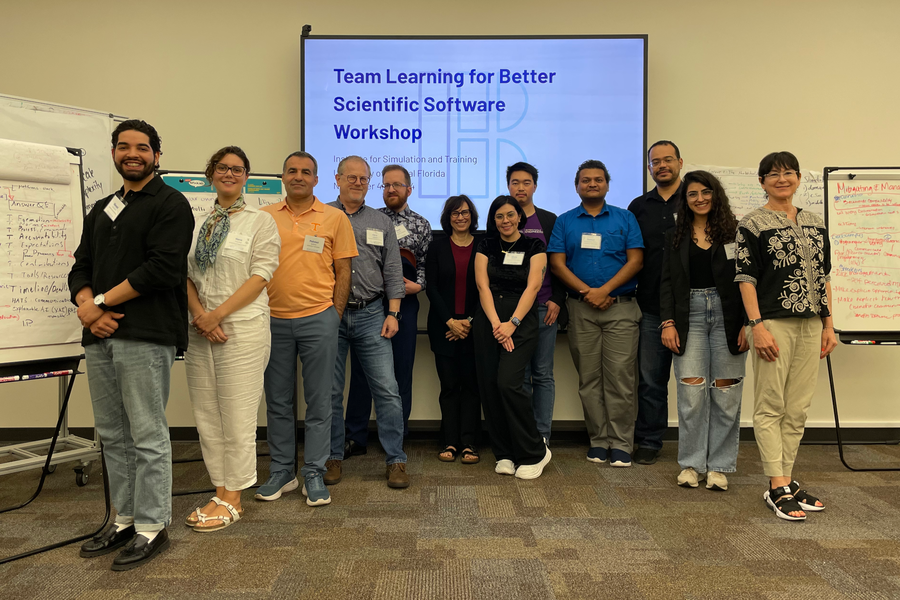

# Team Learning for Better Scientific Software

#### Contributed by [Olivia B. Newton](https://github.com/small0live)

#### Publication date: May 9, 2025

<!--deck start-->
We rarely give much thought to the learning that takes place in teams, but a recent workshop started developing a research agenda to take a closer look at its role in scientific software development.
<!--deck end-->

This article provides a brief introduction to team learning followed by a summary of the Team Learning for Better Scientific Software Workshop.

Teamwork is ubiquitous in science and engineering. The realm of scientific software is no exception to this observation: teams composed of different types of experts, with varying levels of experience and trained in distinct disciplinary traditions, come together to tackle complex, persistent challenges in science and society through software. However, to maximize the potential of collaboration, cross-disciplinary teams must overcome challenges introduced by the insufficient overlap of their knowledge. The ability of such teams to successfully find solutions and develop strategies to manage those challenges rests on the team’s understanding of the problem at hand and each other. That is, the team must learn together.

### What is team learning?

Before jumping into why team learning matters for scientific software, it would be useful to be clear about team learning. What is it? In this context, the focus is on team learning *processes and behaviors* (as opposed to outcomes). There are a number of team learning definitions present throughout literature spanning the organizational, psychological, and learning sciences. Although they do not overlap completely, there are some commonalities across them:

* Team learning is a group phenomenon, not specific or isolated to any individual in the team.
* Team learning consists of learning processes and behaviors engaged by the team over time and in relation to each other, their resources, and their environment.
* Individual members contribute their unique knowledge and perspectives to the team through these processes and behaviors.
* Those contributions have potential for combination and integration, influencing the emergence and quality of team knowledge.
* There is some meaningful gain made by the team relevant to their work (e.g., adaptive responses, adopting processes, developing solutions).

Team learning can include: how a team acquires, shares, and manages information; how a team develops shared knowledge and builds shared meaning; how a team manages and overcomes errors and failure; and how a team reflects on their activities in service of understanding and improving their collaboration. Importantly, the capacity of a team to learn depends on the presence of psychological safety. That is, to learn, a team must actively maintain a climate where its members are able to express themselves without fear of punishment or judgment.

### Why does team learning matter for scientific software?

Now that we have some common ground on what is meant by team learning, let’s consider why team learning matters for scientific software. First, it’s generally understood that team learning positively contributes to team performance. A [recent meta-analysis](https://doi.org/10.1177/10596011211016928) showed that learning that occurs within a team consistently predicts performance across levels of task complexity and in teams with moderate levels of task interdependence. Furthermore, [teams perceive team learning as important for their performance](https://doi.org/10.1108/13527591011090682) and [the opportunity to learn motivates researchers to join collaborative projects](https://doi.org/10.1108/tpm-05-2022-0036).

Second, we know that scientific software often involves collaboration across disciplines, meeting specific computational requirements, and achieving scientific rather than production goals. Scientific software exists at the intersection of cross-disciplinary collaboration and software development, both of which necessitate team learning. Team learning has the power to support scientific software teams as they work toward overcoming the challenges associated with these forms of work. Specifically, team learning critically enables the coordination of their scientific work and integration of diverse approaches.

While we know that team learning is important for the development and use of scientific software, there is still much to, well, learn! We do not know much about how team learning should unfold over time in scientific software projects. We also do not have well-designed techniques to assess and facilitate team learning in scientific software projects. With this in mind, I organized the Team Learning for Scientific Software Workshop with support from the [BSSw Fellowship](https://bssw.io/fellowship) and invaluable guidance from my mentors and colleagues.

[Participants in the Team Learning for Better Scientific Software Workshop.]

### The TL4BSSw workshop

The Team Learning for Better Scientific Software Workshop (TL4BSSw), hosted at the University of Central Florida on November 4-5, 2024, was organized to begin making progress towards developing a team learning framework. The workshop was attended by 12 individuals from universities and national laboratories across the United States, all with a vested interest in better scientific software. Day 1 of the workshop consisted of information sharing and co-construction processes: participants formed small groups and collaboratively developed short proposals for enhancing team learning in scientific software projects. Groups presented their proposals and elicited feedback from each other. These proposals targeted different areas, including supporting multi-team systems, leveraging artificial intelligence, and broadening participation. Day 2 of the workshop consisted of reflective and planning processes as we charted the path forward: developing a framework for future research and curating resources for teams.

### Ongoing work and next steps

Building on the momentum of the workshop, our group has continued our collaboration focused on developing a team learning research framework and engaging other members of the scientific software community. To date, this has included the ongoing development of [online resources](http://tl4bssw.github.io) and a [minisymposium at SIAM CSE25](https://meetings.siam.org/sess/dsp_programsess.cfm?SESSIONCODE=82405) in addition to a planned manuscript submission to a computational science and engineering journal. If you are interested in connecting with our group, please reach out via email: onewton@sigsoft.org.

### Acknowledgements

This work was supported by the Better Scientific Software Fellowship Program, a collaborative effort of the U.S. Department of Energy (DOE), Office of Advanced Scientific Research via ANL under Contract DE-AC02-06CH11357 and the National Nuclear Security Administration Advanced Simulation and Computing Program via LLNL under Contract DE-AC52-07NA27344; and by the National Science Foundation (NSF) via SHI under Grant No. 2327079.

Many thanks to members of the TL4BSSw group for their dedication and continued contribution to this work (in alphabetical order by first name): Chris Lenhardt, Elaine Raybourn, Giovani Diaz Alfaro, Hana Frluckaj, Huaxia Zhou, Lois Curfman McInnes, Mehmet Aydeniz, Mohammed Almtuairi, Reed Milewicz, Sanket Ramchandra Patole, and Zeinab Serhan.

### Author bio

Olivia B. Newton is a Research Associate and Adjunct Professor at the University of Montana (UM). Olivia has a Ph.D. in Modeling and Simulation from the University of Central Florida (UCF), where she received the University Award for Outstanding Dissertation for her work examining expertise and participation in open source software development. Prior to joining the faculty at UM, she contributed to interdisciplinary research on individual and team cognition at UCF’s Institute for Simulation and Training in the Cognitive Sciences Lab. Olivia is interested in collaborative software engineering, expertise utilization in teams, and broadening participation in science.

<!---
Publish: yes
Track: BSSw Fellowship, Community 
Topics: strategies for more effective teams
--->
