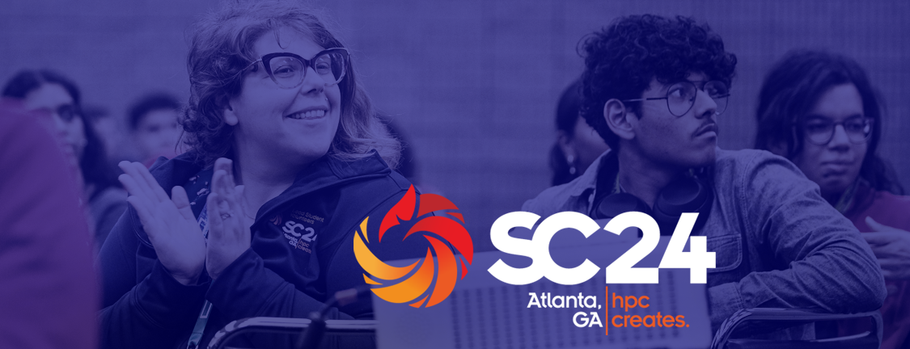

# Research Software Engineers in HPC (RSE-HPC-2024): A Summary of the SC24 Workshop

**Hero Image:**

- 

#### Contributed by: [Charles Ferenbaugh](https://github.com/cferenba), [Sandra Gesing](https://github.com/sandragesing), [Simon Hettrick](https://github.com/SimonHettrick), and [Daniel S. Katz](https://github.com/danielskatz)

#### Publication date: June 23, 2025

<!-- begin deck -->
The RSE-HPC workshop, held in conjunction with SC24 in November 2024 featured invited and contributed talks as well a panel and open discussion about research software engineers working in the HPC area.  With this summary, we also invite contributions to the upcoming SC25 edition of the workshop, to be held in St. Louis, Missouri.
<!-- end deck -->

At the SC24 conference in November 2024, for the fifth year in a row, research software engineers hosted the Research Software Engineers in HPC workshop (RSE-HPC-2024). There were 65 participants onsite in Atlanta, and many more joined virtually. Our goal was to bring together research software engineers (RSEs) and their allies from many countries and backgrounds to hear about successes and challenges that RSEs have experienced, and to discuss ways to increase awareness and support for RSEs.  The program of invited and contributed talks, panels, and breakout discussions was designed to raise interest and encourage active participation.

### Invited talks

Tim Mattson, recently retired from Intel after a long career in HPC, gave the first invited talk, entitled “The Future: What to Do About It—Processors, People, and Programming.” Tim talked about the evolving landscape of computing hardware and software development, emphasizing the dominance of market forces and the critical role of emerging technologies. His talk included discussion of the following topics: the current dominance of hyperscalers, shifts in microprocessor design, challenges for programmers, the cloud’s impact on HPC, programming language trends, and Large Language Models (LLMs) in HPC. Tim ended with a call to action: the HPC community must take ownership of developing sustainable, open-source software infrastructure to support its unique needs, as vendors prioritize more lucrative AI and cloud markets, and he pointed out that collaboration is essential to sustain innovation and build foundational tools for the future.

Sheikh Ghafoor, a program officer in NSF’s Office of Advanced Cyberinfrastructure (OAC), gave the second invited talk: “National Science Foundation (NSF) and National AI Research Resource (NAIRR) Pilot Update.” He talked about OAC’s role, to advance science and engineering research through integrated cyberinfrastructure, which includes hardware (machines, networks, storage) and software (libraries, data infrastructure), as well as people. He then discussed the goals, structure, and ongoing efforts of the NAIRR pilot program. NAIRR was mandated by the U.S. Congress in 2020 and initiated with an Executive Order in 2023. It aims to:

- provide accessible AI research resources (computing, data, software, testbeds),
- democratize AI research by supporting diverse researchers and institutions, and
- advance trustworthy AI.

It is a partnership of many federal agencies and private organizations, led overall by NSF.

The NAIRR pilot’s users include AI researchers advancing foundational technologies, domain scientists leveraging AI for other fields, and educators and students needing training resources. Its infrastructure comprises NSF-funded HPC resources and private contributions from companies like NVIDIA, Google, and Microsoft. NAIRR is currently expanding into supporting AI-related datasets. Areas of current or future development include open AI research, secure computing for privacy, software stack development, and education. The NAIRR pilot has awarded allocations to over 200 projects across disciplines like agriculture, environment, and foundational AI research, and its resources are nearly fully utilized, showcasing the high demand for AI infrastructure. Significant effort is still required to reach underrepresented regions and smaller institutions.

Sheikh stated that RSEs are crucial for operationalizing research tools and ensuring infrastructure usability, and that the evolving complexity of AI and cyberinfrastructure requires RSEs to adapt and innovate alongside these systems. He also discussed upcoming workshops and community-driven efforts for software stack standardization and portal improvements. He emphasized the importance of community involvement in shaping the NAIRR pilot, and the need for sustainable partnerships and innovative solutions to address the growing challenges of AI research and infrastructure.

Sheikh then closed by highlighting some other NSF funding opportunities, including the Campus Cyberinfrastructure (CC) Program, which supports regional and institutional infrastructure development, CyberTraining, which focuses on training researchers, students, and professionals in cyberinfrastructure, and CSSI (Cyberinfrastructure for Sustained Scientific Innovation), which funds software and tool development for community needs.

### Contributed talks

The workshop featured a rich set of contributed talks and a panel that reflected the evolving and interdisciplinary role of research software engineers in HPC and AI.
The contributed talks were:

- Ilektra Christidi from University College London discussed “Applying Good Software Development Practices in HPC – Benchmarking As an Example.” She showcased how rigorous benchmarking pipelines promote reproducibility and sustainability and emphasized the need for codified workflows and community standards to maintain long-term software quality.
- Drew Paine from Lawrence Berkeley National Laboratory presented “Bringing User Experience Practice to RSEs in HPC Ecosystems.” He introduced the Strudel design system and highlighted how integrating user experience principles enhances both research productivity and the usability of scientific software.
- Weronika Filinger from the University of Edinburgh shared insights on “Personalized Learning Pathways for Upskilling RSEs” as part of the Universe HPC initiative. She emphasized the importance of making training learner-driven and transparent, with flexible pathways aligned to the evolving skills needed in research software engineering.
- Jean M. Sexton, also from Lawrence Berkeley National Laboratory, spoke on “Increasing the Effectiveness of Mentoring Programs: An RSE Perspective.” She discussed the role of formal and informal mentoring structures in fostering inclusion and provided practical tips for building impactful mentoring experiences across different settings.
- Jeffrey Carver from the University of Alabama introduced “Connect with Computing in Science & Engineering: An IEEE Computer Society Magazine.” He invited the RSE community to contribute to this platform to amplify their work and share insights across the computational science and engineering ecosystem.
- Fang Liu from Georgia Institute of Technology presented “RSE Support for Georgia Tech’s AI Makerspace,” which leverages GPU-powered infrastructure and container technologies to support AI education. She described efforts to create a scalable, student-led learning environment and to lower access barriers for underrepresented groups.
- Daniel Madren from Purdue University’s Rosen Center for Advanced Computing delivered “Forging the Future of RSE: Self-Sustaining Operational Models and Growth Strategies.” He proposed operational frameworks for sustaining RSE teams through diversified revenue streams, licensing models, and strategic partnerships that balance open-source values with institutional viability.

A panel titled “The Future of Computing” brought together Kevin Gott from NERSC, Dali Wang from Oak Ridge National Laboratory, Shuxia Zhang from Engelhart Commodities Trading Partners, and Siegfried Höfinger from TU Wien. The panel explored the shifting landscape of research computing and the increasingly vital role that RSEs play in supporting diverse users, developing AI-integrated workflows, and enabling energy-efficient systems. Panelists discussed the need for effective onboarding strategies and stressed the value of clear documentation, standardized workflows, and cross-disciplinary training. They also highlighted the challenge of balancing scientific domain expertise with deep knowledge of computing architectures, a skillset that is becoming essential for RSEs working at the intersection of HPC and AI. As energy costs rise and workloads become more complex, the ability of RSEs to optimize code, understand infrastructure, and bridge academic and operational needs is more critical than ever. The conversation closed with a call for better institutional recognition of RSE roles, centralized support systems, and funding mechanisms to grow and sustain the RSE profession across both national labs and international institutions.

### Discussion session

In the last session of the workshop, participants were invited to explore one or more of four themes: the role of emerging technologies like AI in shaping HPC and how RSEs can lead their integration; the evolving structure of HPC teams and the inclusion of new roles such as data stewards and software maintainers; career development pathways and recognition for RSEs; and strategies for influencing funding bodies to better support non-traditional, yet essential, roles within the HPC ecosystems.

Participants discussed the diverse routes into RSE roles and the lack of formal career progression for them. In national labs and universities, RSEs often sit between IT and research roles, making it hard to align with traditional academic progression. While some institutions (e.g., NCSA, UCL) offer structured RSE tracks or promotion criteria, these are still exceptions. Many attendees noted a lack of formal mechanisms for continued technical education and called for accreditation or certification models to support long-term development. There was consensus that clearer progression pathways and advocacy at institutional level are crucial to making RSE a sustainable career. Future editions of the SC conference could support this advocacy by setting up a software or RSE track.

Groups explored how to influence funders to value non-traditional research roles such as data stewards, RSEs, and knowledge specialists. Support organizations, like US-RSE, are key to increasing awareness of non-traditional roles and lobbying funders for change. Tapping into hot topics, like AI, may also help make the case, with examples such as AlphaFold demonstrating how RSE contributions can advance research in general.

A discussion on the future structure of HPC teams envisioned more integrated, multidisciplinary teams involving RSEs, computational scientists, project managers, and data professionals. Smaller, agile teams with members wearing multiple hats may become more common, particularly as workloads evolve from simulation-heavy to data-intensive computing. Participants also discussed the potential of “matrixed” organizational structures that allow flexible deployment of different types of expertise across projects.

RSEs can play a pivotal role in building bridges between domains: raising awareness of emerging roles, fostering collaboration with library and compliance teams, and advocating for a more diverse and representative workforce. The shifting gravity of HPC teams—from traditional academics toward professional research technology staff—was seen as both a challenge and an opportunity to reshape how research is done.

### Conclusion

We were happy to see the enthusiastic participation in the workshop, and the continued interactions and growth of the community in the full week of SC24.  And given all that, we are excited to announce that planning is underway for [RSE-HPC-2025 on November 16th in St. Louis](https://us-rse.org/rse-hpc-2025/).  More details will be available soon, and we hope that many of you will be able to join us!

### Author bios

Charles Ferenbaugh is the Computer Science Lead for the Eulerian Applications Project at Los Alamos National Laboratory. He received a Ph.D. in Mathematics from Princeton University in 1992. He spent several years working at Raytheon developing high-performance signal processing software, before coming on staff at LANL in 2001. At LANL he has been a software developer contributing to large multiphysics code projects running on supercomputer clusters. He has also been a part of LANL research efforts in advanced architectures and programming models. He was a founding steering committee member of the US Research Software Engineer Association.

Sandra Gesing is the Executive Director of the US Research Software Engineer Association (US-RSE), the Director of the Center of Excellence for Science Gateways and a Senior Researcher at the San Diego Supercomputer Center. Her research focuses on science gateways, computational workflows as well as distributed computing which inherently leads to highly interdisciplinary projects. She is especially interested in the sustainability of research software, the usability of computational methods, and the reproducibility of research results. She advocates for improving career paths for research software engineers and facilitators and for incentivizing their work via means beyond the traditional academic reward system.

Simon Hettrick is Director of Strategy for the Software Sustainability Institute and a Director of the Southampton Research Software Group. Simon's research focuses on the use of software in the research community with the aim of understanding practices and demographics. Simon is a passionate advocate for Research Software Engineers. He orchestrated a campaign to gain recognition for this community, which has grown from a handful of people in 2013 to a substantial international community. He was the founding chair of the UK's Association of Research Software Engineers and was a founding Trustee of the Society of Research Software Engineering.

Daniel S. Katz is Chief Scientist at the National Center for Supercomputing Applications (NCSA) and Research Professor in the Siebel School of Computing and Data Science and the School of Information Sciences (iSchool) at the University of Illinois Urbana-Champaign. Dan's interest is in the development and use of advanced cyberinfrastructure to solve challenging problems at multiple scales. His technical research interests are in applications, algorithms, fault tolerance, and programming in parallel and distributed computing, including HPC, Grid, Cloud, etc. He is also interested in policy issues, including citation and credit mechanisms and practices associated with software and data, organization and community practices for collaboration, and career paths for computing researchers.

<!---
Publish: yes
Track: community
Pinned: no
Topics: conferences and workshops, Research Software Engineers
--->
