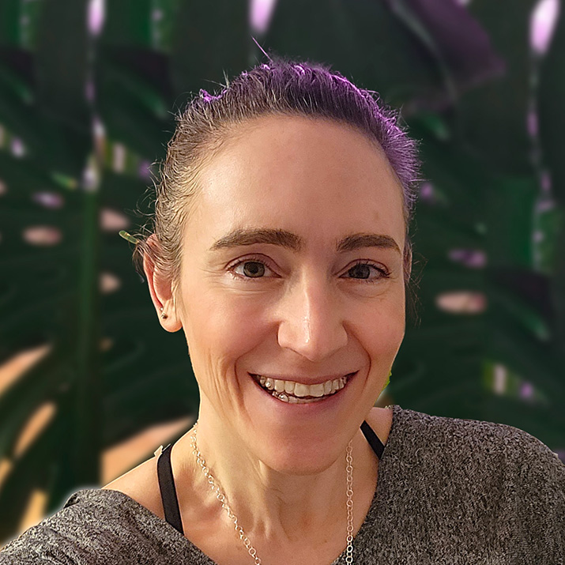

# 2024 BSSw Fellows: Projects and Perspectives

Read about the 2024 BSSw Fellows and their contributions to the BSSw community!

<!-- TODO: Get new image -->

#### Contributed by: [Elsa Gonsiorowski](https://github.com/gonsie "Elsa Gonsiorowski's GitHub Profile"),[Dave Bunten](https://github.com/d33bs "Dave Bunten's GitHub Profile"), [Dorota Jarecka](https://github.com/djarecka "Dorota Jarecka's GitHub Profile"), [Olivia Newton](https://github.com/small0live "Olivia Newton's GitHub Profile"),  [Ken Raffenetti](https://github.com/raffenet "Ken Raffenetti's GitHub Profile"), [Ryan Richard](https://github.com/ryanmrichard "Ryan Richard's GitHub Profile"), [Leah Wasser](https://github.com/lwasser "Leah Wasser's GitHub Profile")

#### Publication date: July 13, 2025

[Better Scientific Software (BSSw) Fellowships](https://bssw.io/fellowship) provide resources and community support to those who foster and promote practices, processes, and tools to improve developer productivity and software sustainability of scientific codes.

The 2024 BSSw Fellows have utilized their skills to create tutorials, webinars, and tools to guide developers through various stages of the scientific software lifecycle and impact the culture of scientific software development.
Here's more about what they have been up to and their perspectives on the BSSw Fellowship program.

## Software gardening almanack: Cultivating sustainable software development in the generative era

Scientific software developed through factory assembly approaches often overlooks the dynamic evolution of code and risks becoming obsolete abandonware, costing resources and hampering scientific replicability. BSSw Fellow Dave Bunten has developed the [Software Gardening Almanack](https://software-gardening.github.io/almanack/introduction.html), an open-source handbook of applied guidance and tools for sustainable software development and maintenance. The almanack offers guidance to developers on dynamic, sustainable software management. It also covers detecting and addressing challenges throughout the software lifespan for a range of topics, such as code decay and broken environments. In addition to GitHub, users can also access the [applied tools based on the handbook through PyPI](https://pypi.org/project/almanack/) (e.g., `uv add almanack` or `pip install almanack`).

<a href="https://software-gardening.github.io/almanack/introduction.html" class="link-row">Software Gardening Almanack</a>
<a href="https://pypi.org/project/almanack/" class="link-row">Software Gardening Almanack PyPI package</a>
<a href="https://bssw.io/blog_posts/growing-resilient-scientific-software-ecosystems-introducing-the-software-gardening-almanack" class="link-row">BSSw.io blog article - Growing Resilient Scientific Software Ecosystems: Introducing the Software Gardening Almanack</a>
<a href="https://github.com/software-gardening" class="link-row">Software Gardening Ecosystem on GitHub</a>

 

    

        

<a href="https://www.linkedin.com/in/dave-bunten">Dave</a> is a software developer in the Department of Biomedical Informatics at the University of Colorado Anschutz Medical Campus. He has over a decade of experience in the field of software development and data engineering and holds an M.Ed. in Educational Technology. Dave is passionate about software design, research data engineering, in-memory data flow, and scientific software.

*Perspectives on the BSSw Fellowship Program:*
Being part of the BSSw community also created valuable connections that amplified the project's reach, accelerated its development, and fostered deeper engagement with the broader scientific software ecosystem. Developing the Software Gardening Almanac has broadened my technical skills, strengthened my leadership in open-source projects, and deepened my appreciation for collaboration across groups and disciplines. It provided a unique opportunity to connect with a broader community dedicated to improving software quality and to transform conceptual ideas into tangible educational resources, practical tools, and real-world impact. Through building and applying the Almanack, I also gained a deeper understanding of empirical software development—the power of using real software data, metrics, and sustainability signals to inform and improve how we build and maintain scientific software ecosystems. One major takeaway is that sustainable software doesn't happen by accident--it requires deliberate cultivation over time, much like tending a living garden. I also learned that providing both conceptual frameworks and actionable tools is essential to truly empower developers and support long-term change. Exploring software sustainability through the Fellowship revealed a topic that is much deeper, richer, and more dynamic than I first understood; it's not only intellectually rewarding but genuinely fun. This sense of exploration continues to open up new and inspiring questions about how we build, maintain, and care for scientific software.

*Advice for new (prospective) BSSw Fellows:*
Pick a project that you feel deeply connected to--something that addresses a real need in the world and resonates with your values. Use the Fellowship as a catalyst to grow your ideas into something tangible, meaningful, and impactful. Be bold: reach for the ideas that feel just beyond your grasp. Stay true to your heart, and pour your passion into the work--people will recognize it and be drawn to it. And remember: the relationships you build through BSSw will be just as lasting and valuable as the work itself.

- - -

## Best practices for reproducibility and testing in scientific software

BSSw Fellow Dorota Jarecka has developed an eight-month training program for scientists to foster continuous learning and integrate best practices in scientific software development. The course covers both reproducibility in scientific software and testing and debugging with Python.

<a href="https://science-reproducibility.github.io/BSSw_course_page/" class="link-row">Best Practices for Reproducibility and Testing in Scientific Software course website</a>
<a href="https://science-reproducibility.github.io/BSSw_course_page/blog-post.html" class="link-row">Reflections on the BSSw Fellowship</a>

 

  

<a href="https://linkedin.com/in/djarecka">Dorota</a> is a research scientist at the McGovern Institute for Brain Research, MIT. Her current work focuses on scientific software, data modeling, and neuroinformatics. She received a Ph.D. in Atmospheric Research and an M.S. in Theoretical Physics from the University of Warsaw, Poland. Her prior worked focused on numerical modeling of cloud microphysical processes.

*Perspectives on the BSSw Fellowship Program:*
As scientific research becomes increasingly dependent on software, it's essential to ensure that this software is efficient, sustainable, and reproducible. The fellowship offers a unique platform to support these goals, empowering individuals to lead improvements in software development practices, documentation, testing, and training across the scientific community. The fellowship gave me the opportunity to develop a modular course format I had been envisioning, one that integrates concise explanations with hands-on exercises in a single place and promotes continuous learning through small, manageable segments. I was able to experiment with different platforms and formats, refine the content with a focus on accessibility, and ensure it would not overwhelm learners. One unexpected challenge was recognizing how difficult it can be to engage already busy students in an era saturated with online courses and rapidly evolving LLM-based tools that can quickly answer many software-related questions. Nevertheless, I believe that developing a strong conceptual understanding remains invaluable. The fellowship also enabled me to connect with other BSSw Fellows and engage more deeply with the broader Research Software Engineering (RSE) community. During the fellowship, I began collaborating with instructors across multiple departments who are involved in teaching software-related courses. Moving forward, I aim to strengthen these collaborations, and I'm confident that these connections will continue to foster efforts to promote better scientific software practices.

*Advice for new (prospective) BSSw Fellows:*
From my experience, one of the biggest challenges was making time for my BSSw project alongside my primary commitments. If I were to do it again, I would make a more intentional effort to block dedicated time specifically for the fellowship work and involve others to help keep myself accountable. Another piece of advice is to start thinking early about how to engage the community and reach potential participants. Building interest and visibility takes time, so planning outreach efforts from the beginning can make a difference.

- - -

## Improving the effectiveness of scientific software teams through collaborative learning.

BSSw Fellow Olivia Newton organized a workshop to produce an open knowledge base with tools to support and evaluate team learning in the interdisciplinary groups developing scientific software. Interdisciplinary group work in scientific software development is increasingly common as institutional initiatives aim to advance science through collaboration and technological innovation. These collaborations are created with the goal of solving problems that are complex in nature and thus benefit from the integration of varied forms of expertise and perspectives to produce software. Team learning has been identified as a key process for the performance and collaboration effectiveness of scientific teams. At the same time, facilitating this form of learning remains a challenge given the breadth of expertise that must be synthesized to effectively build knowledge.

<a href="https://tl4bssw.github.io" class="link-row">Team Learning for Better Scientific Software workshop</a>
<a href="https://tl4bssw.github.io/teamresources/" class="link-row">Resources for Teams</a>
<a href="https://bssw.io/blog_posts/team-learning-for-better-scientific-software" class="link-row">BSSw.io blog article - Team Learning for Better Scientific Software</a>
<a href="https://meetings.siam.org/sess/dsp_programsess.cfm?SESSIONCODE=82405" class="link-row">Team Science in CSE for All, Minisymposium at SIAM CSE</a>

 

  

<a href="https://small0live.github.io">Olivia</a> is a member of the faculty at the University of Montana. She is interested in modeling human and technical aspects of collaboration in science and engineering domains to enhance team effectiveness and promote equity in computational technologies.

*Perspectives on the BSSw Fellowship Program:*
When I first learned of the BSSw Fellowship, I knew that I had to apply. I was able to work with a passionate group of individuals to organize resources and research recommendations to support learning in scientific software teams. The project was much more than an opportunity to build on this line of inquiry, though, as it was a transformative experience for an early career researcher like me. Through my project, I have expanded my professional network, mentored graduate students, discovered career trajectories, and established new collaborations. Importantly, the fellowship has increased my awareness of scientific software at the intersection of government, higher education, and industry. As a researcher in the academy, exposure to collaborative scientific work carried out at the national laboratories, in particular, has been exciting, eye-opening, and deeply motivating. A major takeaway for me has been the unique talent and passion at the labs for advancing science and technological innovation. I hope that by continuing my work and advocating for social science in computational spaces, I can enhance the effectiveness of collaboration for better scientific software.

*Advice for new (prospective) BSSw Fellows:*
First, if you haven't already, find ways to engage with the BSSw community, from reading blog posts to submitting your own events and surveys to introducing yourself at conferences. Making these types of connections will enhance your understanding of the ways that you can make a positive, meaningful impact in the scientific software community. Second, leverage the BSSw community to strengthen and execute your project. That means asking for help (e.g., guidance, feedback, etc.) when you need it and accepting help when it's offered. Both will help maximize the potential of your project.

- - -

## Guidelines for improving MPI performance

The Message Passing Interface (MPI) is a critical component for many HPC applications. While MPI has many features, it is not obvious to users which may provide the best performance for their application, or how to avoid common usage pitfalls. The MPI Standard document---at over one thousand pages---is not a user's manual. Readers of the MPI Standard document may easily overlook key features and concepts. BSSw Fellow Ken Raffenetti has created online resources to help users get the best performance by explaining, in plain terms, guidelines for using MPI effectively. Ken used his years of experience in the MPI community to educate users on best practices.

<a href="https://mpi-performance-guidelines.github.io" class="link-row">MPI Performance Guidelines website</a>
<a href="https://bssw.io/blog_posts/mpi-performance-guidelines" class="link-row">BSSw.io blog article - MPI Performance Guidelines</a>

 

  

<a href="https://www.linkedin.com/in/ken-raffenetti-b47a1222/">Ken</a> is a research software engineer in the Mathematics and Computer Science Division of Argonne National Laboratory. His research interests include parallel programming models and low-level communication libraries.

*Perspectives on the BSSw Fellowship Program:*
I wanted to share the experience I have gained as part of the MPI community over the years. I have been lucky enough to learn from the top parallel programming experts in scientific computing, and I wanted to share that expertise with others.  I viewed my project as a way to step outside my typical software development comfort zone. I wanted to write, in an approachable way, about MPI performance topics. To complement the writing, I wanted to try my hand at producing short video content. Each was challenging in its own way. Writing requires organizing my thoughts more formally than is needed in casual conversation. In doing so, I believe I deepened my understanding of each topic. The videos, on the other hand, were an exercise in distillation. The goal was to not overwhelm or bore the audience, but to get the point as quickly and succinctly as possible. What I'll take away from the fellowship is the confidence and support that I felt from the BSSw community. Having the privilege to run my ideas past the BSSw team was truly valuable. They wanted to see my project succeed, and that was a welcome boost that helped bring it to life.

*Advice for new (prospective) BSSw Fellows:*
My advice for new fellows is not to get overwhelmed and not to be afraid to ask for help. I got stuck several times in my project, and my team at Argonne was instrumental in helping me get back on track.

- - -

## Sustainable scientific software through multi-project CI/CD

BSSw Fellow Ryan Richard wants to simplify the process of using continuous integration/continuous deployment (CI/CD) across multi-project organizations. As scientific software becomes more modular, many development teams are increasingly developing and maintaining multiple projects. Adhering to best practices in software engineering means that each of these projects will rely on a CI/CD pipeline to ensure correctness, reliability, and conformance with community standards. Since these projects are often managed by a common development team, many aspects of the CI/CD pipelines are shared across the projects. In the spirit of treating infrastructure as code, developers should avoid duplicating CI/CD infrastructure across projects. Via a series of workshops, Ryan has brought the community together to share techniques CI/CD maintainers are already using to avoid CI/CD infrastructure duplication.

<a href="https://multiprojectdevops.github.io" class="link-row">Best Practices for Multi-Project CI/CD website</a>
<a href="https://multiprojectdevops.github.io/workshops/" class="link-row">Multi-Project CI/CD Workshop Reports</a>
<a href="https://bssw.io/blog_posts/best-practices-for-multi-project-continuous-integration-and-deployment" class="link-row">BSSw.io blog article - Best Practices for Multi-Project Continuous Integration and Deployment</a>

 

  

<a href="https://rmrresearch.github.io/">Ryan</a> is a scientist in the Chemical and Biological Sciences Division of Ames National Laboratory and an Adjunct Assistant Professor of Chemistry at Iowa State University. Ryan's primary research interests are the design and development of sustainable scientific software, high-performance computing, and high-accuracy quantum chemistry method development.

*Perspectives on the BSSw Fellowship Program:*
Probably my biggest takeaway from this experience is the importance of the community. Through my project, I have now engaged with over a hundred members of the research software engineering community. These discussions proved extremely useful in exploring the problem and solution spaces for multi-project CI/CD and helped shape the initial best practices. I hope that my BSSw project can contribute to the larger discussion on the importance of valuing all aspects of maintaining scientific software. While continuous integration and deployment (CI/CD) is generally viewed as important to developers, it's largely transparent to users of the software. As such, many developers struggle to secure funding and time to "do CI/CD right." This characterization is not unique to CI/CD, but pervasive throughout much of the scientific software development process. Perhaps with enough examples of the "thankless" work that occurs behind the scenes, we can begin to change the narrative so that reliable, maintainable, and extendable scientific software becomes as valued as the results it produces.

*Advice for new (prospective) BSSw Fellows:*
Talk to other community members. More than likely, your BSSw Fellowship idea will resonate with other people in the community. Those community members can provide you with valuable feedback on how to improve your idea and/or make it more applicable. If you do not know where to start, consider joining the US RSE's Slack workspace.

- - -

## Essential collaboration skills for contributing to open source software

BSSw Fellow Leah Wasser has created a multi-lesson self-paced online module that teaches the often-missed technical and social collaboration skills needed to contribute to open source software (OSS). The focus of these lessons is on the skills that will make the experience of OSS contributors more positive and constructive. Areas of social focus include using constructive and specific language and code examples that simplify problem solving, building trust with volunteer maintainers, providing reproducible code for bug reports, and referencing issue history when submitting bugs.

<a href="https://www.pyopensci.org/lessons/contribute-open-source/index.html" class="link-row">Introduction to GitHub and Open Source Collaboration</a>
<a href="https://www.pyopensci.org/blog/contribute-to-open-source-lessons.html" class="link-row">pyOpenSci blog article - Contribute to Open Source Software: It’s More Than just Code</a>

 

  

<a href="https://www.leahwasser.com">Leah</a> is the executive director and founder of pyOpenSci --- an organization that is building a diverse community that supports the open source tools that are driving open science. She has taught data-intensive science for about 20 years, with the last 10 devoted to open-source software. Previously, Leah developed an Earth analytics education program at the University of Colorado - Boulder. In her free time Leah can be found on mountain trails with her pup.

*Perspectives on the BSSw Fellowship Program:*
The BSSw award gave me a unique opportunity to focus on a key challenge in scientific open source: sustainability--and the social side of contributing. Contributing to open source is not just technical--it's deeply social. While learning Git and GitHub can be hard, navigating new communities and communication norms is often opaque. This work is personal. I started unsure of how to contribute. Today, I maintain a project with a strong user base. I also lead a scientific open source community, pyOpenSci, that runs beginner-friendly sprints that empower people to make their first contributions. My journey empowered me to develop the technical and social skills needed to participate.  These lessons aim to empower hundreds of others to take their first steps. The BSSw award made this empowerment possible.

*Advice for new (prospective) BSSw Fellows:*
Think about a topic that is meaningful to you that you think will impact the scientific open source community positively! Also, think about something that is doable given the allocated funds, but also that might scale in a way that impacts and broadens participation in open source.

- - -

## Learn more about the BSSw Fellowship Program

BSSw Fellows are selected annually based on an application process that includes the proposal of a funded activity that promotes better scientific software. See more about the [BSSw Fellowship Program](https://bssw.io/fellowship), including the ongoing work of the 2025 BSSw Fellows. We will begin accepting applications for 2026 BSSw Fellowships during mid-August 2025. Register for the [BSSw mailing list](https://bssw.io/pages/receive-our-email-digest) to receive information.

## Author bio

Elsa Gonsiorowski is the coordinator of the BSSw Fellowship Program, a member of the [PESO](https://pesoproject.org) team, and an HPC I/O support specialist at [Livermore Computing, LLNL](https://hpc.llnl.gov/about-us).

<!---
Publish: yes
Track: bssw fellowship
Pinned: no
Topics: Projects and organizations
--->
