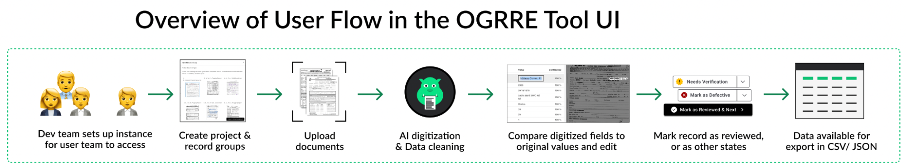

# User Experience Design (UXD) in the Lifecycle of Scientific Software

**Hero Image:**

- 

#### Contributed by [Sarah Poon](https://github.com/sspoon), [Rajshree Deshmukh](https://github.com/Rjdesh), and [Drew Paine](https://github.com/pained)

#### Publication date: July 28, 2025

<!-- begin deck -->
User Experience Design (UXD) identifies and leverages user needs to help deliver usable scientific software products.
<!-- end deck -->

This is the second article in a series on User Experience (UX) in the scientific software lifecycle written by members of the UX team in the Scientific Data Division at Lawrence Berkeley National Laboratory. The [first piece](https://bssw.io/blog_posts/framing-user-experience-ux-across-the-scientific-software-lifecycle) introduced UX work and UX Research as a practice. This piece focuses on the role of UX Design (UXD) and, to a lesser extent, UX Writing in scientific software lifecycles. Links to the entire series are provided in [Further information](#further-information) below.

### What is UX Design?

UX Design is work that develops research insights and transforms them into product designs. These designs can then be iteratively tested and measured for usability, accessibility, and so forth to produce a joyful, consistent, productive, and relevant overall experience. UX Design directly impacts the chance that target users will use a piece of scientific software at all, the extent to which they use its full set of capabilities, and the degree to which they will promote the software to others in their community. UX Design work can influence everything from how an end user first learns about a product via its website to the software’s graphical user interface (GUI), command line interfaces, APIs, or, very importantly, documentation. UX methods and design are furthermore often used to shape an organization’s processes for delivering software or services so that likely pain points and user needs can be identified and resolved before they are able to lead to a negative experience. 

### Who are UX Designers?

Individuals conducting this work commonly hold a UX Designer role but may also be referred to as User Interface (UI) designers (perhaps with a more limited direct scope) or hold a software engineering role in scientific environments. Some come with formal training or education in UX and human-centered design. Others may be software engineers or domain scientists who develop skills through online training resources (some examples linked below).

### What does UX Design entail?

UX Design contributes to the scientific software development process by helping identify user needs, translating these into designs, and facilitating their testing with a variety of end users. Identifying user needs, which may involve collaboration with a UX Researcher, can include conducting a literature review or competitive analysis of existing tools or services, development and distribution of a community survey, or conducting interviews with focal users and project stakeholders. This is essential work to focus the team’s perspective on what targeted users need from a software product versus what the team may be aiming for it to do in line with their research goals. The overlap between these needs and desires is hopefully, but not necessarily, strong.

UX Designers employ UXD methods to analyze the data from these investigations to develop the experience, from first interaction to advanced use cases. UX Designers can then prototype interface designs and evaluate them via usability testing to gather grounded and consistent feedback. UX Designers also work closely with other members of development teams to ensure proper handoff and implementation of designs, often answering questions about particular details, as nuances of code may require subtle changes. Fundamentally, UX Design should help scientific software teams ensure clear communication of information to end users and generate usable interactions with software products and services.

Additionally, a key part of software usability and adoptability is clear communication enabled through UX Writing design work. UX Writing specifically focuses on crafting clear communication within and about a software product for end users (e.g., the labels, notifications, and other text within an application, the documentation for developers and end users, or summary information on a product’s website). UX Writing focuses on ensuring clear, consistent, and understandable language across aspects of a product to aid its accessibility. This role is less common in scientific software contexts compared with industry, but the work is still essential and commonly undertaken by UX Designers (often implicitly) in concert with researchers and engineers on the team.

### Examples of UX Design work for scientific software

For over 15 years, members of the UX team in what is now the [Scientific Data Division](https://crd.lbl.gov/divisions/scidata/) at Lawrence Berkeley National Lab have employed UX design methods to improve software for scientific users. These range from early work on a workflow API with the Tigres project to more recent partnership building an AI/ML-enabled oil and gas record digitization tool.

#### Case: Tigres API

Our first example is [Tigres](https://ieeexplore.ieee.org/document/6972276), a project to develop a workflow API providing a simple set of workflow templates (e.g., sequence, parallel, split, merge) to compose and execute computational and data transformation pipelines. The Tigres team wanted to be able to iteratively gather feedback from potential users to ensure the usability, relevance, and usefulness of the tool when designing and developing the Tigres API. They wanted to incorporate UX methods, but at the time, found very little work about applying these methods to APIs.

To gather and assess user needs, UX Designers on the Tigres team developed a usability testing protocol for APIs. This protocol involved a lightweight, “low-fidelity” prototype of the API where the API calls were defined as documentation but not yet implemented in code. For a graphical user interface, this is akin to sketching the layout of interface features. The team then developed a set of tasks involving the API and held sessions to ask test participants to “think aloud” and write pseudo code using the API documentation to develop a solution addressing their workflow needs. After each usability test, the proctors spent a significant amount of time in follow-up interviews with the test participants to understand their challenges and needs. 

While the study did provide some insight into areas where the API could be clearer or better documented, the team’s biggest takeaway was that the usability study provided context to have a deeper discussion with test participants about how they could use the API and what they would need the tool to do to help them with their work. The usability study made concrete what was previously too abstract and conceptual for users to be able to provide feedback. 

#### Case: OGRRE

Our second example comes from a partnership between our UX team and National Energy Technology Laboratory (NETL) staff on the Consortium Advancing Technology for Assessment of Lost Oil & Gas Wells (CATALOG) project. CATALOG’s broad aim is to locate and characterize so-called "undocumented orphan wells", which are oil and gas wells that are no longer actively owned or maintained but could be leaking toxic materials into the air and groundwater. One area of focus for the UX team and NETL was developing a tool for digitizing historical oil and gas regulatory records so that detailed well location and construction information would be more accessible to end users. Historically, this vital data is most often difficult to access, buried in unstructured scans of printed records. The project’s resulting tool, the Oil and Gas Regulatory Record digitizEr (OGRRE), is an intelligent document processing workflow that streamlines the digitization and extraction of key data from these scanned records.

The UX team supported this software across its development lifecycle. UX Designers participated in stakeholder discussions and conducted user interviews to identify a diverse range of users with varying roles and needs. The entire project team used this feedback to inform the tool's design, incorporating features such as separate roles and permissions, rapid review and approval processes, and an intuitive information architecture. As development progressed the UX team held regular feedback sessions with staff who would serve as end-users of the software. Using this feedback, the team refined the tool’s user experience while ensuring a seamless onboarding experience and dedicated support for users. 

The resulting product is particularly valuable for state agencies and industry stakeholders that require highly accurate information from oil and gas regulatory documents. Using OGRRE, state agencies and other stakeholders can build and curate digital oil and gas well databases to strategically implement well plugging campaigns or identify wells with optimal designs for reuse.

### Conclusion

UX Design is work to help build usable, consistent products that enable work to be accomplished effectively, efficiently, and productively. By investigating the needs of focal users, UX Designers can then design and test documentation, APIs, and interfaces that are usable. UXD work is increasingly found in scientific software environments, and there are many opportunities to learn more. We have curated a few resources below for those who are interested in exploring further.

This post is the second in a series about the user experience of scientific software. Upcoming articles will explore UX Engineering and design systems for user interface development, and will highlight experiences from working groups dedicated to growing communities of practice for UX in science. Additional suggestions for articles would be most welcome\!

*Confused and want clarification? Curious to learn more? Reach out or explore the further information links!*

### Further information

* This article is part of a series about UX for scientific software.  The other articles are linked below as they are published.
  * [Framing User Experience (UX) Across the Scientific Software Lifecycle](https://bssw.io/blog_posts/framing-user-experience-ux-across-the-scientific-software-lifecycle)
  * User Experience Design (UXD) in the Lifecycle of Scientific Software (this article)
  * User Experience Engineering in the Lifecycle of Scientific Software *(to be published)*
  * Design Systems To Help Amplify Development of Usable Scientific Software Interfaces *(to be published)*
  * Growing Communities of Practice in Scientific Software: Experiences from User Experience *(to be published*)
* Interested in joining communities of practice for UX in science?   
  * The US-RSE community and its User Experience working group offer the opportunity to engage with others about UX or identify resources to help your own software team. [https://us-rse.org/wg/ux/](https://us-rse.org/wg/ux/)   
  * The Consortium for the Advancement of Scientific Software (CASS) User-Developer Experience (UDX) working group offers bimonthly talks and conversations open to all. [https://cass.community/working-groups/user-developer-experience.html](https://cass.community/working-groups/user-developer-experience.html)   
* Interaction Design Foundation  
  * [https://www.interaction-design.org/literature/topics/ux-design](https://www.interaction-design.org/literature/topics/ux-design)   
  * [https://www.interaction-design.org/literature/topics/ux-writing](https://www.interaction-design.org/literature/topics/ux-writing)   
* Useful Design Tools  
  * Figma [https://figma.com](https://figma.com)   
  * Penpot (open source alternative to Figma) [https://penpot.app/](https://penpot.app/)  
* Useful Writing & Documentation Resources  
  * The Good Docs Project [https://www.thegooddocsproject.dev/](https://www.thegooddocsproject.dev/)   
  * Write the Docs community [https://www.writethedocs.org/](https://www.writethedocs.org/) 

### Author bios

Sarah Poon

Rajshree Deshmukh

Drew Paine is a 2024 BSSw Fellowship Honorable Mention and User Researcher in the Scientific Data Division at Lawrence Berkeley National Laboratory. He contributes to a range of UX projects (<https://ux.lbl.gov>) and has over a decade of qualitative user research experience in scientific software and commercial cloud environments. He holds a PhD in Human Centered Design and Engineering from the University of Washington and a BS in Software Engineering from Rose-Hulman Institute of Technology.

<!---
Publish: Yes
Track: Deep Dive
Topics: user experience design, software process improvement
--->
