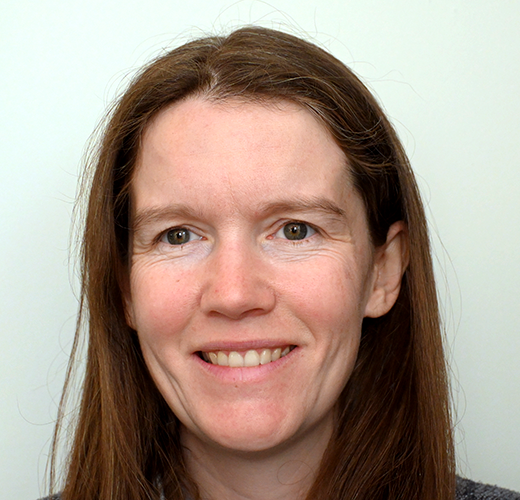

# Reducing Code Review Anxiety in Open Sourcing

#### Contributed by Heather Bourbeau and Sustainable Horizons Institute

#### Publication date: August 26, 2025

Meet Helen Kershaw, Software Engineer at the National Science Foundation’s National Center for Atmospheric Research (NSF NCAR), who, as a Better Scientific Software (BSSw) Fellow, has worked passionately to encourage and humanize the essential skill of code review.

 

This article is cross-posted at [Sustainable Horizons Institute](https://shinstitute.org/).

 
[Helen Kershaw]

 

[Helen Kershaw](https://bssw.io/fellows/helen-kershaw), Software Engineer at the National Science Foundation’s National Center for Atmospheric Research (NSF NCAR), wants to encourage and humanize the essential skill of code review. She develops the Data Assimilation Research Testbed (DART), an open-source community facility for ensemble data assimilation, and has seen that software developers can be timid about sharing their code to open-source projects, particularly first time contributors. 

Often researchers are trying to learn programming languages as they are also working on their scientific problem, and sometimes research software engineers are working in areas where they have steep learning curves. Thus, during code critiques, it can be frustrating and discouraging to hear about issues with something that is not a well-developed skill. Reviewers, as well as reviewees, need help navigating critiques, and this is where Helen Kershaw comes in. 

As a Better Scientific Software (BSSw) Fellow, she has created an online tutorial that can be used to onboard new contributors or as a review for more confident coders. The tutorial can be done in pairs or individually and emphasizes the skill of reviewing, not the skill of coding. Users practice code review by using the git utility and Github, where mistakes can be made without consequences.

As of July 2025, her [code-review.org](https://code-review.org/) tutorial has been accessed over 100 times and is used to onboard new staff, including the Summer Internships in Parallel Computational Science (SIParCS) program, at NSF NCAR. “We actually ended up sharing some mediated discussions on code review throughout NSF NCAR,” says Kershaw. “These were lively and active with software engineers across NSF NCAR sharing their experiences. These discussions really bridged the gap between software groups.” 

She credits her BSSw Fellowship with giving her the time and resources to develop the tutorial.  “The fact that they fund the Fellowship allows people to try projects that they've maybe wanted for a while but maybe can’t do on their own time,” says Kershaw. “I think that is amazing.”

Her enthusiasm for the program is such that she is now turning her mentoring skills to the BSSw Fellowship itself, working with newer fellows. “BSSw is a great organization. It is a great way to connect with people who are your peers at other institutions. As a result, the BSSw experience gives you valuable perspectives.”  

### More info
Learn more about [Helen Kershaw's work as a BSSw Fellow](https://bssw.io/fellows/helen-kershaw).

The main goal of the BSSw Fellowship program is to foster and promote practices, processes, and tools to improve developer productivity and software sustainability of scientific codes. Submissions for the 2026 cohort are now open: [2026 BSSw Fellowship Application Form](https://bssw.io/pages/apply-for-the-bssw-fellowship-program)\!*

Fellowship Q&A webinar: Tuesday, September 16, 2025 1:00-2:00 pm EDT. [Subscribe](https://bssw.io/pages/receive-our-email-digest) to our mail list to be notified about details. Please see the [FAQ page](https://bssw.io/pages/bssw-fellowship-faq), where we will post Q&A slides, as well as the questions that have been raised (with answers, of course!)

Application deadline: Friday, October 31, 2025; this is a firm deadline that will not be extended.

### Author bios
[Heather Bourbeau](https://www.linkedin.com/in/heatherbourbeau/) is a research analyst, communications strategist, and storyteller.
[Sustainable Horizons Institute](https://shinstitute.org) is a partner in leading the BSSw Fellowship Program.

<!---
Publish: yes
Track: bssw fellowship
Topics: Funding sources and programs, projects and organizations
OpenGraph image: OG_2508_BSSwFellowships.png
--->
