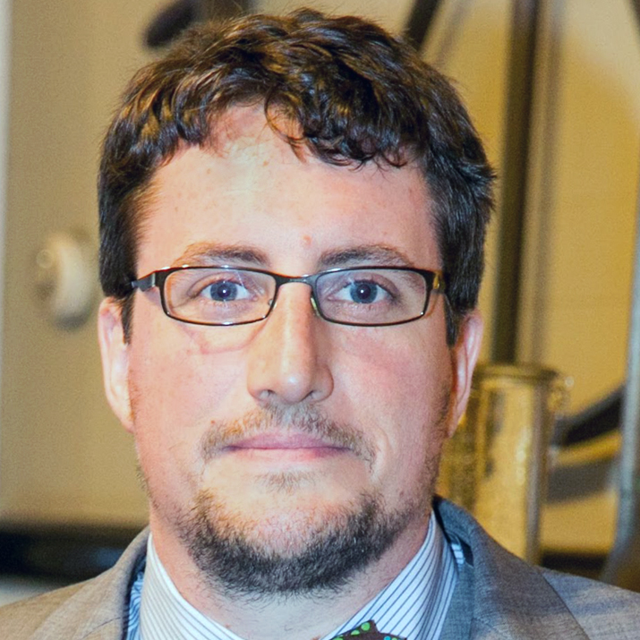

# Building Better Proposals, Enabling Best Research

#### Contributed by [Heather Bourbeau](https://www.linkedin.com/in/heatherbourbeau/) and [Sustainable Horizons Institute](https://shinstitute.org)

#### Publication date: September 9, 2025

Meet Chase Million, BSSw Fellow and founder of Million Concepts, who recognized a critical gap in research environments: the need for dedicated project management, process support and engineering expertise in research software development. And researchers are grateful. Million has been approached at conferences and by research software engineering groups across the country about his BSSw paper, and continues to  provide research software engineering services through Million Concepts

 

This article is cross-posted at [Sustainable Horizons Institute](https://shinstitute.org/better-scientific-software-bssw-fellowship-previous-fellows-spotlight-helen-kershaw/).

 
[Chase Million]]
 

[Chase Million](https://bssw.io/fellows/chase-million) started Million Concepts, which provides research software engineering services, because he was frustrated by an absence of “professional process and project management for software development in research contexts,” including allocating enough time and resources to software tasks. His company builds software to enhance the work of scientific researchers and subject-matter experts, many of which are funded by grants. “The idea was that we would then be on the grant as the software people and there would be a specific line of funding for that, which has been historically rare,” says Million. 

As a Better Scientific Software (BSSw) Fellow, he wanted to figure out how to make strong arguments for software development efforts in grant proposals. Often one-third of research proposals’ merit criteria is the “work plan,” including software development and maintenance. However, proposal writers dedicate far less than one-third of a proposal itself to their work plan. “Academic scientists don't have the background with which to provide any sort of plausible estimate of how long software-related things are going to take,” says Million. “The BSSw Fellowship allowed me to dig deeply into the literature on software project estimation.”

He found that only a small fraction of the literature applied to the domain of research software, and what he did find underscored that allocating limited resources to a software team and having that team be composed of domain experts make a scientific research project less efficient. “I was able to distill what's the easiest, quickest way that a researcher can make a reasonable and compelling case for what amount of resources they need to do the software task for their scientific research,” says Million. 

And researchers are grateful. Million has been approached at conferences and by research software engineering groups across the country about [his BSSw paper](https://github.com/MillionConcepts/software_project_management/blob/main/practical_software_estimation/a_practical_guide_to_research_software_project_estimation.pdf). “They have found it provides a good basis for the technical people to talk to the spreadsheet people,” says Million. “That's a classic tension. The accountants need a justification, and the software people don't want to get pinned into a corner.”

Now Million is paying it forward again by being one of the inaugural BSSw Fellowship mentors. “I don't have a Ph.D. I started my own company doing something people told me was impossible. I had to learn a lot, and there were people who helped me,” says Million. “If I can prevent other people from having to do it the hard way, then I will. And I can offer a different perspective than faculty would provide.”

### More info

Learn more about [Chase Million’s work as a BSSw Fellow](https://bssw.io/fellows/chase-million).

The main goal of the BSSw Fellowship program is to foster and promote practices, processes, and tools to improve developer productivity and software sustainability of scientific codes. Submissions for the 2026 cohort are now open: [2026 BSSw Fellowship application details and form](https://bssw.io/pages/apply-for-the-bssw-fellowship-program)\!

Fellowship Q\&A webinar: Tuesday, September 16, 2025 1:00-2:00 pm EDT. [Subscribe](https://bssw.io/pages/receive-our-email-digest) to our mail list to be notified about details. Please see the [FAQ page](https://bssw.io/pages/bssw-fellowship-faq), where we will post Q\&A slides, as well as the questions that have been raised (with answers, of course\!).

Application deadline: Friday, October 31, 2025; this is a firm deadline that will not be extended.

### Author bios

[Heather Bourbeau](https://www.linkedin.com/in/heatherbourbeau/) is a research analyst, communications strategist, and storyteller.
[Sustainable Horizons Institute](https://shinstitute.org) is a partner in leading the BSSw Fellowship Program.

<!---
Publish: yes
Track: bssw fellowship
Topics: Funding sources and programs, projects and organizations
OpenGraph image: OG_2508_BSSwFellowships.png
--->
