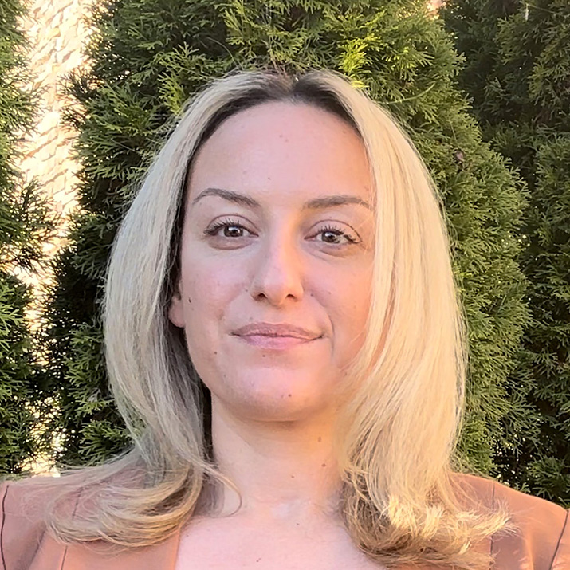

# Smarter Software Development

#### Contributed by [Heather Bourbeau](https://www.linkedin.com/in/heatherbourbeau/) and [Sustainable Horizons Institute](https://shinstitute.org)

#### Publication date: September 23, 2025

Scientists like Dr Antigoni Georgiadou are spearheading discussions around the energy footprint of high performance computing and artificial intelligence. As a BSSw Fellowship Honorable Mention, she’s launching a YouTube series to inspire the wider high performance computing community to be leaders in energy-efficiency.

 

This article is cross-posted at [Sustainable Horizons Institute](https://shinstitute.org/better-scientific-software-bssw-fellowship-previous-honorable-mentions-spotlight-antigoni-georgiadou/
).

 
[Antigoni Georgiadou]
 

[Dr. Antigoni Georgiadou](https://bssw.io/pages/meet-our-fellows#2024-honorable-mentions), a computational scientist in the Algorithms and Performance Analysis Group in the Science Engagement Section at the Oak Ridge National Laboratory (ORNL), wants to raise awareness about and reduce the larger energy footprint of high performance computing. 

With the growth of artificial intelligence comes increased power consumption at data centers and the need for a smarter approach to software development. Exascale systems are requiring 30+ megawatts, enough to power sizable towns, and scientists like Dr. Georgiadou are spearheading discussions to produce better, more energy efficient software.

At ORNL, she is working to establish portable mini-apps for testing and optimization of current and future software for the Oak Ridge Leadership Computing Facility (OLCF) facility, and she partners with the Hardware/Hybrid Accelerated Cosmology Code (HACC) team to perform simulations using scientific codes in cosmology. However, as a Better Scientific Software ([BSSw) Fellowship](https://bssw.io/pages/bssw-fellowship-program) Honorable Mention, she wants to bring her passion for smart computing to the creation of a series of YouTube videos that would encourage the high performance computing community to lead in energy efficiency. This video series that started with an [HPC Best Practices webinar](https://www.youtube.com/watch?v=nCm2nlRI6q8), will feature interviews, reviews of technical material, and discussions of current practices in the energy-economic software engineering landscape. 

“As an Honorable Mention, I have had the chance to promote my work, gain visibility, and work with everyone in the BSSw Fellowship community, which I think that's the best part of it,” says Dr. Georgiadou. “My work was equally advertised and equally supported, other than financially.” 

As a result of the exposure she received as a BSSw Honorable Mention, Dr. Georgiadou was able to travel to conferences, present her work, and give seminars. Moreover, through the BSSw Fellowship network, she and Jack Marquez, another 2024 BSSw Honorable Mention and Research Assistant Professor in Electrical Engineering and Computer Science at the University of Tennessee at Knoxville, have become close collaborators, working on validation, verification, and quantification tools for optimizing codes for better software practices. She notes that without the BSSw Fellowship, they probably would not have met, even though they are so geographically close, as their funding sources are so different. 

“The goal of my proposal was to raise awareness for smart computing and smart software best practices,” says Dr. Georgiadou. “The BSSw Fellowship community is very supportive. I will continue to engage and go to meetings wherever I can because I can promote this work better through it.”

### More info

Learn more about [Antigoni Georgiadou’s work as a BSSw Honorable Mention](https://bssw.io/items?author=antigoni-georgiadou). 

The main goal of the BSSw Fellowship program is to foster and promote practices, processes, and tools to improve developer productivity and software sustainability of scientific codes. Submissions for the 2026 cohort are now open: [2026 BSSw Fellowship application details and form](https://bssw.io/pages/apply-for-the-bssw-fellowship-program)\!

If you have questions about the Fellowship or the application process, please see the [FAQ page](https://bssw.io/pages/bssw-fellowship-faq), which includes the slides and recording from our recent informational webinar. If your question is not answered there, please [contact us](https://bssw.io/contact).

Application deadline: Friday, October 31, 2025; this is a firm deadline that will not be extended.

### Author bios

[Heather Bourbeau](https://www.linkedin.com/in/heatherbourbeau/) is a research analyst, communications strategist, and storyteller.
[Sustainable Horizons Institute](https://shinstitute.org) is a partner in leading the BSSw Fellowship Program.

<!---
Publish: yes
Track: bssw fellowship
Topics: Funding sources and programs, projects and organizations
OpenGraph image: OG_2508_BSSwFellowships.png
--->
