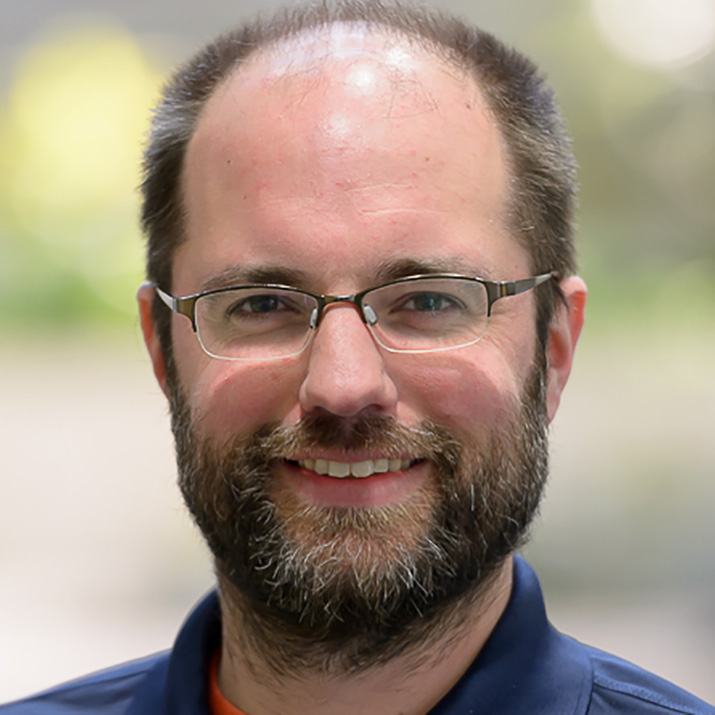

# Lasting Efficiencies and Lifelong Learning

#### Contributed by [Heather Bourbeau](https://www.linkedin.com/in/heatherbourbeau/) and [Sustainable Horizons Institute](https://shinstitute.org)

#### Publication date: October 7, 2025

The Better Scientific Software (BSSw) Fellowship may only last a year, but it can have positive impacts that last a career. Just ask Robert Latham, a senior scientific programmer in the Mathematics and Computer Science Division at Argonne National Laboratory.

 

This article is cross-posted at [Sustainable Horizons Institute](https://shinstitute.org/better-scientific-software-bssw-fellowship-previous-fellows-spotlight/).

 
[Robert Latham]
 

Robert Latham strives to help scientific applications use input/output (I/O) more efficiently. ​He wants to help others diagnose and debug I/O problems in performance and correctness in high-performance computing. Through his BSSw Fellowship, he developed a one-day course on how to investigate and fix potential problems that is available and accessible to a broader audience.

“I’m still using the benchmarks, scripts, and tools that I developed in that presentation,” says Latham. “Much of the work I did as a Fellow informed my subsequent presentations, and we often give it as [a tutorial](https://sc25.conference-program.com/presentation/?id=tut155&sess=sess270) at the International Conference for High Performance Computing, Networking, Storage, and Analysis (SC25).”

In addition, he and his colleagues will refer to his outline as they prepare for the annual [Argonne Training Program on Extreme-Scale Computing](https://extremecomputingtraining.anl.gov/) summer school. “The tutorial gives users an idea of where they should start to get the best performance,” says Latham. “It's an example of using tried-and-true tools in new environments.”

He credits the support of the BSSw Fellowship with having helped him hone his presentation. “At this point in my career, the nice thing about the fellowship is having dedicated time to produce a seminar, a working set, and a collection of examples,” says Latham. “We don't get a lot of time to do this type of work in our usual rush of proposals, deadlines, and deliverables.”

Latham notes that being part of the BSSw network and getting to know the BSSw Fellows and Honorable Mentions and their work are great ways to learn what is new in research software engineering. “I appreciate being able to understand the way that other people are thinking about the problems we're facing and how to solve them,” says Latham. “The BSSw Fellowship program has been so great that the only thing I would want would be more of it so we can see more of what is happening in the field.”

### More info

Learn more about [Rob Latham’s work as a BSSw Fellow](https://bssw.io/items?author=rob-latham).

The main goal of the BSSw Fellowship program is to foster and promote practices, processes, and tools to improve developer productivity and software sustainability of scientific codes. Submissions for the 2026 cohort are now open: [2026 BSSw Fellowship application details and form](https://bssw.io/pages/apply-for-the-bssw-fellowship-program)\!

If you have questions about the Fellowship or the application process, please see the [FAQ page](https://bssw.io/pages/bssw-fellowship-faq), which includes the slides and recording from our recent informational webinar. If your question is not answered there, please [contact us](https://bssw.io/contact).

Application deadline: Friday, October 31, 2025; this is a firm deadline that will not be extended.

### Author bios

[Heather Bourbeau](https://www.linkedin.com/in/heatherbourbeau/) is a research analyst, communications strategist, and storyteller.
[Sustainable Horizons Institute](https://shinstitute.org) is a partner in leading the BSSw Fellowship Program.

<!---
Publish: yes
Track: bssw fellowship
Topics: Funding sources and programs, projects and organizations
OpenGraph image: OG_2508_BSSwFellowships.png
--->
