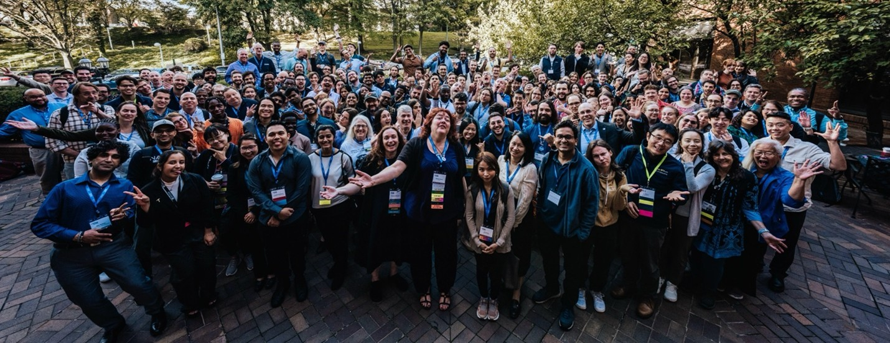
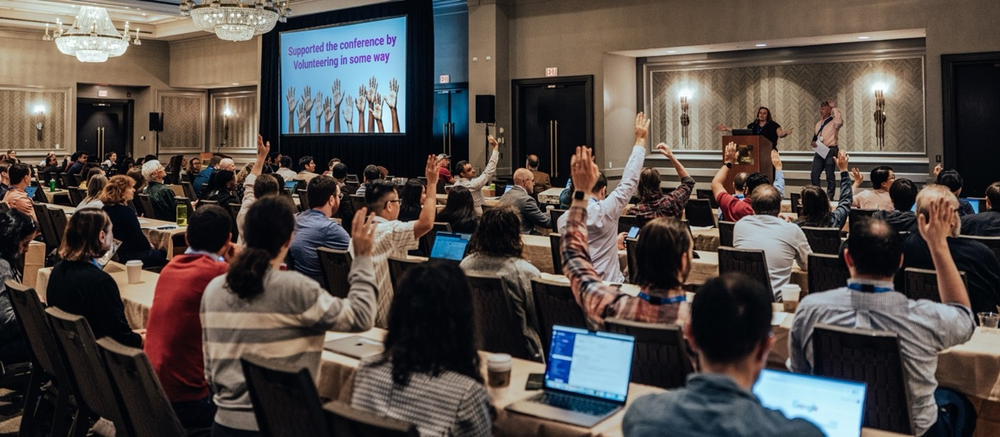

# USRSE'25 Conference Recap: Code, Practices, and People

**Hero Image:**

- 

#### Contributed by [Christina Maimone](https://github.com/cmaimone), [Jamil Gafur](https://github.com/jamilgafur), and [Pengyin Shan](https://github.com/pengyin-Shan)

#### Publication date: November 11, 2025

<!-- begin deck -->
<!-- end deck -->

The third annual US Research Software Engineering Conference (USRSE’25), hosted by the US Research Software Engineer Association ([US-RSE](http://us-rse.org/)), welcomed 275 passionate RSEs and RSE allies from over 140 universities, national labs, companies, research institutes, and other organizations to Philadelphia, Pennsylvania, from October 6-8, 2025.  The conference was chaired by Curtis Hillegas, Princeton University, and Christina Maimone, Northwestern University, with support from 30 additional volunteers on the planning committee, over 100 reviewers, and many volunteers, including session chairs and microphone runners.  The conference was packed with opportunities for connection and collaboration, with attendees making the most of having colleagues from around the country together in one place.

The conference kicked off with a welcome reception the evening before the official start of the program, with those conversations carrying into the breaks between sessions and conference meals.  This energy continued at the poster session, where attendees explored and engaged in lively discussions with the 52 different projects represented. The following evening brought a memorable networking event aboard the Moshulu, a historic tall ship built in 1904 that is now a restaurant. The Moshulu provided attendees a chance to ponder the difference between a ship and a boat, show off their dance skills, or enjoy the moonlit deck in quiet conversation. 

The enthusiasm shown at the networking events carried through to a conference program that included nearly half of the conference attendees sharing their work.  In addition to the poster session, the program included two keynote presentations; 46 presentations of papers, notebooks, and submitted talks; 15 tutorials, panels, and discussion sessions; and 10 brave presenters of Rapid Access Micro (RAM) talks chosen by attendee vote. Ian Cosden, Chair of the US-RSE Steering Committee, and Sandra Gesing, the Executive Director of US-RSE, gave an overview of the history of US-RSE, its current state, and strategies for the future.

Sessions focused on the three components of the conference theme: Code, Practices, and People. For code, conference attendees learned about software used in hydrologic research; packages and applications such as surveydown, Undate, SyncFlow, AquiLLM, LLMaven, SPEL, ToolsyBio, dbverse, paleopal, SLEAP, and PyEEG; and algorithms and workflows for financial time series, genetic analysis, galaxy redshift estimation, and more.  Attendees learned research software engineering best practices, with topics spanning a wide variety of areas, including: testing, user experience design, project management, agile methods, security, effective use of generative AI tools, managing multiple file formats, documentation, FAIR data practices, reproducibility, publishing software, and working with legacy code bases.  The RSEs and other people who build research software were also represented, with presentations on RSE job descriptions and salaries, training programs for students, the value of networks of research software collaborators, working effectively with research collaborators, and tips for personal project management, as well as discussion around how generative AI tools are impacting RSEs.  

The [conference proceedings](https://us-rse.org/usrse25/participate/proceedings/) are available in Zenodo, and paper authors are working on expanding and submitting their work to a special issue of the journal *Future Generation Computer Systems*.  While you're waiting for the 2025 papers, check out the papers from the 2023 conference in the already published [special issue](https://www.sciencedirect.com/special-issue/10GXQ2MQKBW).

### BSSw Involvement

The Better Scientific Software (BSSw) community was out in force at the conference.  Myra Cohen, 2023 BSSw Fellow and Professor and Lahn and Oahn Chair in Software Engineering at Iowa State University, gave a keynote presentation, "Building Confidence in What We Build: Correctness in Research Software in the Age of AI." Her talk got the audience excited about testing, the topic of a US-RSE working group that meets virtually throughout the year.

The [BSSw Fellowship Program](https://bssw.io/fellowship) had the opportunity to bring together past and current BSSw fellows and interested RSEs from the community in a Birds of a Feather session, inform people about the program during the poster session, and recognize the 2025 fellows and honorable mentions on stage during a plenary session. Two 2025 BSSw Fellows gave talks related to their fellowship work at the conference. Brigitta Sipőcz presented on "User-facing tutorials as code: reproducible and reliable tutorials with CI/CD," and Peter Williams presented on "Efficient Documentation: Best Practices, Tools, and Opportunities."

### Get Ready for USRSE'26

> "Just attend, it’s worth the time and effort." – Minhaz Zibran, Associate Professor, Department of Computer Science, Idaho State University, and 2025 BSSw Fellowship Honorable Mention.

USRSE'26 will be held in the San Francisco Bay Area in fall 2026.  Conference General Chairs Alex Koufos from Stanford University and Keith Beattie from Lawrence Berkeley National Laboratory are currently looking for volunteers for the planning committee.  You can volunteer at <https://us-rse.org/usrse26/>.

Expect submissions of papers, talks, notebooks, tutorials, and other sessions to be due late spring 2026.  Accepted papers will have the opportunity to submit an extended paper for publication in a special journal issue.

We hope to see you at USRSE'26.  Ian Cosden, US-RSE Steering Committee Chair and Senior Director, Research Software Engineering, Princeton University, summarizes the reasons to attend well: "You will find someone you connect with. You will learn something new. And you will go back with a renewed enthusiasm for the work you do."

### Author Bios

Christina Maimone is Associate Director of Research Data Services with Northwestern IT Research Computing and Data Services.  She was a founding Steering Committee member of US-RSE and Co-Chair of the USRSE 2025 conference.  She supports the development of research computing, data, and software engineering roles and careers through work with several organizations.  At Northwestern, Christina collaborates with researchers across domains on projects requiring data science, AI, or software development and teaches data science workshops and courses.  She holds an MS in statistics and PhD in political science from Stanford University.

Jamil Gafur is a Ph.D. candidate in Computer Science at the University of Iowa. Previously he has worked at research institutions such as Los Alamos National Lab, National Renewable Energy Lab, and Cornell University. Through his experiences he specializes in explainable AI (XAI) and resource-efficient neural networks across domains. Passionate about the intersection of Research Software Engineering, Machine Learning, and Societal Impact Research, Jamil strives to create solutions that benefit communities and improving lives. His current work involves investigating pruning techniques to enhance neural network efficiency while preserving accuracy and robustness. As an active member of the US Research Software Engineer Association, Jamil is committed to mentoring, developing training resources, and fostering community engagement.

Pengyin Shan serves as a Senior Research Software Engineer at the National Center for Supercomputing Applications (NCSA). Since joining NCSA in 2023, Pengyin has contributed to the development of secure science applications, data visualization tools, and software localization frameworks. She has led the design of scientific applications that enable data exploration in digital agriculture, bioinformatics, and public health. In addition to her technical work, she actively supports the research software engineering community through leadership roles in US-RSE and PEARC. Her professional goal is to advance the visibility and impact of Research Software Engineering and Research Computing while fostering stronger knowledge-sharing practices across the national community. Pengyin earned a B.S. in Computer Science and Engineering from The Ohio State University and an MBA from York University in Canada. In her free time, she enjoys jogging and day hikes.

<!---
Publish: Yes
Track: Community
Topics: Conferences and Workshops
--->
