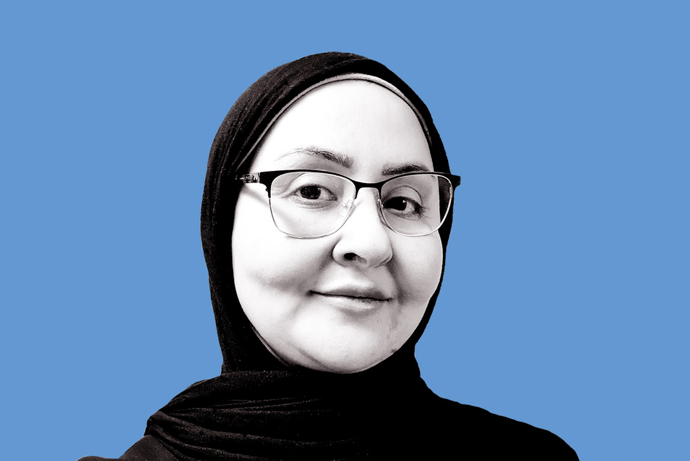
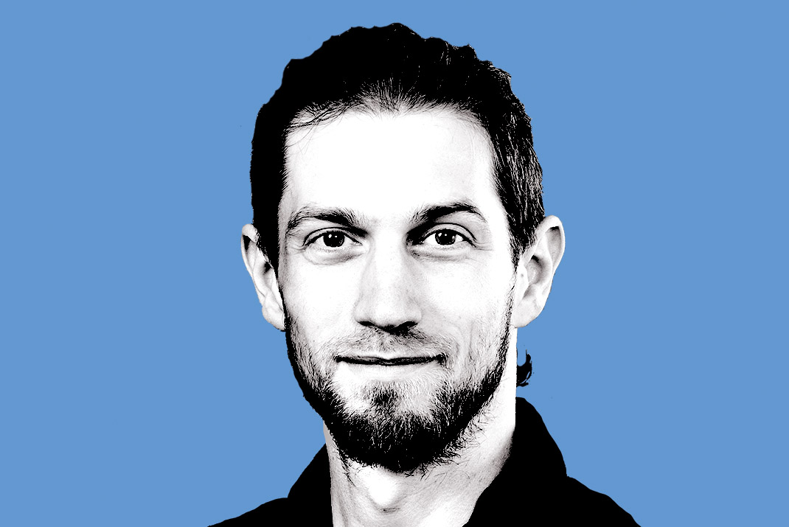
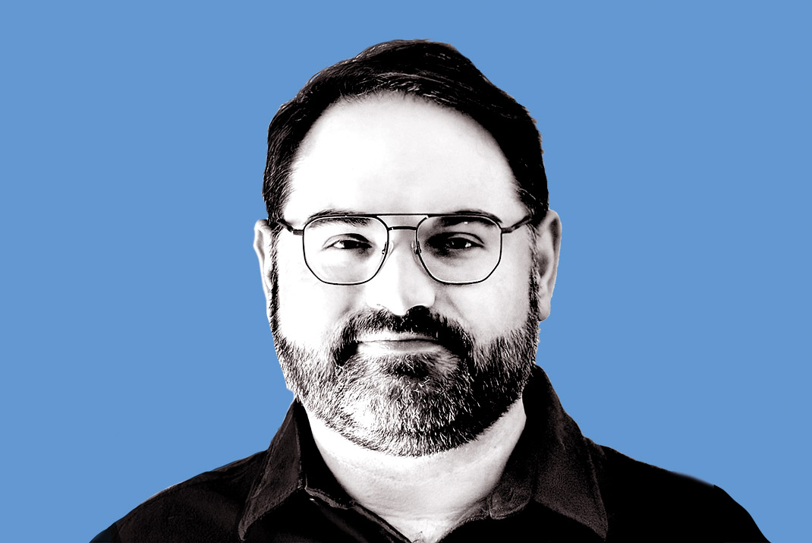
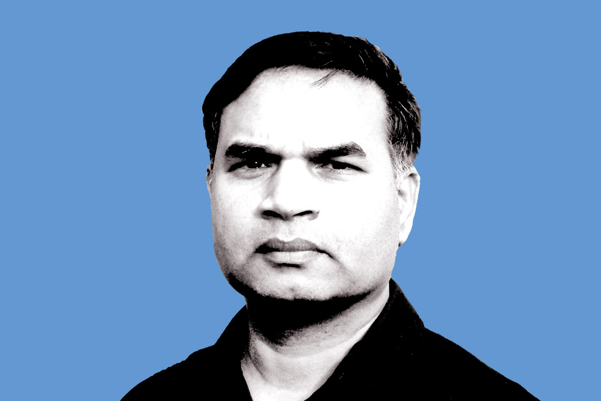
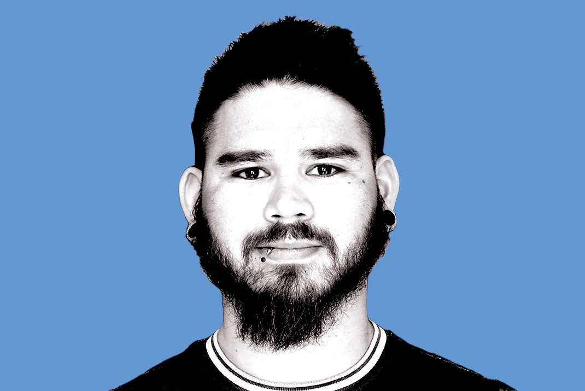
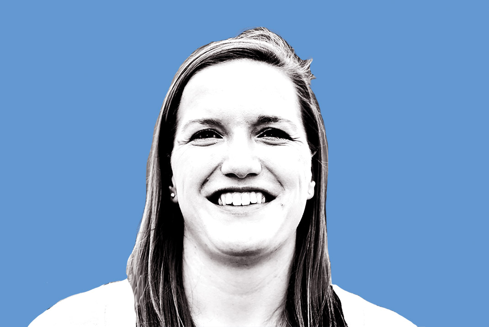
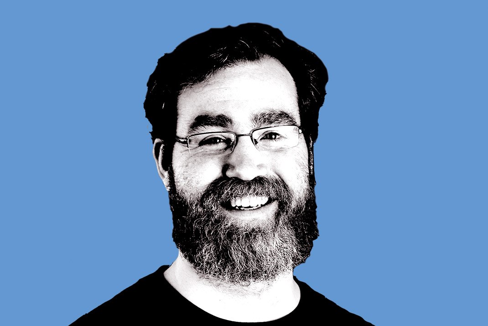
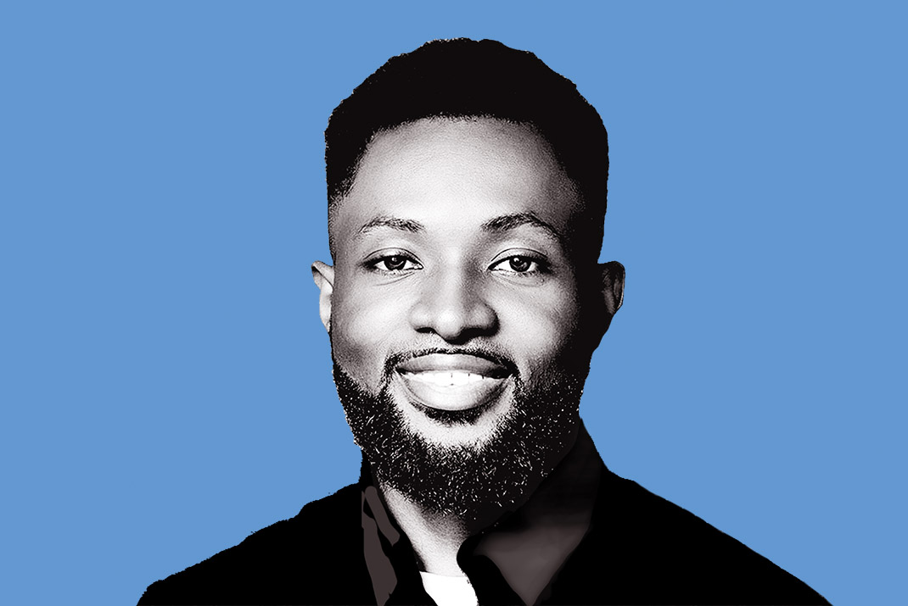
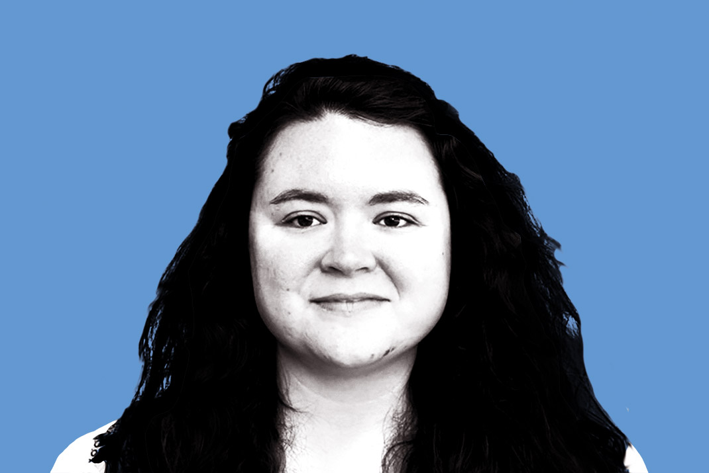
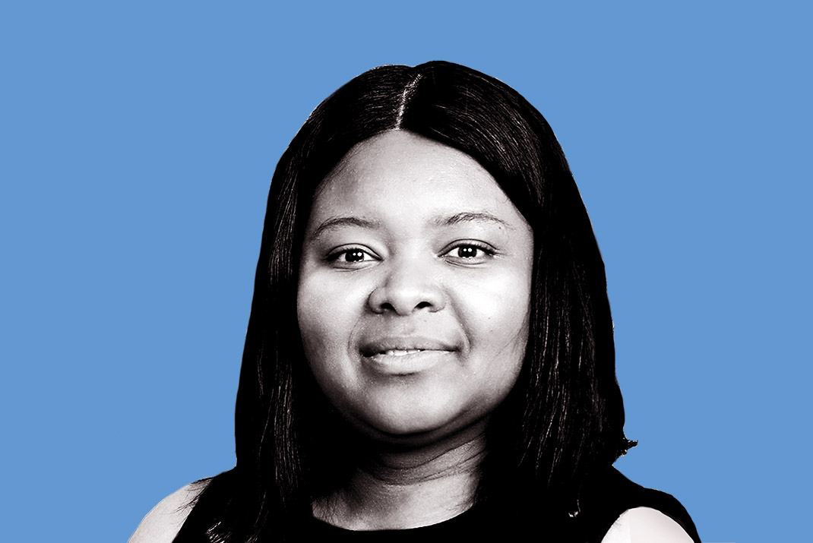

# Introducing the 2026 BSSw Fellows

#### Contributed by [Elsa Gonsiorowski](https://github.com/gonsie "Elsa Gonsiorowski GitHub Profile")

#### Publication date: February 17, 2026

We are pleased to announce the 2026 class of Better Scientific Software (BSSw) Fellows: six Fellows and six Honorable Mentions.

We sincerely thank _all_ fellowship applicants. The broad range of creative and interesting proposals made the selection process difficult.

The [BSSw Fellowship Program](https://bssw.io/fellowship) gives recognition and funding to leaders and advocates of high-quality scientific software. Each 2026 Fellow will receive up to $25,000 for an activity that promotes better scientific software, such as organizing a workshop, preparing a tutorial, or creating content to engage the scientific software community.

The BSSw Fellowship Program is supported by the U.S. Department of Energy (DOE, via the Office of Advanced Scientific Computing Research and the National Nuclear Security Administration's Advanced Simulation and Computing Program) and the National Science Foundation (NSF). The BSSw Fellowship Program enables a more robust approach toward pioneering the future of advanced computing ecosystems and leadership in science and engineering. The program enhances workforce development and pathways to NSF and DOE software communities, through nurturing a network of people who advance software practices as a fundamental aspect of increasing overall scientific productivity.

## 2026 BSSw Fellows

    <h3>Suzan Anwar, Philander Smith University</h3>
    
Associate Professor, Computer Science

    
<i>BSSw Focus</i>: Sustainable AI: Best Practices for Reproducible Scientific Software Development

    <h3>Jakob Bludau, Oak Ridge National Laboratory</h3>
    
Postdoctoral Research Associate, Computational Sciences and Engineering Division

    
<i>BSSw focus</i>: Performance-Portable Design Patterns: A gallery and community hub

    <h3>Mary Goldman, University of California, Santa Cruz</h3>
    
Design and Outreach Engineer, Genomics Institute

    
<i>BSSw focus</i>: User Experience Design for RSEs

  

    <h3>Drew Paine, Lawrence Berkeley National Laboratory</h3>
    
User Experience Research Lead, Scientific Data Division

    
<i>BSSw focus</i>: Growing & Tending User Experience Resources for Scientific Software Communities

    <h3>Parmanand Sinha, University of Chicago</h3>
    
Computational Scientist, Research Computing Center

    
<i>BSSw focus</i>: From One-Off Containers to HPC Production Science: Reproducibility Patterns for Multi-Service Workflows

    <h3>Victor Weeks, NSF National Center for Atmospheric Research<h3>
    
Software Engineer, Atmospheric Science

    
<i>BSSw focus</i>: Maintaining Scientific Rigor in AI-Assisted Development: A Validation-Focused Methodology

## 2026 BSSw Honorable Mentions

    <h3>Floor Broekgaarden, University of California, San Diego</h3>
    
Assistant Professor, Astronomy & Astrophysics

    <h3>Matthew Feickert, University of Wisconsin-Madison</h3>
    
Research Scientist, Data Science Institute

    <h3>Joseph Frimpong, Argonne National Laboratory</h3>
    
Postdoctoral Research, Midwest Integrated Center for Computational Materials

    <h3>Erin Higgins, Carnegie Mellon University</h3>
    
Postdoctoral Researcher, University Libraries

    <h3>Abena Primo, Huston-Tillotson University</h3>
    
Associate Professor, Computer Science

    <h3>Daniel Steger, Center For Open Science</h3>
    
Technical Community Manager, Open Science Framework

### About the BSSw Fellowship
The main goal of the [BSSw Fellowship Program](https://bssw.io/fellowship) is to foster and promote practices, processes, and tools to improve developer productivity and software sustainability of scientific codes. BSSw Fellows are selected annually based on an application process that includes the proposal of an activity that promotes better scientific software. Subscribe to the [BSSw email digest](https://bssw.io/pages/receive-our-email-digest) for notification about next year’s call for applications, which will be announced in summer 2026. More information:

- [BSSw Meet Our Fellows](https://bssw.io/pages/meet-our-fellows)
- [FAQ for the BSSw Fellowship Program](https://bssw.io/pages/bssw-fellowship-faq)

Stay tuned for more from the 2025 BSSw Fellows.

### Contribute to the BSSw Site
Also, we want and need contributions from the international community for the BSSw site.  If you have expertise that can help other scientific software teams, we encourage you to contribute an article or pointer to good work.  See details on [how to contribute to BSSw](https://bssw.io/pages/what-to-contribute-content-for-better-scientific-software).

### Author bio

Elsa Gonsiorowski is Coordinator of the BSSw Fellowship Program, a member of the [PESO Project](https://pesoproject.org) team, and HPC I/O support specialist at [Livermore Computing, LLNL](https://hpc.llnl.gov/about-us).

<!---
Publish: yes
Track: Bssw Fellowship
Track: Community
RSS update: 2026-02-XX
Categories: collaboration
Topics: projects and organizations
Tags: bssw-article
--->
