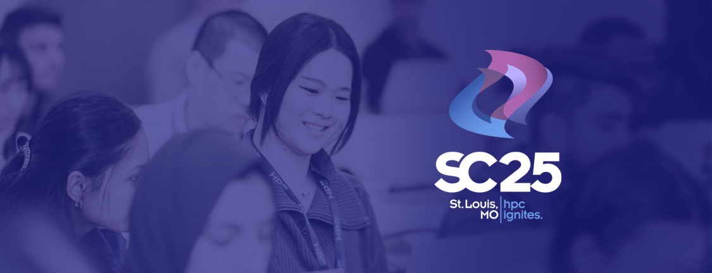

# Reflecting on Our Community: The SC25 BoF on Scientific Software and the People Who Make It Happen: Building Our Communities and Practices

**Hero Image:**

- 

#### Publication date: February 10, 2026

#### Contributed by: [Stefania Amodeo](https://github.com/samodeo), [David E. Bernholdt](https://github.com/bernhold/), [Eleanor Broadway](https://github.com/eleanor-broadway), [Sunita Chandrasekaran](https://crpl.cis.udel.edu/), [Ian A. Cosden](https://github.com/cosden), [Anshu Dubey](https://github.com/adubey64), [Sandra Gesing](https://github.com/sandragesing), [Rinku Gupta](https://github.com/rinkug), [Guido Juckeland](https://github.com/juckel), [Mozhgan Kabiri chimeh](https://github.com/mozhgan-kch), [Adam Lavely](https://github.com/adamlavely), [James Richings](https://github.com/JPRichings), [Sheri Voelz](https://github.com/sherimickelson), [Marion Weinzierl](https://github.com/marionbweinzierl)

<!-- begin deck -->
A snapshot of our community from the SC25 Birds of a Feather session on Scientific Software and the People Who Make It Happen: Building Our Communities and Practices.
<!-- end deck -->

At the annual Supercomputing conference and sometimes at the ISC High Performance conference, members of the scientific software developer community come together to share their thoughts, network, and build community. These “Birds of a Feather” (BoF) sessions started in 2015 under the title *Software Engineering for Computational Science and Engineering on Supercomputers*. While the titles of the sessions have morphed over time, the purpose has always been to focus more on the “people” side of high-performance scientific computing. Below, we summarize the 2025 edition of the BoF as a sampling of what’s on people’s minds lately.

### Lightning talks

As usual, we kicked off the session with a set of lightning talks. The organizers selected these 3-minute talks to highlight recent developments in the community and spur further conversation. This year, we had eight talks covering a wide range of topics.

- [Invitation to the International Research Software Conference, Sept 7-8, 2026](https://betterscientificsoftware.github.io/swe-cse-bof/assets/2025-11-sc25-bof/01-gesing-irsc.pdf) by Sandra Gesing	 (US Research Software Engineer Association). Sandra invited the community to a new conference on research software, which will be co-located with RSECon26 in Sheffield, UK. The organization of the conference is led by the Research Software Alliance (ReSA), and will focus on strategic coordination, long-term sustainability, and collaboration across boundaries. Expected participants include leaders and change-makers in RSE, funders, policy makers, publishers, infrastructure organizations, skills, and training initiatives, national and regional RSE associations, and others with similar interests. For further details, visit [https://www.researchsoft.org/irsc/](https://www.researchsoft.org/irsc/).
- [Beyond Busy: Building Sustainable Research Communities](https://betterscientificsoftware.github.io/swe-cse-bof/assets/2025-11-sc25-bof/02-broadway-busy.pdf) by Eleanor Broadway (EPCC). Using her own experience with the Women in HPC community as a touchstone, Eleanor discussed some of the challenges faced by many community organizations. Common problems include: volunteers struggling to stay engaged, missed opportunities, and small groups of individuals supporting a very large community. The takeaway lesson is that without the right structures to support and sustain our efforts, even the busiest and most passionate communities can collapse – sustainable communities are *designed,* they don’t just happen. Actions that can help include:
  - Distributing energy – no one person should carry the load;
  - Continual community connection – regular conversations and opportunities to meaningfully contribute;
  - Focusing on key goals – doing what truly matters to the community’s members.
  - Asking for help! Services like the [RCM Cooperative](https://www.rcmcooperative.com/) help people and organizations with exactly this problem: build intentionality into their communities for sustainability.
- [Open Training for Sustainable HPC & AI Skills](https://betterscientificsoftware.github.io/swe-cse-bof/assets/2025-11-sc25-bof/03-kabirichimeh-training.pdf) by Mozhgan Kabiri chimeh	(NVIDIA). Mozhgan discussed the growing importance of HPC+AI in our space and the need for sustainable training in this fast-moving area. Presently, HPC+AI training activities are fragmented – everyone is creating their own. Mozhgan called for the sharing of experiences and materials to help move towards more sustainable open training in this space. She referred to open training pathways which are being pursued: self-paced labs, developer certifications, community ambassador programs, and noted complementary initiatives, such as the Carpentries, PRACE Training Portal, and others. She called on the community to share curricula and mentorship pipelines, and asked more broadly, “What models have worked in your institution for scaling HPC+AI skill training, and how can we interconnect them?”
- [Toward Next-generation Ecosystems for Scientific Computing workshop – objectives and outcomes](https://betterscientificsoftware.github.io/swe-cse-bof/assets/2025-11-sc25-bof/04-dubey-ecosystems.pdf) by Anshu Dubey (Argonne National Laboratory). Anshu discussed the eponymous workshop, which is the first in a series of three on the challenge of the next-generation ecosystem for scientific computing, including the increasing heterogeneity of computer systems and the rise of AI, changing both what we do and how we do it. The workshops are intended to address, respectively, the gaps, actionable items, and how to use them in the community. A novel aspect of the design of these workshops is the inclusion of social as well as computational scientists to more fully explore how teams work together going forward, including, potentially, AI as a collaborator. A [summary report](https://doi.org/10.48550/arXiv.2510.03413) from the first workshop has been published on arXiv.
- [NSF DARSE: Democratizing Access to Research Software Engineering](https://betterscientificsoftware.github.io/swe-cse-bof/assets/2025-11-sc25-bof/05-chandrasekaran-darse.pdf) by Sunita Chandrasekaran (Director, First State AI Institute, University of Delaware). Sunita described some of the early results from an award made about a year ago in the NSF SCIPE program. The goals of the project are to modernize research software (both STEM and non-STEM), hire two RSEs, and enhance training for prospective RSEs. They are focusing on projects using AI/ML in science, in applications that run anywhere from laptops to supercomputers. Sunita mentioned a wide spectrum of interdisciplinary science projects that have been impacted so far. Some of the challenges they’ve seen so far include:
  - Sustainability and long-term maintenance of software;
  - Complexity of creating scientific software with an evolving hardware landscape;
  - Working in diverse teams, coordinating contributions, and managing code quality;
  - Shared learning;
  - Equipping researchers with state-of-the-art skills; and
  - Adopting FAIR principles across disciplines – what are the incentives?
- [Green RSE and Green HPC Training](https://betterscientificsoftware.github.io/swe-cse-bof/assets/2025-11-sc25-bof/06-richings-green.pdf) by James Richings (EPCC, University of Edinburgh). James noted that there’s lots of activity in the UK around green HPC, and presumably elsewhere too, and asked how we can better coordinate these activities across different countries, particularly in developing training materials to introduce greenhouse gas emissions in the context of HPC. James mentioned a number of relevant UK resources and invited those interested to join the Green RSE channel on the (UK) RSE Society Slack workspace to get involved.
  - NetDRIVE: [https://eng.ox.ac.uk/netdrive](https://eng.ox.ac.uk/netdrive)
  - Environmentally Sustainable Computational Science (ESCS) Forum: [https://forum.escs-community.org/](https://forum.escs-community.org/)
  - GreenRSE SIG within Society of RSE: [https://socrse.github.io/green-sig/](https://socrse.github.io/green-sig/)
  - Green DiSC: [https://www.software.ac.uk/GreenDiSC](https://www.software.ac.uk/GreenDiSC)
  - Digital Humanities Climate Coalition Toolkit: [https://sas-dhrh.github.io/dhcctoolkit/](https://sas-dhrh.github.io/dhcctoolkit/)
  - ARCHER2 Green HPC course: [https://www.archer2.ac.uk/training/courses/250513-green-computing/](https://www.archer2.ac.uk/training/courses/250513-green-computing/)
- [Sustaining scientific software through the High Performance Software Foundation](https://betterscientificsoftware.github.io/swe-cse-bof/assets/2025-11-sc25-bof/07-gamblin-hpsf.pdf) by Todd Gamblin (LLNL). Todd described the High Performance Software Foundation (HPSF) as a neutral hub for open-source high-performance software. It was founded about a year ago under the umbrella of the Linux Foundation. HPSF members are mostly HPC providers – mostly industry, and some national laboratories; several universities are among the associate members as well. The HPSF wants to help software projects build communities. They’ve defined a lifecycle for projects: “emerging”, “established”, and “core”, in which the depth and breadth of the communities around them play a significant role. HPSF also looks for synergies across projects. Working groups are currently exploring potential synergies in the areas of benchmarking and CI/CD, with additional efforts expected. Users of HPSF software can benefit from the structure, mentoring, and (soon) common services that the HPSF provides to its projects, which de-risks some decisions about software for users. HPSF also launched the HPSF Conference series in May 2025 and plans to hold the [next one](https://events.linuxfoundation.org/hpsf-conference/) in March 2026 in Chicago. In addition to an extensive plenary program, the venue provides opportunities for HPSF projects to colocate more focused meetings.
- [Building Bridges Between the Software Engineering Research (SER) and Research Software Engineering (RSE) Communities](https://betterscientificsoftware.github.io/swe-cse-bof/assets/2025-11-sc25-bof/08-cosden-bridges.pdf) by Ian A Cosden (Princeton University). Ian talked about a Dagstuhl seminar that took place in April 2024 on building bridges between the software engineering research (SER) and research software engineering (RSE) communities. Starting with the premise that both communities could benefit from more interactions, the focus of the seminar was to explore how. The purpose of this presentation was to share some of the outputs since the original seminar and encourage this community to join the conversation. Outputs, which are being collected at [https://ser-rse-bridge.github.io/](https://ser-rse-bridge.github.io/), include the organization of follow-on events; published papers, including a special issue of Computing in Science and Engineering; posters in a variety of venues; and the creation of new discussion spaces.

### Discussion

The discussion began with a question about templates. Many people are using basic project templates, for example, as starting points for new projects. A template for a documentation project that is preconfigured with a set of recommended tools and styles; a template for a Python- or C++-based project that provides the common directory structure and includes a working “hello world” that will build and run. People also mentioned templates for README files and job templates to facilitate reproducing past runs. Attendees particularly recommended the use of templates with early-career people. Often, as people are getting started in research or research software, they can be overwhelmed by the myriad choices; when starting with a template, many of those decisions are already made, and the user can quickly proceed to what they’re really interested in. Templates can also be an effective way to introduce and standardize a particular set of tools and practices within a research group, organization, or community.

The discussion then turned to a question related to the last lightning talk, seeking a better understanding of the difference between RSE and SER. Research software engineering was described as work where the primary output is software (for research purposes) using software engineering practices and tools. Software engineering research is the study of the methods, practices, and approaches of the development of software (of any kind) and also the people who do that work. A question was raised about researchers who write code, which led to the point that these are merely *roles* and people can perform multiple roles over time (or sometimes even simultaneously). This is why some in the community prefer to use “research software engineering” (RSEng) to focus on the activity and avoid labeling a person as a “research software engineer”, as if it were the only thing they did.

We then turned to a lengthy discussion of what is happening within the RSEng community to promote sustainable software development. One audience member noted that there has been a clear and fundamental change in the perception of “how to do software” over the years. For example, the use of version control was spotty and has now become ubiquitous. Increasingly, software is being published as an artifact, but it isn’t always being maintained – there are large differences between different groups. Someone else observed that the publication of (software) artifacts is primarily related to reproducibility concerns right now, rather than sustainability. Another audience member noted that putting a greater emphasis on testing and documentation is very valuable in facilitating long-term sustainment of the software. It was also noted that testing and creating a test suite alongside development is invaluable not only for projects with outside users, but even for lone-developer efforts. For those using AI in their coding, the recommendation is to formulate it as asking the AI to solve a problem by giving it specifications for the problem, checking its understanding of the problem, refining the specifications as necessary, and finally, asking it to generate the code and testing it. In this way, the specification can serve as documentation. But the AI’s work still needs to be checked very carefully before it can be trusted. We now have a broader (worldwide) RSE community, which is making it easier for people in similar roles to share, collaborate, and build and understand best practices. Some also noted that it is becoming more common in some circles to hire RSEs for software development, allowing researchers to focus more on the research aspects of their work. Another useful approach is to think about where the software is in its lifecycle. Set looser requirements for emerging projects and make them stricter as the project gains users and developers. This allows projects to get started quicker while building and maturing their software practices as appropriate. It can also be useful for the developers/maintainers of a software project to publicly set expectations about the nature of the project – some are never intended to be used outside of a specific target community (often a research group). But there may nevertheless be outsiders interested in using it. It may be reasonable to share relatively raw projects with others, accompanied by suitable disclaimers.

A self-identified software engineering researcher then asked a question they’ve been wondering about: how do researchers and RSEs think about the testing of scientific software where there is no oracle available to tell you whether or not you’re getting the right answer? Several audience members contributed to the response. First, you need to have testing at many different levels to gain confidence that things are working as intended, at least in the mechanical sense – at the unit level, at the component level, and end-to-end. Then, you need to carry out both verification and validation of what you’ve produced. Verification confirms that the code you’ve written does what you intended it to do. Validation confirms that what you’ve designed and written produces results consistent with available observations or results from other codes. If your code is well verified, but doesn’t pass your verification tests, it may be that the model you’ve (correctly) implemented is incorrect or inadequate and needs to be rethought. The process of verification often relies on expert judgment on whether results are close enough to be considered “consistent” and whether deviations are meaningful. Generally, you’re able to improve your testing as you learn more and as the research community learns more.

Finally, rounding out the discussion, someone asked how we should be *teaching* coding in this age of AI? The consensus was that the students still need to learn to think algorithmically to be able to judge the validity of the code, regardless of how it was produced. In other words, they need to learn the craftsmanship of coding. We noted that a lot of the people in the room finished their schooling well before AI became so prominent, and it would be helpful to understand the students' perspective on AI in teaching coding. Fortunately, our student volunteer was willing to relate their experience. They started using AI on assignments in the last year. They often use AI to check assignments they’ve done by hand and to help debug when they’re having problems. We observed that, generally, there’s probably a strong analogy with the introduction of calculators into the classroom. Students still had to learn the “easy stuff” to have a basic understanding of what the calculator was doing for them, and they had to develop an intuition to identify when something went wrong in using the calculator. Similarly, we’ll need to teach students how and when to use AI and create a culture of thoughtful and careful use.

### Summary

In this year's discussions, we saw interest in ratcheting up software development practices, and also in bridging between communities to help do that – both “horizontally”, across research software developers in different geographical regions and scientific domains, and “vertically”, between those who make an academic study of software development and those who are hands-on producing the code, or those who are focused on the scientific research of interest and those who are hands-on with the primary tools (i.e., the code).

As in previous years, AI came up repeatedly in the discussions, but the discussions seem to have evolved and matured this year to be more accepting of its use, and to provide reasoned suggestions for how to teach coding in the AI era and how to use it effectively as a practitioner.

### Resources mentioned

Links to the BoF website and other resources mentioned in the presentations and discussions.

- BoF series website, including notes from past meetings: [http://bit.ly/swe-cse-bof](http://bit.ly/swe-cse-bof).
- Previous blog posts from this BoF series: [2024](https://bssw.io/blog_posts/reflecting-on-our-community-the-sc24-bof-on-scientific-software-and-the-people-who-make-it-happen-building-communities-of-practice), [2023](https://bssw.io/blog_posts/reflecting-on-our-community-the-sc23-bof-on-scientific-software-and-the-people-who-make-it-happen-building-communities-of-practice), [2021](https://bssw.io/blog_posts/reflecting-on-our-community-the-sc21-bof-on-software-engineering-and-reuse-in-modeling-simulation-and-data-analytics-for-science-and-engineering)
- A list of software-focused events at SC25: [https://bssw.io/events/sc25-software-related-events](https://bssw.io/events/sc25-software-related-events)
- The [International Research Software Conference](https://www.researchsoft.org/irsc/)
- The [Research Community Manager (RCM) Cooperative](https://www.rcmcooperative.com/)
- [Report of the 2025 Workshop on Next-Generation Ecosystems for Scientific Computing: Harnessing Community, Software, and AI for Cross-Disciplinary Team Science](https://doi.org/10.48550/arXiv.2510.03413)
- Green RSE resources in the UK
  - NetDRIVE: [https://eng.ox.ac.uk/netdrive](https://eng.ox.ac.uk/netdrive)
  - Environmentally Sustainable Computational Science (ESCS) Forum: [https://forum.escs-community.org/](https://forum.escs-community.org/)
  - GreenRSE SIG within Society of RSE: [https://socrse.github.io/green-sig/](https://socrse.github.io/green-sig/)
  - Green DiSC: [https://www.software.ac.uk/GreenDiSC](https://www.software.ac.uk/GreenDiSC)
  - Digital Humanities Climate Coalition Toolkit: [https://sas-dhrh.github.io/dhcctoolkit/](https://sas-dhrh.github.io/dhcctoolkit/)
- [High Performance Software Foundation](https://hpsf.io/)
- [HPSF Conference](https://events.linuxfoundation.org/hpsf-conference/)
- Dagstuhl Seminar on Research Software Engineering: Bridging Knowledge Gaps
  - [Seminar page](https://www.dagstuhl.de/seminars/seminar-calendar/seminar-details/24161)
  - [Outputs site](https://ser-rse-bridge.github.io/)

### Author bios

Stefania Amodeo works at OpenAIRE as an engagement and training officer. She leads community engagement initiatives centered on the OpenAIRE Knowledge Graph. Through collaboration with researchers, institutions, and partner projects, she bridges technical and user groups, fostering a community-driven innovation. Before her current position, she worked as a researcher in astrophysics for five years.

David E. Bernholdt is a Distinguished R&D Staff Member at Oak Ridge National Laboratory. His research interests are broadly in the development of scientific software for high-performance computers, including developer productivity, and software quality and sustainability.

Eleanor Broadway is an Architect at EPCC at the University of Edinburgh. She is a co-I for the [Computational Abilities Knowledge Exchange (CAKE)](http://cake.ac.uk) project, supports the users of the UK’s national supercomputing service, and works on technical research projects. She is passionate about supporting people to succeed in their chosen career, so she dedicates time to advocate for diversity and inclusion in HPC. She serves on the Executive Board of [Women in HPC (WHPC)](http://womeninhpc.org) and Chairs the CAKE-CoSeC EDI working group, actively working to broaden participation and representation in computational research communities.

Sunita Chandrasekaran is an Associate Professor in the Department of Computer & Information Sciences at the University of Delaware (UDel) and the Director, First State AI Institute. She also serves as the Vice Chair of the State of Delaware AI Commission. Her research team focuses on both fundamental and applied topics in computer science, including compilers, programming models, and applied machine learning/AI for real-world applications. Her NSF-funded (SCIPE) DARSE grant democratizes access to research software engineering (RSE) by creating a team of RSE professionals and trainees in order to advance scientific research and upskill the next-generation workforce with state-of-the-art AI, HPC, and ML skills.

Ian A. Cosden is the Senior Director of Research Software Engineering at Princeton University. He leads a team of research software engineers who complement multiple traditional academic research groups by offering embedded, long-term software development expertise. Ian is the current and founding chair of the steering committee for the [United States Research Software Engineer (US-RSE) Association](https://us-rse.org/).

Anshu Dubey is a Senior Computational Scientist in the Mathematics and Computer Science Division at Argonne National Laboratory. She works on various aspects of multiphysics software for high-performance computing, including design, implementation, verification, quality, and sustainment.

Sandra Gesing is the Executive Director of the [US Research Software Engineer Association](https://us-rse.org/) and a Senior Research Scientist at the San Diego Supercomputer Center (SDSC). She is passionate about building career paths for Research Software Engineers (RSEs) and advocating for sustainable software practices in scientific research. Her work focuses on science gateways, cyberinfrastructure, and research software engineering, aiming to enhance accessibility to shared computing, data, and software resources. She actively engages in community building, policy discussions, and initiatives that support the RSE community.

Rinku Gupta is a Senior Research Software Specialist and Technical Product Manager at Argonne National Laboratory. She serves as Editor-in-Chief of the Better Scientific Software site. She has been a part of the high-performance scientific community for two decades and works in the field of high-performance fault tolerance, resiliency, middleware libraries, and programming models. She is passionate about her work in the area of developer productivity and software sustainability; her current focus lies in partnering with the computational science community on these topics to design better scientific software.

Guido Juckeland is the head of the Computational Science Department at Helmholtz-Zentrum Dresden-Rossendorf (HZDR) and a professor for Research Software Engineering at Dresden University of Technology. He is working in close collaboration with scientists on sustainable solutions for research software engineering, AI consultation, and scientific data management.

Mozhgan Kabiri chimeh is a Developer Relations Manager at NVIDIA, focused on growing the AI and accelerated computing ecosystem across the UK and Ireland. In this role, she works with researchers, startups, and industry partners to support the adoption of NVIDIA’s AI software platforms and GPU technologies, helping them accelerate innovation and scale solutions.

Previously, Mozhgan was a Research Software Engineer at the University of Sheffield, working on massive-scale complex systems simulation using emerging high-performance parallel architectures.

A dedicated community builder, she has chaired Women in HPC workshops at Supercomputing (SC) and the International Supercomputing Conference (ISC), served on program committees for leading HPC and AI conferences, and, as a Software Sustainability Institute (SSI) Fellow, advocates for open, reproducible, and sustainable software. Mozhgan holds a Ph.D. in Computer Science and a Master’s in Information Technology from the University of Glasgow, UK.

Adam Lavely is the User Environment Architect at NERSC, which operates the DoE supercomputing facilities at Lawrence Berkeley National Laboratory. He is a recovering aerospace engineer and works to provide programming environments and containers for users to easily get excellent performance on NERSC’s current system, Perlmutter, and upcoming system, Doudna. Adam is the Deputy Coordinator of the BSSw Fellowship program.

James Richings is an HPC Architect at EPCC, University of Edinburgh. He has a background in Lattice QCD and high-fidelity simulation of particle physics processes. Current work focuses on the delivery of the UK national supercomputer ARCHER2, delivery of EPCC's MSC courses in HPC and data science, as well as research into accelerated HPC and Quantum computing.

Sheri Voelz is the section manager of the NSF NCAR/CISL’s Applied Computational Science Section (ACS). ACS focuses on advancing the performance and sustainability of NCAR’s modeling infrastructure. Her group is responsible for porting models to GPUs, optimizing I/O workflows, compressing scientific data, evaluating code correctness, and researching emerging computing technology. She is also the project lead for the NSF NCAR Community Software Facility. Sheri has over 25 years of experience as a research software engineer, starting her career at Argonne National Laboratory in 2000 and joining NSF NCAR in 2014.

Marion Weinzierl is a Senior Research Software Engineer at the Institute of Computing for Climate Science (ICCS), University of Cambridge.

<!---
Publish: Yes
Track: community 
Topics: conferences and workshops, software engineering, research software engineers
--->
