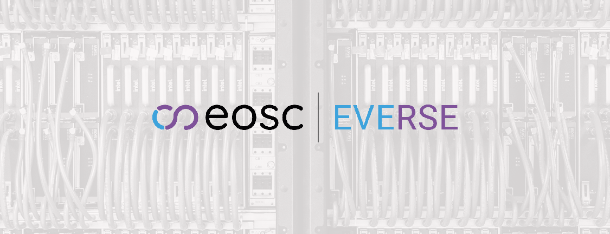

# European Virtual Institute for Research Software Excellence: EVERSE

**Hero Image:**

- 

#### Contributed by [Nikos Pechlivanis](https://github.com/npechl), [Fotis Psomopoulos](https://github.com/fpsom), [Stefania Amodeo](https://github.com/samodeo), [Thanasis Vergoulis](https://github.com/vergoulis), [Salvador Capella-Gutierrez](https://github.com/scapella), [Stefan Roiser](https://github.com/roiser/), and [Guido Juckeland](https://github.com/juckel)

#### Publication date: April 13, 2026

<!-- begin deck -->
The European Virtual Institute for Research Software Excellence (EVERSE) plans to revolutionize how Europe approaches research software.
<!-- end deck -->

In today's research landscape, software is no longer just a tool; it's a fundamental pillar, driving discoveries and enabling breakthroughs across every scientific discipline. However, the importance of research software and the people who develop and manage it has frequently been overlooked. In this context, **EVERSE – the European Virtual Institute for Research Software Excellence – stands as a pivotal initiative set to revolutionize how Europe approaches research software**.

## Brief history: paving the way for research software recognition

The journey towards EVERSE began with a growing realization within the research community: **high-quality, sustainable, and discoverable research software is essential for robust and reproducible science**. For too long, software developed within research projects was often treated as a secondary output, lacking standardized practices, proper recognition, and dedicated career paths for its creators. This led to challenges in reproducibility, reusability, and long-term sustainability.

Recognizing these systemic issues, the European Union's Horizon Europe Programme stepped in to fund an ambitious project. The goal was clear: to **foster a cultural shift, establish a set of good practices, and build a cohesive ecosystem for research software across Europe**. This vision culminated in the launch of the EVERSE project in March 2024, bringing together diverse expertise from across the continent in the context of the European Open Science Cloud (EOSC), conceivably the European Data Space for research.

## What is EVERSE? Defining research software excellence

At its heart, EVERSE is a collaborative project dedicated to elevating the quality, impact, and recognition of research software in Europe. EVERSE aims to establish a common framework for research software quality and a supportive network for its practitioners.

Overall, the project sets the foundation for a future where all research software is FAIR (findable, accessible, interoperable, and reusable), where researchers are empowered with the best tools and knowledge to create robust code, and where the invaluable contributions of research software engineers (RSEs) are fully acknowledged. This is the vision EVERSE is working to achieve.

### Software for the communities, by the communities

A core philosophy of the project is that standards and best practices for research software must emerge from the communities that create and use it. This isn't about imposing top-down rules but rather about fostering a collaborative environment and recognizing established good practices where researchers, RSEs, data scientists, and other stakeholders co-create solutions.

EVERSE actively engages with various scientific communities, from life sciences and physics to humanities and social sciences, to understand their unique needs, challenges, and existing expertise. This community-driven approach ensures that the frameworks and tools developed by EVERSE are relevant, practical, and truly beneficial across the diverse European research landscape. It's about empowering researchers to define what "excellence" means for their specific domain and providing them with the resources to achieve it.

EVERSE is coordinated by the Centre for Research and Technology Hellas (CERTH) and the Barcelona Supercomputing Center (BSC). The project interfaces with the European Open Science Cloud (EOSC) Science Clusters and their emerging use cases to showcase the potential of EVERSE:

- **ENVRI Community**: Essential Climate Variables
- **Life Science RI**: The Workflow Execution Service backend with RO-Crate
- **ESCAPE**: Particle physics and astrophysics in the Dark Matter Science Project
- **PaNOSC**: Photon and neutron science through LEAPS/LENS
- **SSHOC**: UDPipe language processing suite

## EVERSE services: empowering researchers and RSEs

EVERSE offers a suite of services designed to support and empower the research software community.

These services are still under development, but will coalesce into a powerful toolkit:

- The **Research Software Quality Toolkit (RSQKit)**: This will be a comprehensive, open knowledge base, acting as a central hub for best practices, standards, guidelines, and tools related to research software quality. Think of it as a go-to resource for anyone looking to improve their software development life cycle, from initial design to deployment and maintenance.
- **Quality dimensions and indicators** define the key characteristics of high-quality research software and provide measurable criteria to assess them. They help researchers and RSEs systematically evaluate and improve aspects such as reliability, sustainability, usability, and reproducibility across the software life cycle.
- **EVERSE Technology Radar (TechRadar)** provides a curated overview of tools, technologies, and practices relevant to research software, highlighting their maturity, adoption, and recommended use. It supports informed decision-making by helping researchers and RSEs navigate emerging, established, and deprecated technologies with confidence.
- **EVERSE Quality Pipelines (Resqui)** enable the automated assessment and continuous monitoring of research software quality throughout the development life cycle. They integrate quality checks into development workflows, helping teams identify issues early, ensure compliance with best practices, and maintain high standards over time.
- **EVERSE Dashverse** provides interactive dashboards that visualize research software quality metrics and indicators in an accessible way. It enables researchers, RSEs, and institutions to monitor progress, identify risks, and support data-driven decisions for continuous improvement.

### Training and recognition

- **Training**: EVERSE will curate, potentially develop, and provide training resources to upskill researchers and RSEs in various aspects of software engineering, reproducible research, and open science practices.

- **Recognition framework**: A key service will be the development of frameworks for recognizing high-quality research software and the expertise of RSEs, paving the way for better career development and institutional support.

## The network of research software quality

The EVERSE project is committed to improving the quality of software in European research within an international context. To this end, EVERSE launched a **Network of Research Software Quality** to enable collaboration with individuals and partner organizations to achieve this common goal.

The vision of the EVERSE Network of Research Software Quality is to establish a Community of Practice to improve the quality of research software in Europe and beyond. EVERSE and partners work to provide standardized and well-documented practices around tools and training for software developers, researchers, RSEs, and service providers.

The network aims to:

- **Facilitate knowledge exchange**: Share best practices, tools, and expertise across different domains and institutions.
- **Promote collaboration**: Encourage joint initiatives, projects, and training programs.
- **Advocate for RSEs**: Work towards better recognition, career paths, and institutional support for research software engineers.
- **Influence policy**: Provide input to European and national policies related to open science, research infrastructure, and digital skills.

## Current status and future plans

EVERSE officially launched in March 2024, focusing on community engagement and the foundational development of its key components. The coming months and years will see:

- **Intensive community engagement**: Workshops, surveys, and consultations to gather input from diverse research communities across Europe.
- **Development of the RSQKit**: Building out the knowledge base with curated content, tools, and guidelines.
- **Growth of the network**: Expanding the European Network of Research Software Quality by onboarding new members and fostering active participation.
- **Pilot implementations**: Working with the EOSC Science Clusters to pilot the EVERSE quality framework and services within their specific domains, ensuring practical applicability.

Ultimately, and after its initial three-year funding period, EVERSE aims to build the foundation for a sustainable Virtual Institute whose central goal is to improve the quality and excellence of software and code, increase its reliability and sustainability, and foster a sense of community and collaboration among individuals with expertise in research software development.

## How can you get involved?

EVERSE is a community-driven initiative, and its success hinges on active participation from researchers, RSEs, institutions, and policymakers. Here's how you can get involved:

- **Follow** EVERSE through its official channels ([website](https://everse.software/), [social media](https://everse.software/contact/)) for updates, news, and events.
- **Participate** in [EVERSE workshops, webinars, and community forums](https://everse-training.app.cern.ch/). Your insights and experiences are invaluable!
- If you have expertise in research software best practices, tools, or guidelines, please **contribute** to the development of the [RSQKit](https://everse.software/RSQKit/get_involved).
- If your institution or community is interested in fostering research software excellence, explore opportunities to **join** the [European Network of Research Software Quality](https://everse.software/network/).
- Help **spread the word** about the importance of research software and the critical role of research software engineers within your own institution and networks.

**By engaging with EVERSE, you can directly contribute to shaping the future of research software in Europe**, ensuring that scientific progress is built on a foundation of high-quality, sustainable, and impactful code.

## Author bio

Nikos Pechlivanis is highly proficient in data analysis within the R project, utilizing its extensive libraries and tools for in-depth statistical modelling and data manipulation. His expertise extends to bioinformatics, where he applies R-based workflows to process, analyze, and visualize large-scale biological datasets, such as those generated by high-throughput sequencing experiments.

Fotis Psomopoulos, PhD, is a Senior Researcher at the [Institute of Applied Biosciences](https://www.inab.certh.gr/)  (INAB) at the [Centre for Research and Technology Hellas (CERTH)](https://www.certh.gr/), in Thessaloniki Greece. He is the Director of the [Bioinformatics Laboratory](https://biodataanalysisgroup.github.io/) at INAB\|CERTH, which focuses on the intersection of bioinformatics and machine learning, primarily working on the design and implementation of data mining algorithms for knowledge extraction from large datasets in the life sciences. He has been involved in several EU and national projects, primarily around the topics of big data analysis in the life sciences, machine learning technologies, knowledge graph applications and research software. Among other leading roles, he is the coordinator of the [EOSC EVERSE](https://everse.software/) project, and a co-lead of the [ELIXIR AI Ecosystem Focus Group](https://elixir-europe.org/focus-groups/ai-ecosystem), the [EOSC Association Expert Group on Research Software](https://eosc.eu/opportunity-area-exp/oa7-research-software/) and the [RDA Interest Group on FAIR for Machine Learning](https://www.rd-alliance.org/groups/fair-machine-learning-fair4ml-ig). He is a strong advocate of FAIR and Open Science; he is a co-author of the [Open Science Training Handbook](https://www.unesco.org/en/open-science/open-science-training-handbook) and the [Greek National Plan for Open Science](https://zenodo.org/records/14808290).

Stefania Amodeo works at OpenAIRE as an engagement and training officer. She leads community engagement initiatives centered on the OpenAIRE Knowledge Graph. Through collaboration with researchers, institutions, and partner projects, she bridges technical and user groups, fostering a community-driven innovation. Before her current position, she worked as a researcher in astrophysics for five years.

Thanasis Vergoulis is a Principal Researcher at IMSI, Athena Research Center in Greece. He has been involved in several EU and national ICT projects involving big data management, scholarly knowledge representation and management, scientometrics, research analytics, and bioinformatics. He has served as a member of the program or organizing committee for several CS conferences and workshops, and as a guest editor in special issues of well-established journals. He has been teaching courses in undergraduate and postgraduate levels in academic institutions in Greece and Cyprus.

Salvador Capella-Gutierrez, PhD, leads the Technologies for Biomedical Research Laboratory at the Barcelona Supercomputing Center (BSC), as well as the Coordination team of the Spanish National Bioinformatics Institute (INB). INB is the Spanish node of ELIXIR, the pan-European infrastructure for research data in Life Sciences. Salvador joined BSC in July 2017 from the Spanish National Cancer Research Center (CNIO) in Madrid. A bioinformatician with a solid technological background in both Computer Engineering and Health Sciences, Salvador received his PhD in Bioinformatics in 2012, awarded by the Center for Genomic Regulation and Pompeu Fabra University in Barcelona, Spain. His current focus is on developing long-term infrastructure to facilitate the scientific benchmarking and technical evaluation of research software in Life Sciences, including individual tools, web services, and workflows. More recently, he is interested in how to further elevate those efforts to continue serving the research community in the fast-evolving AI context.

Dr. Stefan Roiser is a Senior Research Software Engineer at CERN, where he has contributed to software projects supporting experiments at the Large Hadron Collider (LHC). His work spans several domains of software and computing in high-energy physics, including serving as Computing Coordinator of the LHCb experiment. He is currently leading an effort on hardware acceleration of physics simulation software, leveraging GPU and CPU vector instructions to improve the performance of key software packages. Beyond his technical contributions, Stefan is actively engaged in promoting best practices for research software engineering and advancing the recognition of research software as a scientific output. He contributes to this through his involvement in the HEP Software Foundation and the EVERSE project, where he co-leads the work package on Capacity Building and Recognition.

Guido Juckeland is the head of the Computational Science Department at Helmholtz-Zentrum Dresden-Rossendorf (HZDR) and a professor for Research Software Engineering at Dresden University of Technology. He is working in close collaboration with scientists on sustainable solutions for research software engineering, AI consultation, and scientific data management.

<!---
Publish: Yes
Track: Community
Topics: projects and organizations
--->
