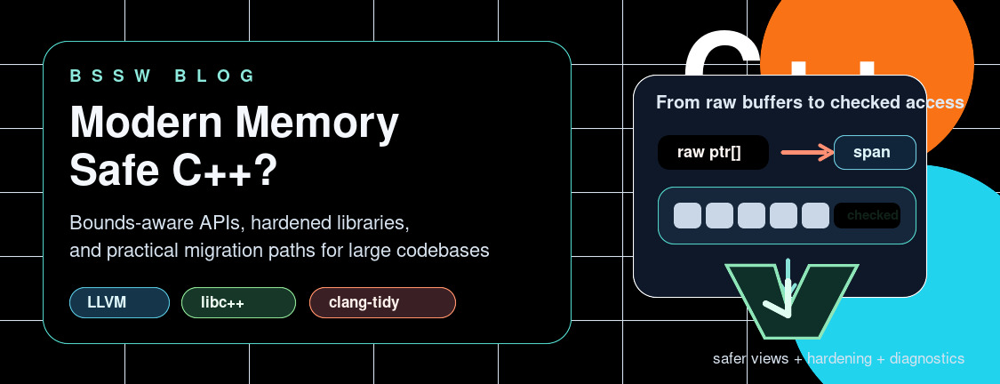

# Modern Memory Safe C++?

#### Contributed by  [Roscoe A. Bartlett](https://github.com/bartlettroscoe)

#### Publication Date: March 30, 2026

<!-- begin deck -->
Modern C++ is safer than much of the C++ sofware written decades, but it is still not a memory-safe language by default.
This article surveys the practical work now underway in LLVM and the C++ standards process to reduce undefined behavior and that results in security and correctness bugs.
<!-- end deck -->

## Why memory safety matters

Memory-safety bugs remain one of the most persistent sources of serious software defects and security vulnerabilities.
ToDo: Provide background on the number of security vulnerabilities that are related to undefined behavior in C and C++ code (see https://cwe.mitre.org/top25/archive/2025/2025_cwe_top25.html).
That matters to the broader software industry, but it also matters to scientific and high-performance (HPC) computing projects.
Even if software security is not a major concern for HPC codes, software correctness bugs caused by undefined behavior caused by incorrect usage of memory is a major problem with the reliability of HPC software and causes some of the most challenging and expensive bugs to diagnose and fix.
Large HPC codes are often long-lived, performance-sensitive, and deeply invested in C++ ecosystems.
The primary tool for accelerated HPC software is the NVIDIA CUDA language, which is basically an extension of the C++ language.
Rewriting everything in a different safer programming language is rarely realistic, yet continuing to accept unchecked undefined behavior is becoming harder to justify.
That tension is the motivation for this article.

There is no single switch that turns ISO C++23 (or in the working draft for C++26) into a memory-safe language.
However, there is now a substantial body of work that can make modern C++ materially safer, especially for spatial memory errors such as out-of-bounds access (which account for a substantial number of the reported software security vulnerabilities).
Much of the most concrete progress is happening around the LLVM and Clang compiler toolchain.

ToDo: Put memory safety in perspective and mention how memory safety issues are no longer dominating reported CWE memory errors (i.e. https://cwe.mitre.org/top25/archive/2025/2025_cwe_top25.html).

ToDo: Mention the tradeoffs between compile-time checking vs. runtime checking and performance vs. safety.

ToDo: Mention previous work C++ memory safety with the Teuchos Memory Management classes

## What "modern C++" already provides for memory safety

Before looking at the newest compiler and library work, it is worth noting that the standard C++ library has already moved in a safer direction over several revisions.
C++11 gave developers a better ownership vocabulary with `std::unique_ptr`, `std::shared_ptr`, move semantics, `std::array`, and stronger RAII-based coding styles.
C++14 added `std::make_unique`, which made ownership transfer less error-prone.
C++17 added `std::string_view`, `std::optional`, `std::variant`, and `std::byte`, all of which helped replace ad hoc conventions with explicit types.
C++20 added `std::span`, ranges, and concepts.
C++23 added `std::mdspan` and `std::expected`, both useful for expressing intent more clearly in high-performance and systems code.

Those additions matter because they reduce the need for raw owning pointers, separate pointer-plus-length pairs, sentinel values, and other patterns that are easy to misuse.
But they do not by themselves eliminate undefined behavior.
An `std::span` is only useful if you actually use it.
A `std::string_view` or `std::span` can still dangle.
Historically, `operator[]` on standard containers has still been a source of undefined behavior when indexing goes out of range.
So "modern C++" helps, but it does not automatically enforce memory safety, and using all of the modern features and libraries do not currently plug all of the holes.

## The LLVM path: Make existing C++ code safer

The LLVM community's recent work is important because it targets a problem most C++ organizations actually have: very large existing codebases that cannot be replaced wholesale.

The first major piece is the [Clang Safe Buffers](https://clang.llvm.org/docs/SafeBuffers.html) effort.
The core idea is simple: buffer operations should not be performed over raw pointers.
Clang's `-Wunsafe-buffer-usage` diagnostics identify pointer arithmetic, unchecked subscripting, and other patterns that often result in out-of-bounds indexing errors and pointer read/write errors.
The intended migration path is to wrap raw buffers in safer abstractions such as `std::span`, `std::vector`, `std::array`, or `std::string_view`, and to preserve that bounds information across APIs instead of dropping back to pointer-plus-size pairs.
Clang also provides `[[clang::unsafe_buffer_usage]]` and `#pragma clang unsafe_buffer_usage` so teams can mark compatibility boundaries and adopt the model incrementally.

The second major piece is [libc++ hardening](https://releases.llvm.org/19.1.0/projects/libcxx/docs/Hardening.html).
Hardening adds runtime checks to important standard-library operations so that some classes of undefined behavior become reliably diagnosed failures instead of silent corruption.
In today's libc++, hardened support already covers important facilities including `std::span`, `std::string_view`, `std::vector`, `std::string`, `std::mdspan`, `std::optional`, and `std::expected`, with several iterator checks available when ABI settings permit bounded iterators.
LLVM's C++ Safe Buffers documentation explicitly treats hardened libc++ and compiler diagnostics as complementary pieces of one programming model.

The third piece is static guidance via the LLVM tool [clang-tidy](https://clang.llvm.org/extra/clang-tidy/).
Clang-tidy's `cppcoreguidelines` checks line up with the [C++ Core Guidelines](https://isocpp.github.io/CppCoreGuidelines/) and enforce proper usage of modern C++ types instead of raw pointers.
Relevant examples include `cppcoreguidelines-pro-bounds-pointer-arithmetic`, `cppcoreguidelines-pro-bounds-array-to-pointer-decay`, `cppcoreguidelines-pro-bounds-constant-array-index`, and `cppcoreguidelines-owning-memory`.
Those checks operationalize the Core Guidelines' bounds rules: avoid pointer arithmetic, avoid array-to-pointer decay, prefer `span`, and make ownership explicit.

This is not full memory safety.
It is mostly a path to stronger spatial safety, and it relies on disciplined adoption.
But it is increasingly a real engineering path instead of just advice.
And existing unsafe C++ code can be incrementally refactored to use modern safe C++ types and eliminate the majority of undefined behavior that cases

## What Apple is doing

Apple has become one of the most visible contributors and deployers of LLVM C++ memory safety work.
Its [C++ language support](https://developer.apple.com/xcode/cpp/) page documents that Xcode 16 added C++ standard library hardening for Apple Clang and `libc++`, with production-oriented modes such as `Yes (fast)` and `Yes (extensive)` as well as a stricter debug mode.

Apple's WWDC25 session [Safely mix C, C++, and Swift](https://developer.apple.com/videos/play/wwdc2025/311/) is especially revealing because it connects several strands into one developer workflow.
Apple explains that standard C++ types like `std::span` can carry bounds information, but that this still does not help if unchecked `operator[]` or raw pointers dominate the code.
Xcode therefore offers an "enforce bounds safe buffer usage in C++" setting that combines C++ standard library hardening with unsafe buffer usage errors, steering developers toward standard containers and `std::span` instead of raw pointers.

Apple is also pushing adjacent work in Clang for C through [`-fbounds-safety`](https://clang.llvm.org/docs/BoundsSafetyImplPlans.html).
That feature is not yet C++ support, and the Clang documentation is explicit about that.
Still, it shows the broader Apple strategy to use compiler and library technology to bring bounds information closer to the source language and to the deployment toolchain.
For C++, Apple's near-term production story is not "C++ becomes Swift."
It is "make bounds bugs harder to write and easier to catch in the toolchain developers already use."

## What Google is doing

Google is pursuing the same LLVM direction at much larger deployment scale, and it has published some of the best public evidence that the approach can pay off.

In November 2024, Google reported on [retrofitting spatial safety to hundreds of millions of lines of C++](https://security.googleblog.com/2024/11/retrofitting-spatial-safety-to-hundreds.html).
After enabling hardened libc++ and rolling it out carefully, Google reported more than 1,000 bugs found, an estimated prevention of 1,000 to 2,000 new bugs per year at its current development rate, and a 30% reduction in its baseline segmentation-fault rate across production.
The same post says hardened libc++ had already disrupted an internal red-team exercise and would have prevented another exploit path that predated deployment.
The WG21 paper [P3471](https://www.open-std.org/jtc1/sc22/wg21/docs/papers/2025/p3471r4.html), authored by Apple libc++ maintainers, cites Google's deployment experience and notes performance impact as low as 0.3%.

Google is not stopping with library hardening.
The company is expanding checking beyond the standard library and migrating code toward Clang [Safe Buffers](https://clang.llvm.org/docs/SafeBuffers.html).
Hardened containers catch misuse at access sites, while Safe Buffers aims to move APIs and data flow away from raw pointers so that bounds information is preserved instead of constantly discarded.

At the same time, Google continues to argue that memory-safe languages matter.
In its March 2024 [Secure by Design perspective on memory safety](https://security.googleblog.com/2024/03/secure-by-design-googles-perspective-on.html), Google made the case that retrofitting protections into C++ is valuable but not sufficient.
Its Android security reporting tells the same story.
In Android 13, Google reported that annual memory-safety vulnerabilities had dropped from 223 in 2019 to 85 in 2022, and from 76% to 35% of Android's total vulnerabilities, while new native code increasingly moved to Rust and other memory-safe languages.

That mixed strategy is worth emphasizing.
Google's message is not "LLVM hardening means C++ is now equivalent to Rust."
It is "use hardening and safer APIs to improve the C++ you already have, while using memory-safe languages more aggressively where you can."

## The Core Guidelines and the standards pipeline

The [C++ Core Guidelines](https://isocpp.github.io/CppCoreGuidelines/) have long pulled together the intellectual framework behind this direction.
Their bounds-safety profile says to not use pointer arithmetic, do not rely on array-to-pointer decay, prefer `span`, and avoid standard-library facilities that are not bounds-checked.
The guidelines also separate bounds safety, type safety, and lifetime safety, which is a useful reminder that no single rule fixes everything.

That same separation is now showing up in WG21 proposals.
Bjarne Stroustrup's [P3274, A framework for Profiles development](https://www.open-std.org/jtc1/sc22/wg21/docs/papers/2024/p3274r0.pdf), argues that the industry needs portable, tool-supported profiles that can offer guarantees rather than just style advice.
Related work includes Herb Sutter's [P3081, Core safety profiles for C++26](https://isocpp.org/files/papers/P3081R2.pdf), the initialization-focused [P3402](https://www.open-std.org/jtc1/sc22/wg21/docs/papers/2025/p3402r2.html), and Stroustrup's invalidation proposal [P3446](https://www.open-std.org/jtc1/sc22/wg21/docs/papers/2024/p3446r0.pdf) for reducing dangling-pointer bugs.

The most concrete proposal with existing field experience is [P3471, Standard library hardening](https://www.open-std.org/jtc1/sc22/wg21/docs/papers/2025/p3471r4.html).
It proposes standardizing the idea of "hardened preconditions" so that operations such as out-of-range indexing on containers, `std::span`, and `std::mdspan` can become contract violations in hardened implementations rather than latent undefined behavior.

What does that mean for C++26 and C++29?
The answer, as of March 2026, is still evolving.
The committee discussion is active enough that it is safer to speak in terms of direction than guarantees.
One important paper, [P3608, Contracts and profiles: what can we reasonably ship in C++26](https://www.open-std.org/jtc1/sc22/wg21/docs/papers/2025/p3608r0.html), explicitly argues for a limited C++26 scope which includes a general profiles framework, standard library hardening, and a simple concrete profile that enables it, while postponing more ambitious profile machinery to post-C++26 work and likely C++29.
Newer papers such as Stroustrup's [P3984](https://www.open-std.org/jtc1/sc22/wg21/docs/papers/2026/p3984r0.pdf) show that broader profile design is still moving.

So the likely near-term picture is incremental.
C++20 and C++23 already delivered safer vocabulary types such as `std::span` and `std::mdspan`.
C++26 may standardize more of the hardening framework around them.
C++29 is a plausible target for more mature C++ safety profiles if implementation experience arrives in time.

## How this compares with Rust

Discussions about C++ memory safety do not exist in a vacuum.
Any discussion of C++ memory safety almost always involves arguments for and against migrating C++ software to [The Rust Programming Language](https://doc.rust-lang.org/stable/book/ch04-03-slices.html).
Rust starts from a different premise.
In Rust, ownership, borrowing, and slices are presented as core language mechanisms that enforce memory safety at compile time for safe Rust.
Unsafe operations are still possible, but they are pushed into explicitly marked `unsafe` regions.

That is a much stronger default than C++ offers today.
Rust's safety model covers both spatial and large parts of temporal memory safety in the language itself.
C++, by contrast, is assembling a layered system of safer library types, compiler diagnostics, runtime hardening, static analysis, and opt-in profiles.
Those layers are useful, but they do not make the language uniformly memory-safe, and they are easier to bypass accidentally or intentionally.

However, C++ has an advantage Rust does not in that it can be improved in place inside enormous deployed systems while preserving existing ABIs, interoperability, and performance envelopes.
That is why the LLVM work matters so much.
It offers a realistic migration path for codebases that will still be largely C++ for years.

The practical conclusion is not that one language "wins."
It is that the tools serve different needs.
For greenfield components that parse untrusted input or sit on critical attack surfaces, Rust often offers the cleaner answer.
For established scientific and HPC codebases, modern C++ plus LLVM hardening and guideline-driven cleanup may be the most feasible way to remove a large fraction of today's risk.

## Why policy pressure is increasing

This technical work is happening in a policy environment that is now openly focused on memory safety.
In the United States, [Executive Order 14028, Improving the Nation's Cybersecurity](https://www.federalregister.gov/documents/2021/05/17/2021-10460/improving-the-nations-cybersecurity), signed on May 12, 2021, pushed federal attention toward software security and secure development practices.
That direction continued through the White House's 2023 National Cybersecurity Strategy, [Executive Order 14144, Strengthening and Promoting Innovation in the Nation's Cybersecurity](https://www.federalregister.gov/documents/2025/01/23/2025-01548/strengthening-and-promoting-innovation-in-the-nations-cybersecurity), signed on January 16, 2025, and the June 6, 2025 amendment to that order.

The policy conversation has also become more explicit about language choice.
CISA's [Secure by Design](https://www.cisa.gov/securebydesign) effort now includes guidance such as *The Case for Memory Safe Roadmaps*.
That does not mean every C++ codebase must be rewritten.
It does mean the burden of proof has shifted.
Organizations are increasingly expected to show a credible plan for reducing memory-unsafe attack surface, whether by migration, hardening, safer subsets, or some combination of the three.

## A practical takeaway for scientific software teams

For research software groups, the most useful stance is probably neither denial nor panic.
Modern C++ can be made significantly safer today, but that requires conscious toolchain and API choices.

If you maintain a C++ codebase, a practical starting point is to target at least C++20 where feasible, prefer containers and views such as `std::vector`, `std::array`, `std::span`, `std::string_view`, and `std::mdspan`, enable `libc++` hardening in development and CI before wider deployment, and run `clang-tidy` with the relevant `cppcoreguidelines` bounds and ownership checks.
For code that still depends on raw pointers, Clang's `-Wunsafe-buffer-usage` offers a concrete migration path.
And for especially high-risk new components, it is increasingly reasonable to ask whether Rust is the better default.

The most honest answer to "Modern Memory Safe C++?" is therefore: not yet, and not completely, but substantially safer C++ is becoming practical.
The interesting part of the current moment is that this is no longer just a language-design conversation.
Apple and Google are shipping it, LLVM is enabling it, and the C++ standards process is trying to catch up.

ToDo: Discuss the future role of incremental refactoring of C++ code using LLM-based AI coding agents.

## Related resources

- [Clang Safe Buffers](https://clang.llvm.org/docs/SafeBuffers.html)
- [libc++ Hardening Modes](https://releases.llvm.org/19.1.0/projects/libcxx/docs/Hardening.html)
- [Apple C++ language support and hardening in Xcode](https://developer.apple.com/xcode/cpp/)
- [Google: Retrofitting spatial safety to hundreds of millions of lines of C++](https://security.googleblog.com/2024/11/retrofitting-spatial-safety-to-hundreds.html)
- [Google: Secure by Design perspective on memory safety](https://security.googleblog.com/2024/03/secure-by-design-googles-perspective-on.html)
- [C++ Core Guidelines](https://isocpp.github.io/CppCoreGuidelines/)
- [WG21 P3471: Standard library hardening](https://www.open-std.org/jtc1/sc22/wg21/docs/papers/2025/p3471r4.html)
- [WG21 P3274: A framework for Profiles development](https://www.open-std.org/jtc1/sc22/wg21/docs/papers/2024/p3274r0.pdf)

## Author bio

Roscoe A. Bartlett earned a PhD in chemical engineering from Carnegie Mellon University, researching numerical approaches for solving large-scale constrained optimization problems applied to chemical process engineering.
At Sandia National Laboratories and Oak Ridge National Laboratory, he continued research and development in constrained optimization, sensitivity methods, and large-scale numerical software design and integration for computational science and engineering (CSE).
Dr. Bartlett currently focuses on software engineering challenges in CSE as well as the development of build, test, and integration software and processes for CSE.

<!---
 Publish: yes
 Track: Deep Dive
 Pinned: no
 Topics: programming languages, development tools
 RSS update: 2026-03-30
 --->
