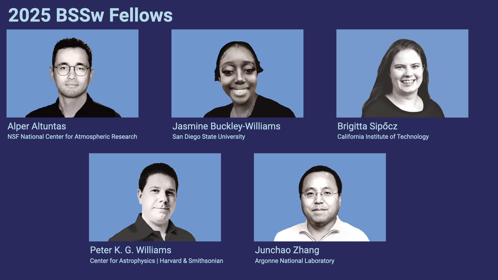
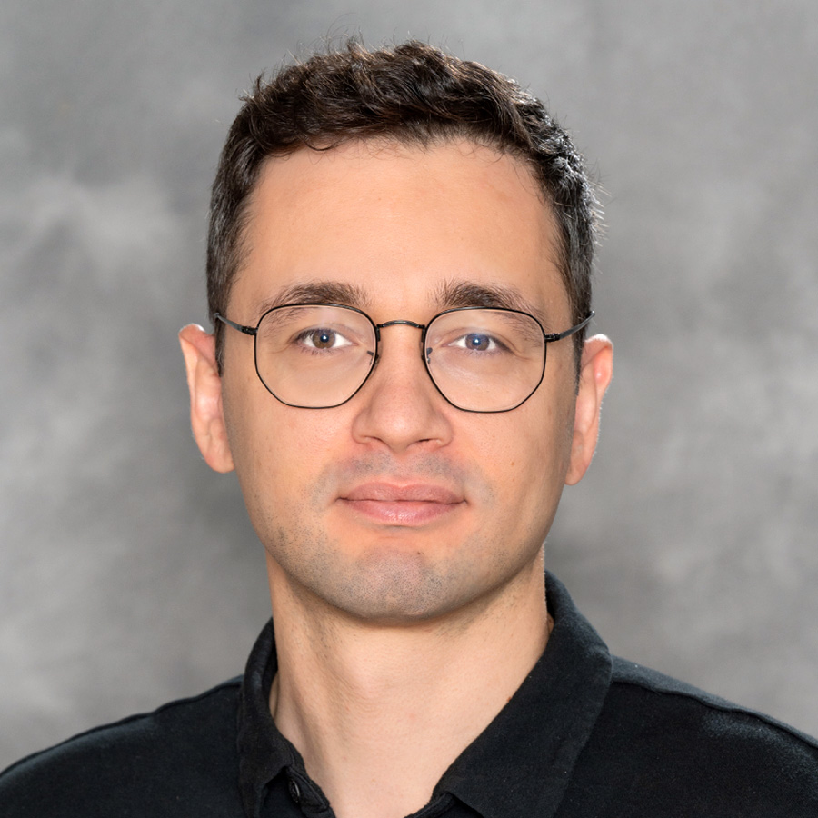
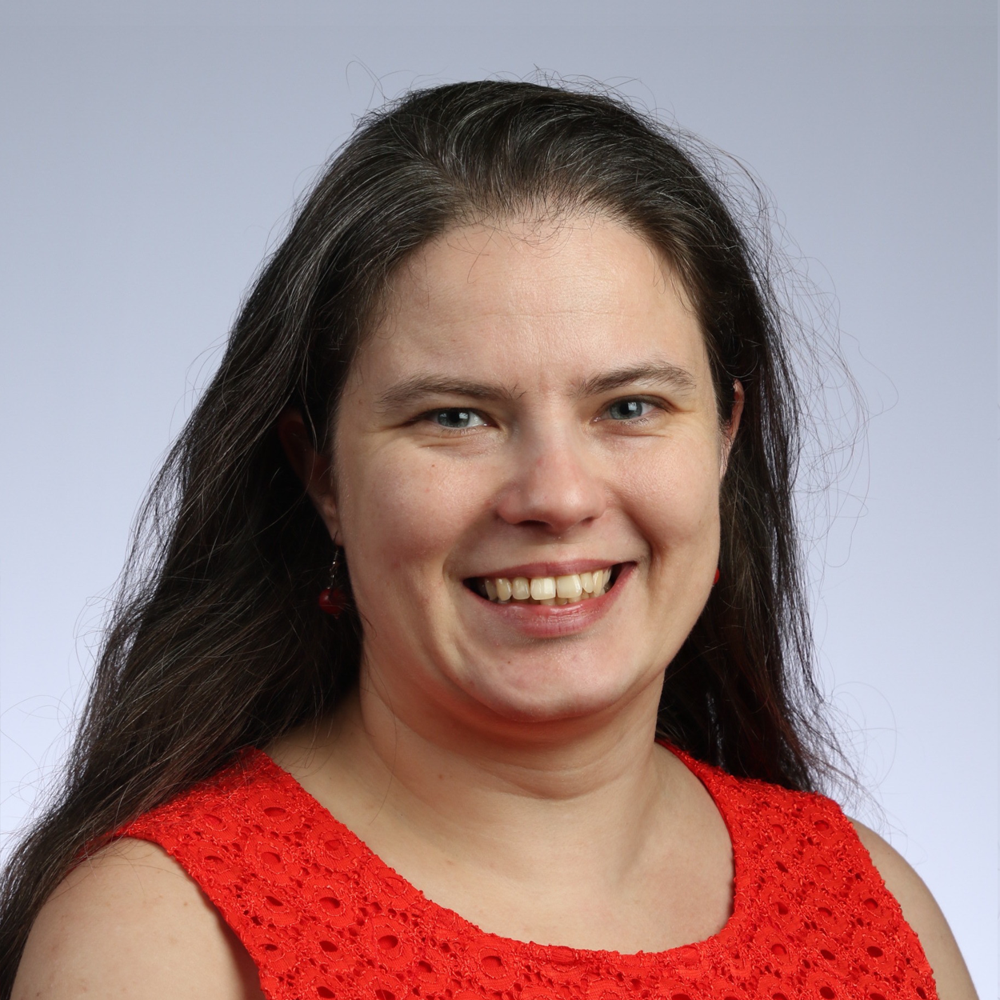
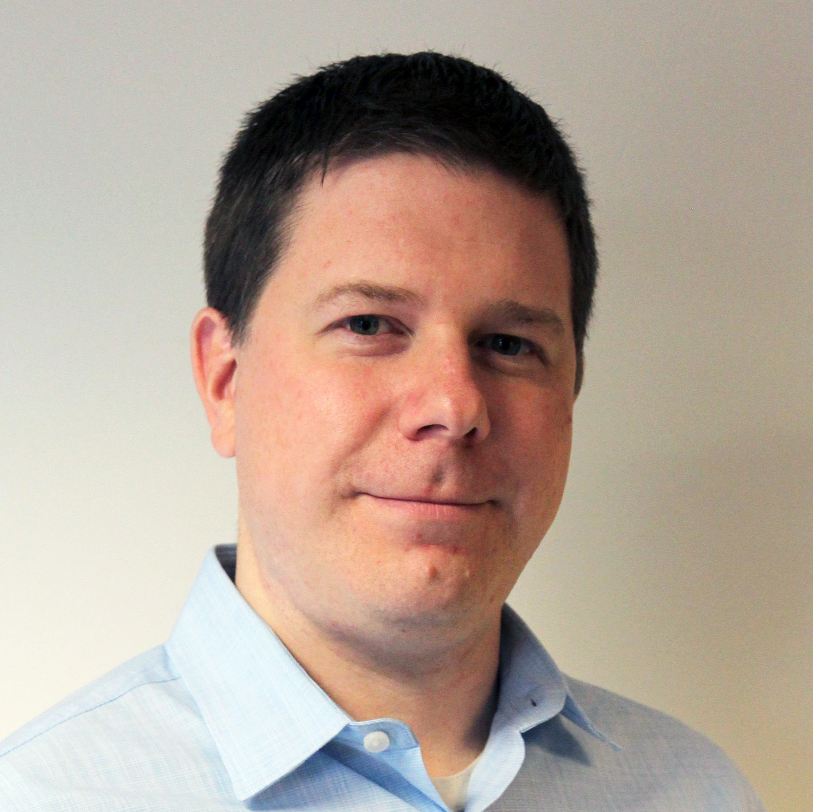
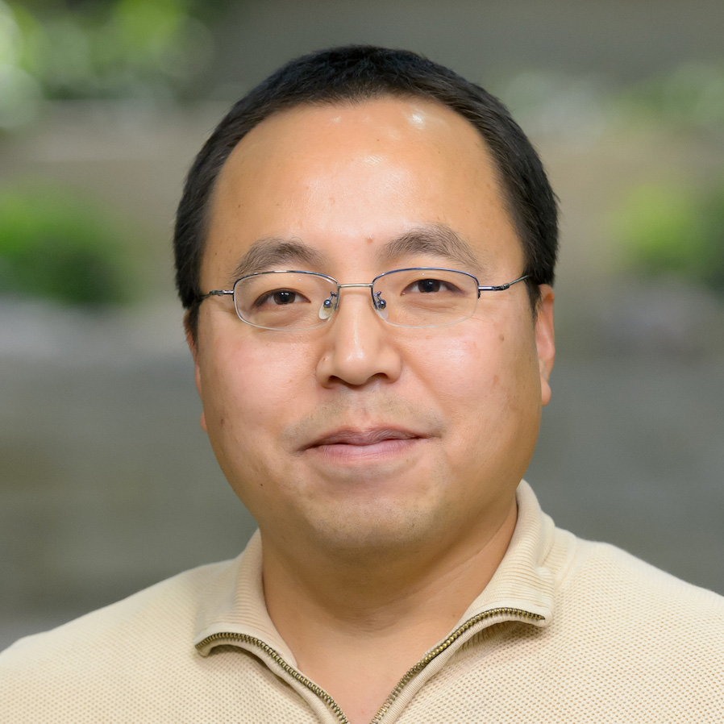

# 2025 BSSw Fellows: Projects and Perspectives

Read about the 2025 BSSw Fellows and their contributions to the BSSw community!

#### Contributed by: [Elsa Gonsiorowski](https://github.com/gonsie "Elsa Gonsiorowski's GitHub Profile"), [Alper Altuntas](https://github.com/alperaltuntas "Alper Altuntas's GitHub Profile"), [Jasmine Buckley-Williams](https://github.com/jbuckleywilliams "Jasmine Buckley-Williams's GitHub Profile"), [Brigitta Sipőcz](https://github.com/bsipocz "Brigitta Sipőcz's GitHub Profile"), [Peter K. G. Williams](https://github.com/pkgw "Peter K. G. Williams's GitHub Profile"), [Junchao Zhang](https://github.com/jczhang07 "Junchao Zhang's GitHub Profile")

#### Publication date: June 24, 2026

[Better Scientific Software (BSSw) Fellowships](https://bssw.io/fellowship) provide resources and community support to those who foster and promote practices, processes, and tools to improve developer productivity and software sustainability of scientific codes.

The 2025 BSSw Fellows have utilized their skills to create tutorials, webinars, and tools to guide developers through various stages of the scientific software lifecycle and impact the culture of scientific software development.
Here's more about what they have been up to and their perspectives on the BSSw Fellowship program.

## Rigor and reasoning in research software: tutorial on testing and verification methods

BSSw Fellow Alper Altuntas organized a [hands-on tutorial](https://ncar.github.io/correctness-workshop/) on software testing and verification to help scientific software developers adopt practical and innovative techniques for improving software quality and reliability. Reliable and accurate scientific software is essential in fields like climate and weather modeling, where simulations play a critical role in advancing knowledge and supporting informed decision-making. This tutorial, hosted at NCAR's Mesa Laboratory in Boulder, CO, and available in a hybrid format, covered key topics such as unit testing, property-based testing, and architectural reasoning in scientific software design. Practical examples were drawn from numerical modeling, data analysis, and related applications. By introducing these techniques, the tutorial has empowered researchers to create robust, trustworthy software that drives progress in scientific computing.

<a href="https://ncar.github.io/correctness-workshop/" class="link-row">Tutorial: Rigor and Reasoning in Research Software</a>
<a href="https://www.alperaltuntas.com/R3Sw/welcome.html" class="link-row">Rigor and Reasoning in Research Software lecture materials</a>
<a href="https://ncar.github.io/correctness-workshop/assets/NCAR_Correctness_25.pdf" class="link-row">Report on the Rigor and Reasoning in Research Software (R3Sw) Tutorial</a>

 

    

        

<a href="https://www.linkedin.com/in/alper-altuntas-ncsu/">Alper</a> is a software engineer and climate model developer at the NSF National Center for Atmospheric Research, where he leads software efforts for the ocean component of the Community Earth System Model, a state-of-the-art climate model. His work focuses on coupled ocean modeling and high-performance computing, alongside initiatives in code modernization, user-friendly modeling toolkits, and formal verification techniques to enhance the reliability, maintainability, and usability of scientific software systems. He holds a Ph.D. in civil engineering from North Carolina State University.

*Perspectives on the BSSw Fellowship Program:*
I wanted to become a BSSw Fellow to share practical perspectives I have developed over the years on writing reliable and maintainable scientific software, and to advocate for techniques that bring the rigor and reasoning of domain science into the software that supports it. Working on the project made me think carefully about how to teach software engineering topics that are often unfamiliar to domain scientists, such as property-based testing and formal verification. I found it useful to frame these ideas using concepts that are already familiar. In particular, I drew an analogy to the scientific method: forming and specifying hypotheses, testing them, and refining understanding. I used this to motivate a more rigorous approach to software. I also relied on simple running examples, such as the 1D heat equation, that are easy to follow but still rich enough to demonstrate testing and reasoning workflows. A key takeaway for me is that unfamiliar topics are more approachable when they are framed using familiar ways of thinking and supported by concrete examples.

*Advice for new (prospective) BSSw Fellows:*
My main advice for prospective BSSw Fellows is to choose a topic that you are genuinely passionate about, but that also addresses a clear need in the community. It is also important to engage with the community and your peers early and throughout the project. Getting feedback at different stages helped me refine and improve my initial plan quite a bit. Finally, on a logistical note, if you are not already familiar with it, it is worth taking some time to understand how your organization handles external funding and grants administration. Clarifying these processes early and staying on top of budgeting, reporting, and invoicing can help things go smoothly.

- - -

## Resource toolkit and outreach on scalable, reproducible software practices

BSSw Fellow Jasmine Buckley-Williams developed an online resource toolkit designed to help the computational science and engineering (CSE) and high-performance computing (HPC) communities adopt and implement best practices in scientific software development. The toolkit includes tutorials and guidelines covering effective HPC software use and collaborative version control. By providing clear, practical resources, the project aims to improve the sustainability, performance, and reliability of scientific software across diverse research domains.

<a href="https://jbuckleywilliams.github.io/BSSw-onlinetoolkit.github.io/index.html" class="link-row">"From Code to Performance" online toolkit</a>

 

  

<a href="https://www.linkedin.com/in/jasminebuckleywilliams">Jasmine</a> is a Public Utilities Regulatory Analyst with a Master's in Big Data Analytics and a background in data manipulation and management in utilities enforcement. Her work bridges the gap between technical excellence and practical accessibility, ensuring that HPC best practices are not only understood but also effectively applied in real-world scientific computing environments.

*Perspectives on the BSSw Fellowship Program:*
My project enriched my professional experience by strengthening my ability to manage complex tasks, analyze information, and adapt to challenges. It also helped me improve my project planning, problem-solving, and time management skills while reinforcing the importance of flexibility and persistence.

One of my major takeaways is the importance of having a clear project strategy and timeline from the beginning to improve efficiency and minimize delays. I also learned the value of seeking guidance, remaining adaptable, and using challenges as opportunities for growth and continuous improvement.

I want to make a meaningful impact by using data, policy, and technology to improve systems, strengthen compliance, and better serve communities. My goal is to contribute to innovative solutions that enhance efficiency, transparency, and consumer or public outcomes.

*Advice for new (prospective) BSSw Fellows:*
My advice for new or prospective BSSw Fellows is to set clear and attainable goals from the beginning of the program and create a realistic timeline to stay on track. Be open to asking for guidance, stay flexible when challenges arise, and take full advantage of the mentorship and learning opportunities available. Most importantly, trust the process and use the experience as an opportunity for both personal and professional growth

- - -

## User-facing tutorials as code: Reproducible and reliable tutorials with CI/CD

BSSw Fellow Brigitta Sipőcz aims to establish and promote best practices for maintaining executable tutorials across scientific computing environments through the implementation of CI/CD (Continuous Integration/Continuous Deployment) practices. Her project focused on developing best-practices documents, tools, and templates to ensure tutorial reproducibility and reliability within the Scientific Python Ecosystem.

<a href="https://github.com/scientific-python/executable-tutorials" class="link-row">Executable Tutorials template repository</a>
<a href="https://docs.google.com/presentation/d/1vAzx0o2_44uRgtdilUQsCXykaWgXwv7JAMtLbNFrIjQ/edit?usp=sharing" class="link-row">User facing tutorials as code</a>

 

  

<a href="https://bsipocz.github.io/">Brigitta</a> is an astronomer turned developer at Caltech/IPAC, where she works in NASA/IPAC Infrared Science Archive. She is a lead developer and maintainer for several widely used open-source Python libraries and infrastructure projects, ranging from astroquery, astropy, astroML to Numpy-tutorials and various pytest and Jupyter components. She holds a pivotal role as one of the community leaders in the Scientific Python project and is committed to unifying the ecosystem by consolidating infrastructure efforts and providing vital support to maintainers and developers within the community.

*Perspectives on the BSSw Fellowship Program:*
Scientific software infrastructure work often falls into an awkward gap: the problems are real and widespread, but they cut across domain boundaries in ways that make them hard to fund, explore, or prioritize within any single field. The BSSw Fellowship offered exactly the right framing: an opportunity to pursue ideas that are too generic to fit neatly into astronomy or atmospheric science or bioinformatics, yet that could genuinely benefit all of them. For me, that idea was that when testing, apply similarly rigorous approaches to tutorials as we do for software libraries.

The clearest takeaway from this work is that the gap between "working code" and "reliably working code" is wider than most people expect, and is costly in educational materials. A tutorial that fails silently teaches the wrong lesson: that scientific software is brittle and hard to trust. Applying CI/CD practices to tutorials is not a heavy engineering lift; it is mostly a shift in perspective, treating a notebook or how-to guide with the same care you would treat a software release. A concrete goal of this project has been to make that shift accessible by giving maintainers templates and patterns they can adopt without reinventing them from scratch.

The impact I hope for is modest but durable: that CI/CD-enabled tutorial scaffolds become a quiet default in the Scientific Python ecosystem. If we want scientific results to be reproducible, the tutorials that teach researchers how to use our tools need to be reproducible too. The two are not separate concerns, and I hope this work helps make that feel like the obvious starting point rather than the heroic one.

*Advice for new (prospective) BSSw Fellows:*
Focus on ideas that are broad enough to be useful across different domains, languages, and techniques. The most valuable contributions tend to be the ones that researchers from very different fields could both reach for without modification. Many fellows bring a problem they have already bumped into in their own work and use the fellowship to generalize it into something universally useful, which is a great instinct to follow.

And, speaking from experience as a former honorable mention: be persistent, but also be open to exploring different project ideas rather than anchoring to just one. The fellowship rewards curiosity as much as conviction.

- - -

## Framework for architecting technical documentation

BSSw Fellow Peter K. G. Williams aims to teach scientific software developers how to create better documentation. For many, the word evokes a feeling of guilt, or dread. Have I written enough? Is what I’ve written any good? While these questions might occur to any kind of developer, scientific software raises some additional ones: How do I integrate my documentation with the academic literature? How do I teach users about the links between physics concepts and code? How do I get professional credit for this work? Peter is has built an online learning resource to answer these sorts of questions: documentation about documentation. The resource presents a conceptual framework for architecting technical documentation, strategies for creating effective documentation, and specific techniques for implementing those strategies. This year-long project has delivered an end-to-end resource: one equipping scientific software developers with the basic conceptual and authoring tools they need to document typical projects satisfactorily.

<a href="https://onegoodtutorial.org" class="link-row">OneGoodTutorial.org</a>
<a href="https://bssw.io/blog_posts/stuck-writing-software-documentation-focus-on-one-good-tutorial" class="link-row">Stuck Writing Software Documentation? Focus on One Good Tutorial</a>
<a href="https://ideas-productivity.org/events/hpcbp-097-onegoodtutorial" class="link-row">(Webinar) One Good Tutorial: Defining a "Minimum Viable Documentation Product" for Scientific Software</a>

 

  

<a href="https://newton.cx/~peter/">Peter</a> is the technical lead for the Minor Planet Center, based at the Center for Astrophysics | Harvard & Smithsonian. Along with a research background in time-domain observational radio astronomy, he has extensive experience in open-source software development, and he is preoccupied with all of the ways in which information technology could be revolutionizing science--but isn't yet.

*Perspectives on the BSSw Fellowship Program:*
One of the major reasons I was excited to become a BSSw Fellow was that, despite how important software is to every branch of science these days, there are very few opportunities to get funded to do work that tries to support the creation of, well, better scientific software. Not only is the BSSw Fellowship an opportunity to do some of that work directly, it’s also part of the larger project to promote the belief that we should be investing in the people who build scientific software and the infrastructure that supports them. I’d love to live in a world where, for every Silicon Valley startup aiming to produce AI-powered vegetable juicers, there was an equally well-funded RSE team building a new software tool that had the chance to transform an entire field of scientific research. We won't get there overnight, but I hope to use my fellowship experience as a platform to push in that direction.

*Advice for new (prospective) BSSw Fellows:*
Get excited! In our line of work it's rare to have the opportunity to spend a significant chunk of time on a project of your own choosing, so make the most of it. Try to craft---and stick to---a thoughtful plan for your time as a BSSw Fellow. Of course, it’s also important to stay open to adjustments, since as you put in work you’ll inevitably think of better ways to accomplish what you’ve been envisioning. My other main piece of advice is to balance the work on your project with community-building. The fellowship is as much about creating connections with people, as it is about executing a particular project.

- - -

## MPI debugging resources and community hub

"There is always one more bug to fix." When code crashes one needs to debug it, making debugging an essential activity in code development. Debugging is a detective process that involves finding and solving mysteries. However, in high performance computing (HPC), debugging can be particularly challenging. Many codes in HPC are written using the message passing interface (MPI) and often run using a handful to millions of processes. Debugging these codes requires following many clues/processes and can be an exciting, frustrating, or even a desperate task. It's important to know tools and best practices to help you fix the bugs, save time, and feel more fulfilled. Unfortunately, debugging resources for MPI are limited and scattered throughout the HPC community. BSSw Fellow Junchao Zhang is fixing this gap through his community hub for MPI debugging tools and best practices, letting MPI code developers share their tips and tricks. This project keeps beginners in mind and focuses mostly on freely available tools.

<a href="https://mpi-debug.org" class="link-row">MPI-Debug.org</a>
<a href="https://bssw.io/blog_posts/making-debugging-mpi-applications-a-little-easier" class="link-row">Making Debugging MPI Applications a Little Easier</a>

 

  

<a href="https://github.com/jczhang07">Junchao</a> is a research software engineer in the Mathematics and Computer Science Division of Argonne National Laboratory. He is a developer of PETSc (the Portable, Extensible Toolkit for Scientific Computation), a widely used math library written in C. His primary focus is on the MPI communication module and the GPU backends in PETSc. He often needs to debug PETSc codes. Before joining PETSc, he was an MPICH developer and he still keeps close collaboration with the MPICH team at Argonne.

*Perspectives on the BSSw Fellowship Program:*
I am a research software engineer on the PETSc team at Argonne National Laboratory, where we develop PETSc, a widely used and sophisticated mathematical library built on MPI. Through both user support and my daily development work, I have seen firsthand how frequently challenges arise from MPI usage. Many users reach out for help with issues that ultimately trace back to MPI, and debugging such problems can be especially daunting for newcomers due to the lack of accessible tools and the inherent complexity of multi-process execution. This experience motivated me to apply for the BSSw Fellowship. I had long felt the need for a centralized, practical resource dedicated to MPI debugging techniques and tools, yet such a resource did not really exist. Given how foundational MPI is to high-performance computing and scientific software, I wanted to help fill this gap by creating a community hub. Although I was initially uncertain whether my idea would be competitive, encouragement from colleagues led me to apply, and I was grateful to be selected.

The fellowship has significantly enriched my professional experience. In addition to developing a website focused on MPI debugging, I had the opportunity to attend the US-RSE Conference 2025 and gain a deeper understanding of the research software engineering community. This experience reinforced my view that, as computational models and architectures grow more complex, it is increasingly important for the community to systematically collect, refine, and share best practices. Such efforts are essential to improving software robustness, performance, and developer productivity. Ultimately, I hope that the MPI debugging resource I am building will lower the barrier to entry for developers and researchers, helping them diagnose and resolve issues more effectively. By contributing to a shared knowledge base, I aim to support a more productive and resilient scientific software ecosystem.

*Advice for new (prospective) BSSw Fellows:*
My advice to prospective BSSw Fellows is to actively engage with the broader research software engineering community. In particular, I strongly encourage attending the US-RSE Conference and joining the US-RSE Slack. These venues offer a wealth of talks that are highly relevant to scientific software development, covering both practical techniques and emerging best practices.

Equally important, they provide opportunities to connect with a welcoming and supportive community. Through these interactions, you can build meaningful professional relationships, exchange ideas, and gain new perspectives. For me, these connections have been especially valuable—not only in expanding my technical understanding, but also in shaping my broader outlook on research software engineering and its role in scientific discovery.

- - -

## Learn more about the BSSw Fellowship Program

BSSw Fellows are selected annually based on an application process that includes the proposal of a funded activity that promotes better scientific software. See more about the [BSSw Fellowship Program](https://bssw.io/fellowship), including the ongoing work of the 2026 BSSw Fellows. We will begin accepting applications for 2027 BSSw Fellowships during mid-August 2026. Register for the [BSSw mailing list](https://bssw.io/pages/receive-our-email-digest) to receive information.

## Author bio

Elsa Gonsiorowski is the coordinator of the BSSw Fellowship Program, a member of the [PESO](https://pesoproject.org) team, and an HPC I/O support specialist at [Livermore Computing, LLNL](https://hpc.llnl.gov/about-us).

<!---
Publish: yes
Track: bssw fellowship
Pinned: no
Topics: Projects and organizations
--->
