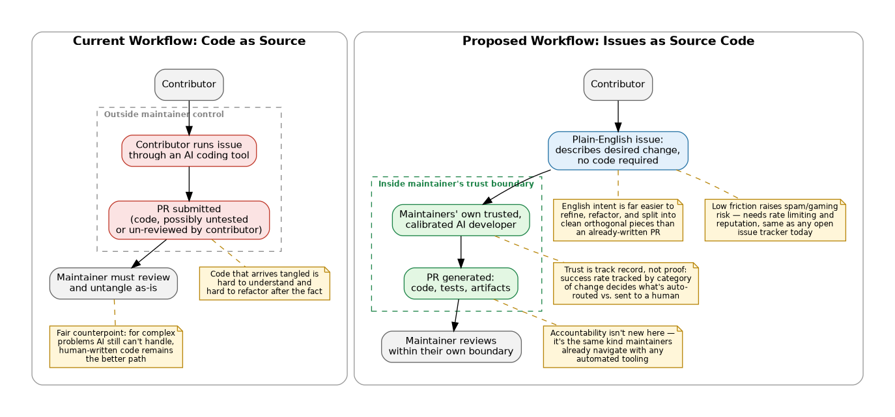

# Issues as Source Code

#### Contributed by: [Michael A. Heroux](https://github.com/maherou)

#### Publication date: September 30, 2026

I have spent much of my career working on the practices that make scientific software trustworthy, and lately a good deal of that attention has gone to how AI is reshaping one of the oldest of those practices: the pull request.

## The Problem

Open source maintainers are experiencing a large increase in contributions that are difficult to trust and process. Pull requests arrive that are clearly the product of someone applying an AI coding tool to the repository, copying out whatever came back, and submitting it, often without reading the diff closely, let alone testing it against the project's actual constraints. The code might work. It might not. It might quietly break an invariant the contributor never knew existed. The maintainer has no way to tell the difference between a PR that was carefully validated and one that was generated and forwarded in five minutes. Even without AI tools to accelerate this kind of contribution, open source software maintainers have long received large pull requests as one big collection of changes addressing multiple concerns across many files.

This isn't a story about AI-generated code being bad. It is the expansion of an existing challenge, to the point that proposed source changes are increasingly difficult to handle and are simply rejected or ignored because the cost of review and integration is too costly or risky. The result is a rising tide of pull requests that all look the same on the surface but vary wildly in quality underneath, and a maintainer community that is understandably growing more defensive and more skeptical of outside contributions in general.

## The Core Proposal: Issues as Source Code

The main proposal of this article is to use AI tools within a different workflow. Instead of asking contributors to submit code, ask them to submit *intent*: a clearly written English description of the change they want to see, filed as a GitHub issue or equivalent. No code required, no PR required. Just a description with enough fidelity that someone, or something, could act on it. In other words, a *set of well-specified requirements.*

The actual code generation then happens on the maintainers' side of the trust boundary, not the contributor's. A project's own trusted AI developer, one it has tuned, tested, and calibrated on that specific codebase, takes the issue and produces the source changes, tests, and other artifacts needed to turn it into a real PR. The contributor's job was never to write good code. It was to describe a problem or a desired change clearly. That's a much lower bar, and it's a bar most people are actually equipped to clear.

This flips the current failure mode. Right now, unvetted AI-generated *code* arrives at the trust boundary, and someone has to untangle it before integration, or reject it outright. In the proposed model, only AI-generated *intent descriptions* cross that boundary, and the code generation step happens inside it, where the maintainers have visibility and control.

## Decomposition: Why English Factors Better Than Code

There's a practical side benefit here that's easy to miss at first: English descriptions of desired changes are much easier to split into clean, semi-orthogonal pieces than an already-written pull request is to untangle after the fact.

A large, sprawling PR that bundles five unrelated changes together is a nightmare to review. You either accept the whole tangled thing or you ask the contributor to go back and re-split work they've already written, which they're often reluctant to do. But a paragraph of English describing "the search results should be paginated, and also the date filter is off by one" is trivial to factor into two separate issues, two separate transformations, two separate PRs. Intent is modular in a way that finished code frequently isn't. This makes the issues-as-source-code workflow not just safer, but structurally tidier. It naturally encourages small, reviewable, independent changes instead of the monolithic PR problem that plagues large repos regardless of who, or what, wrote the code.

[Figure 1. This figure contrasts two workflows for turning a requested change into a merged pull request. In the current workflow, shown on top, a contributor runs an issue through an AI coding tool outside the maintainer's control and submits the resulting code directly, often tangled and hard to refactor, though for genuinely hard problems human-written code can still be the stronger choice. In the proposed workflow, shown below, the contributor instead submits a plain-English description of the desired change, which is easier to refine and split into clean pieces than finished code; the maintainer's own trusted AI, calibrated to that codebase, then generates the code inside the maintainer's trust boundary, with the bot's track record by category of change, rather than any single proof, determining what gets auto-routed versus sent to a human, and with the same accountability and spam safeguards that already govern any automated tooling.]

## The Hypothesis

The bet underlying all of this is fairly simple: a trusted AI that a project's maintainers have specifically calibrated to that codebase will generally do at least as good a job, for a meaningful subset of changes, as a well-intentioned contributor who lacks deep familiarity with the project's conventions, architecture, and edge cases.

There's a second, related bet: debugging English is easier than debugging code. If an issue is unclear, underspecified, or based on a misunderstanding, that's usually obvious on a quick read, and it's cheap to ask a clarifying question or send it back. If a thousand-line diff is subtly wrong, finding that out takes real review effort, and the cost of getting it wrong compounds the moment it is merged.

To be clear, this isn't an argument that all, or even most, contributions should move to this model. That would be premature, since some things genuinely require a human who understands the code to write the code. The argument is narrower and more defensible: there's *enough* territory where this workflow works well that most repos can benefit from having some low-friction path for it.

## What the Data Shows

Some evidence already exists to support the promise of this approach. A task-stratified analysis of over 33,000 agentic pull requests across five major AI coding agents found that documentation tasks reached roughly 82 percent acceptance, compared to about 66 percent for new-feature work, a gap wide enough to matter. Claude Code in particular hit close to 92 percent acceptance on documentation tasks, well above its rates on fixes and refactoring.[1] A separate, similarly large-scale study of agentic PRs found the same pattern: documentation, CI configuration, and build-related changes had the highest merge success of any task category, while performance work and bug fixes were the least reliable, with roughly 71 percent of all agentic PRs merging overall.[2]

In our experience, that maps closely onto the pattern many people doing website and documentation work on GitHub Pages repos are already seeing in practice: this is close to a solved problem for that category of change today.

Programming-language source code and tests are a different, still-maturing story. SWE-bench, the benchmark specifically designed to test whether an AI can turn a real GitHub issue into a correct, tested code patch, has seen resolve rates climb from around 40 percent a couple of years ago to figures in the 70-to-90-plus percent range for the strongest models today.[3],[4] That's genuine progress on exactly the issues-to-code transformation this article is proposing. But a newer, harder benchmark in the same family shows just how repository-dependent that number is: some codebases see resolve rates below 10 percent for every model tested, while others see over 50 percent, with codebase complexity, problem type, and documentation quality named as the deciding factors.[5]

That variance is the reason for the empirical-trust argument developed below. There is no single number that says "AI can resolve issues." There's only a number for *this* repository, on *this* type of task, right now, which is exactly the kind of thing a track-record-based approval process is built to measure.

## Objections Worth Taking Seriously

Three objections come up consistently enough to be worth answering directly.

1. **Why not just let the AI read the code directly and skip the issue?** Because the issue is where a human states what they actually want, in terms a human can review and disagree with before any code exists. Skipping straight to "AI reads the code and decides what to change" removes the one place where intent is explicit and checkable, and it reintroduces the exact opacity problem this workflow is trying to solve.

2. **Who's accountable when the bot's fix breaks something?** This is a real question and it doesn't have a single tidy answer. But it's not a new kind of question. It's the same one projects already navigate with any automated tooling change, and the accountability rests with whoever approved using the bot for that class of change, informed by the track record described below. It's not the contributor's fault for describing a problem in English; it's a matter of the maintainers' judgment about when the automation was appropriate to trust.

3. **Won't low-friction issue submission invite spam or gaming?** Possibly, and any implementation needs to think about rate limiting, reputation, and abuse the way any open contribution surface does. But this isn't a fundamentally new problem. Projects already deal with low-quality or spammy issues today, and a lightweight, well-scoped issue is a much smaller attack surface than a plausible-looking, fully formed malicious PR.

## Trust as Track Record, Not Proof

Underlying the accountability question is a bigger point about how trust actually works in practice. In software engineering, and in most of real life, trust isn't established through some kind of formal proof of correctness or trustworthiness. It's established through repeated, observed reliability. You don't trust a car to cross the desert because someone proved mathematically that it can; you trust it because it's made the crossing before, more than once, and its maintenance and recent performance back that up.

The same logic should govern when an issues-to-PR AI workflow is appropriate to use. The right question isn't "is this AI trustworthy in the abstract," it's "how has this AI performed on similar issues, in this repo, recently." That's a measurable, evolving quantity, not a philosophical stance. A project could concretely track the bot's success rate broken out by category of change (refactors, bug fixes, test additions, documentation) and use that history to decide what gets auto-routed to the bot versus flagged for a human to handle directly.

This also answers the accountability question more concretely than it might first appear: a maintainer approving the use of the bot for a given class of issue isn't issuing a blank check. They're trusting a measured, ongoing track record, the same kind of trust that already governs when a team relies on a test suite, a linter, or any other piece of automation with a history behind it.

## Using AI to Watch the AI

There's a natural extension to the track-record idea, and it closes the loop nicely: the ongoing evaluation of the bot's trustworthiness is itself a good task for AI. Rather than a maintainer manually reviewing outcome logs, a separate evaluative process can watch the pattern of results over time, not just judging a single PR in isolation, but noticing drift, spotting categories where reliability is slipping, and flagging when a class of change should be pulled back from automatic routing.

That's a fitting note to close on, because it reflects the same underlying philosophy driving the whole proposal: trust here isn't a one-time judgment, it's an ongoing, evidence-based relationship. It's one more place where a well-calibrated AI, watching carefully, can do a job that's genuinely hard for a human to keep up with at scale.

To be clear about scope, this is not an argument that the age of human-written pull requests is over, or that every repo needs this today. It's an argument that for a real and growing slice of changes, an issues-first, English-in / PR-out workflow is trustworthy enough, right now, that most repositories should consider a low-friction path for it, even while plenty of contributions will keep flowing through the traditional route for a long time to come.

## Author Bio

Michael (Mike) A. Heroux is a Senior Research Scientist at ParaTools, Inc., Visiting Scholar at Hewlett Packard Enterprise, Consulting Analyst at Hyperion Research, and Professor Alumnus at Saint John’s University, MN. His research interests include all aspects of scalable scientific and engineering software for new and emerging parallel computing architectures, and emerging research and learning methodologies enabled by generative AI tools and workflows.

<!---
Publish: no
Track: deep dive
Topics: peer code review, issue tracking, ai for better development, software process improvement, strategies for more effective teams
--->

[1-sfer-ezikiw]: https://arxiv.org/pdf/2602.08915 "AI coding agent task-stratified analysis {Pinna, G., Gong, J., Williams, D. & Sarro, F. Comparing AI Coding Agents: A Task-Stratified Analysis of Pull Request Acceptance. MSR'26 Mining Challenge Track (2026). arXiv:2602.08915.}"

[2-sfer-ezikiw]: https://arxiv.org/html/2601.15195 "Failed agentic pull requests {Ehsani, R., Pathak, S., Rawal, S., Al Mujahid, A., Imran, M. M. & Chatterjee, P. Where Do AI Coding Agents Fail? An Empirical Study of Failed Agentic Pull Requests in GitHub. International Conference on Mining Software Repositories (MSR) (2026). arXiv:2601.15195.}"

[3-sfer-ezikiw]: https://www.codesota.com/benchmark/swe-bench-verified-agentic "SWE-bench Verified Leaderboard {CodeSOTA. SWE-bench Verified Leaderboard. (2026).}"

[4-sfer-ezikiw]: https://arxiv.org/abs/2310.06770 "SWE-bench benchmark {Jimenez, C. E., Yang, J., Wettig, A., Yao, S., Pei, K., Press, O. & Narasimhan, K. SWE-bench: Can Language Models Resolve Real-World GitHub Issues? International Conference on Learning Representations (ICLR) (2024). arXiv:2310.06770.}"

[5-sfer-ezikiw]: https://labs.scale.com/leaderboard/swe_bench_pro_public "SWE-bench Pro Leaderboard {Deng, X. et al. SWE-Bench Pro: Can AI Agents Solve Long-Horizon Software Engineering Tasks? Scale AI (2025).}"
<!-- DO NOT EDIT BELOW HERE. THIS IS ALL AUTO-GENERATED (sfer-ezikiw) -->
[1]: #sfer-ezikiw-1 "AI coding agent task-stratified analysis"
[2]: #sfer-ezikiw-2 "Failed agentic pull requests"
[3]: #sfer-ezikiw-3 "SWE-bench Verified Leaderboard"
[4]: #sfer-ezikiw-4 "SWE-bench benchmark"
[5]: #sfer-ezikiw-5 "SWE-bench Pro Leaderboard"
<!-- (sfer-ezikiw begin) -->
## References
<!-- (sfer-ezikiw end) -->
* 1[Pinna, G., Gong, J., Williams, D. & Sarro, F. Comparing AI Coding Agents: A Task-Stratified Analysis of Pull Request Acceptance. MSR'26 Mining Challenge Track (2026). arXiv:2602.08915.](https://arxiv.org/pdf/2602.08915)
* 2[Ehsani, R., Pathak, S., Rawal, S., Al Mujahid, A., Imran, M. M. & Chatterjee, P. Where Do AI Coding Agents Fail? An Empirical Study of Failed Agentic Pull Requests in GitHub. International Conference on Mining Software Repositories (MSR) (2026). arXiv:2601.15195.](https://arxiv.org/html/2601.15195)
* 3[CodeSOTA. SWE-bench Verified Leaderboard. (2026).](https://www.codesota.com/benchmark/swe-bench-verified-agentic)
* 4[Jimenez, C. E., Yang, J., Wettig, A., Yao, S., Pei, K., Press, O. & Narasimhan, K. SWE-bench: Can Language Models Resolve Real-World GitHub Issues? International Conference on Learning Representations (ICLR) (2024). arXiv:2310.06770.](https://arxiv.org/abs/2310.06770)
* 5[Deng, X. et al. SWE-Bench Pro: Can AI Agents Solve Long-Horizon Software Engineering Tasks? Scale AI (2025).](https://labs.scale.com/leaderboard/swe_bench_pro_public)
