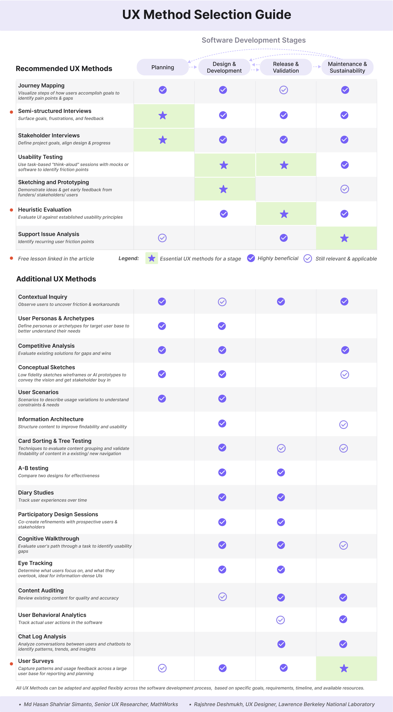

# UX Methods Across the Research Software Lifecycle

#### Contributed by Md Hasan Shahriar Simanto and Rajshree Deshmukh

#### Publication date: November 6, 2026

Research software teams often hesitate to invest in user experience work. Some think it is too early to talk to users; others think the project is too far along for design changes to matter. Both instincts get in the way of the same thing: understanding whether the software actually works for the people using it.

But UX isn't a "one-and-done" step – it's a toolkit that applies at every turn. In practice, every stage of a project has a few usability questions worth answering. The infographic below outlines key UX techniques and their relevance across the project lifecycle:

*The full-size infographic and detailed guide on above methods are available in the open-access [Zenodo resource](https://doi.org/10.5281/zenodo.22287846).*

### Planning: What should we build, and for whom?

Early on in the planning phase, the question is what to build and for whom. Here, methods like stakeholder interviews, semi-structured interviews and contextual inquiry are invaluable. These techniques help uncover the scientific goals and, more importantly, the hidden frustrations and workarounds that formal requirements documents often miss.

### Design and Development: Is it functional & feasible?

As the design takes shape and you move into development, the focus shifts to feasibility and if the approach will actually work for users. Sketching, prototyping and cognitive walkthroughs allow teams to test designs and interactions early, spotting confusing elements or unclear guidance before significant engineering resources are spent.

### Release & Validation: Can people actually use it?

Once something is built and you are in the release and validation phase, the question becomes if people can use it effectively. Methods like heuristic evaluation and targeted usability tests (even a single think-aloud session) help uncover friction points in the actual product. This real-world feedback is far more powerful than internal team assumptions.

### Maintenance & Sustainability: Does it need to change?

Finally during maintenance, the question is whether the software still works as users and their workflows evolve. At this stage, teams can combine broad signals with deeper evidence: behavioral analytics, support ticket analysis, and user surveys help us understand what people are actually doing in the software over time.

In reality, Software development is rarely linear. Unforeseen constraints like funding changes, new scientific questions, or shifting requirements mean usability hurdles surface constantly. UX processes should therefore not be treated as activities that belong only at one stage.

Enhancing user experience also requires more than formal methods. Building trust and engagement relies heavily on user outreach, strong onboarding, and relationship building. Embedding continuous feedback checkpoints at every stage is essential for creating intuitive and frictionless software.

AI-assisted development can shorten the time needed to implement software, but faster implementation does not reduce the need to understand users. If anything, the ability to build more quickly makes it even more important to know what is worth building in the first place.

<h2 style="display:inline;">Details on UX Methods in the chart</h2>

### Journey Mapping
- Visualize steps of how users accomplish goals to identify pain points & gaps.
- Early in development, it can help teams articulate assumptions about how users may accomplish a goal and identify questions that need validation.
- In later stages, it can help diagnose friction in workflows that have been in production for years.
- A map built without user input can be a useful starting point when time is tight, but it reflects the team's assumptions rather than users' reality, so it still needs to be validated with real users before it can be treated as a finding.

### Semi-structured Interviews
- Gather in-depth contextual insights from a user group via a flexible interview format.
- While effective for gathering requirements early on, these methods remain valuable across all project phases to uncover UX friction and pinpoint targeted solutions, such as addressing workflow gaps or missing functionality.
- This method scales well depending on the time and resource constraints. Five to eight conversations with a reasonably similar group of users is typically enough to surface the most common and recurring themes.

### Stakeholder Interviews
- Structured discussions with project owners, funders, and contributors to define goals and keep design decisions aligned.
- Most useful at the start of a project and at the start of each funding cycle, when scope and priorities are being set.
- Stakeholders describe what they want built, but that's not always what users actually need. So it's best paired with research that involves real users.

### Competitive Analysis
- A review of existing tools and workflows that solve part of the same problem, to identify common approaches, gaps, and opportunities.
- In research software this is less about market position than about avoiding reinvention, and about inheriting conventions expert users already know from tools they use.
- Most valuable during planning and design, and worth revisiting when a new tool gains traction in the domain.

### User Personas & Archetypes
- Short profiles of the target user base capturing goals, expertise, and pain points, giving the development team a shared reference instead of an abstract "user."
- For research software, archetypes based on role or expertise, such as a domain scientist, a method developer, and an operator, tend to be more useful than demographic personas.
- Personas are only as useful as the research behind them. Assumption-based personas can align a team temporarily, but they should be validated and updated as user understanding improves.

### Conceptual Sketches
- Low-fidelity sketches, wireframes, or AI-generated prototypes used to convey a vision and get buy-in from funders and stakeholders.
- Particularly useful during planning, when there is nothing built yet to point at.
- Label them as concepts, not commitments, so they don't get mistaken for the final design.

### User Scenarios
- Short narratives describing a specific person trying to accomplish a specific goal in a realistic context, used to understand constraints and usage variations.
- Useful in planning to clarify what the software needs to support, and in design to test whether a proposed approach holds up.
- Good scenarios can be reused later as tasks in usability testing, so it pays off to write them thoughtfully.

### Usability Testing
- Task-based "think-aloud" sessions where someone works through a realistic task using a mockup, prototype, or working software while narrating their thinking.
- The key is giving people representative, non-leading tasks rather than asking for their opinions. Resist the urge to help when they get stuck, since getting stuck is the data.
- This method scales down more than most teams expect. Even one session on one properly designed, unbiased task, run on an early prototype, often surfaces more problems than anticipated.

### Sketching and Prototyping
- Creating a rough, low-effort version of an idea, from a hand-drawn sketch to a clickable prototype, and putting it in front of users, funders, or stakeholders before investing real engineering effort.
- Keeping it rough is important. Polished mockups tend to get polite agreement, since they look finished and people assume the decisions are already made.
- Mostly a design-stage activity, but it applies any time a substantial new feature/design comes up, even during maintenance.

### Heuristic Evaluation
- A review of an interface against established usability principles, typically using a structured template.
- Can be conducted by one person in an afternoon. Two or three reviewers working independently will catch noticeably more.
- Finds the problems experts can see, so it complements testing with real users rather than replacing it. Useful at any stage once there's something designed to review, whether that's an early prototype or a mature interface.

### Support Issue Analysis
- A review of support tickets, issue trackers, and mailing list threads to identify where users repeatedly encounter friction.
- No recruitment needed. The data already exists, so this is often the fastest place to start on an established project.
- Tickets over-represent users persistent enough to file one. People who hit a wall during a process and quietly gave up won't appear in this analysis.

### Contextual Inquiry
- Observing people working in their own environment rather than asking them to describe it.
- Reveals workarounds, informal scripts, and constraints that users don't think to mention.
- Most associated with early research, but equally useful during maintenance when other signals suggest something is wrong and you need to see what's actually happening.
- Even a single session, sitting with one user through real work, often reveals something you'd never have thought to ask about. It takes more coordination than an interview, but it is worth the effort.

### Information Architecture
- Organizing and labeling content and functionality so people can find what they need. In research software this includes command structure, documentation layout, and naming of parameters, modules, and outputs, not just menus.
- Most often addressed during design, but organizational and naming problems frequently surface again during maintenance as functionality grows.

### Card Sorting & Tree Testing
- Card sorting asks users to group and label items, helping you generate a structure for your menus or content. Tree testing asks users to find something in a structure you already have, helping you validate it.
- Useful from design onward, and into maintenance whenever support issues suggest people can't find a feature that already exists.

### A-B Testing
- Comparing two versions of a design with real users to see which one better supports a task or outcome.
- Requires more number of users to get meaningful difference with confidence, which makes it more relevant to systems with larger user base.
- A smaller sample can still be worth running if paired with qualitative context rather than relying on the numbers alone.
- Most applicable to select optimal design from variations, or just after release during the validation phase.

### Diary Studies
- Participants log their experience with the software over days or weeks, so you can see how use changes over time instead of catching one snapshot.
- Good for catching problems that only show up on the tenth use, not the first, and for understanding how adoption actually plays out.
- This method asks more of participants than most methods, so keep prompts short and infrequent if you want people to actually finish it.

### Participatory Design Sessions
- Working sessions where prospective users respond to prototypes and help refine them directly.
- Works well with domain experts who have strong opinions, which is common in research software.
- Needs careful facilitation so the loudest voice in the room doesn't dictate the design.

### Cognitive Walkthrough
- A structured evaluation of learnability. Evaluators step through a task from a new user's perspective to identify where the user might become stuck or confused.
- Usually conducted by UX practitioners, product-team members, or domain experts rather than representative users, though it can also be run with real users thinking out loud, called a participatory or user-led walkthrough.
- A useful first pass before launch or for diagnosing problems in an existing workflow. Because expert-only findings depend on the evaluators' judgment, follow up with usability testing when possible.

### Eye Tracking
- Recording where users look to see what draws attention and what gets missed.
- Best for information-dense interfaces like dashboards, where visual attention is the actual question.
- Needs specialized equipment and expertise most research software teams won't have. Worth the investment when you specifically need to know where attention goes, not just where users struggle.

### Content Auditing
- Reviewing documentation and in-software text, guides, references, labels, error messages, for gaps, inconsistencies, and outdated information.
- Research software docs drift fast, since features change faster than the text describing them.
- Most useful around release and after major version changes.

### User Behavioral Analytics
- Instrumentation that shows what users actually do: which features get used, where people abandon a workflow, what never gets touched.
- Shows what happens, not why. Pairing it up with a qualitative method can help to validate usability issues.
- Applies after release. Settle privacy and consent questions before you start collecting data.

### Chat Log Analysis
- Reviewing conversations between users and an embedded AI assistant to spot recurring questions and points of confusion.
- Increasingly relevant as AI assistants get built into research tools, since logs capture what people actually ask, unprompted.
- Watch for sensitive or unpublished research content in logs, and be clear with users about how conversations are retained.

### User Surveys
- Broad-reach questionnaires to capture patterns and usage feedback across a large user base for reporting and planning.
- Surveys look easy but they aren't. Poorly worded questions produce data that's confident and wrong, and surveys tell you what people report rather than what they actually do.
- Work best when informed by earlier qualitative work, which helps ensure you're measuring meaningful questions rather than guessing. Done well, they scale insight in a way no other method here can.

## Additional Public Resources

Three of the methods above already have free, community-built resources:

- **Usability testing:** a Carpentries Incubator lesson on rapid usability testing, covering everything from participant recruitment through data analysis: [https://carpentries-incubator.github.io/rapid-usability-tutorial/index.html](https://carpentries-incubator.github.io/rapid-usability-tutorial/index.html)
- **Semi-structured interviews:** a presentation on practical techniques for gathering rich data from users, hosted on Zenodo: [https://zenodo.org/records/17362664](https://zenodo.org/records/17362664)
- **Heuristic evaluation:** A template for assessing your software against design heuristics, suitable for both CLI and GUI tools, developed by contributions from the STRUDEL, PESO, and CASS projects: https://github.com/cass-community/heuristics-for-scisoft
- For a broader starting point, the STRUDEL project's "Ten Principles for Creating Usable Software for Science" explains what makes scientific software different and how to approach its usability: [https://escholarship.org/content/qt0w5547jv/qt0w5547jv_noSplash_fb5d052988314657a264f28acb6ffc95.pdf](https://escholarship.org/content/qt0w5547jv/qt0w5547jv_noSplash_fb5d052988314657a264f28acb6ffc95.pdf)

## About the Authors

**Md Hasan Shahriar Simanto**

Senior UX Researcher at MathWorks, where he conducts user research for MATLAB, a scientific computing platform used by engineers and scientists. Since 2018, his work has focused on human-centered research and usability across scientific software, cloud infrastructure, cybersecurity, and enterprise systems, with current work centered on the usability of AI-assisted technical workflows. He is an active member of the US-RSE UX Working Group. Reach him at hsimanto@mathworks.com

**Rajshree Deshmukh**

User Experience Designer at Lawrence Berkeley National Laboratory's Scientific Data Division, where she designs intuitive software products and contributes to projects including NERSC, ESnet, PrOMMiS and the Orphaned Wells project. She has over ten years of industry experience at Reuters, IBM, and Nutanix, and holds a Master's in Information Design from the National Institute of Design, India. Reach her at rajshreed@lbl.gov
<!---
Publish: Yes
Track: Deep Dive
Topics: user experience design, software process improvement
--->
