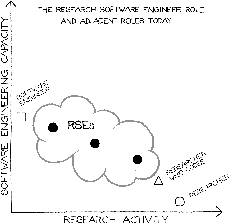
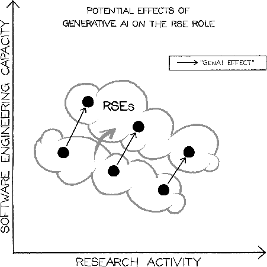
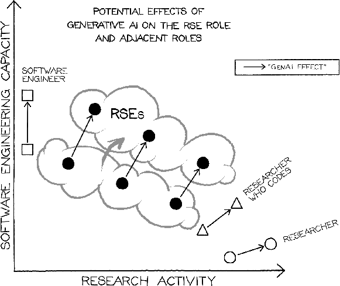

# Research Software Engineers in the Age of GenAI: Same Value, Changing Practice

#### Contributed by [Stephan Druskat](https://sdruskat.net), [Michelle Barker](https://www.linkedin.com/in/michelledbarker/), [Ian Cosden](https://github.com/cosden), [Cunliang Geng](https://github.com/CunliangGeng), [Robert Haines](https://github.com/hainesr), [Daniel S. Katz](https://danielskatz.org/), [Joseph Shingleton](https://github.com/jshng-glasgow), and [Ben van Werkhoven](https://github.com/benvanwerkhoven)

#### Publication date: May 28, 2026

<!-- begin deck -->
Before GenAI, the RSE movement had learned to clearly articulate the value proposition of embedding expert software engineering in research to its stakeholders. This blog post highlights how RSEs use GenAI to increase their capacity in both software engineering and research, and visualize this evolution.
<!-- end deck -->

Research software and its creators have long played a critical role in the advancement of research worldwide. This role is changing in the age of “generative AI” (GenAI), but both the software and the people remain of key importance. Understanding these changes is essential in enabling Research Software Engineers (RSEs) to continue contributing the same high value to the research process and its outputs.

Before GenAI, the RSE movement had learned to clearly articulate the value proposition of embedding expert software engineering in research to its stakeholders. This blog post highlights how RSEs use GenAI to increase their capacity in both software engineering and research, and visualize this evolution. While GenAI is changing - perhaps considerably - how RSEs work in practice, their value and the value of their work for research remains steady and likely to increase.

Generative AI, specifically Large Language Models (LLMs) and coding agents, is rapidly changing software engineering. The practice of software engineering is shifting away from writing lines of code to specifying requirements, implementations, designs and verification strategies in higher-level abstractions, including natural language specifications, that are then enacted by an AI coding agent. This lowers the barrier to entry for producing code and reduces the development time for new solutions.

Generative AI is not only impacting software development in industry, but is understandably also seeing rapid adoption in academia to accelerate software development processes. Its application enables researchers to produce their own research software, including those who would not have done so previously. Software solutions, once beyond the reach of researchers lacking programming and software engineering knowledge, are now accessible with these new GenAI tools. If researchers can write more - and better - code, themselves, it begs the question: where do RSEs fit in this new paradigm?

In March 2026, 36 members of the research software community came together to discuss this at a workshop entitled “[Research Software Engineering in the Age of Generative AI: Building a Community Vision](https://www.researchsoft.org/events/rse-ai-workshop/)”, held in Edinburgh, UK. The Research Software Alliance co-led this event and was supported to undertake this work as part of a Schmidt Sciences grant. Whilst the impact of GenAI on research is being discussed in many forums and publications, this workshop provided an opportunity for a range of early adopters, innovators, and RSE leads to come together to discuss how the ecosystem was changing, and to chart constructive ways to shape and support this change.

The workshop included multiple rounds of focused working groups, one of which discussed the value of research software engineering in the age of GenAI. This blog post is an outcome of that working group. Its authors brought together their experience as leaders of different types of RSE initiatives across the ecosystem to provide an accessible way to show both how the roles of research software personnel are evolving in line with GenAI, and how these roles remain key to enabling research impact.

There are costs, concerns and risks associated with the creation and use of AI models generally,[1],[2]
and in a multitude of more focused areas, including skills,[3],[4],[5],[6]
community culture and motivation,[7],[8]
as well as equity and ethics.[9],[10],[11]
However, while many of these risks also apply to the use of GenAI in coding tasks, there are also many immediate benefits for coding.[12],[13],[14],[15]
AI tools are accelerating routine coding tasks, such as creating working scripts for data analysis, generating boilerplate code, tests and documentation, all from high-level natural language prompts. Coding agents represent a more autonomous evolution of prompt-based coding, enabling systems built around LLMs to access and operate on existing codebases to handle more complex tasks, such as refactoring or porting. They can even be used to build an entire codebase from scratch, given sufficient information such as specifications or implementation plans.

As software has become one of the primary research tools across all disciplines, a significant majority of scientific results rely on the quality of that software. RSEs emerged as a result: by combining professional software engineering expertise with an intimate understanding of the research discipline, partnerships between RSEs and researchers allowed software to evolve along with research, with RSEs guiding the productive application of methods and technologies and ensuring that software meets the reliability and reproducibility standards that are expected from scientific instruments. This unique position of RSEs bridging software engineering and research was often depicted in diagrams similar to Figure 1, which shows that RSEs vary in their skills and knowledge of both software engineering and research activities. It also shows RSE-adjacent roles (such as software engineer, researcher, and researcher who codes) to provide context, illustrating that RSEs have more software engineering experience than researchers, while also possessing a deeper understanding of research practices than software engineers. Diagrams like these have been very important tools in achieving (pre-GenAI) understanding of the value provided by RSEs, to the extent that RSEs are supported by national initiatives such as those in the UK, the Netherlands and Germany.[16],[17],[18]

 
Figure 1: RSEs bring both software engineering and research expertise.
 

With the advent of GenAI, two questions arise: Is this partnership between RSEs and researchers still needed and still valuable? And, how do these roles change? In the age of GenAI, both researchers and RSEs have access to LLMs and coding agents to accelerate their work. Researchers are able to prototype and explore ideas faster and more freely than before. Meanwhile, RSEs are able to use these GenAI tools to greater effect and impact, due to their expertise in software engineering, particularly in requirements engineering and specification, software architecture, testing and verification, validation, performance, and long-term sustainability. This enables them to frame problems more precisely, to evaluate tradeoffs and verify internal correctness and consistency more effectively, and to better address longstanding challenges in research software. Moreover, their continued and frequent practice with these tools compound their advantages, allowing them to better anticipate failure modes, enforce quality standards, and integrate tooling into complex, evolving research environments.

RSEs who maintain GenAI literacy and the ability to critically evaluate complex software stacks are especially indispensable in view of the risks associated with the increasing adoption of GenAI in research software development. In particular, when researchers use agentic coding tools without sufficient expertise and experience to write increasingly complex software, over-reliance on these tools risks generating a significant disconnect between the coder and the code. This disconnect can lead to the introduction of unintended errors and inaccuracies, and could pose serious risk to the robustness of related scientific outputs and research results. In this situation, RSEs are well positioned to provide the guidance and oversight that is necessary to ensure the safe adoption of AI in research software engineering.

Taken together, the value of an RSE remains significant, as the RSE role evolves to integrate expert knowledge in the application of GenAI for software engineering in research contexts. This viewpoint is similarly articulated in the [Position Statement on Generative AI in the RSE Workplace](https://github.com/Academic-Data-Science-Alliance/rse-ai-position-statement/blob/main/RSE-AI-Final_Statement.md),[19] which is led by US-RSE and the Alliance for Data Science and AI. The Edinburgh workshop built upon this position statement, and it is also being shared in other conversations.[20],[21] As such, the value of RSEs in relation to researchers and other stakeholders will remain unchanged as their role as a research software professional evolves to also integrate expert knowledge in the application of GenAI in research contexts. This blog post seeks to move one step further in clearly articulating that value in a way that is easy to understand.

Overall, **the value of the RSE role shifts upward as AI enhances it and amplifies its impact. While the practice may change and shift focus to higher levels of abstraction, including specification and verification, the value proposition remains the same**. This is depicted in Figure 2, which shows how the use of GenAI enables the value of RSEs to increase along both the software engineering and research activity axes. It is critical for the research community to understand and acknowledge this increased potential for research impact, and to ensure that going forward, RSE expertise is appropriately supported, funded and integrated into research ecosystems.

 
Figure 2: AI can enable RSEs to increase their capacity for both research and software engineering, irrespective of specializations.
 

Figure 3 highlights the unique position of RSEs in the research ecosystem. RSEs and other roles in the research sector (software engineers, researchers who code, and researchers) all evolve in response to leveraging GenAI tools, which affects all groups along the software engineering capacity axis to varying degrees. Researchers who have not previously done any programming can now generate their own code, but for all non-RSE roles these shifts largely reinforce strengths within their established areas of expertise. For RSEs, however, this evolution plays to their dual focus on both software engineering and research, so that the effective value of RSEs and their work is amplified, as GenAI enables them to provide (even) more and better software to support (even) more and better research.

 
Figure 3: How various roles are evolving in response to GenAI.
 

## Acknowledgements

MB and DSK were supported to undertake this work as part of Schmidt Sciences grant G-25-69965.

DOI: [10.5281/zenodo.20320178](https://doi.org/10.5281/zenodo.20320178)

This blog post is being cross-posted by the [Research Software Alliance](https://www.researchsoft.org/blog/) (ReSA), [Better Scientific Software](https://bssw.io/blog_posts) (BSSw), [European Virtual Institute for Research Software Excellence](https://everse.software/news/) (EVERSE), [Netherlands eScience Center](https://blog.esciencecenter.nl/), and [Software Sustainability Institute](https://www.software.ac.uk/news-and-blogs-hub) (SSI).

## Author bios

[Michelle Barker](https://www.linkedin.com/in/michelledbarker/) is Director of the Research Software Alliance and has extensive expertise in open science, the research software community, digital skills, and digital research infrastructure. As a sociologist, Michelle is passionate about building collaborative partnerships to achieve system change. She is a former Director of the Australian Research Data Commons, where she led the national research software infrastructure investment program.

[Ian Cosden](https://github.com/cosden) is the Senior Director of Research Software Engineering at Princeton University. He leads a team of research software engineers who complement multiple traditional academic research groups by offering embedded, long-term software development expertise. He spearheaded the formation of the RSE group in 2016 and has grown the group from an initial size of two FTEs, to a total of 37 FTEs as of May 2026. Ian is the current and founding chair of the steering committee for the United States Research Software Engineer (US-RSE) Association. Additionally, he is the principal investigator for Innovative Training Enabled by a Research Software Engineering Community of Trainers (INTERSECT), an NSF-funded project to develop and deliver RSE-led training events for current researchers interested in careers in research software engineering.

[Stephan Druskat](https://sdruskat.net) is a (Research) Software Engineering Researcher based in Berlin. His research focuses on requirements, constraints, policies and practices of software engineering in academic research contexts, such as software publication, citation and sustainability, as well as software metadata and software supply chains. He is a Fellow of the Software Sustainability Institute, co-founder of the Society for Research Software in Germany (de-RSE), and lead of the Citation File Format project.

[Cunliang Geng](https://github.com/CunliangGeng) is a Senior Research Software Engineer at the [Netherlands eScience Center](https://www.esciencecenter.nl/), where he currently leads a study group exploring the use and impact of AI in research software engineering. He is passionate about the intersection of scientific research and software engineering, and has more than seven years of experience developing open source software and building machine learning systems for life sciences research. He holds a PhD in computational structural biology from Utrecht University. Cunliang is also a Carpentries instructor and has delivered training for researchers on topics including deep learning, parallel programming, Docker containers, and related research computing skills.

[Robert Haines](https://github.com/hainesr) is Director of Research IT and an Honorary Lecturer at the University of Manchester, and a Fellow of the Software Sustainability Institute. He is one of the originators of the term "Research Software Engineer", served for six years as an elected representative of the UK RSE Association, chaired the First Conference of Research Software Engineers in 2016, and was a founding trustee of the Society of Research Software Engineering. Robert's research interests include software engineering, software sustainability, software use in open and reproducible research, software citation and credit, and career paths for software engineers and data scientists.

[Daniel S. Katz](https://danielskatz.org/) is Chief Scientist at the National Center for Supercomputing Applications, Research Professor in the Siebel School of Computing and Data Science, and Research Professor in the School of Information Sciences at the University of Illinois Urbana-Champaign. He works at the triple point of research software, people, and policy. He is a co-founder and current Associate Editor-in-Chief of the Journal of Open Source Software, co-founder of the US Research Software Engineer Association (US-RSE), and co-founder and steering committee chair of the Research Software Alliance (ReSA).

[Joseph Shingleton](https://github.com/jshng-glasgow) is a Research Software Engineer at the University of Glasgow. His research explores how artificial intelligence can be safely and effectively applied to tasks in geospatial data science and research software engineering. He is the recipient of a UKRI Metascience AI Fellowship, focusing on how generative AI is shaping RSE practice and its consequences for the scientific process. He is also a Software Sustainability Institute Fellow and leads the SSI study group on responsible AI in RSE.

[Ben van Werkhoven](https://github.com/benvanwerkhoven) is assistant professor at Leiden University, where he heads the Accelerated Computing research group, focusing on making high-performance computing more energy-efficient and sustainable. He holds a PhD from VU Amsterdam on GPU-accelerated scientific computing (2014) and spent nearly a decade at the Netherlands eScience Center before joining Leiden in 2023. With over 15 years of GPU programming and optimization experience, Ben has worked on scientific applications ranging from microscopy and climate modeling to radio astronomy. He is also a co-founder of the Netherlands Research Software Engineers community (NL-RSE), advocating for the recognition of research software engineering as a professional discipline. At Leiden, he teaches High Performance Computing and Multiprocessor Programming, and serves as principal investigator on several research projects. He participates in major European and national consortia, including CORTEX and ESiWACE, advancing large-scale computing infrastructure for science.

<!---
Publish: yes
Track: Community
Pinned: no
Topics: research software engineers, software engineering, ai for better development, strategies for more effective teams
--->

<!--- References --->

[1-sfer-ezikiw]: https://doi.org/10.31235/osf.io/zns7g "Open Science at the Generative AI Turn {M. Hosseini, S. P. J. M. Horbach, K. L. Holmes, and T. Ross-Hellauer, 'Open Science at the Generative AI Turn: An Exploratory Analysis of Challenges and Opportunities', May 24, 2024, SocArXiv. doi: 10.31235/osf.io/zns7g.}"
[2-sfer-ezikiw]: https://doi.org/10.1038/s43588-025-00845-2 "Threats to scientific software from over-reliance on AI code assistants {G. O'Brien, 'Threats to scientific software from over-reliance on AI code assistants', Nat Comput Sci, vol. 5, no. 9, pp. 701-703, Jul. 2025, doi: 10.1038/s43588-025-00845-2.}"
[3-sfer-ezikiw]: https://doi.org/10.48550/ARXIV.2510.00946 "ChatGPT in Introductory Programming {S. Andleeb, B. Kantorski, and J. C. Carver, 'ChatGPT in Introductory Programming: Counterbalanced Evaluation of Code Quality, Conceptual Learning, and Student Perceptions', 2025, arXiv. doi: 10.48550/ARXIV.2510.00946.}"
[4-sfer-ezikiw]: https://doi.org/10.48550/arXiv.2512.19644 "A survey of generative AI adoption and perceived productivity among scientists who program {G. O'Brien, A. Parker, N. Eisty, and J. Carver, 'A survey of generative AI adoption and perceived productivity among scientists who program', Apr. 09, 2026, arXiv: arXiv:2512.19644. doi: 10.48550/arXiv.2512.19644.}"
[5-sfer-ezikiw]: https://doi.org/10.5281/ZENODO.10977676 "Successful and timely uptake of artificial intelligence in science in the EU {SAPEA, 'Successful and timely uptake of artificial intelligence in science in the EU: evidence review report', SAPEA, Apr. 2024. doi: 10.5281/ZENODO.10977676.}"
[6-sfer-ezikiw]: https://doi.org/10.48550/arXiv.2603.22106 "From Technical Debt to Cognitive and Intent Debt {M.-A. Storey, 'From Technical Debt to Cognitive and Intent Debt: Rethinking Software Health in the Age of AI', Apr. 06, 2026, arXiv: arXiv:2603.22106. doi: 10.48550/arXiv.2603.22106.}"
[7-sfer-ezikiw]: https://doi.org/10.1145/3597503.3639201 "How Far Are We? The Triumphs and Trials of Generative AI in Learning Software Engineering {R. Choudhuri, D. Liu, I. Steinmacher, M. Gerosa, and A. Sarma, 'How Far Are We? The Triumphs and Trials of Generative AI in Learning Software Engineering', in Proceedings of the IEEE/ACM 46th International Conference on Software Engineering, Lisbon Portugal: ACM, Apr. 2024, pp. 1-13. doi: 10.1145/3597503.3639201.}"
[8-sfer-ezikiw]: https://doi.org/10.48550/arXiv.2601.15494 "Vibe Coding Kills Open Source {M. Koren, G. Bekes, J. Hinz, and A. Lohmann, 'Vibe Coding Kills Open Source', Jan. 21, 2026, arXiv: arXiv:2601.15494. doi: 10.48550/arXiv.2601.15494.}"
[9-sfer-ezikiw]: https://doi.org/10.12688/openreseurope.22009.1 "How generative AI is shaping research software development and maintenance at a research-intensive university {S. A. Besser, E. A. Jensen, and D. S. Katz, 'How generative AI is shaping research software development and maintenance at a research-intensive university', Open Res Europe, vol. 6, p. 56, Feb. 2026, doi: 10.12688/openreseurope.22009.1.}"
[10-sfer-ezikiw]: https://doi.org/10.31219/osf.io/wb83e "AI thinking and the enterprise of science {D. R. Newman-Griffis, 'AI thinking and the enterprise of science', Jun. 25, 2023, Open Science Framework. doi: 10.31219/osf.io/wb83e.}"
[11-sfer-ezikiw]: https://doi.org/10.1109/ESEM64174.2025.00074 "Invisible Risks, Visible Code {D. Salah, 'Invisible Risks, Visible Code: A Vision for Understanding Ethical Debt in AI-Based Coding', in 2025 ACM/IEEE International Symposium on Empirical Software Engineering and Measurement (ESEM), Honolulu, HI, USA: IEEE, Oct. 2025, pp. 442-446. doi: 10.1109/ESEM64174.2025.00074.}"
[12-sfer-ezikiw]: https://doi.org/10.48550/arXiv.2510.22254 "Ten Simple Rules for AI-Assisted Coding in Science {E. W. Bridgeford et al., 'Ten Simple Rules for AI-Assisted Coding in Science', Oct. 31, 2025, arXiv: arXiv:2510.22254. doi: 10.48550/arXiv.2510.22254.}"
[13-sfer-ezikiw]: https://doi.org/10.48550/ARXIV.2510.03413 "Report of the 2025 Workshop on Next-Generation Ecosystems for Scientific Computing {L. C. McInnes et al., 'Report of the 2025 Workshop on Next-Generation Ecosystems for Scientific Computing: Harnessing Community, Software, and AI for Cross-Disciplinary Team Science', 2025, arXiv. doi: 10.48550/ARXIV.2510.03413.}"
[14-sfer-ezikiw]: https://doi.org/10.1038/d41586-023-03235-8 "How ChatGPT is transforming the postdoc experience {L. Nordling, 'How ChatGPT is transforming the postdoc experience', Nature, vol. 622, no. 7983, pp. 655-657, Oct. 2023, doi: 10.1038/d41586-023-03235-8.}"
[15-sfer-ezikiw]: https://doi.org/10.1145/3706598.3713668 "How Scientists Use Large Language Models to Program {G. O'Brien, 'How Scientists Use Large Language Models to Program', in Proceedings of the 2025 CHI Conference on Human Factors in Computing Systems, Yokohama Japan: ACM, Apr. 2025, pp. 1-16. doi: 10.1145/3706598.3713668.}"
[16-sfer-ezikiw]: https://doi.org/10.5281/ZENODO.10473186 "Software and skills for research computing in the UK {M. Barker et al., 'Software and skills for research computing in the UK', Zenodo, Jan. 2024. doi: 10.5281/ZENODO.10473186.}"
[17-sfer-ezikiw]: https://de-rse.org/2023_paper-RSE-groups/paper.pdf "Establishing central Research Software Engineering units in German research institutions {D. Kempf et al., 'Establishing central Research Software Engineering units in German research institutions', 2025, [Online]. Available: https://de-rse.org/2023_paper-RSE-groups/paper.pdf}"
[18-sfer-ezikiw]: https://doi.org/10.5281/ZENODO.15019998 "Professionalizing the role of Research Software Engineers in the Netherlands {LCRDM, 'Professionalizing the role of Research Software Engineers in the Netherlands', Zenodo, Mar. 2025. doi: 10.5281/ZENODO.15019998.}"
[19-sfer-ezikiw]: https://github.com/Academic-Data-Science-Alliance/rse-ai-position-statement/blob/main/RSE-AI-Final_Statement.md "Position Statement on Generative AI in the RSE Workplace {ADSA and US-RSE, 'Position Statement on Generative AI in the RSE Workplace'. Accessed: Apr. 28, 2026. [Online]. Available: https://github.com/Academic-Data-Science-Alliance/rse-ai-position-statement/blob/main/RSE-AI-Final_Statement.md}"
[20-sfer-ezikiw]: https://doi.org/10.1109/eScience65000.2025.00081 "RSEs 2035: Surviving or Thriving in the Age of AI {S. Gesing, 'RSEs 2035: Surviving or Thriving in the Age of AI', in 2025 IEEE International Conference on eScience (eScience), Chicago, IL, USA: IEEE, Sep. 2025, pp. 381-382. doi: 10.1109/eScience65000.2025.00081.}"
[21-sfer-ezikiw]: https://conf.researchr.org/details/icse-2026/swebok-2026/5/Talk-Software-engineering-role-archetypes-mapping-knowledge-skills-and-competenci "Software engineering role archetypes {P. Leather, D. Silver, and S. Frezza, 'Software engineering role archetypes', presented at the IEEE SWEBOK Summit 2026, Apr. 2026. [Online]. Available: https://conf.researchr.org/details/icse-2026/swebok-2026/5/Talk-Software-engineering-role-archetypes-mapping-knowledge-skills-and-competenci}"
<!-- DO NOT EDIT BELOW HERE. THIS IS ALL AUTO-GENERATED (sfer-ezikiw) -->
[1]: #sfer-ezikiw-1 "Open Science at the Generative AI Turn"
[2]: #sfer-ezikiw-2 "Threats to scientific software from over-reliance on AI code assistants"
[3]: #sfer-ezikiw-3 "ChatGPT in Introductory Programming"
[4]: #sfer-ezikiw-4 "A survey of generative AI adoption and perceived productivity among scientists who program"
[5]: #sfer-ezikiw-5 "Successful and timely uptake of artificial intelligence in science in the EU"
[6]: #sfer-ezikiw-6 "From Technical Debt to Cognitive and Intent Debt"
[7]: #sfer-ezikiw-7 "How Far Are We? The Triumphs and Trials of Generative AI in Learning Software Engineering"
[8]: #sfer-ezikiw-8 "Vibe Coding Kills Open Source"
[9]: #sfer-ezikiw-9 "How generative AI is shaping research software development and maintenance at a research-intensive university"
[10]: #sfer-ezikiw-10 "AI thinking and the enterprise of science"
[11]: #sfer-ezikiw-11 "Invisible Risks, Visible Code"
[12]: #sfer-ezikiw-12 "Ten Simple Rules for AI-Assisted Coding in Science"
[13]: #sfer-ezikiw-13 "Report of the 2025 Workshop on Next-Generation Ecosystems for Scientific Computing"
[14]: #sfer-ezikiw-14 "How ChatGPT is transforming the postdoc experience"
[15]: #sfer-ezikiw-15 "How Scientists Use Large Language Models to Program"
[16]: #sfer-ezikiw-16 "Software and skills for research computing in the UK"
[17]: #sfer-ezikiw-17 "Establishing central Research Software Engineering units in German research institutions"
[18]: #sfer-ezikiw-18 "Professionalizing the role of Research Software Engineers in the Netherlands"
[19]: #sfer-ezikiw-19 "Position Statement on Generative AI in the RSE Workplace"
[20]: #sfer-ezikiw-20 "RSEs 2035: Surviving or Thriving in the Age of AI"
[21]: #sfer-ezikiw-21 "Software engineering role archetypes"
<!-- (sfer-ezikiw begin) -->
## References
<!-- (sfer-ezikiw end) -->
* 1[M. Hosseini, S. P. J. M. Horbach, K. L. Holmes, and T. Ross-Hellauer, 'Open Science at the Generative AI Turn: An Exploratory Analysis of Challenges and Opportunities', May 24, 2024, SocArXiv. doi: 10.31235/osf.io/zns7g.](https://doi.org/10.31235/osf.io/zns7g)
* 2[G. O'Brien, 'Threats to scientific software from over-reliance on AI code assistants', Nat Comput Sci, vol. 5, no. 9, pp. 701-703, Jul. 2025, doi: 10.1038/s43588-025-00845-2.](https://doi.org/10.1038/s43588-025-00845-2)
* 3[S. Andleeb, B. Kantorski, and J. C. Carver, 'ChatGPT in Introductory Programming: Counterbalanced Evaluation of Code Quality, Conceptual Learning, and Student Perceptions', 2025, arXiv. doi: 10.48550/ARXIV.2510.00946.](https://doi.org/10.48550/ARXIV.2510.00946)
* 4[G. O'Brien, A. Parker, N. Eisty, and J. Carver, 'A survey of generative AI adoption and perceived productivity among scientists who program', Apr. 09, 2026, arXiv: arXiv:2512.19644. doi: 10.48550/arXiv.2512.19644.](https://doi.org/10.48550/arXiv.2512.19644)
* 5[SAPEA, 'Successful and timely uptake of artificial intelligence in science in the EU: evidence review report', SAPEA, Apr. 2024. doi: 10.5281/ZENODO.10977676.](https://doi.org/10.5281/ZENODO.10977676)
* 6[M.-A. Storey, 'From Technical Debt to Cognitive and Intent Debt: Rethinking Software Health in the Age of AI', Apr. 06, 2026, arXiv: arXiv:2603.22106. doi: 10.48550/arXiv.2603.22106.](https://doi.org/10.48550/arXiv.2603.22106)
* 7[R. Choudhuri, D. Liu, I. Steinmacher, M. Gerosa, and A. Sarma, 'How Far Are We? The Triumphs and Trials of Generative AI in Learning Software Engineering', in Proceedings of the IEEE/ACM 46th International Conference on Software Engineering, Lisbon Portugal: ACM, Apr. 2024, pp. 1-13. doi: 10.1145/3597503.3639201.](https://doi.org/10.1145/3597503.3639201)
* 8[M. Koren, G. Bekes, J. Hinz, and A. Lohmann, 'Vibe Coding Kills Open Source', Jan. 21, 2026, arXiv: arXiv:2601.15494. doi: 10.48550/arXiv.2601.15494.](https://doi.org/10.48550/arXiv.2601.15494)
* 9[S. A. Besser, E. A. Jensen, and D. S. Katz, 'How generative AI is shaping research software development and maintenance at a research-intensive university', Open Res Europe, vol. 6, p. 56, Feb. 2026, doi: 10.12688/openreseurope.22009.1.](https://doi.org/10.12688/openreseurope.22009.1)
* 10[D. R. Newman-Griffis, 'AI thinking and the enterprise of science', Jun. 25, 2023, Open Science Framework. doi: 10.31219/osf.io/wb83e.](https://doi.org/10.31219/osf.io/wb83e)
* 11[D. Salah, 'Invisible Risks, Visible Code: A Vision for Understanding Ethical Debt in AI-Based Coding', in 2025 ACM/IEEE International Symposium on Empirical Software Engineering and Measurement (ESEM), Honolulu, HI, USA: IEEE, Oct. 2025, pp. 442-446. doi: 10.1109/ESEM64174.2025.00074.](https://doi.org/10.1109/ESEM64174.2025.00074)
* 12[E. W. Bridgeford et al., 'Ten Simple Rules for AI-Assisted Coding in Science', Oct. 31, 2025, arXiv: arXiv:2510.22254. doi: 10.48550/arXiv.2510.22254.](https://doi.org/10.48550/arXiv.2510.22254)
* 13[L. C. McInnes et al., 'Report of the 2025 Workshop on Next-Generation Ecosystems for Scientific Computing: Harnessing Community, Software, and AI for Cross-Disciplinary Team Science', 2025, arXiv. doi: 10.48550/ARXIV.2510.03413.](https://doi.org/10.48550/ARXIV.2510.03413)
* 14[L. Nordling, 'How ChatGPT is transforming the postdoc experience', Nature, vol. 622, no. 7983, pp. 655-657, Oct. 2023, doi: 10.1038/d41586-023-03235-8.](https://doi.org/10.1038/d41586-023-03235-8)
* 15[G. O'Brien, 'How Scientists Use Large Language Models to Program', in Proceedings of the 2025 CHI Conference on Human Factors in Computing Systems, Yokohama Japan: ACM, Apr. 2025, pp. 1-16. doi: 10.1145/3706598.3713668.](https://doi.org/10.1145/3706598.3713668)
* 16[M. Barker et al., 'Software and skills for research computing in the UK', Zenodo, Jan. 2024. doi: 10.5281/ZENODO.10473186.](https://doi.org/10.5281/ZENODO.10473186)
* 17[D. Kempf et al., 'Establishing central Research Software Engineering units in German research institutions', 2025, [Online]. Available: https://de-rse.org/2023_paper-RSE-groups/paper.pdf](https://de-rse.org/2023_paper-RSE-groups/paper.pdf)
* 18[LCRDM, 'Professionalizing the role of Research Software Engineers in the Netherlands', Zenodo, Mar. 2025. doi: 10.5281/ZENODO.15019998.](https://doi.org/10.5281/ZENODO.15019998)
* 19[ADSA and US-RSE, 'Position Statement on Generative AI in the RSE Workplace'. Accessed: Apr. 28, 2026. [Online]. Available: https://github.com/Academic-Data-Science-Alliance/rse-ai-position-statement/blob/main/RSE-AI-Final_Statement.md](https://github.com/Academic-Data-Science-Alliance/rse-ai-position-statement/blob/main/RSE-AI-Final_Statement.md)
* 20[S. Gesing, 'RSEs 2035: Surviving or Thriving in the Age of AI', in 2025 IEEE International Conference on eScience (eScience), Chicago, IL, USA: IEEE, Sep. 2025, pp. 381-382. doi: 10.1109/eScience65000.2025.00081.](https://doi.org/10.1109/eScience65000.2025.00081)
* 21[P. Leather, D. Silver, and S. Frezza, 'Software engineering role archetypes', presented at the IEEE SWEBOK Summit 2026, Apr. 2026. [Online]. Available: https://conf.researchr.org/details/icse-2026/swebok-2026/5/Talk-Software-engineering-role-archetypes-mapping-knowledge-skills-and-competenci](https://conf.researchr.org/details/icse-2026/swebok-2026/5/Talk-Software-engineering-role-archetypes-mapping-knowledge-skills-and-competenci)
