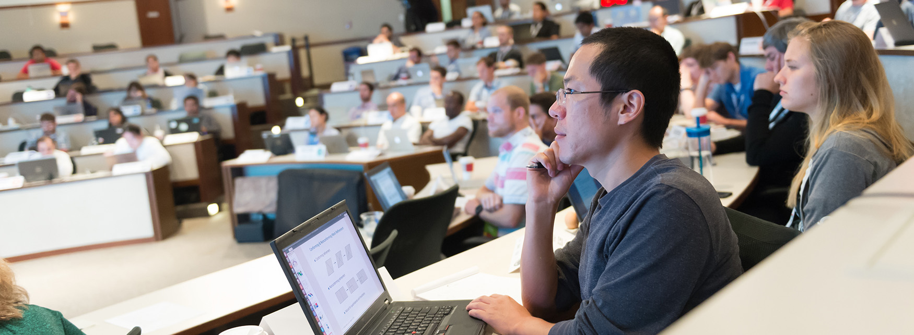

# Preparing the Next Generation of Supercomputer Users

#### Contributed by [Marta Garcia Martinez](https://github.com/martagarciamartinez)

#### Publication date: January 29, 2019

**Hero Image:**
 
- 

High-performance computing (HPC) education is essential to our community. From evolving programming techniques and numerical algorithms to transformations in system architectures and software, the HPC landscape is moving fast as we continue progressing toward the exascale era. But are we ready for it?

## Addressing a gap in professional training
Using supercomputers for computational science and engineering (CSE) research requires expertise that is not always covered by formal education. To address this gap in professional training, we created the [Argonne Training Program on Extreme-Scale Computing (ATPESC)](https://extremecomputingtraining.anl.gov) in 2013. This intensive two-week program focuses on the key skills, approaches, and tools needed to conduct CSE research on today's supercomputers and shares best practices for software sustainability on the extreme-scale systems of the future.

ATPESC participants are provided access to some of today’s most powerful supercomputing resources, including the Argonne Leadership Computing Facility’s systems, the Oak Ridge Leadership Computing Facility’s systems, the National Energy Research Scientific Computing Center’s systems, and leading-edge testbeds from Argonne’s Joint Laboratory for System Evaluation.

While only 70 participants are able to attend ATPESC each year, the entire HPC community can tap into the program’s broad curriculum via the [Argonne YouTube Training Channel](https://www.youtube.com/channel/UCfwgjtIQB3puojz_N9ly_Ag). In an effort to extend the reach of ATPESC beyond the classroom, 2018 program organizers have captured and shared 60 hours of lectures from some of the world’s foremost experts and pioneers in extreme-scale computing. 

ATPESC is funded by the Exascale Computing Project, a collaborative effort of the U.S. Department of Energy Office of Science’s Advanced Scientific Computing Research Program and the National Nuclear Security Administration.

## Apply for this year's training
In the summer of 2019, ATPESC will be back for its seventh year, providing a new group of early career researchers with an opportunity to learn and improve their skills to use extreme-scale computing systems for science. If you or someone you know may be interested in attending, visit the [ATPESC website](https://extremecomputingtraining.anl.gov) for details on the open call for applications. **The deadline to apply is Monday March 4, 2019.**

## Author bio
Dr. Eng. Marta García Martínez joined the Argonne Leadership Computing Facility at [Argonne National Laboratory](https://www.anl.gov) in 2010 to support users and accelerate their research efforts on the facility’s computing resources. She is currently a computational scientist in the [Computational Science Division](https://www.anl.gov/cps) and has served as the program director of the ATPESC since 2015. Born in Calahorra (Spain), she studied mechanical engineering in Spain and carried out her Ph.D. work in fluid dynamics in France. Her research activities focus on computational fluid dynamics, high-performance computing, and training of current and future supercomputer users. 

<!---
Publish: yes
Track: community
RSS update: 2019-01-29
Categories: performance
Topics: high-performance computing (HPC), performance at leadership computing facilities
Tags: bssw-blog-article
Level: 2
Prerequisites: default
Aggregate: none
--->
