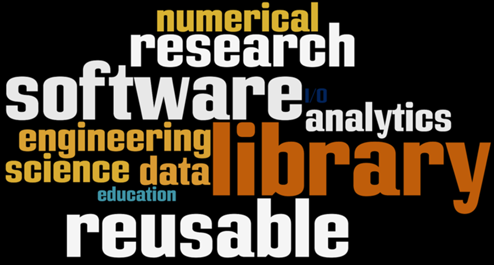

# Call for Papers ... Accelerating Scientific Discovery with Reusable Software
<!---  --->

#### Contributed by [Scott Lathrop](https://github.com/scottlathrop " Scott Lathrop GitHub Profile")

#### Publication date: February 26, 2018

Share your knowledge and perspectives on developing, applying, and promoting reusable research software by submitting an idea for an article for a special issue of IEEE's *Computing in Science and Engineering (CiSE)* that will be published by April of 2019.

### Submit an idea for an article to a special issue of IEEE-CiSE

- Letter of intent to submit (with abstract) deadline: April 2, 2018
- Full paper submission deadline: July 2, 2018
- Publication: March/April 2019
- [https://publications.computer.org/cise/2017/11/13/accelerating-scientific-discovery-reusable-software-call-papers](https://publications.computer.org/cise/2017/11/13/accelerating-scientific-discovery-reusable-software-call-papers)

The goal of this special issue is to promote high-quality reusable research software for advancing computational and data-enabled discovery in all fields. We welcome and encourage submissions from the international community, including application scientists, software developers, and stakeholders.

This special issue of *Computing in Science and Engineering* will examine the state of reusable software, inform the community of the excellent resources available to advance research and education goals, and inform future directions for creating reusable software that is responsive to community needs for advancing discovery.

We are soliciting papers on topics that include, but are not limited to, the state-of-the-art, how reusable software can advance discovery, lessons learned, developing and applying reusable software, efforts in interoperability and community policies, effective methods for addressing user requirements, case studies that can be generalized, and strategies to address emerging technologies including extreme-scale computing. Manuscripts of particular interest will describe efforts that involve collaborations among government, industry, and academia.
 
Please contact the guest editors at <cise2-2019@computer.org> with any questions.

<!---
Publish: Yes
Categories: collaboration
Topics: software publishing and citation, projects and organizations
Tags: bssw-blog-article
Level: 2
Prerequisites: default
Aggregate: none
--->
