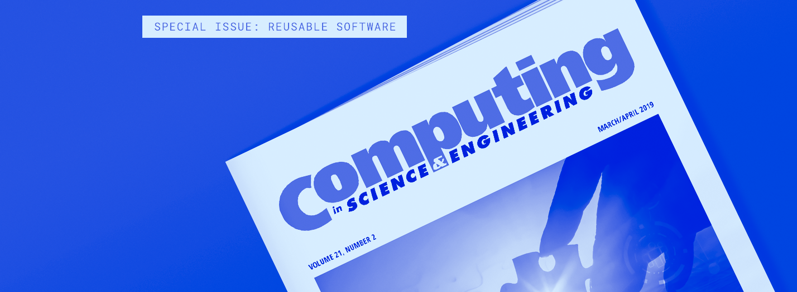

# Accelerating Scientific Discovery with Reusable Software: Special issue of IEEE CiSE    

**Hero Image:**
- 

#### Contributed by [Scott Lathrop](https://github.com/scottlathrop "Scott Lathrop GitHub Profile")

#### Publication date: March 19, 2019

### Is your research code giving you the best "time to science"?

Every field of research is under increasing pressure to publish high-quality, reproducible results more quickly  &mdash; to reduce the “time to science” or, more generally, the "time to scholarship."

We recognize that many research teams lack the resources and expertise to focus on getting the best performance from their software codes on today’s constantly evolving computing environments, adding new complex features to improve their computational methods, or using practices that may simplify and improve their software development and maintenance. And yet, for many years now, many projects  have been aggressively developing high-quality software and documenting their good practices. Research teams that have adopted these highly developed libraries, software modules, and good practices have realized significant improvements. They have enhanced the quality of their research findings, expanded their ability to solve more complex problems, and   published computationally based research more quickly. Their research software can be reused to both verify and validate the research findings, as well as to conduct further research.

### Reusable software

We encourage you to read  the [March/April issue of *IEEE Computing in Science and Engineering*](https://www.computer.org/csdl/magazine/cs/2019/02). This issue includes six papers on “Accelerating Scientific Discovery with Reusable Software.” These papers describe proven strategies for enhancing computational and data analytics research:

* _Community organizations: Changing the culture in which research software is developed and sustained_ (Daniel S. Katz et al.) ... survey of organizational efforts for developing better scientific software
* _The role of scientific communities in creating reusable software: Lessons from geophysics_ (Louise H. Kellogg et al.) ... introduction to the CIG community and best practices for developing reusable software for geophysics
* _A community of practice around peer review for long-term research software sustainability_ (Karthik Ram et al.) ... overview of rOpenSci and best practices for developing software to support reproducible science
* _Developing a computational chemistry framework for the exascale era_ (Ryan M. Richard et al.) ... strategy for designing NWChemEx to enable extreme-scale, collaborative computational chemistry
* _How to professionally develop reusable scientific software – and when not to_ (Carl S. Adorf et al.) ... approach for balancing reusable scientific software development with obtaining rapid scientific results
* _Fostering reuse in scientific computing with embedded components: Application to Bayesian inference for bioinformatics_ (Vincent Lanore) ... component-based programming paradigm for building and using reusable software

### Webinar series related to reusable software

We welcome you to attend the Blue Waters Webinar series, which includes a track on Scientific Software Ecosystems; see https://bluewaters.ncsa.illinois.edu/webinars/software-ecosystems ... The next speaker in the track (March 27) is Ryan Richard, who will discuss the strategy for designing NWChemX.  On May 15, Lorraine Hwang will discuss scientific software communities in geophysics.

We also invite you to attend the [webinar series on Best Practices for HPC Software Developers](https://ideas-productivity.org/resources/series/hpc-best-practices-webinars), presented by the IDEAS Productivity project, in partnership with the Argonne Leadership Computing Facility (ALCF), National Energy Research Scientific Computing Center (NERSC), Oak Ridge Leadership Computing Facility (OLCF), and the DOE Exascale Computing Project (ECP).  

### Get involved!

We encourage you to contribute to accelerating scientific discovery by participating in community efforts such as [Better Scientific Software](https://bssw.io), the UK's [Software Sustainability Institute](https://software.ac.uk), and the [US Research Software Sustainability Institute](http://urssi.us) to enhance the development and applications of reusable software.

### Author bio
[Scott Lathrop](https://github.com/scottlathrop) coordinates the [education, outreach and training activities for the Blue Waters project](https://bluewaters.ncsa.illinois.edu/education-overview). Lathrop has served as a member of the SC Steering Committee and has been the conference chair for the SC’11 and XSEDE14 conferences.  He is a member of ACM and IEEE and an ex officio officer of the [ACM SIGHPC Education Chapter](https://sighpceducation.acm.org). Lathrop has been active in planning  and participating in HPC education and training workshops at numerous conferences, including  ISC, PEARC, and SC.

<!---
- Guidance for author bio:
- Length: 50-100 words.
- Can include hyperlinks.
- Mention your current position, employer, a bit about your background.
- Include info about your interests related to software productivity and sustainability.
- Anything else you want to mention.
---!>

<!---
Publish: yes
Track: community
RSS update: 2019-03-19
Categories: planning, collaboration
Topics: design, projects and organizations
Tags: bssw-blog-article
Level: 2
Prerequisites: default
Aggregate: none
--->
