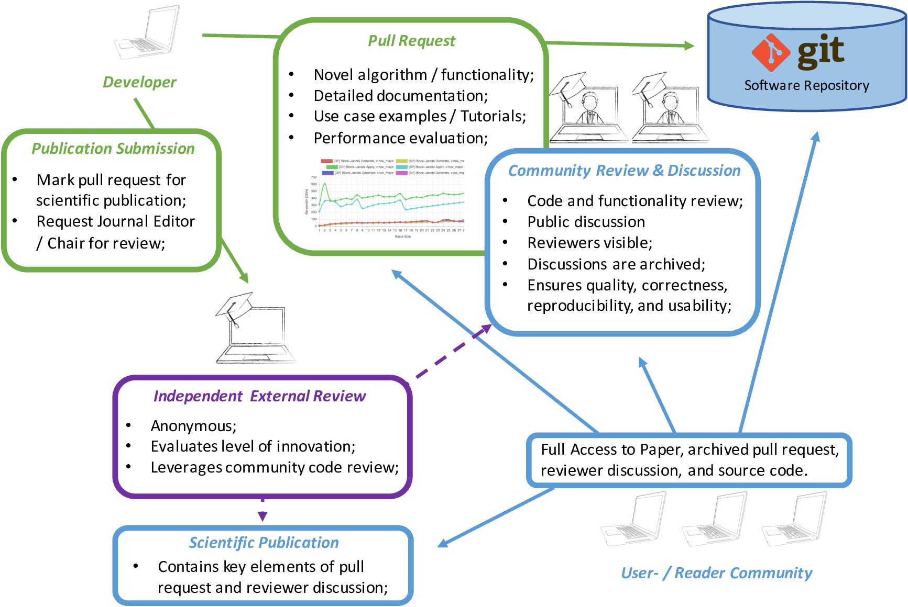

# Accepting High-Quality Software Contributions as Scientific Publications 

#### Contributed by [Hartwig Anzt](https://github.com/hartwiganzt)

#### Publication date: October 15, 2019

As the traditional scientific peer review concept is hitting its capacity limits 
and high-quality software contributions are established as the powertrain behind 
the success of computational science, it is time to change academic publishing.

As in any other research field, academically surviving in the high-performance 
computing (HPC) community generally requires publishing papers---in 
the best case many of them and in high-ranked journals or at top-tier 
conferences.
As a result, the number of scientific papers published each year in this 
(relatively small) community easily outnumbers what a single researcher can 
read. 

Furthermore, many of the proposed strategies, algorithms, and 
hardware-optimized implementations never make it beyond the prototype stage. 
In particular, they often fail to contribute to the 
community's software ecosystems: the publications typically lack the level of 
detail that allows reproducing the technology; and, with prototype 
realizations (at least until recently) often remaining private, the readers are unable to track the code.
In response to this situation, different publication formats now encourage (or 
even require) the release of source code and supporting data. These 
reproducibility efforts (for example, [ACM badging](https://www.acm.org/publications/policies/artifact-review-badging))
provide reviewers access to the raw material and aim at increasing replicability, traceability, and general software quality.
The side benefit is that the community can leverage the novel technology by accessing the sources and re-engineering the algorithms in already existing 
software libraries or simulation codes.

### Community software ecosystems
One might ask, "What about community software projects? Don't they provide high-quality production software?" 
The answer is yes, and no.
A number of established open source software packages do exist that are 
developed as collaborative community efforts to provide domain 
scientists with the technology and the tools to realize scientific simulations. 
These software packages typically feature high standards in terms of software 
quality and software sustainability (e.g., https://xsdk.info), 
and serve as the powertrain 
behind many research achievements and simulation 
codes. 
At the same time, community software packages are dependent on 
high-quality contributions from software developers. And with
scientists responding to the academic pressure to publish scientific papers, 
the software packages often lack the production-ready implementation of 
novel algorithms and hardware-specific efficient implementations. As a result, 
software packages are inclined to also accept contributions that lack the level 
of documentation and code readability that would be preferred for software 
sustainability. 
 

To summarize, the HPC community 

* responds to academic pressure by publishing an increasing number of 
scientific papers (often containing novel algorithms and parallelization 
strategies);

* bears a significant amount of prototype implementations for novel 
algorithm technology in private possession;

* serves domain scientists by providing open source software packages; but

* falls short in releasing novel algorithm technologies as production-ready 
implementations featuring detailed documentation and problem-specific 
efficiency analysis.
 

In a time and field where a high-quality labor pool is a scarce 
resource, this situation is extremely inefficient.
 

### Redefining the concept of publications for computer-based science 
Acknowledging the merits of  traditional metrics such as the H-index and the fact that it 
is not realistic to quickly change the academic system to base the promotion to 
tenure on software quality, 
we argue for a change in <i>what</i> a scientific publication is. 
Traditionally, a scientific publication has been characterized as a self-contained 
monograph describing the researchers' contribution and presenting results. 
The community benefits of this classical publication format are limited, especially 
in comparison with other, more effective technology dissemination systems such as [Git](https://git-scm.com/), 
which are employed by virtually all software community efforts and feature 
powerful 
services that are waiting to be explored by an academic peer review system: 
full 
reproducibility; full traceability of contributions; the archiving of community 
discussions and code reviewer comments; rollback functionality; and full  
accessibility worldwide. 
While it may (for now) be unrealistic to change the 
academic system to consider well-documented software contributions on 
their own as a scientific publication, we can trick the 
system by accepting such software contributions after an additional (independent) review 
as a full-value conference submission that is later included in the 
post-conference proceedings; see Figure 1. 

 

 

[Figure 1. A community-based review concept for scientific publications based on high-qality software contributions.]

 

Obviously, such a process requires not only defining minimum standards on what level of 
innovation and novelty qualifies software development as a conference 
contribution but also deriving guidelines on how such a conference submission 
based on a software contribution has to be designed, the level of algorithm 
and functionality description, and the code quality. 
We argue, however,  that complementing the independent review assessing the 
level of innovation in the software contribution with the technical reviews of 
the community effectively reduces the review workload of the independent 
reviewer (another bottleneck in the current peer review) and ensures a very 
high quality of the submission:

* Full reproducibility and traceability are ensured, since not only reviewers but also the 
complete community can track the software patch.

* The versioning systems keeping track of the authors of each line helps not only to  
identify the main contributors of a software contribution but also to link to 
the right person in case of technical questions.

* Novel algorithms and hardware-optimized implementations are integrated into 
open source software already at the point of publishing the new technology (or 
shortly after).

* The whole community can contribute to the development of a novel algorithm by 
commenting on software contributions---without the individuals losing the 
recognition for the ideas since the comments are publicly available and tracked by 
the collaboration platform.

* Designing software patches as conference contributions naturally implies an 
extremely high level of code documentation and efficiently enables users to 
evaluate (based on the patch and the included efficiency analysis) the 
appropriateness of a software feature for a specific problem.

* Presenting patches at a conference not only makes the whole community 
aware of a new feature but also enables domain scientists to directly approach the 
developers, establish contact, and discuss technical aspects.

* The submission rate will be far lower, and acceptance rate far higher, as each 
submission will most likely pass at least some pre-review process by software 
developers, and the authors of the papers will be forced to produce a higher-quality contribution.
 

### Pioneering the academic community
Arguably, this workflow is not suitable
for all types of conference contributions: one example would be a purely
theoretical exposition of a new algorithm or method that does not yet have a
high-performance implementation. Nevertheless, we want to promote the idea of complementing 
the existing classical publication format with one that is <i>software based</i>. 
Concretely, we plan to initially allow for software-based conference 
contributions in the submission process for the [Scalable Data Analytics in 
Scientific Computing](https://sdascconf.github.io/) (SDASC) workshop, which we will propose in conjunction with [ISC High Performance 2020](https://www.isc-hpc.com/). 
 

We encourage everyone to contribute to the idea, by implementing a 
similar workflow or submitting a software development as a contribution to SDASC 
2020.
 

<!-- Replace using hyperlinked ref format
### References
H. Anzt and G. Flegar: [<i>Are We Doing the Right Thing? - A Critical Analysis of the Academic HPC Community</i>](https://github.com/hartwiganzt/HartwigAnzt.github.io/blob/master/papers/2019_AreWeDoingTheRightThing.pdf), 20th IEEE International Workshop on Parallel and Distributed Scientific and Engineering Computing (PDSEC 2019).

M. Anzt et al.: [<i>Towards a New Peer Review Concept for Scientific Computing ensuring Technical Quality, Software Sustainability, and Result Reproducibility</i>](https://github.com/hartwiganzt/HartwigAnzt.github.io/blob/master/papers/2019_TowardsNewPeerReveiwConcept.pdf), Proceedings in Applied Mathematics and Mechanics, 90th GAMM Annual Meeting, 2019.
-->

### Author bio
[Hartwig Anzt](https://github.com/hartwiganzt) is a Helmholtz Young Investigator Group leader at the Steinbuch Centre for Computing at the Karlsruhe Institute of Technology, Germany. He also holds a research consultant position in the [Innovative Computing Lab](http://www.icl.utk.edu/) at the University of Tennessee, USA. Hartwig has a strong background in numerical mathematics, specializes in iterative methods and preconditioning techniques for the next-generation hardware architectures, and has a long track record of high-quality software development. He is author of the [MAGMA-sparse](http://icl.cs.utk.edu/magma/) open source software package, managing lead and developer of the [Ginkgo project](https://ginkgo-project.github.io/), and part of the ["Production-ready, Exascale-enabled Krylov Solvers for Exascale Computing" (PEEKS)](http://icl.utk.edu/peeks/) effort delivering production-ready numerical linear algebra libraries as part of the [Exascale Computing Project](https://www.exascaleproject.org/). 

 

<!--- MS - These references were in place, but no anchor links were present. Not sure why they are included
[1]: #ref1 "Are we doing the right thing? - A Critical Analysis of the Academic HPC Community"
[2]: #ref2 "Towards a New Peer Review Concept for Scientific Computing ensuring Technical Quality, Software Sustainability, and Result Reproducibility"
---> 

### References

<a href="https://github.com/hartwiganzt/HartwigAnzt.github.io/blob/master/papers/2019_AreWeDoingTheRightThing.pdf">Anzt and Flegar, Are we doing the right thing? - A Critical Analysis of the Academic HPC Community, 20th IEEE International Workshop on Parallel and Distributed Scientific and Engineering Computing (PDSEC 2019)</a>
<a href="https://github.com/hartwiganzt/HartwigAnzt.github.io/blob/master/papers/2019_TowardsNewPeerReveiwConcept.pdf">Anzt et al., Towards a New Peer Review Concept for Scientific Computing ensuring Technical Quality, Software Sustainability, and Result Reproducibility, Proceedings in Applied Mathematics and Mechanics - 90th GAMM Annual Meeting, 2019</a>

<!---
Publish: yes
Track: community
RSS update: 2019-10-15
Topics: Software publishing and citation, peer code review
Pinned: no
--->
