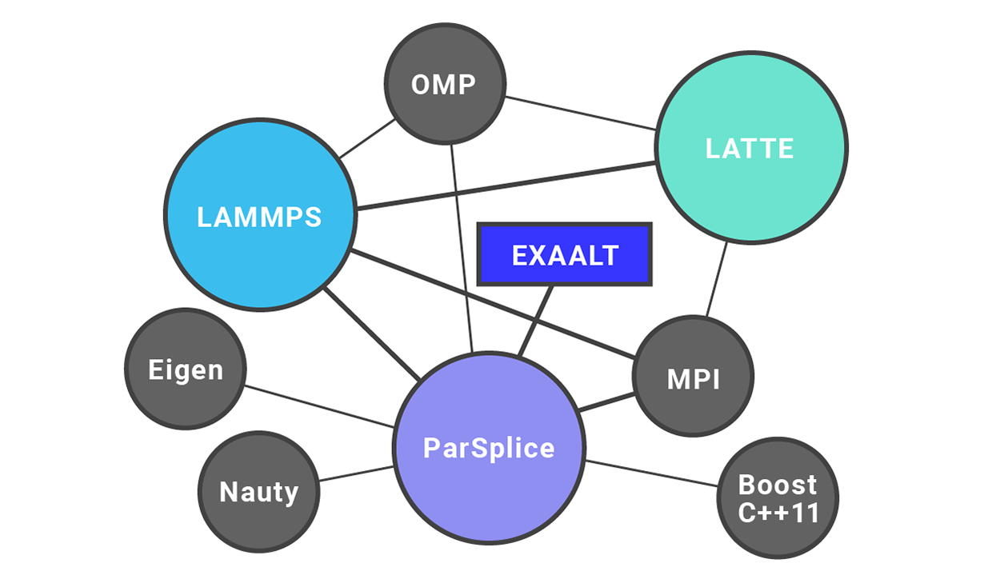
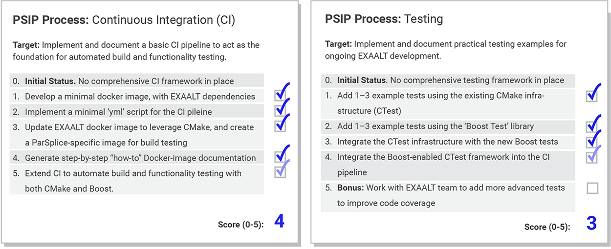

# Adopting Continuous Integration for Long-Timescale Materials Simulation

#### Contributed by [Richard Zamora](https://github.com/rjzamora "Rick Zamora's Github.io Profile")

#### Publication date: September 25, 2018

**Hero Image:**
 
- [

To develop software that can push the limits of accelerated molecular dynamics, the EXAALT team is working with the IDEAS-ECP project to adopt continuous integration practices.

The [Exascale Atomistic capability for Accuracy, Length and Time (EXAALT)](https://www.exascaleproject.org/research-project/exaalt/) is an [ECP](https://www.exascaleproject.org)-funded materials modeling framework designed to leverage extreme-scale parallelism to produce accelerated molecular dynamics simulations.  The end goal is to allow the user to access the most appropriate combination of accuracy, length, and time for the problem at hand, trading the costs of various forms of parallelism.  One application of EXAALT is modeling the surface of a fusion reactor (shown above is the interior of a tokamak at MIT, photograph by Chris Bolin, wikimedia commons).  As shown in Figure 1, EXAALT is actually a collection of multiple packages, each having its own dependencies. At the heart of EXAALT is the Large-scale Atomic/Molecular Massively Parallel Simulator ([LAMMPS](https://lammps.sandia.gov/)), developed at Sandia National Laboratories. However, in order to enable simulations with ab initio accuracy and extended time scales, other critical packages include [LATTE](https://github.com/lanl/LATTE) and [ParSplice](https://gitlab.com/exaalt/parsplice), both developed at Los Alamos National Laboratory (LANL).

 

<!--- Image to illustrate the complexity of EXAALT --->
[Figure 1. Illustration of the EXAALT framework. The three main software components (LAMMPS, LATTE, and ParSplice) are represented as colored circles, while other libraries are represented as grey circles. Lines (graph edges) depict dependencies between the various software components.]

 

### Software Challenges in EXAALT
In 2017, LANL focused its annual [IS&T Co-Design Summer School](http://lanl.github.io/cdss/history.html) program on the topic of accelerated molecular dynamics (AMD).  The idea was to gather a small group of elite graduate students to help optimize the performance of ParSplice, the AMD driver of EXAALT.  During the early weeks of that summer, the developers of ParSplice quickly recognized that their rapidly evolving code had become difficult for the typical (and even advanced) computational scientist to compile and run.  The reason was that the existing build system (or lack thereof) was becoming prohibitively difficult to negotiate.

The summer students overcame their early technical difficulties and accomplished great feats.  However, the experience inspired the EXAALT team to be more proactive about future productivity issues.  That is, the members decided to collaborate closely with members of the [IDEAS-ECP](https://ideas-productivity.org/activities/ideas-ecp/) project, to adopt modern and sustainable software-development practices.  In the short term, this decision meant the implementation of a more user-friendly and portable build system (compared with the manual Makefile-based compilation of several different packages). In the longer term, this meant the development of a continuous-integration (CI) pipeline to first automate build testing and ultimately accelerate all quality-control efforts.  

### Productivity and Sustainability Improvement Planning

The fruitful EXAALT-IDEAS collaboration, which is still ongoing between researchers at LANL and Argonne National Laboratory (ANL), has proven mutually beneficial to both teams: providing EXAALT with technical advice and providing IDEAS with clear insight into the fundamental needs of an ECP application project. To help the IDEAS team map their collaboration efforts onto a manageable set of tasks, the group leveraged the [Productivity and Sustainability Improvement Planning (PSIP)](https://bssw.io/psip) process. For the first stage of the collaboration, the construction of a minimal end-to-end CMake build system, this process was implicitly used for project planning and execution. The work required CMake script/module implementations within all three major framework components (LAMMPS example: [CMakeLists.txt](https://github.com/lammps/lammps/blob/master/cmake/CMakeLists.txt)). For the second (ongoing) stage, PSIP was followed more explicitly by compiling the *planning/tracking cards* shown in Figure 2 (in summarized form).   

 

<!--- Image to show build and test PSIP cards /> --->
[Figure 2. Summarized versions of PSIP process cards used for the EXAALT-IDEAS collaboration.  The specific scores in the figure correspond to the state of the project in mid-July 2018: Boost-enabled tests have been added to the CMake build system, and now the existing Gitlab CI pipeline needs to be modified to leverage the current CMake/CTest capabilities.  Note that some details about dependencies and timeline are excluded from the PSIP cards for clarity.]

 

One significant advantage of the PSIP management approach is that it forces the team to specify the 4-6 steps needed to reach a given goal.  In this case, the process helped formulate the actionable items needed to lay the foundation for CI within the existing EXAALT [software repository](https://gitlab.com/exaalt).  Although PSIP can be used to manage the goals of any software project, the specific details of each step are highly dependent on the project.  For example, different projects will most likely need to work with slightly different technologies to build a practical CI pipeline.  Specific details will depend on where and how the repository is organized, as well as the limitations/capabilities of the existing library dependencies.  For EXAALT, after careful discussion between teams, it was decided that the CI pipeline would need to depend on four key technologies:

- [CMake](https://cmake.org/): To manage the end-to-end compilation and testing execution using CTest
- [Boost](https://www.boost.org/): To implement and organize functionality tests (integration, regression, and unit) inside CTest
- [GitLab CI](https://about.gitlab.com/features/gitlab-ci-cd/): To automatically build and test the software framework (using CMake) to validate new repository commits (usually using docker)
- [Docker](https://www.docker.com/): To generate standard system images (with library dependencies) for use in GitLab CI

As illustrated in Figure 2, most of the work detailed in the PSIP cards was carried out by members of the IDEAS-EXAALT collaboration by the end of July 2018. With that said, the completion of these PSIP cards does not mean that the EXAALT team is finished improving their CI and/or testing infrastructure. Like most aspects of software engineering, PSIP is an iterative process, and the initial plan may need  change if unexpected roadblocks emerge. Whether or not a PSIP card can be followed to completion, documenting, revising, and repeating the process make sense when a natural finishing point is reached.

At this stage, the EXAALT team members have successfully adopted continuous integration and are ready to apply the PSIP process to improve their CI pipeline further.  The plan is to modify the existing infrastructure to interface with ECP-supported facilities (e.g., ALCF and OLCF). They will also expand on the Boost testing suite to tackle a related software development issue: code coverage.

For more resources on PSIP, please refer to the following articles on the BSSw.io site:
- [The BSSw.io PSIP page](https://bssw.io/psip)
- [Planning for Better Software: PSIP Tools](https://bssw.io/items/planning-for-better-software-psip-tools)
- [Lightweight Software Process Improvement using Productivity and Sustainability Improvement Planning (PSIP)](https://bssw.io/items/lightweight-software-process-improvement-using-productivity-and-sustainability-improvement-planning-psip)
- [What makes PSIP suitable for the Exascale Computing Project?](https://bssw.io/items/what-makes-psip-suitable-for-the-exascale-computing-project)
- [FLASH5 Refactoring and PSIP](https://bssw.io/blog_posts/flash5-refactoring-and-psip)

### Author Bio
Richard Zamora is an assistant computer scientist in the [ALCF](https://www.alcf.anl.gov/) Data Science group at Argonne National Laboratory.  His research focuses on the development and optimization of parallel software for high-performance computing and machine learning. Before joining Argonne, Richard worked in the Theoretical Division at Los Alamos National Laboratory, where he was heavily involved in the design and application of accelerated molecular dynamics algorithms. While working on the EXAALT package at LANL, he helped manage the official software repository, and he has since taken a special interest in sustainable and productive development practices. 

<!---
Publish: yes
Track: deep dive
RSS update: 2018-09-25
Categories: planning, reliability
Topics: software process improvement, testing, continuous integration testing
Tags: bssw-blog-article
Level: 2
Prerequisites: default
Aggregate: none
--->
