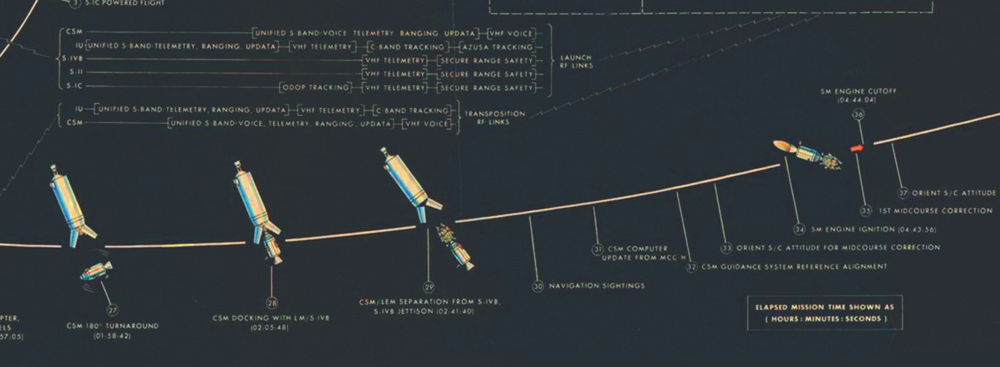
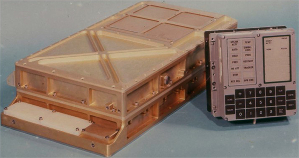
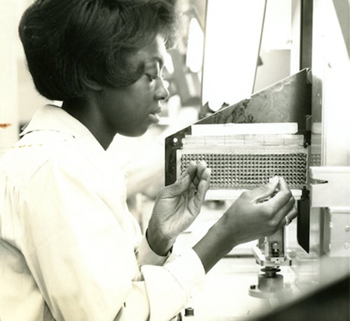
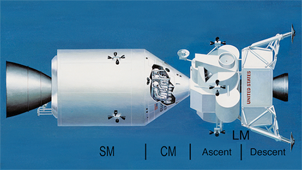

# Celebrating Apollo's 50th Anniversary: When 100 FLOPS/Watt Was a Giant Leap

**Hero Image:**

- [Image Source: NASA (see below)]

#### Contributed by [Mark C. Miller](https://github.com/markcmiller86)
#### Publication date: May 15, 2019

*First of a three-part series to commemorate the 50th anniversary of the Moon landings.*

 

This year, July 20 will mark the 50th anniversary of the 1969 Apollo 11 Moon
landing.[1],[2] Between 1958 and 1965, both Russian and American space
programs attempted a total of over 36 unmanned Moon missions.[3]
Of the 6 that succeeded, none were survivable soft landings. Just crashing into
the Moon proved exceedingly difficult. Developing a guidance, navigation, and
control (GNC) system for manned Apollo missions[4],[9] was an
enormous challenge. At its heart was a revolutionary new computer: the Apollo
Guidance Computer (AGC).[5],[6],[7]

In commemoration of that historical achievement, this is the first of three
articles about the AGC. Part 1 describes the hardware.
[Part 2](https://bssw.io/blog_posts/celebrating-apollo-s-50th-anniversary-the-oldest-code-on-github)
describes
the software and [part 3](https://bssw.io/blog_posts/celebrating-apollo-s-50th-anniversary-users-stories-from-space) its application in Moon missions. In the years since its
development, jargon may have changed, but the HPC community will recognize
many common themes such as flops/watt power constraints, checkpoint and restart
strategies, and the need for performance portability.

### The AGC architecture: A giant leap in FLOPSa per W, Kg, m3 

Apollo needed a computer orders of magnitude better than those typical of the
era:[36] lower power, lighter weight, smaller size, greater reliability,
and able to operate in the extreme environmental conditions of space flight.
In mid-1961, NASA accorded MIT/Draper Labs “sole source” status to design the AGC
and soon after selected Raytheon to manufacture it.[7] Both organizations
had been involved in development of the Polaris missile GNC system.[17]

  

[The AGC (left) with its Display and Keyboard Interface (DSKY - right). Image Source: NASA]

  

The AGC was the first computer to use integrated circuits. It was constructed
entirely from dual-packaged, 3-input NOR gate flat-packs produced by Fairchild
Semiconductor[18] in an area that would eventually become known as
Silicon Valley.[25],[26] At its peak, the effort consumed over 60%
of all integrated circuits produced in the country. The AGC used a total of 5,600 NOR gates,
operated at 1.024 MHz with a 16-bit word, and had 34 basic instructions each
micro-coded into a 12-step sequence. It had 4 central registers plus 15
special-purpose registers.[16] The table below compares key AGC
performance metrics with an early model of the IBM 360. Both systems were
released in 1966, the same year initial designs of the first massively parallel
computer, ILLIAC IV,[22] were completed. Costing nearly $5 billion
to develop, 20% of the entire Apollo budget, IBM's System 360 was a big gamble
and even bigger success.[30] In the table below, we also include a
row for comparison with IBM’s newest AC922[27] based systems
(Summit[20] / Sierra[24]).

  

System | Kb | Flops (F) | (Watts) F/W | (Kg) F/Kg | (m3) F/m3
:--- | :---: | :---: | :---: | :---: | :---:
AGC Block II[12] | 76 | 14,245 | (55) 259.0 | (32) 445 | (00.03) 50000
IBM 360-20[10],[11] | 32 | 3,011 | (5000) 0.6 | (600) 5 | (30.00) 100
IBM AC922 (Summit[20],[21],[24]) | 1E12 | 14E16 | (97E5) 14E9  | (31E4) 45E10  | (930) 15E13

aFlop = single-precision multiply + add

### Rope core: A new type of nonvolatile memory

The AGC utilized two types of *core* memory[14]: erasable memory
(2K words) using coincident current cores and fixed (read-only) memory (36K words)
using rope cores,[15],[29] technology specifically designed for and unique to the
AGC. Both were nonvolatile, providing extra protection against data loss during
faults. The advantages of rope core were superlative robustness and
significantly higher density because a single core was used to store
24 bits.[5] On the other hand, rope core took weeks of painstaking
labor to hand-weave[13] thin wires through (logical ‘1’) or around
(logical ‘0’) arrays of cores. Bugs were costly to correct and often were just
worked around with additional steps in astronaut checklists or even by revising
mission parameters. Unable to fully automate this crucial manufacturing step,
Raytheon instead hired an army of experienced textile workers from the New
England area, all women. Remarkably, weaving and its place in computing date
back more than 150 years *earlier* to the Jacquard loom.[23],[28]
Present day operating system terms such as *core dump* or *core image* are
derived from this early memory technology.

  

[A worker weaves copper wires through an array of cores for the AGC (Photo courtesy of Raytheon Company)]

### The Executive: An operating system with checkpoint/restart services
The AGC used a priority-driven, collaborative, multitasking operating system
called the *Executive*.[5] Priority-based job scheduling was
revolutionary for its time. The Executive could detect a variety of hardware
and software faults and had restart utilities to recover. But, only the most
critical programs were restart protected.[19] This involved careful
design with periodic updates of *waypoints* (redundant copies of essential state
throughout program execution). Restart support consumed resources and
complicated testing. In 1968, an internal NASA report[19] raised
significant doubts about its value. In Part 3 of this series, we’ll describe why
it would later be proven invaluable during the Apollo 11 landing.

### The Interpreter: A domain-specific language
The Executive and other system functions were all implemented in AGC native
assembly code[31]. However, solving complex, 3D spatial navigation
problems with this simple instruction set was tedious, error prone, and memory
consuming. Early on, engineers designed a higher-level language, called the
*Interpreter*,[5] to support the complex software required for GNC
operations. Operands were scalar, vector, and matrix data types in single,
double, and even triple precision. Instructions included vector and matrix
arithmetic functions, transcendental functions, float normalization functions
and other miscellaneous control-flow functions. Similar to p-code,[33]
it was still a form of assembly language. But, it operated at a much higher
level of abstraction—easing development, improving overall reliability and,
most importantly, reducing memory usage.

### Multiple spacecraft configurations: A performance portability challenge
Apollo wasn't just a single spacecraft. It was two: the Command and Service
Module (CSM) and the Lunar Module (LM). Each had its own AGC and was further
divided into two stages. Depending on the phase of a mission[1],
the vehicles were joined together in various configurations with dramatically
different operating characteristics. Developing a single program, the Digital
Auto Pilot (DAP),[8] to provide effective GNC for any configuration,
even off-nominal cases, presented what amounts to a significant performance
portability problem. In Part 2 of this series we'll discuss how software
developers met this challenge.

  

[Early NASA artist's rendition of Apollo Spacecraft. Command and Service Module (left) Lunar Module Ascent and Descent Stages (right)]

 

### MTBF of 40,000 hours: Extreme computing reliability
The AGC may not have been extreme in scale, but it was extreme in reliability.
Of the 42 Block II systems delivered and an aggregate of 11,000 hours of
vibration exposure and thermal cycling plus 32,500 hours of normal operation,
only 4 hardware faults were observed,[12] none of which occurred in
actual Moon missions. A conservative estimate of the mean time between failures (MTBF) of the AGC was later
calculated to be over 40,000 hours, more than an order of magnitude better than
machines typical of that era. Little did AGC hardware engineers know that writing
the software would present even greater challenges, ultimately becoming the
rate-determining factor in delivering flight-ready units.

Because autonomous guidance was so critical for Apollo, NASA funded the development of
this revolutionary new computer to support it.[34],[35] Half a century
later, because self-driving is so critical in the auto industry, Tesla has
developed their own custom, proprietary AI chip to support it.[32]

---

Part 1 | [Part 2](https://bssw.io/blog_posts/celebrating-apollo-s-50th-anniversary-the-oldest-code-on-github) | [Part 3](https://bssw.io/blog_posts/celebrating-apollo-s-50th-anniversary-users-stories-from-space)

 

### Author bio

Mark Miller is a computer scientist supporting the
[WSC](https://wci.llnl.gov/about-us/weapon-simulation-and-computing)
program at [LLNL](https://www.llnl.gov) since 1995.
Among other things, he contributes to
[VisIt](https://wci.llnl.gov/simulation/computer-codes/visit),
[Silo](https://wci.llnl.gov/simulation/computer-codes/silo),
[HDF5](https://www.hdfgroup.org) and
[IDEAS-ECP](https://ideas-productivity.org/ideas-ecp/).

<!---
Image copyright source info…
  Two are public domain...
      * https://commons.wikimedia.org/wiki/File:NASA_spacecraft_comparison.jpg
      * https://en.wikipedia.org/wiki/Apollo_Guidance_Computer#/media/File:Agc_view.jpg
  The Raytheon image I received approval email from Raytheon customer relations
--->

<!---
Publish: yes
RSS update: 2019-05-15
Categories: performance
Topics: high-performance computing (hpc), performance portability
Tags: bssw-blog-article
Level: 2
Prerequisites: default
Aggregate: none
--->

 

[1-sfer-ezikiw]: https://github.com/betterscientificsoftware/images/raw/master/397_apollo_flightdiagram.jpg "Apollo flight plan diagram created by NASA in 1967 to illustrate the flight path and key mission events for the upcoming Apollo missions to the Moon. To allow our readers to explore the image in more detail we include a link to the full-res image here."
[2-sfer-ezikiw]: https://www.nasa.gov/mission_pages/apollo/missions/apollo11.html "Overview of Apollo 11 Mission"
[3-sfer-ezikiw]: https://en.wikipedia.org/wiki/Moon_landing "List of Moon missions since 1958"
[4-sfer-ezikiw]: https://en.wikipedia.org/wiki/Apollo_PGNCS "What is Primary Guidance, Navigation and Control"
[5-sfer-ezikiw]: ftp://ssh.esac.esa.int/pub/ekuulker/Apollo15/The-Apollo-Guidance-Computer-Architecture-and-Operation.pdf "Whole book: 'Apollo Guidance Computer Architecture and Operation'"
[6-sfer-ezikiw]: https://en.wikipedia.org/wiki/Apollo_Guidance_Computer "Overview of AGC Architecture"
[7-sfer-ezikiw]: https://youtu.be/YIBhPsyYCiM "YouTube Video of Rope Core Manufacture"
[8-sfer-ezikiw]: https://pdfs.semanticscholar.org/0d44/2a1b41da2ccbffeda8aa2e1a7c2417ac71e0.pdf "Computer-Controlled Steering of the Apollo Spacecraft {Martin FH, Battin RH. 1968. Computer-Controlled Steering of the Apollo Spacecraft. J Spacecraft. 5(4):400-7}"
[9-sfer-ezikiw]: https://www.ibiblio.org/apollo/hrst/archive/1713.pdf "MIT Technical Report on Apollo Guidance and Navigation"
[10-sfer-ezikiw]: https://en.wikipedia.org/wiki/IBM_System/360_Model_20 "IBM 360/20 Specs"
[11-sfer-ezikiw]: http://www.bitsavers.org/pdf/ibm/360/fe/GC22-6820-12_System_360_Installation_Manual_Physical_Planning.pdf "IBM 360 Detailed Installation Manual"
[12-sfer-ezikiw]: https://www.ibiblio.org/apollo/klabs/history/history_docs/r713.pdf "Reliability History of the AGC"
[13-sfer-ezikiw]: https://youtu.be/P12r8DKHsak "Weaving Rope Core Memory"
[14-sfer-ezikiw]: https://en.wikipedia.org/wiki/Magnetic-core_memory "Description of Core Memory"
[15-sfer-ezikiw]: https://en.wikipedia.org/wiki/Core_rope_memory "Description of Rope Core Memory"
[16-sfer-ezikiw]: https://youtu.be/xx7Lfh5SKUQ "Amazingly Detailed Presentation on Architecture and Operation of the AGC"
[17-sfer-ezikiw]: https://www.computerhistory.org/revolution/real-time-computing/6/128/529 "Polaris Guidance System"
[18-sfer-ezikiw]: https://en.wikipedia.org/wiki/Fairchild_Semiconductor "Historical Note about Fairchild Semiconductor"
[19-sfer-ezikiw]: https://www.ibiblio.org/apollo/hrst/archive/1033.pdf "AGC Restart System Design"
[20-sfer-ezikiw]: https://www.ornl.gov/news/ornl-launches-summit-supercomputer "ORNL Launch of Summit"
[21-sfer-ezikiw]: https://www.top500.org/green500/list/2018/11/ "Top Green 500 List, November 2018"
[22-sfer-ezikiw]: https://en.wikipedia.org/wiki/ILLIAC_IV "Description of Illiac IV"
[23-sfer-ezikiw]: https://en.wikipedia.org/wiki/Jacquard_loom#Importance_in_computing "Jacquard Loom & Computing"
[24-sfer-ezikiw]: https://hpc.llnl.gov/hardware/platforms/sierra "LLNL Description of Sierra"
[25-sfer-ezikiw]: https://www.computerworld.com/article/2525898/app-development/nasa-s-apollo-technology-has-changed-history.html "Historical Impact of AGC on Computing Technology"
[26-sfer-ezikiw]: https://airandspace.si.edu/stories/editorial/apollo-guidance-computer-and-first-silicon-chips "Historical Impact of AGC on Chip Manufacture"
[27-sfer-ezikiw]: https://www.ibm.com/us-en/marketplace/power-systems-ac922 "Description of IBM AC922 Systems"
[28-sfer-ezikiw]: http://www.computersciencelab.com/ComputerHistory/History.htm "Illustrated History of Computers"
[29-sfer-ezikiw]: https://youtu.be/P12r8DKHsak?t=35 "Rope Memory Description"
[30-sfer-ezikiw]: https://www.telegraph.co.uk/technology/news/10719418/IBMs-5bn-gamble-revolutionary-computer-turns-50.html "IBM $5B Gamble with System 360"
[31-sfer-ezikiw]: https://www.ibiblio.org/apollo/assembly_language_manual.html "AGC Assembly Language Manual"
[32-sfer-ezikiw]: https://www.theverge.com/2019/4/22/18511594/tesla-new-self-driving-chip-is-here-and-this-is-your-best-look-yet "Tesla's new AI Chip"
[33-sfer-ezikiw]: https://en.wikipedia.org/wiki/P-code_machine "Example of a P-code language"
[34-sfer-ezikiw]: https://history.nasa.gov/computers/Part1.html "NASA archive on Computers in Spaceflight"
[35-sfer-ezikiw]: https://history.nasa.gov/computers/Ch2-1.html "The need for an on-board computer"
[36-sfer-ezikiw]: https://www.computerhistory.org/timeline/ "Computer History Timeline"
<!-- DO NOT EDIT BELOW HERE. THIS IS ALL AUTO-GENERATED (sfer-ezikiw) -->
[1]: #sfer-ezikiw-1 "Apollo flight plan diagram created by NASA in 1967 to illustrate the flight path and key mission events for the upcoming Apollo missions to the Moon. To allow our readers to explore the image in more detail we include a link to the full-res image here."
[2]: #sfer-ezikiw-2 "Overview of Apollo 11 Mission"
[3]: #sfer-ezikiw-3 "List of Moon missions since 1958"
[4]: #sfer-ezikiw-4 "What is Primary Guidance, Navigation and Control"
[5]: #sfer-ezikiw-5 "Whole book: 'Apollo Guidance Computer Architecture and Operation'"
[6]: #sfer-ezikiw-6 "Overview of AGC Architecture"
[7]: #sfer-ezikiw-7 "YouTube Video of Rope Core Manufacture"
[8]: #sfer-ezikiw-8 "Computer-Controlled Steering of the Apollo Spacecraft"
[9]: #sfer-ezikiw-9 "MIT Technical Report on Apollo Guidance and Navigation"
[10]: #sfer-ezikiw-10 "IBM 360/20 Specs"
[11]: #sfer-ezikiw-11 "IBM 360 Detailed Installation Manual"
[12]: #sfer-ezikiw-12 "Reliability History of the AGC"
[13]: #sfer-ezikiw-13 "Weaving Rope Core Memory"
[14]: #sfer-ezikiw-14 "Description of Core Memory"
[15]: #sfer-ezikiw-15 "Description of Rope Core Memory"
[16]: #sfer-ezikiw-16 "Amazingly Detailed Presentation on Architecture and Operation of the AGC"
[17]: #sfer-ezikiw-17 "Polaris Guidance System"
[18]: #sfer-ezikiw-18 "Historical Note about Fairchild Semiconductor"
[19]: #sfer-ezikiw-19 "AGC Restart System Design"
[20]: #sfer-ezikiw-20 "ORNL Launch of Summit"
[21]: #sfer-ezikiw-21 "Top Green 500 List, November 2018"
[22]: #sfer-ezikiw-22 "Description of Illiac IV"
[23]: #sfer-ezikiw-23 "Jacquard Loom & Computing"
[24]: #sfer-ezikiw-24 "LLNL Description of Sierra"
[25]: #sfer-ezikiw-25 "Historical Impact of AGC on Computing Technology"
[26]: #sfer-ezikiw-26 "Historical Impact of AGC on Chip Manufacture"
[27]: #sfer-ezikiw-27 "Description of IBM AC922 Systems"
[28]: #sfer-ezikiw-28 "Illustrated History of Computers"
[29]: #sfer-ezikiw-29 "Rope Memory Description"
[30]: #sfer-ezikiw-30 "IBM $5B Gamble with System 360"
[31]: #sfer-ezikiw-31 "AGC Assembly Language Manual"
[32]: #sfer-ezikiw-32 "Tesla's new AI Chip"
[33]: #sfer-ezikiw-33 "Example of a P-code language"
[34]: #sfer-ezikiw-34 "NASA archive on Computers in Spaceflight"
[35]: #sfer-ezikiw-35 "The need for an on-board computer"
[36]: #sfer-ezikiw-36 "Computer History Timeline"
### References <!-- (sfer-ezikiw) -->
* 1[Apollo flight plan diagram created by NASA in 1967 to illustrate the flight path and key mission events for the upcoming Apollo missions to the Moon. To allow our readers to explore the image in more detail we include a link to the full-res image here.](https://github.com/betterscientificsoftware/images/raw/master/397_apollo_flightdiagram.jpg)
* 2[Overview of Apollo 11 Mission](https://www.nasa.gov/mission_pages/apollo/missions/apollo11.html)
* 3[List of Moon missions since 1958](https://en.wikipedia.org/wiki/Moon_landing)
* 4[What is Primary Guidance, Navigation and Control](https://en.wikipedia.org/wiki/Apollo_PGNCS)
* 5[Whole book: 'Apollo Guidance Computer Architecture and Operation'](ftp://ssh.esac.esa.int/pub/ekuulker/Apollo15/The-Apollo-Guidance-Computer-Architecture-and-Operation.pdf)
* 6[Overview of AGC Architecture](https://en.wikipedia.org/wiki/Apollo_Guidance_Computer)
* 7[YouTube Video of Rope Core Manufacture](https://youtu.be/YIBhPsyYCiM)
* 8[Computer-Controlled Steering of the Apollo Spacecraft Martin FH, Battin RH. 1968. Computer-Controlled Steering of the Apollo Spacecraft. J Spacecraft. 5(4):400-7](https://pdfs.semanticscholar.org/0d44/2a1b41da2ccbffeda8aa2e1a7c2417ac71e0.pdf)
* 9[MIT Technical Report on Apollo Guidance and Navigation](https://www.ibiblio.org/apollo/hrst/archive/1713.pdf)
* 10[IBM 360/20 Specs](https://en.wikipedia.org/wiki/IBM_System/360_Model_20)
* 11[IBM 360 Detailed Installation Manual](http://www.bitsavers.org/pdf/ibm/360/fe/GC22-6820-12_System_360_Installation_Manual_Physical_Planning.pdf)
* 12[Reliability History of the AGC](https://www.ibiblio.org/apollo/klabs/history/history_docs/r713.pdf)
* 13[Weaving Rope Core Memory](https://youtu.be/P12r8DKHsak)
* 14[Description of Core Memory](https://en.wikipedia.org/wiki/Magnetic-core_memory)
* 15[Description of Rope Core Memory](https://en.wikipedia.org/wiki/Core_rope_memory)
* 16[Amazingly Detailed Presentation on Architecture and Operation of the AGC](https://youtu.be/xx7Lfh5SKUQ)
* 17[Polaris Guidance System](https://www.computerhistory.org/revolution/real-time-computing/6/128/529)
* 18[Historical Note about Fairchild Semiconductor](https://en.wikipedia.org/wiki/Fairchild_Semiconductor)
* 19[AGC Restart System Design](https://www.ibiblio.org/apollo/hrst/archive/1033.pdf)
* 20[ORNL Launch of Summit](https://www.ornl.gov/news/ornl-launches-summit-supercomputer)
* 21[Top Green 500 List, November 2018](https://www.top500.org/green500/list/2018/11/)
* 22[Description of Illiac IV](https://en.wikipedia.org/wiki/ILLIAC_IV)
* 23[Jacquard Loom & Computing](https://en.wikipedia.org/wiki/Jacquard_loom#Importance_in_computing)
* 24[LLNL Description of Sierra](https://hpc.llnl.gov/hardware/platforms/sierra)
* 25[Historical Impact of AGC on Computing Technology](https://www.computerworld.com/article/2525898/app-development/nasa-s-apollo-technology-has-changed-history.html)
* 26[Historical Impact of AGC on Chip Manufacture](https://airandspace.si.edu/stories/editorial/apollo-guidance-computer-and-first-silicon-chips)
* 27[Description of IBM AC922 Systems](https://www.ibm.com/us-en/marketplace/power-systems-ac922)
* 28[Illustrated History of Computers](http://www.computersciencelab.com/ComputerHistory/History.htm)
* 29[Rope Memory Description](https://youtu.be/P12r8DKHsak?t=35)
* 30[IBM $5B Gamble with System 360](https://www.telegraph.co.uk/technology/news/10719418/IBMs-5bn-gamble-revolutionary-computer-turns-50.html)
* 31[AGC Assembly Language Manual](https://www.ibiblio.org/apollo/assembly_language_manual.html)
* 32[Tesla's new AI Chip](https://www.theverge.com/2019/4/22/18511594/tesla-new-self-driving-chip-is-here-and-this-is-your-best-look-yet)
* 33[Example of a P-code language](https://en.wikipedia.org/wiki/P-code_machine)
* 34[NASA archive on Computers in Spaceflight](https://history.nasa.gov/computers/Part1.html)
* 35[The need for an on-board computer](https://history.nasa.gov/computers/Ch2-1.html)
* 36[Computer History Timeline](https://www.computerhistory.org/timeline/)
