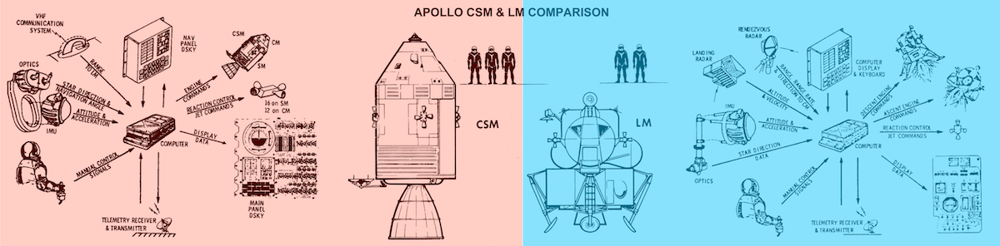
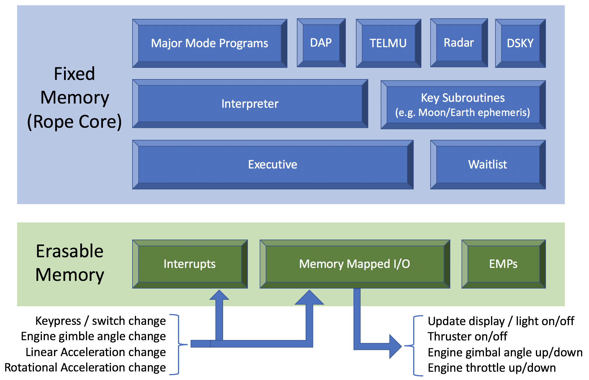
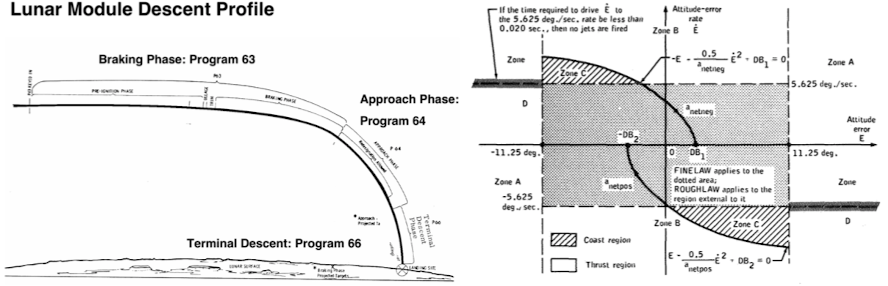
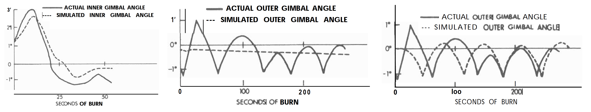
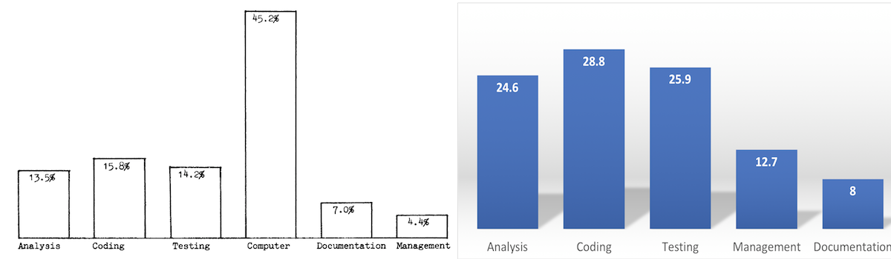

<!--- WARNING: Auto-generated with wikize-refs.py from ApolloGuidanceComputerPart2.md --->
# Celebrating Apollo's 50th Anniversary: The Oldest Code on GitHub

**Hero Image:**

#### Contributed by [Mark C. Miller](https://github.com/markcmiller86)
#### Publication date: June, 2019

*Second of a three-part series to commemorate the 50th anniversary of the Moon landings.*

Retro-computing enthusiasts recently uploaded Apollo Guidance Computer (AGC)
source code for various Apollo missions to GitHub. There is even a *Virtual AGC*
that can run this code.[5] In all likelihood, it is the oldest *active* code on
GitHub. Remarkably, its development began over half a century ago in the ashes
of Mariner 1, a Venus probe destroyed shortly after launch due to a bug in its
guidance software.[13],[34] The prevailing explanation was that in the
transcription of hand-written guidance equations into a software specification
for the contractor, TRW, an over-bar to indicate the use of *average* rather than
*instantaneous* velocity went missing; along with it, an $18M
probe ($152M in 2019 dollars) and a regrettable ration of American prestige.
How would MIT and NASA avoid similar mistakes developing software for the AGC?

This is the second of three articles about the AGC. In part 1, we described the
hardware.[18] Here, in part 2, we focus on MIT's effort to develop
the software.[3],[10],[35]
As in part 1, the scientific computing community will recognize
some familiar themes such as the benefits and challenges of *co-design*, the importance of
sufficient testing resources, the role and impact of software process
improvements and more.

### Extreme Co-design
Initially, about all that was known with any certainty was that a digital
computer would be the centerpiece of a complex collection of GN&C sub-systems.
A year would pass before NASA selected the Lunar Orbit
Rendezvous[36] (LOR) mission plan involving two separate
and substantially different vehicles each with its own AGC.
AGC software would control everything. Even so called *manually controlled* inputs would first
pass through AGC software before affecting the relevant hardware. 

A challenge in developing the software is that all the GN&C sub-systems
pictured above were under development *simultaneously*
right along with the software itself. Their interfaces, performance
characteristics, size, weight and position within the spacecraft, all of
which effect key parameters in guidance equations were constantly evolving.

Another challenge was testing the software's
ability to interact with all these sub-systems
without actually flying the vehicle?
Ultimately, several different test simulators would be developed.
Again, these testing resources were being developed right along with
the software it was intended to test. Even techniques to manage the
software effort were effectively under development and evolving with the
software. Eventually, NASA would pressure MIT to adopt techniques pioneered
by IBM to help manage large software development projects.

Today, we would call all of this simultaneous development activity
*co-design*[6],[7],[22] and it has a lot of advantages.
But, in the 1960's where there were no DevOps[37] best practices and collaborative tools
like GitLab, Jenkins, Confluence, Kanban, WebEx, or even Email, it presented a massive
coordination and management challenge.

### Evolving requirements, versions and flight rope releases
Early on, NASA's expectations for what functions
the GN&C system would perform, and therefore the AGC software, continued to evolve
motivated by such needs to reduce weight, increase safety margins, improve mission
flexibility and optimize propellant usage.

> NASA had established a need for the machine and had determined its general tasks, and
> MIT received a contract based on only a short, very general requirements statement.
> Requirements started changing immediately and continued to change throughout the program.[38]

Midway through development, the AGC was re-designed to support more memory and an expanded
instruction set. Software developers had to support both.
They were different enough that each required separate software development teams
which only worsened already strained resources.
The re-designed AGC had only 2K words of *erasable* core and 36K words of *fixed*
or *rope core* memory. All software and data had to fit into this combined 76KB of memory.

**The essential step for software developers was to produce a *flight program* or *rope*
and release it to Raytheon for rope core manufacture approximately 4 months prior to launch;
2 months to manufacture the ropes followed by 2 months for installation in the spacecraft,
checkout, integrated system testing, crew rehearsals and final erasable memory load.**

MIT needed to deliver flight programs for ~30 Apollo flights (crewed and uncrewed),
many with unique guidance requirements, planned between 1966 and 1972.[39]
The lead engineer in coordinating and approving a completed flight program was
called a *rope mother* and would also name the release. Early on the names were fairly
creative including **ECLIPSE**, **SUNRISE**, **RETREAD** and **AURORA**. Eventually,
NASA put a stop to this and only the names **COLOSSUS** and **LUMINARY** together
with their revision numbers would be used to identify CM and LM flight programs
respectively.[23] **LUMINARY 1A** is the revision used in the first lunar
landing of Apollo 11.

### The AGC software stack
Each flight program involved a combination of common utilities and mission specific
space guidance subroutines. Mission specific components required significant
analysis and development time. Early development activity, 1961-1965, focused on
infrastructural software.

**Program Name** | **Purpose** | **Size (AGC words)**
:--- | :--- | ---:
Executive[24] | Priority driven large/long-running process manager | ~350
Waitlist[25] | Time sequenced small/short-running process manager | ~300
Down-Telemetry[28] | Transmit system data to ground | ~200
Restart[29],[30],[31] | Error recovery and restart protection | ~1225
Interpreter[26] | Space guidance domain specific programming language interpreter | ~2200
DSKY I/O[27] | Cockpit Displays and Keypad | ~3500
**Combined Total** | 22% of fixed memory | **~7775**

These programs comprised what we might call today the *Apollo Guidance Software Stack*.
All were implemented in assembly language. By 1965, most of this code had been
written and fully tested and changed little with each new flight program. All
higher level space guidance routines were implemented using some of these pieces.

An example of a space guidance subroutine is computing the relative positions of Earth,
Sun and Moon at any moment. After evaluating options[33] in MAC Fortran on 
mainframe systems, developers settled on an approach using 8th degree polynomial fits to
time-varying positional data predicted from mainframe solution of the 3-body (Earth, Sun, Moon)
problem. Eight, double precision, X, Y and Z polynomial coefficients, 48 words of data,
fitting a 2-week period of Moon position data would
then be stored in fixed memory. Another example is a list of stars,
and spatial positions used with the Apollo space sextant[32]
requiring 112 words.[40] This data
and code would be among the 76 kilobytes of a flight program
hand woven into rope core in the months before launch. For time sensitive data,
multiple ropes for different launch windows would be manufactured as contingencies.
A 1962 memo[17] lists 45 major software analysis efforts then
underway for various aspects of planned Apollo missions.

### There's AGC app for that
Flying to the moon and returning safely involved *long periods of boredom
punctuated by moments of extreme peril*. A mission was divided into phases by
*velocity change maneuvers* or *burns* of the main engines. A complete mission
involved around 11 main engine burns. For each maneuver,
there was a corresponding program, called a *major mode program*, to handle it.
For every phase of the mission, *there was an app for that*.

By far the most critical sequence of maneuvers occurred during lunar landing.
It was divided into 4 phases (pictured below left) depending on the amount and type of
control the pilot required; Powered Descent (major mode P63), Approach (P64),
Terminal Descent (P66), and Touchdown (P68). That was for a *normal* landing.
In addition, the software needed to be prepared to handle a variety of abort
contingencies depending upon which phase in the landing abort might be required.

Development of a major mode program began with an analysis of the equations
of motion governing the particular phase of the mission, an assessment of
computational approaches utilizing available sensors, controls and engines
to affect the desired velocity change (magnitude and direction) yet subject
to a variety of constraints. For any particular maneuver, factors impacting
algorithm design were considerable. They included zero gravity fuel slosh,
changing center of mass due to fuel consumption, vehicle structural bending
modes, main engine throttle and gimbal characteristics, sensor drift and
deadbands (e.g. IMU gimbal lock), sensor measurement biases and uncertainties,
optimizing use of RCS propellants, contingency logic for failed (on or off)
RCS thrusters, minimizing RCS jet thrust durations in certain directions that
impinge on spacecraft skin or direct exhaust debris at windows or sensitive
equipment, positions of Sun, Earth and Moon (all in constant motion) as well
as their *lumpy*[1],[2] gravity fields, and precise timing of events
coordinated with lines of sight to ground communication stations.

Digital Autopilot (DAP) software was developed based on *Kalman Filtering*,[41]
The computation is decomposed into a *prediction* phase where an idealized model
of the spacecraft is used to estimate the current state. In the second phase, noisy
direct measurement of system state (from spacecraft sensors) is compared with the
predicted state to produce control decisions.

A key challenge was ensuring the
same DAP software would provide effective control given a variety of spacecraft
configurations. For example, the CM DAP software handled (1) coasting-flight control
of the Saturn IVB using Saturn IVB thrusters, (2) coasting-flight control of the CSM,
(3) powered-flight control of the CSM, (4) coasting-flight control of the CSM/LM,
(5) powered-flight control of the CSM/LM, and (6) aerodynamic entry of the CM.
The main engine on the CSM gimbaled but was not throttleable.

The descent engine
on the LM gimbaled and throttled while the ascent engine did neither.
Developing a single piece of code for each vehicle to perform effectively in this
large variety of configurations presented a what we would call a *performance portability*
problem.[8] DAP software was configurable through a number of parameters.
Prior to a burn, astronauts would follow a checklist setting a number of switches and
entering data on the DSKY to set parameters for the DAP.

DAP software developers were given a budget of 10% of rope core memory (< 3,600 words) and
20-30% of full computational load (3-4.5 kFLOPS). Apollo's DAP software was the
first known use of Kalman filtering for space guidance and first known use of a fully
digital control system for a *flying* vehicle. It would take 4 developers 3 years
and 2000 words of rope core to develop the LM DAP software alone.
A key optimization realized late in development was that a change in coordinates used
in the computations from *body axes* to *jet axes* reduced complexity of the code and
increased performance[4],[9].

The picture here (above right) shows the complex, non-linear switching logic used by the Kalman
filtering algorithm controlling RCS jet firings. With a change of a dial on the
control panel, astronauts could adjust the filter from *course* to *fine* control.

> By early 1965, the basic RCS autopilot functions were laid out, including phase-plane
> and jet-select logic, a new maneuver routine, and interfaces for the various manual modes.

### Testing
Six different levels of testing were developed to test AGC software.
* An all-software simulator (also known as the *all-digital* simulator)
  of *just* the AGC itself implemented in MAC Fortran on MIT mainframes
  which ran at 10% speed.
* A hybrid simulator using a real AGC together with a rope core simulator and a
  software simulation of all other GN&C components the latter requiring two
  massive machine rooms in the second and third stores of the test facility.
* System test labs using a real AGC and real key GN&C sub-systems. There were multiple of
  these system test labs at MIT and other spacecraft contractors.
* Crew rehearsals with a real AGC in the actual spacecraft exercising *some* of
  the actual GN&C sub-systems. As a practical matter, such tests of course could not
  include engine or thruster firings but did exercise other system components.
* Actual flight tests of the fully integrated GN&C system both in uncrewed and crewed
  flights.

For tests involving software simulation of GN&C sub-systems, a key concern was
whether those simulations faithfully represented the behavior of the actual
hardware and spacecraft in which it was housed including such key
issues as engine performance, fuel slosh and even structural responses of the
spacecraft under torques and loads imposed by engine gimbaling and thruster firings.

In the data pictured here, data from actual flight tests of the LM descent engine
(left) is compared with the all-digital simulation (middle), revealing a clear
bug in failure to faithfully model structural dynamics which was eventually corrected
(right).

> The need for formal validation rose with the size of the software. Programs of
> 2,000 words took between 50 and 100 test runs to be fully debugged, and
> full-size flight program took from 1,000 to 1,200 runs.

The all-digital simulation of the AGC would eventually require MIT to purchase one
Honeywell 800, 2 Honeywell-1800s and 2 IBM 360/75 peaking at about 4,500 cpu hours/month
(equiv. H-1800 cpu) testing solely for the all-digital testing simulator per month.

### Putting the Software Effort in Context
The whole GN&C system for all 16 uncrewed and 11 crewed Apollo missions
cost a total of ~$600M[16] over 10 years. The software
effort was about 10% of that[15] ($500M in 2019 dollars) the majority
of it occurring over the last 5 years or about $100M/year in 2019 dollars.
By comparison, the Exascale Computing Project budget for 2019 is projected to be
$809M which includes many non-software related costs suggesting the AGC software
effort alone is on par with the software effort of the ECP program.

> Before the first lunar landing, more than 1400 person-years of software
> engineering effort had been expended, with a peak level of effort of 350
> engineers reached in 1968.

In a 1972 Master's thesis,[15] software
costs are broken down by category shown below, left. The *Computer* category
is the cost of machine hardware purchased by MIT used primarily for testing
purposes. Factoring this out, we have the adjusted, relative costs right.
There was even an automatic documentation system developed to help manage
costs of documentation for test engineers, crew, and flight controls.[42]

> In the early stages, there were no "programmers". Instead engineers and scientists
> learned the techniques of programming. It was believed that competent engineers could
> learn programming more easily than programmers could learn engineering.[21]

We can thank Margaret Hamilton, who received the Presidential Medal of Freedom for her
work on the on AGC[14],[20], for being the first to champion
*Software Engineering*[19]
as a discipline unto itself "...to bring the software [effort] legitimacy so that it
and those building it would be given due respect." Hamilton was the only woman working
on AGC software and ultimately became a rope mother for LM fight program **LUMINARY**.

> Throughout much of the Apollo effort, MIT experienced difficulty in estimating the
> time and effort requirements to design, test and verify successive mission programs.[21]

> No one doubted the quality of the software eventually produced by MIT. It was the
> process used in software development that caused great concern. The lessons were:
> (a) up-to-date documentation is crucial, (b) verification must proceed through
> several levels, (c) requirements must be clearly defined and carefully managed,
> (d) good development plans should be created and executed, and (e) more programmers
> do not mean faster development[12].

In the space race, the Russian program achieved all of its early successes, which were
many, using analog on-board and digital ground computers for guidance. This is possible
for Earth orbital flights involving a single vehicle. But the complexities of providing
guidance for multiple vehicles or lunar missions including soft landing and return to
Earth eventually forced the Russians to begin their own digital, on-board computer
development. In August 1969, the uncrewed Russian probe Zond-7 guided by an Argon-11S[43]
digital computer completed the first fully successful Russian circumlunar mission.

There were four on-board computers on an Apollo mission. There were two AGC's, one each
in the CM and LM. The LM also had a backup computer called the
*Abort Guidance System (AGS)*[44] that was designed to be used only for
aborting from a lunar landing. The Saturn booster had its own computer called the
*Launch Vehicle Digital Computer (LVDC)*.[45] The AGC included software to
allow it to serve as a backup to the LVDC. With the flick of a switch, an Apollo
astronaut could have taken control of the Saturn rocket during launch and boosted
into orbit under full manual control through the AGC.

[6]:http://www.klabs.org/history/apollo_11_alarms/eyles_2004/eyles_2004.htm "Tales from Lunar Landing {}"

 

<!---
[3]: https://en.wikipedia.org/wiki/Gravity_of_Earth "Earth's Lumpy Gravity Field {}"
[4]: https://en.wikipedia.org/wiki/Gravitation_of_the_Moon "Moon's Lumpy Gravity Field {}"
[5]: https://www.americanscientist.org/article/moonshot-computing "Great Article on AGC Software {}"
[7]: https://www.mathworks.com/company/newsletters/articles/fly-me-to-the-moon-then-and-now.html "DAP Design Then and Now with MathWorks {}"
[8]: https://www.ibiblio.org/apollo/index.html "Virtual AGC Project Home Page {}"
[9]: https://www.researchgate.net/publication/228517819_Architectural_Simulation_for_Exascale_HardwareSoftware_Co-design "Architectural Simulation for ExascaleHardware/Software Co-design {Janssen, Curtis & Quinlan, Dan & Shalf, John. (2019). Architectural Simulation for Exascale Hardware/Software Co-design.}"
[10]: https://www.design-reuse.com/articles/31951/the-power-of-developing-hardware-and-software-in-parallel.html "The Power of Developing Hardware and Software in Parallel {}"
[12]: http://web.mit.edu/digitalapollo/Documents/Chapter6/hoagprogreport.pdf?#page=24 "Hoag Report including DAP Design and Performance {}"
[13]: https://www.mathworks.com/help/simulink/slref/developing-the-apollo-lunar-module-digital-autopilot.html "Simulink Model of DAP {}"
[15]: http://www.ibiblio.org/apollo/hrst/archive/1695.pdf "AGC Software Development Plan {}"
[18]: https://www.ibiblio.org/apollo/hrst/archive/1687.pdf?#page=40 "Example AGC Interpretive Program To Find Quadratic Roots {}"
[19]: https://history.nasa.gov/computers/Ch2-6.html "Great Overview of Software Development Issues {}"
[20]: https://www.airspacemag.com/space/practicing-safe-software-180962744/ "Air & Space Article on Mariner 1 {}"
[21]: https://authors.library.caltech.edu/5456/1/hrst.mit.edu/hrs/apollo/public/conference1/hamilton-intro.htm "Interview with Margaret Hamilton {}"
[23]: https://www.ibiblio.org/apollo/hrst/archive/1728.pdf "AGC Software Development Productivity and Costs {Rankin DA. (1972) A Model of the Cost of Software Development for the Apollo Spacecraft Computer, Masters Thesis, MIT}"
[24]: https://history.nasa.gov/SP-4029/Apollo_18-16_Apollo_Program_Budget_Appropriations.htm "Apollo Budget By Sub-Program and Year {}"
[25]: https://www.ibiblio.org/apollo/Documents/SGA_Memo11_620716.pdf "List of Software Studies Underway in 1962 {}"
[26]: https://bssw.io/blog_posts/celebrating-apollo-s-50th-anniversary-when-100-flops-watt-was-a-giant-leap "Part 1 in this series {}"
[28]: https://www.computer.org/publications/tech-news/events/what-to-know-about-the-scientist-who-invented-the-term-software-engineering "Origin of the term 'Software Engineering' {}"
[29]: https://www.nasa.gov/feature/margaret-hamilton-apollo-software-engineer-awarded-presidential-medal-of-freedom "Margaret Hamilton Medal of Freedom {}"
[30]: https://www.ibiblio.org/apollo/hrst/archive/1137.pdf "The MIT Software Effort {Johnson MS Giller DR (1971) MIT's Role in the Project: Final Report on Contracts, Vol. 5 The Software Effort, NAS 9-153 & NAS 9-4065}"
[31]: https://www.google.com/search?client=safari&rls=en&ei=YeryXMO2H6m_0PEPvciWiA8&q=what+is+co-design+in+computing&oq=what+is&gs_l=psy-ab.1.0.35i39l2j0i67l5j0l2j0i131.1499.3009..4244...2.0..0.121.836.5j4......0....1..gws-wiz.......0i71j0i10j0i10i67.bQxpLbPTVwU "Google Search co-design in computing {}"
[34]: https://www.ibiblio.org/apollo/AGC-versions.jpg "AGC Software Version History {}"
[40]: https://github.com/virtualagc/virtualagc/blob/master/Luminary069/EXECUTIVE.agc "AGC source code for Executive {}"
[41]: https://github.com/virtualagc/virtualagc/blob/master/Luminary069/WAITLIST.agc "AGC source code for Waitlist {}"
[42]: https://github.com/virtualagc/virtualagc/blob/master/Luminary069/INTERPRETER.agc "AGC source code for Interpreter {}"
[43]: https://github.com/virtualagc/virtualagc/blob/master/Luminary069/PINBALL_GAME__BUTTONS_AND_LIGHTS.agc "AGC source code for DSKY and cockpit displays {}"
[44]: https://github.com/virtualagc/virtualagc/blob/master/Luminary069/DOWN-TELEMETRY_PROGRAM.agc "AGC source code for Downlink {}"
[45]: https://github.com/virtualagc/virtualagc/blob/master/Luminary069/FRESH_START_AND_RESTART.agc "AGC source code for restart {}"
[46]: https://github.com/virtualagc/virtualagc/blob/master/Luminary069/RESTARTS_ROUTINE.agc "AGC source code for Interpretive routine restart {}"
[47]: https://github.com/virtualagc/virtualagc/blob/master/Luminary069/RESTART_TABLES.agc "AGC source code for restart phase tables {}"
[50]: https://www.spaceartifactsarchive.com/2013/05/the-star-chart-of-apollo.html "Apollo space sextant {}"
[51]: https://www.ibiblio.org/apollo/Documents/SGA_Memo12_620716.pdf "Position of Moon analysis {}"
[53]: https://en.wikipedia.org/wiki/Mariner_1 "Overview of Mariner 1 {}"
[54]: https://ocw.mit.edu/courses/science-technology-and-society/sts-471j-engineering-apollo-the-moon-project-as-a-complex-system-spring-2007/readings/1_4_9_mit_role.pdf "MIT's Role in The Apollo Project: The Software Effort (Volume V) {}"
[55]: https://en.wikipedia.org/wiki/Lunar_orbit_rendezvous "Description of Lunar Orbit Rendezvous (LOR) {}"
[56]: https://theagileadmin.com/what-is-devops/ "What is DevOps {}"
[57]: https://history.nasa.gov/computers/Ch2-5.html "Computers in Spaceflight {}"
[58]: https://en.wikipedia.org/wiki/List_of_Apollo_missions "List of Apollo Flights {}"
[59]: https://github.com/virtualagc/virtualagc/blob/master/Colossus249/STAR_TABLES.agc "AGC source code for star tables {}"
[60]: https://en.wikipedia.org/wiki/Kalman_filter "Description of Kalman filter {}"
[61]: https://www.ibiblio.org/apollo/hrst/archive/1719.pdf "Automatic Documentation System {}"
[62]: http://web.mit.edu/slava/space/introduction.htm "Russian Argon-11S Guidance Computer {}"
[63]: https://en.wikipedia.org/wiki/Apollo_Abort_Guidance_System "Abort Guidance System (AGS) Computer {}"
[64]: https://en.wikipedia.org/wiki/Saturn_Launch_Vehicle_Digital_Computer "Saturn LVDC Computer {}"

--->
 

[1]: #ref1 "Earth's Lumpy Gravity Field"
[2]: #ref2 "Moon's Lumpy Gravity Field"
[3]: #ref3 "Great Article on AGC Software"
[4]: #ref4 "DAP Design Then and Now with MathWorks"
[5]: #ref5 "Virtual AGC Project Home Page"
[6]: #ref6 "Architectural Simulation for ExascaleHardware/Software Co-design"
[7]: #ref7 "The Power of Developing Hardware and Software in Parallel"
[8]: #ref8 "Hoag Report including DAP Design and Performance"
[9]: #ref9 "Simulink Model of DAP"
[10]: #ref10 "AGC Software Development Plan"
[11]: #ref11 "Example AGC Interpretive Program To Find Quadratic Roots"
[12]: #ref12 "Great Overview of Software Development Issues"
[13]: #ref13 "Air & Space Article on Mariner 1"
[14]: #ref14 "Interview with Margaret Hamilton"
[15]: #ref15 "AGC Software Development Productivity and Costs"
[16]: #ref16 "Apollo Budget By Sub-Program and Year"
[17]: #ref17 "List of Software Studies Underway in 1962"
[18]: #ref18 "Part 1 in this series"
[19]: #ref19 "Origin of the term 'Software Engineering'"
[20]: #ref20 "Margaret Hamilton Medal of Freedom"
[21]: #ref21 "The MIT Software Effort"
[22]: #ref22 "Google Search co-design in computing"
[23]: #ref23 "AGC Software Version History"
[24]: #ref24 "AGC source code for Executive"
[25]: #ref25 "AGC source code for Waitlist"
[26]: #ref26 "AGC source code for Interpreter"
[27]: #ref27 "AGC source code for DSKY and cockpit displays"
[28]: #ref28 "AGC source code for Downlink"
[29]: #ref29 "AGC source code for restart"
[30]: #ref30 "AGC source code for Interpretive routine restart"
[31]: #ref31 "AGC source code for restart phase tables"
[32]: #ref32 "Apollo space sextant"
[33]: #ref33 "Position of Moon analysis"
[34]: #ref34 "Overview of Mariner 1"
[35]: #ref35 "MIT's Role in The Apollo Project: The Software Effort (Volume V)"
[36]: #ref36 "Description of Lunar Orbit Rendezvous (LOR)"
[37]: #ref37 "What is DevOps"
[38]: #ref38 "Computers in Spaceflight"
[39]: #ref39 "List of Apollo Flights"
[40]: #ref40 "AGC source code for star tables"
[41]: #ref41 "Description of Kalman filter"
[42]: #ref42 "Automatic Documentation System"
[43]: #ref43 "Russian Argon-11S Guidance Computer"
[44]: #ref44 "Abort Guidance System (AGS) Computer"
[45]: #ref45 "Saturn LVDC Computer"

 

References | &nbsp;
:--- | :---
1 | [Earth's Lumpy Gravity Field ](https://en.wikipedia.org/wiki/Gravity_of_Earth)
2 | [Moon's Lumpy Gravity Field ](https://en.wikipedia.org/wiki/Gravitation_of_the_Moon)
3 | [Great Article on AGC Software ](https://www.americanscientist.org/article/moonshot-computing)
4 | [DAP Design Then and Now with MathWorks ](https://www.mathworks.com/company/newsletters/articles/fly-me-to-the-moon-then-and-now.html)
5 | [Virtual AGC Project Home Page ](https://www.ibiblio.org/apollo/index.html)
6 | [Architectural Simulation for ExascaleHardware/Software Co-design Janssen, Curtis & Quinlan, Dan & Shalf, John. (2019). Architectural Simulation for Exascale Hardware/Software Co-design.](https://www.researchgate.net/publication/228517819_Architectural_Simulation_for_Exascale_HardwareSoftware_Co-design)
7 | [The Power of Developing Hardware and Software in Parallel ](https://www.design-reuse.com/articles/31951/the-power-of-developing-hardware-and-software-in-parallel.html)
8 | [Hoag Report including DAP Design and Performance ](http://web.mit.edu/digitalapollo/Documents/Chapter6/hoagprogreport.pdf?#page=24)
9 | [Simulink Model of DAP ](https://www.mathworks.com/help/simulink/slref/developing-the-apollo-lunar-module-digital-autopilot.html)
10 | [AGC Software Development Plan ](http://www.ibiblio.org/apollo/hrst/archive/1695.pdf)
11 | [Example AGC Interpretive Program To Find Quadratic Roots ](https://www.ibiblio.org/apollo/hrst/archive/1687.pdf?#page=40)
12 | [Great Overview of Software Development Issues ](https://history.nasa.gov/computers/Ch2-6.html)
13 | [Air & Space Article on Mariner 1 ](https://www.airspacemag.com/space/practicing-safe-software-180962744/)
14 | [Interview with Margaret Hamilton ](https://authors.library.caltech.edu/5456/1/hrst.mit.edu/hrs/apollo/public/conference1/hamilton-intro.htm)
15 | [AGC Software Development Productivity and Costs Rankin DA. (1972) A Model of the Cost of Software Development for the Apollo Spacecraft Computer, Masters Thesis, MIT](https://www.ibiblio.org/apollo/hrst/archive/1728.pdf)
16 | [Apollo Budget By Sub-Program and Year ](https://history.nasa.gov/SP-4029/Apollo_18-16_Apollo_Program_Budget_Appropriations.htm)
17 | [List of Software Studies Underway in 1962 ](https://www.ibiblio.org/apollo/Documents/SGA_Memo11_620716.pdf)
18 | [Part 1 in this series ](https://bssw.io/blog_posts/celebrating-apollo-s-50th-anniversary-when-100-flops-watt-was-a-giant-leap)
19 | [Origin of the term 'Software Engineering' ](https://www.computer.org/publications/tech-news/events/what-to-know-about-the-scientist-who-invented-the-term-software-engineering)
20 | [Margaret Hamilton Medal of Freedom ](https://www.nasa.gov/feature/margaret-hamilton-apollo-software-engineer-awarded-presidential-medal-of-freedom)
21 | [The MIT Software Effort Johnson MS Giller DR (1971) MIT's Role in the Project: Final Report on Contracts, Vol. 5 The Software Effort, NAS 9-153 & NAS 9-4065](https://www.ibiblio.org/apollo/hrst/archive/1137.pdf)
22 | [Google Search co-design in computing ](https://www.google.com/search?client=safari&rls=en&ei=YeryXMO2H6m_0PEPvciWiA8&q=what+is+co-design+in+computing&oq=what+is&gs_l=psy-ab.1.0.35i39l2j0i67l5j0l2j0i131.1499.3009..4244...2.0..0.121.836.5j4......0....1..gws-wiz.......0i71j0i10j0i10i67.bQxpLbPTVwU)
23 | [AGC Software Version History ](https://www.ibiblio.org/apollo/AGC-versions.jpg)
24 | [AGC source code for Executive ](https://github.com/virtualagc/virtualagc/blob/master/Luminary069/EXECUTIVE.agc)
25 | [AGC source code for Waitlist ](https://github.com/virtualagc/virtualagc/blob/master/Luminary069/WAITLIST.agc)
26 | [AGC source code for Interpreter ](https://github.com/virtualagc/virtualagc/blob/master/Luminary069/INTERPRETER.agc)
27 | [AGC source code for DSKY and cockpit displays ](https://github.com/virtualagc/virtualagc/blob/master/Luminary069/PINBALL_GAME__BUTTONS_AND_LIGHTS.agc)
28 | [AGC source code for Downlink ](https://github.com/virtualagc/virtualagc/blob/master/Luminary069/DOWN-TELEMETRY_PROGRAM.agc)
29 | [AGC source code for restart ](https://github.com/virtualagc/virtualagc/blob/master/Luminary069/FRESH_START_AND_RESTART.agc)
30 | [AGC source code for Interpretive routine restart ](https://github.com/virtualagc/virtualagc/blob/master/Luminary069/RESTARTS_ROUTINE.agc)
31 | [AGC source code for restart phase tables ](https://github.com/virtualagc/virtualagc/blob/master/Luminary069/RESTART_TABLES.agc)
32 | [Apollo space sextant ](https://www.spaceartifactsarchive.com/2013/05/the-star-chart-of-apollo.html)
33 | [Position of Moon analysis ](https://www.ibiblio.org/apollo/Documents/SGA_Memo12_620716.pdf)
34 | [Overview of Mariner 1 ](https://en.wikipedia.org/wiki/Mariner_1)
35 | [MIT's Role in The Apollo Project: The Software Effort (Volume V) ](https://ocw.mit.edu/courses/science-technology-and-society/sts-471j-engineering-apollo-the-moon-project-as-a-complex-system-spring-2007/readings/1_4_9_mit_role.pdf)
36 | [Description of Lunar Orbit Rendezvous (LOR) ](https://en.wikipedia.org/wiki/Lunar_orbit_rendezvous)
37 | [What is DevOps ](https://theagileadmin.com/what-is-devops/)
38 | [Computers in Spaceflight ](https://history.nasa.gov/computers/Ch2-5.html)
39 | [List of Apollo Flights ](https://en.wikipedia.org/wiki/List_of_Apollo_missions)
40 | [AGC source code for star tables ](https://github.com/virtualagc/virtualagc/blob/master/Colossus249/STAR_TABLES.agc)
41 | [Description of Kalman filter ](https://en.wikipedia.org/wiki/Kalman_filter)
42 | [Automatic Documentation System ](https://www.ibiblio.org/apollo/hrst/archive/1719.pdf)
43 | [Russian Argon-11S Guidance Computer ](http://web.mit.edu/slava/space/introduction.htm)
44 | [Abort Guidance System (AGS) Computer ](https://en.wikipedia.org/wiki/Apollo_Abort_Guidance_System)
45 | [Saturn LVDC Computer ](https://en.wikipedia.org/wiki/Saturn_Launch_Vehicle_Digital_Computer)

 

