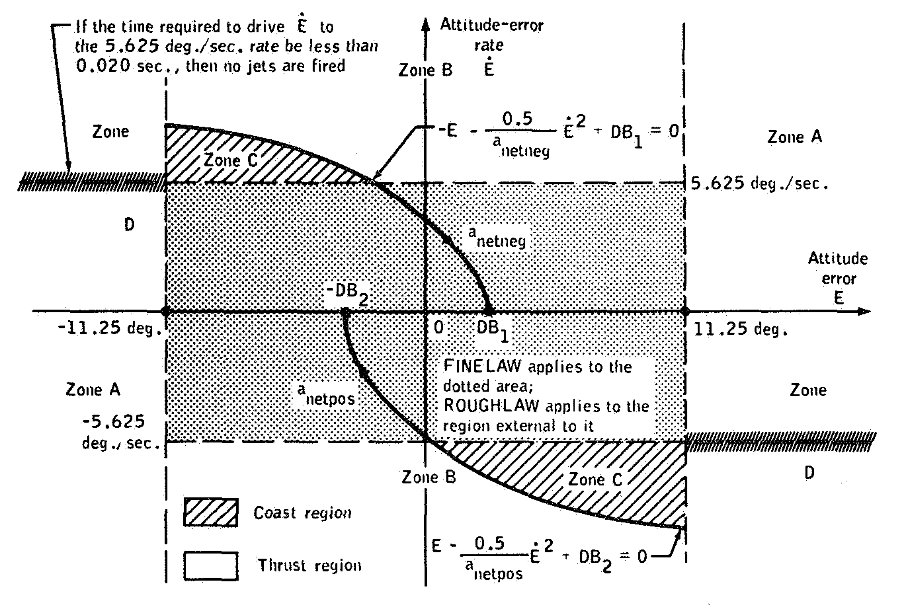
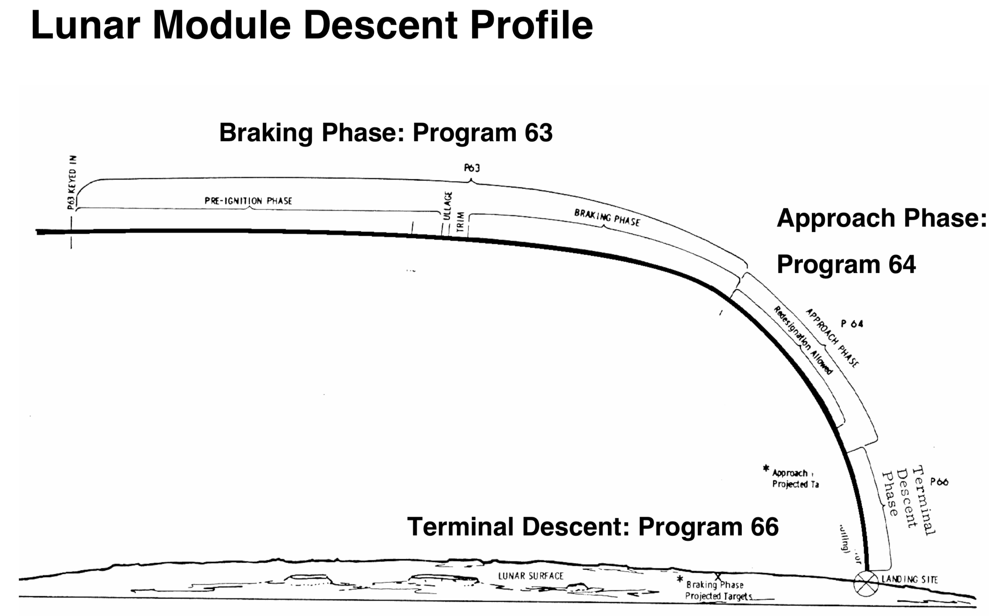
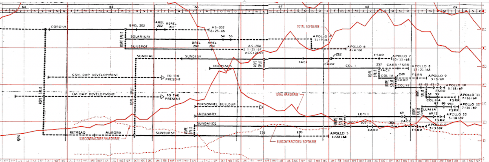

# Celebrating Apollo's 50th Anniversary: The Oldest Code on GitHub

**Hero Image:**

#### Contributed by [Mark C. Miller](https://github.com/markcmiller86)
#### Publication date: June, 2019

*Second of a three-part series to commemorate the 50th anniversary of the Moon landings.*

Retro-computing enthusiasts recently uploaded Apollo Guidance Computer (AGC)
source code for various Apollo missions to GitHub. There is even a *Virtual AGC*
that can run this code. In all likelihood, it is the oldest *active* code on
GitHub. Remarkably, its development began over half a century ago in the ashes
of Mariner 1, a Venus probe destroyed shortly after launch due to a bug in its
guidance software. The prevailing explanation was that in the
transcription of hand-written guidance equations into a software specification
for the contractor, TRW, an over-bar to indicate the use of *average* rather than
*instantaneous* velocity went missing;[20] along with it, an $18M
probe ($152M in 2019 dollars) and a regrettable ration of American prestige.
How would MIT and NASA avoid similar mistakes developing software for the AGC?

This is the second of three articles about the AGC. In part 1, we described the
hardware.[26] Here, in part 2, we focus on MIT's effort to develop
the software. As much information as there is available regarding the AGC, it
is difficult to find details about specific development processes used.
Nonetheless, as in part 1, the scientific computing community will recognize
some familiar themes such as the necessity of *co-design*, the importance of
sufficient testing resources, the role and impact of software process
improvements and more.

### Extreme Co-design
Initially, about all that was known with any certainty was that a digital
computer would be the centerpiece of a complex collection of GN&C sub-systems.
More than year would pass before NASA finally selected the Lunar Orbit
Rendevous (LOR) mission plan involving two separately piloted and radically
different vehicles each with its own AGC controlling a substantially different
configuration of GN&C sub-systems. These would be the first all digitally controlled,
fly-by-wire vehicles ever created. At the heart of it all, AGC software would
control everything. Even so called *manually controlled* inputs would first
pass through AGC software before affecting the relevant hardware. 

A challenge in developing the software is that all the sub-systems
it must interact with and control were under development *simultaneously*
right along with the software itself. Their interfaces, performance
characteristics, size, weight and position within the spacecraft, all of
which effect key parameters in guidance equations were constantly evolving.

Another challenge was testing. How is the software's
ability to properly utilize and control all these sub-systems tested
without actually flying the vehicle in real-word conditions?
Ultimately, several different test simulators would be developed.
Simulator hardware and software as well as the test plans and methods for
collecting and analyzing test results were being developed right along with
the software it was intended to test. Even techniques to manage the
software effort were effectively under development and evolving with the
software. Eventually, NASA would pressure MIT to adopt techniques pioneered
by IBM to help manage large software development projects.

Today, we would call all of this simultaneous development activity
*co-design*[31] and it has a lot of advantages.
But, in the 1960's where there were no dev-ops best practices and collaborative tools
like GitLab, Jenkins, Confluence, Kanban, WebEx, or even Email, it presented a massive
coordination and management challenge.

### Evolving requirements, versions and flight rope releases
Throughout the early phases of development, NASA's expectations for what functions
the GN&C system would perform, and therefore the AGC software, continued to evolve
motivated by a desire to reduce weight, increase safety margins, improve mission
flexibility and optimize propellant usage.

> NASA had established a need for the machine and had determined its general tasks, and
> MIT received a contract based on only a short, very general requirements statement.
> Requirements started changing immediately and continued to change throughout the program.

Midway through development, the AGC was re-designed to support more memory and an expanded
instruction set. Software developers had to support both the old, Block I, and new, Block II
hardware. Block I would be used on early, uncrewed Apollo test flights and Block II on crewed
flights. They were different enough that each required separate software development teams.
This only exacerbated already strained software development and management burdens.

Attribute | Block I (fall 1962) | Block II (summer 1966) 
---|---|---
Fixed/Erasable Memory (k-words) | 24 / 1 | 36 / 2
Logic #ICs (NOR gates/IC) | 4,100 (x1) | 2,800 (x2)
Clock / Instructions | 1.024 Mhz / 11 | 1.024 Mhz / 34
Power/Weight | 85W / 39.5kg | 55W / 31.9kg
Flops (kF) | 7.1 | 14.5

Neither Block I or Block II supported floating point. Instead, like a *slide rule*,[22]
the AGC used single-, double- or triple-precision *fractional* representation where the
*exponent* was managed implicitly. Developers simply agreed on the implied scaling of any
particular numerical value as well as occasionally coding explicit re-scaling as needed to
maintain precision. Block II had only 2K words of *erasable* core and 36K words of *fixed*
or *rope core* memory. All software and data had to fit into this combined 76KB of memory.

**The essential step for software developers was to produce a *flight program* or *rope*
and release it to Raytheon for rope core manufacture approximately 4 months prior to launch;
2 months to manufacture the ropes followed by 2 months for installation in the spacecraft,
checkout, integrated system testing, crew rehearsals and final erasable memory load.**

The lead engineer in coordinating and approving all software in a flight program was
called a *rope mother* and would also name the release. Early on the names were fairly
creative including **ECLIPSE**, **SUNRISE**, **RETREAD** and **AURORA**. Eventually,
NASA put a stop to this and only the names **COLOSSUS** and **LUMINARY** together
with their revision numbers would be used to identify CM and LM flight programs
respectively. [34]

### The AGC software stack
Each flight program involved a combination of common, utility modules as well as those
that were highly mission specific. The mission specific components required significant
analysis and development time. Early development activity, 1961-1965, focused on
infrastructural software.

**Program Name** | **Purpose** | **Size (AGC words)**
:--- | :--- | ---:
Executive[40] | Priority driven large/long-running process manager | ~350
Waitlist[41] | Time sequenced small/short-running process manager | ~300
Down-Telemetry[44] | Transmit system data to ground | ~200
Restart[45],[46],[47] | Error recovery and restart protection | ~1225
Interpreter[42] | Space guidance domain specific programming language interpreter | ~2200
DSKY I/O[43] | Cockpit Displays and Keypad | ~3500
**Combined Total** | %22 of fixed memory | **~7775**

The programs listed here largely comprised what we would know today as the AGC *operating system*.
All were written in assembly language. By 1965, most of this code had been written and fully tested
and changed little with each new flight program.

An example of a space guidance subroutine is computing the relative positions of Earth,
Sun and Moon at any moment. Doing so using a minimum of fixed and erasable storage and
without consuming too much of the CPU's attention or taking longer than needed for
real-time operation were all design considerations.
In this case, after evaluating various approaches[51] in MAC Fortran on 
mainframe systems, developers settled on an approach using 8th degree polynomial fits to
positional data predicted from mainframe solution of the 3-body (Earth, Sun, Moon)
problem. Eight, double precision, X, Y and Z polynomial coefficients (48 words of data)
for a 2-week period (an Apollo mission was about 10 days) of Moon position data would
then be stored in fixed memory (rope core). Once the MAC Fortran mainframe version of
this subroutine had been developed, it was then used to "predict" historically measured
Moon position data to verify the algorithm. Then, it was re-implemented in 90 words of
AGC Interpreter language and re-tested to verify the AGC interpreter version predicted
historical data with same accuracy. The data and code would be among the 76 kilobytes
hand woven into the rope core flight program in the months before a mission.
Multiple ropes would be manufactured as contingencies in case the launch was delayed.
Another example is the list of star names, numbers and positions needed for the Apollo space
sextant which required 112 words of AGC Interpreter code.[50]

Then, there was mission specific subroutine development. For example, early uncrewed
missions performed tests requiring specialized operation of system components.
As crewed missions evolved, new rendezvous techniques were introduced that required less
time and fuel, re-entry targeting was improved, or lunar missions ventured into
mountainous regions of the Moon and required a minimal terrain model for the landing radar.
A 1962 memo[25] lists 45 major software analysis efforts then
underway for various aspects of planned Apollo missions.

### The whole spacecraft as a feedback control loop
The whole collection of GN&C sub-systems with the AGC at the center
represented a complex feedback control loop, the stability of which was
crucial to crew safety and mission success.

Originally, the auto-pilot features to be implemented using tried and true
analog control techniques. However, as confidence grew in the potential for
the AGC to function as as a *digital* control system, the decision was made in late
1964 to develop the Digital Autopilot (DAP) software. DAP software would control
main engine gimbal and attitude control thrusters during a *burn* to maintain a
given attitude or attitude rate and to achieve a given desired velocity change
(magnitude and direction). DAP software would also need to affect its controls
subject to a number of constraints in the RCS jet usage rules including optimizing
RCS propellant use, avoiding gimbal lock as the spacecraft orientation is changed,
detecting and avoiding failed on or off RCS jets, minimizing jet thrust durations
in certain directions that impinge on spacecraft skin or direct exhaust debris at
windows.

DAP software was given a budget of 10% of rope core memory (< 3,600 words) and
20-30% of full computational load (3-4.5 kFLOPS). Apollo's DAP software was the
first known use of a fully digital control system for a *flying* vehicle
Something like this had never been done before. It would take 4 developers 3 years
and 2000 words of rope core to develop DAP sofware. A crtical technological advancement
was the introduction of *Kalman* filtering as the main control logic. A key optimization
realized late in the development was that a change in coordinates used in the computations
from *body axes* to *jet axes* reduced complexity of the code and increased performance.

The picture here shows the complex, non-linear switching logic used by the Kalman
filtering algorithm. With a change of a dial on the control panel, astronouts could
adjust the filter from *course* to *fine* control. In addition, the control logic
needed to handle failed thrusters (either failed on or failed off).

> By early 1965, the basic RCS autopilot functions were laid out, including phase-plane
> and jet-select logic, a new maneuver routine, and interfaces for the various manual modes.

### There's an AGC app for that
Flying to the moon and returning safely involved *long periods of boredom
punctuated by moments of extreme peril*. A mission was divided into phases by
*velocity change maneuvers* or *burns* of the main engines. A complete mission
involved around 11 main engine burns. For each maneuver,
there was a corresponding program, called a *major mode*, to handle it.
For every phase of the mission, *there was an app for that*.

Development of a *major mode* software program began by understanding the equations
of motion governing the particular phase of spaceflight and then outline computational
approaches utilizing available spacecraft sensors, controls and engines to affect the
desired outcomes within various constraints.
For any particular maneuver, factors impacting the equations of motion were considerable.
They included zero gravity fuel slosh, changing center of mass due to fuel consumption,
main engine throttle and gimbal characteristics, sensor drift and measurement
biases and uncertainties, avoiding IMU gimbal lock, optimizing use of RCS
propellants, contingency logic for failed (on or off) RCS thrusters, positions of Sun,
Earth and Moon (all in constant motion) as well as their *lumpy*[3],[4]
gravity fields, narrow windows of opportunity as lines of sight to ground communication
stations varied.

By far the most critical sequence of maneuvers occurred during lunar landing.
It was divided into 4 phases depending on the amount and type of
control the pilot required; Powered Descent (major mode P63), Approach (P64),
Terminal Descent (P66), and Touchdown (P68). That was for a *normal* landing.
In addition, the software needed to be prepared to handle a variant of abort
contingencies depending upon which phase in the landing abort might be required.

### Code heroes and heroines
The failure of Mariner 1 was a painful experience for one NASA team member in particular;
John Norton. Norton was a guidance software expert at TRW and was partly responsible for
the Mariner 1 software failure. Remarkably, he was later hired by NASA to perform
independent peer review of the code MIT was producing.

In his new role at NASA, he dedicated himself to becoming what can only be described as
a human static analyzer. Norton developed a way of expressing AGC assembly code in a
human readable form he called *Programmed Equations*.[32] He would then
manually read and reverse engineer critical sections of AGC interpreter code that
performed key guidance functions, documenting them in this form. The documents he
produced became invaluable technical documentation for both NASA and MIT.

Early on, he discovered bugs such as prolific use of the numerically poor approximation
of pie as 22/7, failures in units conversions between astronaut displays in feet/second
and internal AGC computatons which used meters/second, and occasional discrepancies
between documented guidance equations and the equations finally programmed.

Although Norton's software skills became legendary, he was otherwise apparently a tad
quirky...often not cashing several months worth of paychecks at a time. One when one MIT
programmer tried to have a bit of fun, burying the phrase "Norton Needs Glasses" in comments
in the bowels of major mode program P52 just to see how long it would take Norton to find it
(apparently only a few hours of analysis), Norton asked for MIT to be removed from the project.
Norton's work was a form of *independent peer review* akin to what code teams do now every
day with pull requests on GitHub.

Developer productivity was measured in new *words per month* of flight program
ready and released AGC code. Given the tight memory constraints, however, the
main problem was not developer productivity. It was fitting all the developed
functionality into memory. In early 1966, NASA appointed a new *watchdog*
manager; Bill Tindall. He became famous for his sharply worded progress memos
known as *Tindallgrams*. He was the first to realize that software development
processes were jeapardizing the whole program's ability to meet their mission
schedule. His first major action was to triage the flight program for Apollo 1,
the first crewed mission. In a meeting on Friday the 13th of May, 1966 he led
discussions on what functionality to cut to meet schedule deadlines. Even after
making dramatic cuts in functionality[52], he considered the early
flight programs MIT released of dubious quality. This was the first of many
such meetings which became known as *Black Friday* meetings. As difficult and
emotional as these meetings were resulting in months if not years of software
development work being cut from flight programs, most MIT development staff
eventually recognized they would not have produced a working flight program
without Bill Tindall's relentless efforts to cut functionality to meet schedule
constraints. His role was a systems integrator. Apollo 1 suffered a horrible fire
killing the crew during a dress rehearsal and delaying all flights for 18 months.
The subsequent relaxation of software schedule pressures allowed Tindall to 
lead MIT from triage mode to optimization mode.

> In the early stages, there were no "programmers". Instead engineers and scientists
> learned the techniques of programming. It was believed that competent engineers could
> learn programming more easily than programmers could learn engineering.[30]

We can thank Margaret Hamilton, who received the Presidential Medal of Freedom for her
work on the on AGC[29], for being the first to champion *Software Engineering*[28]
as a discipline unto itself "...to bring the software [effort] legitimacy so that it
and those building it would be given due respect." Hamilton was the only woman working
on AGC software and ultimately became a rope mother for LM fight program **LUMINARY**.

Hamilton would often bring her 11 year old daughter to work on weekends and she would
sometimes randomly tap out commands on a DSKY attached to an AGC simulator. One day,
she shocked her mother by entering a command that managed to crash the AGC. Upon
investigation, Hamilton discovered the cause and alerted colleagues of the need to
add error input checking logic. She developed logic to validate astronaut DSKY inputs
and made a program change request which was initially denied due to various constraints.

### Testing
Six different levels of testing were developed to test AGC software.
* An all-software simulator (also known as the *all-digital* simulator)
  of *just* the AGC itself implemented in MAC Fortran on MIT mainframes
  which ran at 10% speed.
* A hybrid simulator using a real AGC together with a rope core simulator and a
  software simulation of all other GN&C components the latter requiring two
  massive machine rooms in the second and third stores of the test facility.
* System test labs using a real AGC and real key GN&C sub-systems. There were multiple of
  these system test labs at MIT and other spacecraft contractors.
* Crew rehearsals with a real AGC in the actual spacecraft exercising *some* of
  the actual GN&C sub-systems. As a practical matter, such tests of course could not
  include engine or thruster firings but did exercise other system components.
* Actual flight tests of the fully integrated GN&C system both in uncrewed and crewed
  flights.

For tests involving software simulation of GN&C sub-systems, a key concern was
whether those simulations faithfully represented the behavior of the actual
hardware as well as the spacecraft in which they are housed including such key
issues engine performance, fuel slosh and even structural responses of the
spacecraft under torques and loads imposed by engine and thruster firings.

In the data pictured here, data from actual flight tests of the LM descent engine
(left) is compared with the all-digital simulation (middle), revealing a clear
bug in failure to faithfully model structural dynamics which was eventually corrected
(right).

> The need for formal validation rose with the size of the software. Programs of
> 2,000 words took between 50 and 100 test runs to be fully debugged, and
> full-size flight program took from 1,000 to 1,200 runs.

The all-digital simulation of the AGC would eventually require MIT to purchase one
Honeywell 800, 2 Honeywell-1800s and 2 IBM 360/75 peaking at about 4,500 cpu hours/month
(equiv. H-1800 cpu) testing solely for the all-digital testing simulator per month.

### Managing software in the face of evolving requirements

The whole GN&C system for all 16 uncrewed and 11 crewed Apollo missions
cost a total of ~$600 million[24] over 10 years. The software
effort was about 10% of that[23] the majority of it occurring
over the last 5 years.

> Before the first lunar landing, more than 1400 person-years of software
> engineering effort had been expended, with a peak level of effort of 350
> engineers reached in 1968.

Below we compare key aspects of the Apollo GN&C effort with
the Exascale Computing Project. One aspect in all likelihood remarkably
different between the two projects is the emphasis on publication.
Although the Apollo effort did publish some, the amount of publication
relative to the whole effort is in all likelihood smaller than that
required of ECP software developers.

Project | 1965 Dollars | 2019 Dollars | Publications + Theses 
---|---|---|---
Apollo GNC Total | $600M | ~$5B | ~60 + 60
Apollo GNC Software | $60M | ~$0.5B | ~25 + 13
ECP Total | ~$100M | $809M |
ECP Software | XXX | XXX | XXX

> Throughout much of the Apollo effort, MIT experienced difficulty in estimating the
> time and effort requirements to design, test and verify successive mission programs.[30]

> In the software system, just as in the case of hardware systems, the engineering
> attention required of the interface between components may sometimes exceed the
> attention required for the selection or design of the any of the components individually.
>
>
> No one doubted the quality of the software eventually produced by MIT. It was the
> process used in software development that caused great concern. The lessons were:
> (a) up-to-date documentation is crucial, (b) verification must proceed through
> several levels, (c) requirements must be clearly defined and carefully managed,
> (d) good development plans should be created and executed, and (e) more programmers
> do not mean faster development[19].

[1]: https://en.wikipedia.org/wiki/Control_theory#Stability "Stability in Control Theory {}"
[2]: https://www.ibiblio.org/apollo/Documents/SGA_Memo11_620716.pdf "Software Development Activities Summary Memo 1962 {}"
[3]: https://en.wikipedia.org/wiki/Gravity_of_Earth "Earth's Lumpy Gravity Field {}"
[4]: https://en.wikipedia.org/wiki/Gravitation_of_the_Moon "Moon's Lumpy Gravity Field {}"
[5]: https://www.americanscientist.org/article/moonshot-computing "Great Article on AGC Software {}"
[6]:http://www.klabs.org/history/apollo_11_alarms/eyles_2004/eyles_2004.htm "Tales from Lunar Landing {}"
[7]: https://www.mathworks.com/company/newsletters/articles/fly-me-to-the-moon-then-and-now.html "DAP Design Then and Now with MathWorks {}"
[8]: https://www.ibiblio.org/apollo/index.html "Virtual AGC Project Home Page {}"
[9]: https://www.researchgate.net/publication/228517819_Architectural_Simulation_for_Exascale_HardwareSoftware_Co-design "Architectural Simulation for ExascaleHardware/Software Co-design {Janssen, Curtis & Quinlan, Dan & Shalf, John. (2019). Architectural Simulation for Exascale Hardware/Software Co-design.}"
[10]: https://www.design-reuse.com/articles/31951/the-power-of-developing-hardware-and-software-in-parallel.html "The Power of Developing Hardware and Software in Parallel {}"
[12]: http://web.mit.edu/digitalapollo/Documents/Chapter6/hoagprogreport.pdf?#page=24 "Hoag Report including DAP Design and Performance {}"
[13]: https://www.mathworks.com/help/simulink/slref/developing-the-apollo-lunar-module-digital-autopilot.html "Simulink Model of DAP {}"
[14]: http://thecomputerboys.com "Early Programmers as Data Entry Personnel - Women's Work {}"
[15]: http://www.ibiblio.org/apollo/hrst/archive/1695.pdf "AGC Software Development Plan {}"
[16]: http://klabs.org/history/history_docs/mit_docs/1711.pdf?#page=12 "Hoag Report: THE HISTORY OF APOLLO ON-BOARD GUIDANCE, NAVIGATION, AND CONTROL {}"
[17]: http://tindallgrams.net "Select Tindall-grams {}"
[18]: https://www.ibiblio.org/apollo/hrst/archive/1687.pdf?#page=40 "Example AGC Interpretive Program To Find Quadratic Roots {}"
[19]: https://history.nasa.gov/computers/Ch2-6.html "Great Overview of Software Development Issues"
[20]: https://www.airspacemag.com/space/practicing-safe-software-180962744/ "Air & Space Article on Mariner 1 {}"
[21]: https://authors.library.caltech.edu/5456/1/hrst.mit.edu/hrs/apollo/public/conference1/hamilton-intro.htm "Interview with Margaret Hamilton {}"
[22]: https://en.wikipedia.org/wiki/Slide_rule "Slide Rule {}"
[23]: https://www.ibiblio.org/apollo/hrst/archive/1728.pdf "AGC Software Development Productivity and Costs {Rankin DA. (1972) A Model of the Cost of Software Development for the Apollo Spacecraft Computer, Masters Thesis, MIT}"
[24]: https://history.nasa.gov/SP-4029/Apollo_18-16_Apollo_Program_Budget_Appropriations.htm "Apollo Budget By Sub-Program and Year {}"
[25]: https://www.ibiblio.org/apollo/Documents/SGA_Memo11_620716.pdf "List of Software Studies Underway in 1962 {}"
[26]: https://bssw.io/blog_posts/celebrating-apollo-s-50th-anniversary-when-100-flops-watt-was-a-giant-leap "Part 1 in this series {}"
[27]: https://www.doneyles.com/LM/ORG/index.html "MIT Org Charts (1969) {}"
[28]: https://www.computer.org/publications/tech-news/events/what-to-know-about-the-scientist-who-invented-the-term-software-engineering "Origin of the term 'Software Engineering' {}"
[29]: https://www.nasa.gov/feature/margaret-hamilton-apollo-software-engineer-awarded-presidential-medal-of-freedom "Margaret Hamilton Medal of Freedom {}"
[30]: https://www.ibiblio.org/apollo/hrst/archive/1137.pdf "The MIT Software Effort {Johnson MS Giller DR (1971) MIT's Role in the Project: Final Report on Contracts, Vol. 5 The Software Effort, NAS 9-153 & NAS 9-4065}"
[31]: https://www.google.com/search?client=safari&rls=en&ei=YeryXMO2H6m_0PEPvciWiA8&q=what+is+co-design+in+computing&oq=what+is&gs_l=psy-ab.1.0.35i39l2j0i67l5j0l2j0i131.1499.3009..4244...2.0..0.121.836.5j4......0....1..gws-wiz.......0i71j0i10j0i10i67.bQxpLbPTVwU "Google Search co-design in computing {}"
[32]: https://www.ibiblio.org/apollo/Documents/j2-80-MSC-69-FS-4_text.pdf "Example of Norton's Programmed Equations {}"
[33]: http://tindallgrams.net/66-FM1-68 "Tindall-gram about Software Development Processes {}"
[34]: https://www.ibiblio.org/apollo/AGC-versions.jpg "AGC Software Version History {}"
[40]: https://github.com/virtualagc/virtualagc/blob/master/Luminary069/EXECUTIVE.agc "AGC source code for Executive {}"
[41]: https://github.com/virtualagc/virtualagc/blob/master/Luminary069/WAITLIST.agc "AGC source code for Waitlist {}"
[42]: https://github.com/virtualagc/virtualagc/blob/master/Luminary069/INTERPRETER.agc "AGC source code for Interpreter {}"
[43]: https://github.com/virtualagc/virtualagc/blob/master/Luminary069/PINBALL_GAME__BUTTONS_AND_LIGHTS.agc "AGC source code for DSKY and cockpit displays {}"
[44]: https://github.com/virtualagc/virtualagc/blob/master/Luminary069/DOWN-TELEMETRY_PROGRAM.agc "AGC source code for Downlink {}"

[45]: https://github.com/virtualagc/virtualagc/blob/master/Luminary069/FRESH_START_AND_RESTART.agc "AGC source code for restart {}"
[46]: https://github.com/virtualagc/virtualagc/blob/master/Luminary069/RESTARTS_ROUTINE.agc "AGC source code for Interpretive routine restart {}"
[47]: https://github.com/virtualagc/virtualagc/blob/master/Luminary069/RESTART_TABLES.agc "AGC source code for restart phase tables {}"
[50]: https://www.spaceartifactsarchive.com/2013/05/the-star-chart-of-apollo.html "Apollo space sextant {}"
[51]: https://www.ibiblio.org/apollo/Documents/SGA_Memo12_620716.pdf "Position of Moon analysis {}"
[52]: http://tindallgrams.net/66-FM1-75 "Apollo 1 (AS-204) flight program memo {}"
