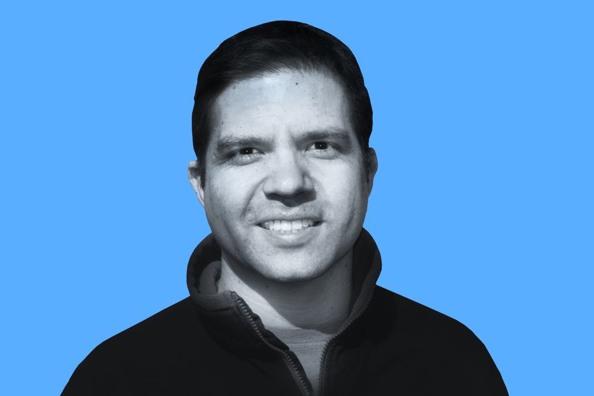
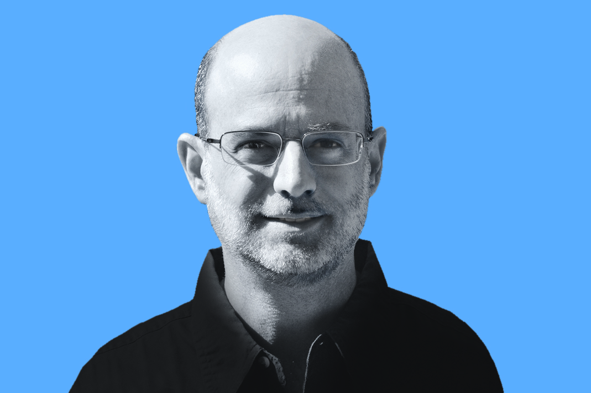
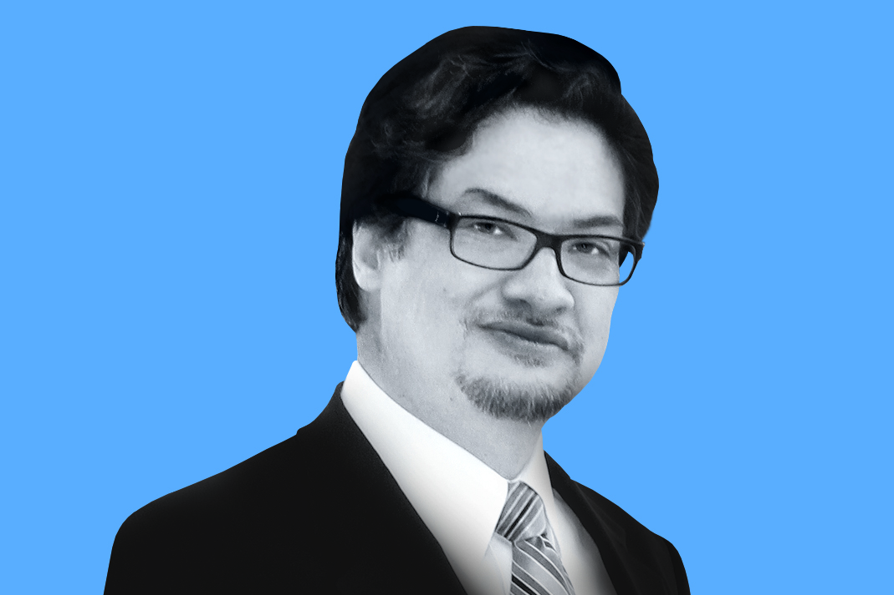
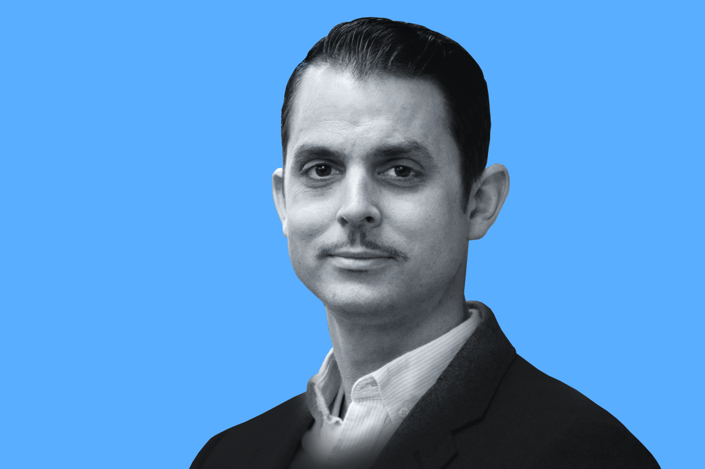
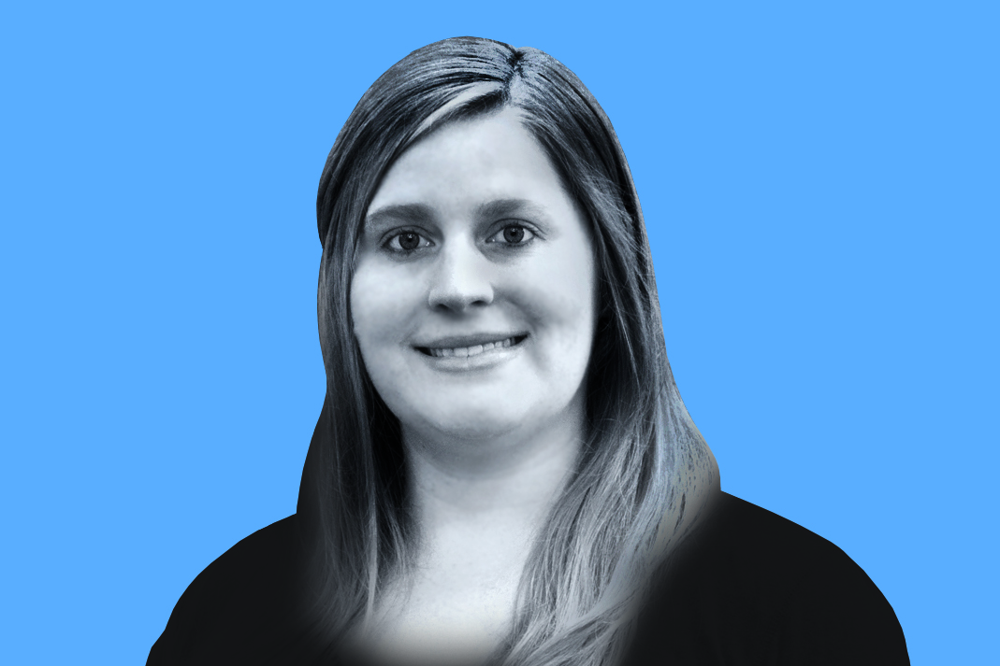

# Introducing the 2018 BSSw Fellows

#### Contributed by [David E. Bernholdt](https://github.com/bernhold " David Bernholdt GitHub Profile"), [Mike Heroux](https://github.com/maherou "Mike Heroux GitHub Profile"), and [Lois Curfman McInnes](https://github.com/curfman "Lois Curfman McInnes GitHub Profile") 

#### Publication date: February 5, 2018

We are pleased to announce the inaugural class of Better Scientific Software (BSSw) Fellows: four Fellows and four Honorable Mentions.

The inaugural class of BSSw Fellows will be recognized during the [Exascale Computing Project 2nd Annual Meeting](https://www.ecpannualmeeting.com), February 6-9, 2018, in Knoxville, TN.  Thanks to _all_ fellowship applicants. The broad range of creative and interesting proposals made the selection process difficult.

The [BSSw Fellowship Program](https://bssw.io/fellowship) gives recognition and funding to leaders and advocates of high-quality scientific software. Each Fellow will receive up to $10,000 for an activity that promotes better scientific software, such as organizing a workshop, preparing a tutorial, or creating content to engage the scientific software community.  

## 2018 BSSw Fellows

&nbsp;

### Jeffrey Carver
University of Alabama, Professor, Computer Science

_BSSw Focus_: Contemporary peer code review in scientific software development

&nbsp;

### Ivo Jimenez
University of California Santa Cruz, Ph.D. candidate, Computer Science

_BSSw focus_: generation of computational experimentation pipelines that are easy to re-execute and validate

&nbsp;

### Daniel S. Katz</b>     
University of Illinois at Urbana-Champaign, Research Associate Professor, Computer Science, Electrical and Computer Engineering, and the School of Information Sciences
 
National Center for Supercomputing Applications, Assistant Director for Scientific Software and Applications

_BSSw focus_: techniques for making scientific software more sustainable by providing credit to its developers via software citation

&nbsp;

### Andrew Lumsdaine
Pacific Northwest National Laboratory, Fellow, Advanced Computing, Mathematics, and Data Division
 
University of Washington, Affiliate Professor, Computer Science
 
Northwest Institute for Advanced Computing, Chief Scientist

_BSSw focus_: practices for high-performance and high-quality scientific software in modern C++

## 2018 BSSw Honorable Mentions

&nbsp;

### Neal Davis 
University of Illinois at Urbana-Champaign, Teaching Assistant Professor, Computer Science

&nbsp;

### Elsa Gonsiorowski
Lawrence Livermore National Laboratory, HPC I/O Specialist, Livermore Computing

&nbsp;

### Marc Henry de Frahan
National Renewable Energy Laboratory, Postdoctoral Researcher

&nbsp;

### Ying Li
Argonne National Laboratory, Argonne Scholar, Argonne Leadership Computing Facility

&nbsp;

### About the BSSw Fellowship
As described in a [prior blog article](https://bssw.io/blog_posts/applications-open-for-new-bssw-fellowship-program-q-a-webinar-on-dec-12-2017), the main goal of the BSSw Fellowship program is to foster and promote practices, processes, and tools to improve developer productivity and software sustainability of scientific codes. BSSw Fellows are selected annually based on an application process that includes the proposal of an activity that promotes better scientific software. Subscribe to the [BSSw email digest](https://bssw.io/pages/receive-our-email-digest) for notification about next year’s call for applications, which will be announced in fall 2018.

Stay tuned for more from the 2018 BSSw Fellows. 

<!---
Publish: yes
Track: bssw fellowship
Topics: projects and organizations
Pinned: no
--->
