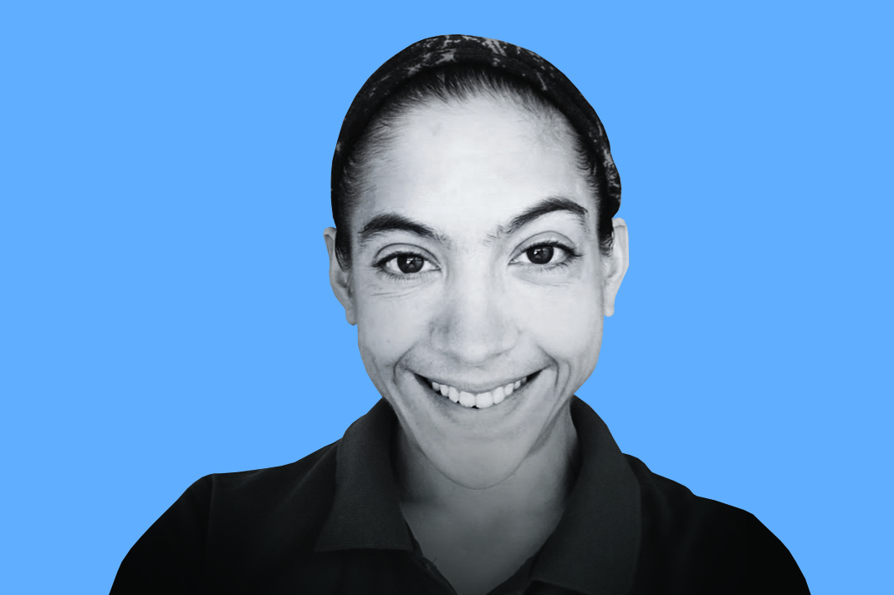

# Introducing the 2019 BSSw Fellows

#### Contributed by [David E. Bernholdt](https://github.com/bernhold " David Bernholdt GitHub Profile"), [Mike Heroux](https://github.com/maherou "Mike Heroux GitHub Profile"), and [Lois Curfman McInnes](https://github.com/curfman "Lois Curfman McInnes GitHub Profile")

#### Publication date: December 11, 2018

We are pleased to announce the 2019 class of Better Scientific Software (BSSw) Fellows: four Fellows and four Honorable Mentions.

The 2019 class of BSSw Fellows will be recognized during the [2019 Exascale Computing Project Annual Meeting](https://www.ecpannualmeeting.com), January 14-17, 2019, in Houston, TX.

We sincerelly thank _all_ fellowship applicants. The broad range of creative and interesting proposals made the selection process difficult.

The [BSSw Fellowship Program](https://bssw.io/fellowship) gives recognition and funding to leaders and advocates of high-quality scientific software. Each 2019 Fellow will receive up to $25,000 for an activity that promotes better scientific software, such as organizing a workshop, preparing a tutorial, or creating content to engage the scientific software community.

## 2019 BSSw Fellows

&nbsp;

### Rene Gassmoeller, University of California, Davis
Assistant Project Scientist, Earth and Planetary Sciences

_BSSw Focus_: Social challenges in the evolution of scientific software projects

&nbsp;

### Ignacio Laguna, Lawrence Livermore National Laboratory
Computer Scientist, Center for Applied Scientific Computing

_BSSw focus_: Debugging and improving the reliability of scientific applications

&nbsp;

### Tanu Malik, DePaul University
Assistant Professor, School of Computing

_BSSw focus_: Reducing technical debt in scientific software

&nbsp;

### Kyle Niemeyer, Oregon State University
Assistant Professor, School of Mechanical, Industrial, and Manufacturing Engineering

_BSSw focus_: Best practices for developing research software

## 2019 BSSw Honorable Mentions

&nbsp;

### Stephen Andrews, Los Alamos National Laboratory
Staff Scientist, XCP-8: Verification and Analysis

&nbsp;

### Nasir Eisty, University of Alabama
Ph.D. Student, Computer Science

&nbsp;

### Benjamin Pritchard, Virginia Tech
Software Scientist, Molecular Sciences Software Institute

&nbsp;

### Vanessa Sochat, Stanford University
Research Software Engineer, Stanford Research Computing Center

&nbsp;

## About the BSSw Fellowship
The main goal of the [BSSw Fellowship Program](https://bssw.io/fellowship) is to foster and promote practices, processes, and tools to improve developer productivity and software sustainability of scientific codes. BSSw Fellows are selected annually based on an application process that includes the proposal of an activity that promotes better scientific software. Subscribe to the [BSSw email digest](https://bssw.io/pages/receive-our-email-digest) for notification about next year’s call for applications, which will be announced in summer 2019.  More information:

- [2018 BSSw Fellows: Projects and Perspectives](https://bssw.io/resources/bssw-fellows-2018-projects-and-perspectives)
- [FAQ for the BSSw Fellowship Program](https://bssw.io/pages/bssw-fellowship-faq)

Stay tuned for more from the 2019 BSSw Fellows.

## Contribute to the BSSw Site
Also, we want and need contributions from the international community for the BSSw site.  If you have expertise that can help other scientific software teams, we encourage you to contribute an article or pointer to good work.  See details on [how to contribute to BSSw](https://bssw.io/pages/what-to-contribute-content-for-better-scientific-software).

<!---
Publish: yes
Track: bssw fellowship
RSS update: 2018-12-11
Topics: projects and organizations
Pinned: no
--->
