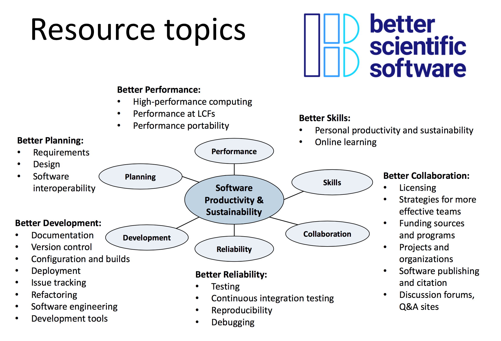

# Applications Open for New BSSw Fellowship Program ... Q&A Webinar on Dec 12, 2017

#### Contributed by [Mike Heroux](https://github.com/maherou "Mike Heroux GitHub Profile") and [Lois Curfman McInnes](https://github.com/curfman "Lois Curfman McInnes GitHub Profile") 

#### Publication date: Dec 1, 2017

Better Scientific Software is an organization dedicated to improving developer productivity and software sustainability for computational science and engineering (CSE).

 

We are launching a new [BSSw Fellowship Program](https://bssw.io/pages/bssw-fellowship-program) to give recognition and funding to leaders and advocates of high-quality scientific software.  The main goal of the BSSw Fellowship program is to foster and promote practices, processes, and tools to improve developer productivity and software sustainability of scientific codes.  BSSw Fellows are selected annually based on an application process that includes the proposal of a funded activity that promotes better scientific software. We select at least three Fellows per year and honorable mentions as appropriate. Each Fellow is awarded up to $10,000 for an activity that promotes better scientific software. Activities can include organizing a workshop, preparing a tutorial, or creating content to engage the scientific software community. 

#### Q&A Webinar about the BSSw Fellowship Program
- Tuesday, December 12, 2017, 4:30 pm EST.  
- Please [subscribe to our mailing list](https://bssw.io/pages/receive-our-email-digest) to receive further details, including telecon information for the Q&A session.

#### More information, including on-line application
- [BSSw Fellowship Program](https://bssw.io/pages/bssw-fellowship-program)
- Application deadline: January 5, 2018

<!---
Publish: Yes
Track: community
Topics: projects and organizations
Pinned: no
--->
