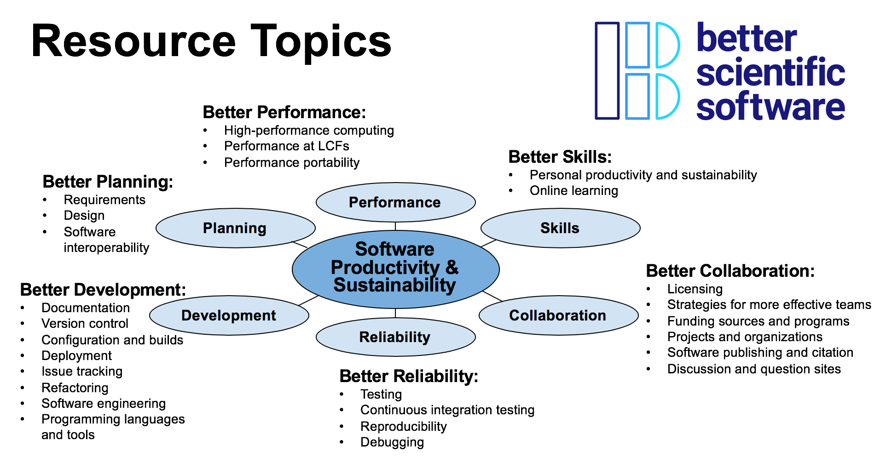

# Applications Open for 2019 BSSw Fellowship Program ... Q&A Webinar on Sept 21, 2018

#### Contributed by [David E. Bernholdt](https://github.com/bernhold "David E. Bernholdt GitHub Profile"), [Mike Heroux](https://github.com/maherou "Mike Heroux GitHub Profile") and [Lois Curfman McInnes](https://github.com/curfman "Lois Curfman McInnes GitHub Profile") 

#### Publication date: September 10, 2018

Better Scientific Software is an organization dedicated to improving developer productivity and software sustainability for computational science and engineering (CSE).

 

Applications are now open for the 2019 [BSSw Fellowship Program](https://bssw.io/pages/bssw-fellowship-program), which gives recognition and funding to leaders and advocates of high-quality scientific software.  The main goal of the BSSw Fellowship program is to foster and promote practices, processes, and tools to improve developer productivity and software sustainability of scientific codes.  BSSw Fellows are selected annually based on an application process that includes the proposal of a funded activity that promotes better scientific software. We select at least three Fellows per year and honorable mentions as appropriate. Each 2019 BSSw Fellow will receive up to $25,000 for an activity that promotes better scientific software. Activities can include organizing a workshop, preparing a tutorial, or creating content to engage the scientific software community. 

#### Q&A Webinar about the BSSw Fellowship Program

- Friday, September 21, 2018, 1:00-2:00 pm EDT 
- Please [subscribe to our mailing list](https://bssw.io/pages/receive-our-email-digest) to receive further details, including telecon information for the Q&A session.

#### More information, including on-line application

- [BSSw Fellowship Program](https://bssw.io/fellowship)
- Application deadline: Tuesday, October 16, 2018; this is a firm deadline that will not be extended.

<!---
Publish: yes
Track: bssw fellowship
RSS update: 2018-09-10
Topics: projects and organizations
Pinned: no
--->
