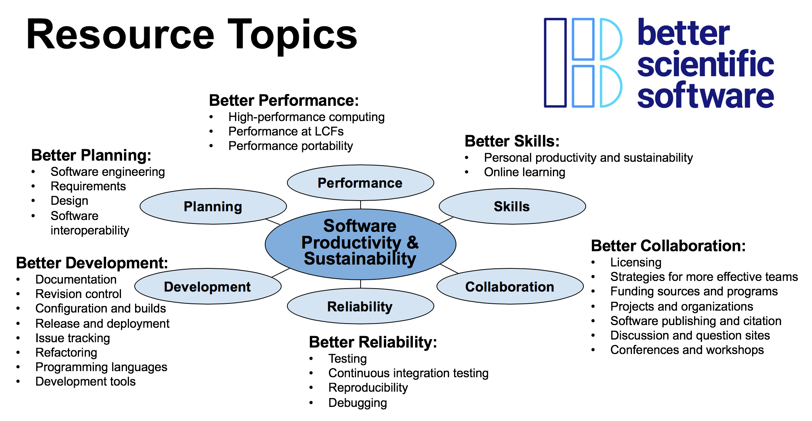

# Applications Open for 2020 BSSw Fellowship Program ... Q&A Webinar on Sept 20, 2019

#### Contributed by [Hai Ah Nam](https://github.com/hnamLANL "Hai Ah Nam GitHub Profile") 

#### Publication date: September 4, 2019

Applications are now open for the 2020 BSSw Fellowship Program, which gives recognition and funding to leaders and advocates of high-quality scientific software. 

Better Scientific Software is an organization dedicated to improving developer productivity and software sustainability for computational science and engineering (CSE) through BETTER Planning, Development, Performance, Reliability, Collaboration, and Skills.  

 

 

The main goal of the [BSSw Fellowship Program](https://bssw.io/fellowship) is to foster and promote practices, processes, and tools to improve developer productivity and software sustainability of scientific codes.  BSSw Fellows are selected annually based on an application process that includes the proposal of a funded activity that promotes better scientific software. We select at least three Fellows per year and honorable mentions as appropriate. Each 2020 BSSw Fellow will receive up to $25,000 for an activity that promotes better scientific software. Activities can include organizing a workshop, preparing a tutorial, or creating content to engage the scientific software community. 

### Q&A Webinar about the BSSw Fellowship Program

- Friday, September 20, 2019, 1:00-2:00 pm EDT 
- Please [subscribe to our mailing list](https://bssw.io/pages/receive-our-email-digest) to receive further details, including telecon information for the Q&A session.

### More information, including on-line application and FAQ

- [BSSw Fellowship Program](https://bssw.io/fellowship)
- Application deadline: Tuesday, October 15, 2019; this is a firm deadline that will not be extended.

### Current and past BSSw Fellows are:

- Navigating the social challenges in the evolution of scientific software projects (Rene Gassmoeller, 2019)
- Improving the reliability of scientific software through analyzing and debugging floating-point software (Ignacio Laguna, 2019)
- Improving code quality through modern peer code review (Jeff Carver, 2018)
- And more!  [Check out how our BSSw Fellows are improving developer productivity and software sustainability.](https://bssw.io/pages/meet-our-fellows)

### Author bio
Hai Ah Nam is coordinator of the BSSw Fellowship Program, a member of the IDEAS-ECP team, and a computational physicist at Los Alamos National Laboratory.  Her  background includes computational low-energy nuclear physics, large-scale scientific computing, and high-performance computing. She is an advocate for developer productivity and software sustainability and has been one of the organizers of the [DOE Performance, Portability and Productivity Annual Meetings](https://doep3meeting2019.lbl.gov) for three years.

<!---
Publish: yes
RSS update: 2019-09-04
Categories: collaboration
Topics: projects and organizations
Tags: bssw-blog-article
Level: 2
Prerequisites: default
Aggregate: none
--->
