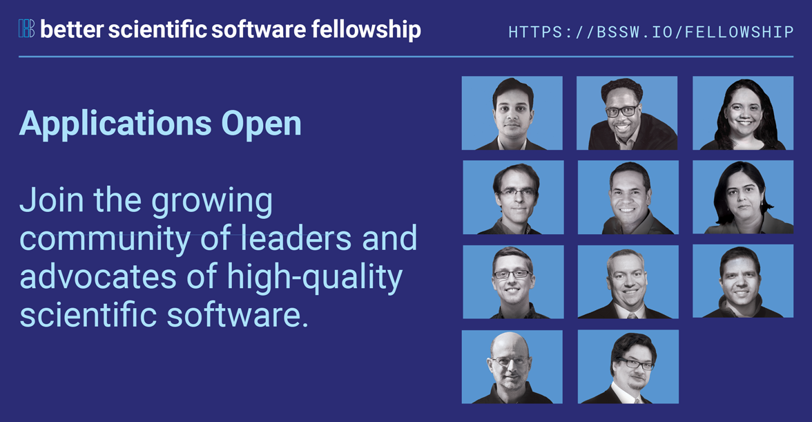

# Applications Open for the 2021 BSSw Fellowship Program 

#### Contributed by [Hai Ah Nam](https://github.com/hnamLANL "Hai Ah Nam GitHub Profile") 

#### Publication date: August 19, 2020

Applications are now open for the 2021 BSSw Fellowship Program, which gives recognition and funding to leaders and advocates of high-quality scientific software.

Addressing scientific software challenges magnified by rapidly changing computing environments requires broad community collaboration to improve developer productivity and software sustainability—as key aspects of ensuring the integrity of computational results and increasing overall scientific productivity.  

The [BSSw Fellowship Program](https://bssw.io/fellowship) provides recognition and funding for leaders and advocates of high-quality scientific software who foster practices, processes, and tools to improve scientific software productivity and sustainability. BSSw Fellows are selected annually based on an application process that includes the proposal of a funded activity that promotes better scientific software. We select at least three Fellows per year and honorable mentions as appropriate. Each 2021 BSSw Fellow will receive up to $25,000 for an activity that promotes better scientific software. Activities can include organizing a workshop, preparing a tutorial, or creating content to engage the scientific software community.  [Applications are now being accepted for the 2021 BSSw Fellowship](https://bssw.io/pages/apply-for-the-bssw-fellowship-program). 

 

<meta property="og:image" content="https://res.cloudinary.com/bssw/image/fetch/https://raw.githubusercontent.com/betterscientificsoftware/bssw.io/master/images/Blog_0820_FellowsGrid_11.png" />

 

We encourage diverse applicants at all career stages—ranging from students through early-career, mid-career, and senior professionals—from throughout the computational science and enginnering (CSE) and software communities. We are looking for applications from people with the following characteristics:

* Passionate about scientific software.
* Interested in contributing powerful ideas, tools, methodologies, and more that improve the quality of scientific software.
* Able to use the fellowship to broadly benefit the scientific software community.

Applicants must be affiliated with a U.S.-based institution that is able to receive funding from the U.S. Department of Energy. Typically such institutions include U.S. government labs, U.S. universities, and U.S.-based corporations. 

### Q&A Webinar about the BSSw Fellowship Program

Join us for a Q&A Webinar to hear more about the BSSw Fellowship Program and get your questions answered.
- Wednesday, September 9, 2020, 4:00-5:00 pm EDT 
- Please [subscribe to our mailing list](https://bssw.io/pages/receive-our-email-digest) to receive further details, including telecon information for the Q&A session.

### More information, including on-line application and FAQ

Better Scientific Software is an organization dedicated to improving developer productivity and software sustainability for computational science and engineering through BETTER Planning, Development, Performance, Reliability, Collaboration, and Skills. 

- [BSSw Fellowship Program](https://bssw.io/fellowship)
- [APPLY NOW!](https://bssw.io/pages/apply-for-the-bssw-fellowship-program)
- <mark>Application deadline: Wednesday, September 30, 2020</mark>; this is a firm deadline that will not be extended.

### Current and past BSSw Fellows are:

- [Guiding developers through each stage of the scientific software lifecycle](https://bssw.io/blog_posts/2019-bssw-fellows-guide-developers-through-each-stage-of-the-scientific-software-lifecycle)
- [Tackling scientific productivity challenges](https://bssw.io/blog_posts/2018-bssw-fellows-tackle-scientific-productivity-challenges)
- And more!  [Check out how each of our BSSw Fellows are improving developer productivity and software sustainability.](https://bssw.io/pages/meet-our-fellows)

### Author bio
Hai Ah Nam is coordinator of the BSSw Fellowship Program, a member of the IDEAS-ECP team, and a computational physicist at Los Alamos National Laboratory.  Her  background includes computational low-energy nuclear physics, large-scale scientific computing, and high-performance computing. She is an advocate for developer productivity and software sustainability and has been one of the organizers of the [DOE Performance, Portability and Productivity Annual Meetings](https://p3hpcforum2020.alcf.anl.gov/).

<!---
Publish: yes
Track: bssw fellowship
RSS update: 2020-08-19
Topics: projects and organizations
Pinned: no
--->
