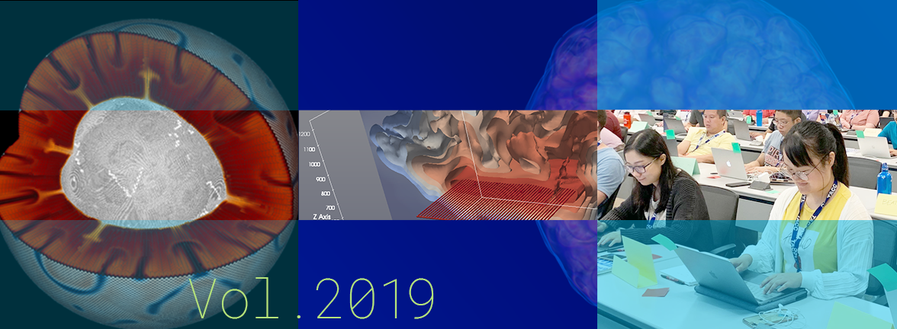

# Better Scientific Software: 2019 Highlights

**Hero Image:**
- [2019 Highlights]

#### Contributed by [Rinku Gupta](https://github.com/rinkug "Rinku Gupta GitHub Profile")

#### Publication date: January 3, 2020

As we stand at the cusp of a new decade, I want to thank the BSSw community, whose efforts have led to great strides in  building better scientific software. In 2019, the BSSw site was revamped to improve user experience through enhanced site navigation, along with additions to our ever-expanding collection of resources. We thank our international community of contributors who are sharing their philosophies and experiences, as well as our readers from all over the world. In this blog post, we list some of the interesting articles and blogs that have especially resonated with readers. We hope to have a productive and fruitful 2020! Happy new year to our entire community!

## Better Planning:
- [FLASH5 Refactoring and PSIP](https://bssw.io/blog_posts/flash5-refactoring-and-psip), Anshu Dubey and Jared  O'Neal
- [The Art of Writing Scientific Software in an Academic Environment](https://bssw.io/blog_posts/the-art-of-writing-scientific-software-in-an-academic-environment), Hartwig Anzt
- [Software As Craft](https://bssw.io/blog_posts/software-as-craft), Paul Wolfenbarger
- [Software Sustainability in the Molecular Sciences](https://bssw.io/blog_posts/software-sustainability-in-the-molecular-sciences), Theresa L. Windus and T. Daniel Crawford 
- [An Introduction to User Stories and How to Write Them](https://bssw.io/items/an-introduction-to-user-stories-and-how-to-write-them), Osni Marques
- [A Look at the Economic Forces in Open Source Software](https://bssw.io/items/a-look-at-the-economic-forces-in-open-source-software), Paul Wolfenbarger
- [Determining Good Enough Practices in Scientific Computing](https://bssw.io/items/determining-good-enough-practices-in-scientific-computing), Patricia Grubel
- [A Look into Self-Perceptions about Software Engineering in the Scientific Community](https://bssw.io/items/a-look-into-self-perceptions-about-software-engineering-in-the-scientific-community), Rinku Gupta

## Better Development:
- [Continuous Technology Refreshment: An Introduction Using Recent Tech Refresh Experiences on VisIt](https://bssw.io/blog_posts/continuous-technology-refreshment-an-introduction-using-recent-tech-refresh-experiences-on-visit), Mark C. Miller and Holly Auten
- [Bloodsuckers, Banshees and Brains: A Bestiary of Scary Software Projects and How to Banish Them](https://bssw.io/blog_posts/bloodsuckers-banshees-and-brains-a-bestiary-of-scary-software-projects-and-how-to-banish-them), Neil Chue Hong and Benjamin Cowan
- [A Checklist for Better Open Source Libraries](https://bssw.io/items/a-checklist-for-better-open-source-libraries), Mike Heroux
- [Working Effectively with Legacy Code](https://bssw.io/items/working-effectively-with-legacy-code/), Roscoe Bartlett
- [Python for HPC](https://bssw.io/items/python-for-hpc), Steve Hudson
- [A Look into Popular Issue Tracking Software](https://bssw.io/items/a-look-into-popular-issue-tracking-software), Jean Shuler

## Better Reliability:
- [Streamlining Software Development through Continuous Integration](https://bssw.io/blog_posts/streamlining-software-development-through-continuous-integration), Glenn Hammond
- [When NOT to Write Automated Tests?](https://bssw.io/blog_posts/when-not-to-write-automated-tests), Roscoe Bartlett
- [Surveying Test-Driven Development in Scientific Software](https://bssw.io/items/surveying-test-driven-development-in-scientific-software), David Bernholdt
- [Understanding Software Testing and How to Make Software Fail](https://bssw.io/items/understanding-software-testing-and-how-to-make-software-fail), David Bernholdt
- [Unit Testing C++ with Catch](https://bssw.io/items/unit-testing-c-with-catch/), Mark Dewing

## Better Performance:
- [Preparing the Next Generation of Supercomputer Users](https://bssw.io/blog_posts/preparing-the-next-generation-of-supercomputer-users), Marta Garcia Martinez
- [Celebrating Apollo's 50th Anniversary: When 100 FLOPS/Watt Was a Giant Leap](https://bssw.io/blog_posts/celebrating-apollo-s-50th-anniversary-when-100-flops-watt-was-a-giant-leap), Mark C. Miller
- [Celebrating Apollo's 50th Anniversary: The Oldest Code on GitHub](https://bssw.io/blog_posts/celebrating-apollo-s-50th-anniversary-the-oldest-code-on-github),  Mark C. Miller
- [Celebrating Apollo's 50th Anniversary: Users' Stories from Space](https://bssw.io/blog_posts/celebrating-apollo-s-50th-anniversary-users-stories-from-space),  Mark C. Miller
- [Introducing Container Mythbusters](https://bssw.io/items/introducing-container-mythbusters), Patricia Grubel

## Better Collaboration:
- [Leading a Scientific Software Project: It's All Personal](https://bssw.io/blog_posts/leading-a-scientific-software-project-it-s-all-personal), Wolfgang Bangerth
- [Building Community through Software Policies](https://bssw.io/blog_posts/building-community-through-software-policies), Piotr Luszczek and Ulrike Meier Yang 
- [2018 BSSw Fellows Tackle Scientific Productivity Challenges](https://bssw.io/blog_posts/2018-bssw-fellows-tackle-scientific-productivity-challenges), Hai Ah Nam
- [Research Software Science: A Scientific Approach to Understanding and Improving How We Develop and Use Software for Research](https://bssw.io/blog_posts/research-software-science-a-scientific-approach-to-understanding-and-improving-how-we-develop-and-use-software-for-research), Mike Heroux
- [Data-driven Software Sustainability](https://bssw.io/blog_posts/data-driven-software-sustainability), Daniel S. Katz
- [Making Open Source Research Software Visible: A Path to Better Sustainability?](https://bssw.io/blog_posts/making-open-source-research-software-visible-a-path-to-better-sustainability), Neil Chue Hong
- [Give Thanks!](https://bssw.io/blog_posts/give-thanks), Angela Herring
- [Accepting High-Quality Software Contributions as Scientific Publications](https://bssw.io/blog_posts/accepting-high-quality-software-contributions-as-scientific-publications), Hartwig Anzt
- [Accelerating Scientific Discovery with Reusable Software: Special issue of IEEE CiSE](https://bssw.io/blog_posts/accelerating-scientific-discovery-with-reusable-software-special-issue-of-ieee-cise), Scott Lathrop

## Better Skills:
- [An Introduction to Online Learning](https://bssw.io/items/an-introduction-to-online-learning), Elaine Raybourn
- [Producing a Webinar Series](https://bssw.io/items/producing-a-webinar-series), Osni Marques
- [Talking about Software Development at SIAM CSE19](https://bssw.io/blog_posts/talking-about-software-development-at-siam-cse19), David Bernholdt, Anshu Dubey, Mike Heroux, Katherine Jones, Daniel S. Katz, Lois Curfman McInnes, and James Willenbring
- [A Look into Rules for Focused Success in a Distracted World](https://bssw.io/items/a-look-into-rules-for-focused-success-in-a-distracted-world), Greg Watson

## Building a Better Scientific Software Community through Your Contributions

We welcome your interest in joining the the BSSw community in raising awareness of the importance of good software practices to scientific productivity.  The BSSw site provides a venue to share information and experiences on scientific software issues.   If you have experience or expertise that can help other scientific software teams, we encourage you to [contribute to the BSSw site](https://bssw.io/pages/what-to-contribute-content-for-better-scientific-software).  We welcome original articles, blog posts, curated links (brief articles that highlight other web-based content), and [event announcements](https://bssw.io/events).

## Author Bio
Rinku Gupta is the Editor-in-Chief of the Better Scientific Software site. She has been a part of the high-performance scientific community for two decades and is a researcher in the field of high-performance fault tolerance, resiliency, middleware libraries and programming models. She is passionate about her work in the area of developer productivity and software sustainability; her current focus lies in partnering with the computational science community on these topics to design better scientific software.

<!---
Publish: yes
Track: community
RSS Update: 2020-01-03
Topics: projects and organizations
Pinned: no
--->

