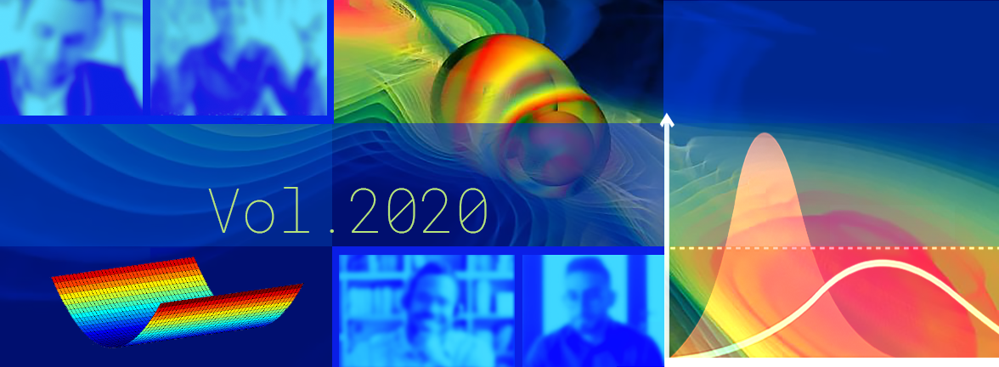

# Better Scientific Software: 2020 Highlights

**Hero Image:**
- [2020 Highlights]

#### Contributed by [Rinku Gupta](https://github.com/rinkug "Rinku Gupta GitHub Profile")

#### Publication date: January 7, 2021

And 2020 wraps! What a year it has been!  I would like to take this opportunity to thank the BSSw international community for rallying together and helping our readers deal with the ambiguity  that arose with sudden challenges of remote working, effective virtual collaborations, and work-family life balance. We are thankful for the thoughtful articles/contributions that were made to the BSSw.io site this year. BSSw.io continues to feature a rapidly-expanding collection of resources from an international community of contributors who are sharing their perspectives on challenges, strategies, and best practices for improving developer productivity and software sustainability. In this blog, we list some of the articles that have most interested our readers this year. As we move into 2021, the BSSw editorial team wishes the entire community a healthy and safe new year. Happy new year!!

## Better Skills:
- [Virtual Meeting Tools and Features for the HPC/CSE Community](https://bssw.io/items/virtual-meeting-tools-and-features-for-the-hpc-cse-community), M. Miller
- [Remote Working in an Agile World](https://bssw.io/items/remote-working-in-an-agile-world), R. Bartlett
- [Cleaning Your Work Surfaces: One Way to Help Flatten the Curve](https://bssw.io/blog_posts/cleaning-your-work-surfaces-one-way-to-help-flatten-the-curve), M. Miller
- [Resources for Maximizing Remote Working](https://bssw.io/items/resources-for-maximizing-remote-working), E. Raybourn
- [Coded Bias: A Film Highlighting Issues of Bias in AI Software](https://bssw.io/items/coded-bias-a-film-highlighting-issues-of-bias-in-ai-software), M. Miller
- [Tips for Producing Online Panel Discussions](https://bssw.io/items/tips-for-producing-online-panel-discussions), E. Raybourn
- [A List of Free Online Programming and Computer Science Courses](https://bssw.io/items/a-list-of-free-online-programming-and-computer-science-courses), R. Gupta
- [Using Personal Kanban for Productivity](https://bssw.io/items/using-personal-kanban-for-productivity), P. Grubel
- [Best Practices for HPC Software Developers Webinar Series](https://bssw.io/items/best-practices-for-hpc-software-developers-webinar-series), O. Marques

## Better Planning:
- [Recent Successes with PSIP on HDF5](https://bssw.io/blog_posts/recent-successes-with-psip-on-hdf5),  M. Miller, E. Pourmal, and E. Gonsiorowski 
- [Digging Deeper into Agile Software Development](https://bssw.io/items/digging-deeper-into-agile-software-development), R. Bartlett
- [A Look at Detrimental Effects of Context Switching with DevOps](https://bssw.io/items/a-look-at-detrimental-effects-of-context-switching-with-devops), P. Grubel
- [Working Remotely: The Spack Team](https://bssw.io/blog_posts/working-remotely-the-spack-team), T. Gamblin and E. Raybourn
- [Making Myself Better: What Craftspeople Can Teach Us about Software](https://bssw.io/blog_posts/making-myself-better-what-craftspeople-can-teach-us-about-software), W. Bangerth
- [Maintainers Drive Software Sustainability](https://bssw.io/blog_posts/maintainers-drive-software-sustainability), S. Smith
- [A Community of Practice around Peer Review for Long-Term Research Software Sustainability](https://bssw.io/blog_posts/a-community-of-practice-around-peer-review-for-long-term-research-software-sustainability), K. Ram, C. Boettiger, S. Chamberlain, N. Ross, M. Salmon and S. Butland.

## Better Development:
- [What Does This Line Do? The Challenge of Writing a Well-Documented Code](https://bssw.io/blog_posts/what-does-this-line-do-the-challenge-of-writing-a-well-documented-code), M. Stoyanov
- [The Lazy Approach to Developing Scientific Research Software](https://bssw.io/blog_posts/the-lazy-approach-to-developing-scientific-research-software), C. Adorf and V. Ramasubramani
- [Lack of Evidence In Software Engineering](https://bssw.io/items/lack-of-evidence-in-software-engineering), G. Watson

## Better Reliability:
- [Testing Non-Deterministic Research Software](https://bssw.io/blog_posts/testing-non-deterministic-research-software), N. Eisty
- [Software and Workflow Development](https://bssw.io/items/software-and-workflow-development), P. Grubel
- [Porting the Ginkgo Package to AMD's HIP Ecosystem](https://bssw.io/blog_posts/porting-the-ginkgo-package-to-amd-s-hip-ecosystem), H. Anzt

## Better Performance:
- [Performance Portability and the Exascale Computing Project](https://bssw.io/blog_posts/performance-portability-and-the-exascale-computing-project), A. Dubey
- [The Apollo Guidance Computer in Depth](https://bssw.io/items/the-apollo-guidance-computer-in-depth), M. Miller

## Better Collaboration:
- [Working Remotely: The Exascale Computing Project (ECP) Panel Series](https://bssw.io/blog_posts/working-remotely-the-exascale-computing-project-ecp-panel-series), E. Raybourn, R. Milewicz, D. Rogers, E. Gonsiorowski, B. Sims and G. Watson
- [The Collegeville Workshop Series on Scientific Software](https://bssw.io/items/the-collegeville-workshop-series-on-scientific-software), M. Heroux
- [A Collection of Resources for Sustaining Open Source Software](https://bssw.io/items/a-collection-of-resources-for-sustaining-open-source-software), T. Gamblin
- [The RSE-HPC-2020 Workshop: Creating Community, Building Careers, Addressing Challenges](https://bssw.io/blog_posts/the-rse-hpc-2020-workshop-creating-community-building-careers-addressing-challenges), C. Ferenbaugh, S. Gesing, S. Hettrick and D. Katz
- [Scientific Software Bloggers and Podcasts Worth Following](https://bssw.io/items/scientific-software-bloggers-and-podcasts-worth-following), D. Bernholdt
- [Increasing Productivity by Broadening Participation in Scientific Software Communities](https://bssw.io/blog_posts/increasing-productivity-by-broadening-participation-in-scientific-software-communities), M. A. Leung, D. Rouson and L.C McInnes
- [The Four Pillars of Research Software Engineering](https://bssw.io/items/the-four-pillars-of-research-software-engineering), R. Gupta
- [2019 BSSw Fellows Guide Developers through Each Stage of the Scientific Software Lifecycle](https://bssw.io/blog_posts/2019-bssw-fellows-guide-developers-through-each-stage-of-the-scientific-software-lifecycle), H. A. Nam, R. Gassmoeller, I. Laguna, T. Malik and K. Niemeyer
- [A Minisymposium on Improving Productivity and Sustainability for Parallel Computing Software](https://bssw.io/items/a-minisymposium-on-improving-productivity-and-sustainability-for-parallel-computing-software), R. Gupta
- [Scientific Software Projects and Their Communities](https://bssw.io/blog_posts/scientific-software-projects-and-their-communities), R. Gassmoeller
- [An Introduction to National RSE Organizations](https://bssw.io/items/an-introduction-to-national-rse-organizations), R. Gupta
- [Research Software Engineer Stories](https://bssw.io/blog_posts/research-software-engineer-stories),  V. Sochat

## Building a better scientific software community through your contributions

We welcome your interest in joining the the BSSw community in raising awareness of the importance of good software practices to scientific productivity.  The BSSw site provides a venue to share information and experiences on scientific software issues.   If you have experience or expertise that can help other scientific software teams, we encourage you to [contribute to the BSSw site](https://bssw.io/pages/what-to-contribute-content-for-better-scientific-software).  We welcome original articles, blog posts, curated links (brief articles that highlight other web-based content), and [event announcements](https://bssw.io/events).

## Author bio
Rinku Gupta is the Editor-in-Chief of the Better Scientific Software site. She has been a part of the high-performance scientific community for two decades and is a researcher in the field of high-performance fault tolerance, resiliency, middleware libraries and programming models. She is passionate about her work in the area of developer productivity and software sustainability; her current focus lies in partnering with the computational science community on these topics to design better scientific software.

<!---
Publish: yes
Track: community
Pinned: no
RSS Update: 2021-01-07
Topics: projects and organizations
--->

