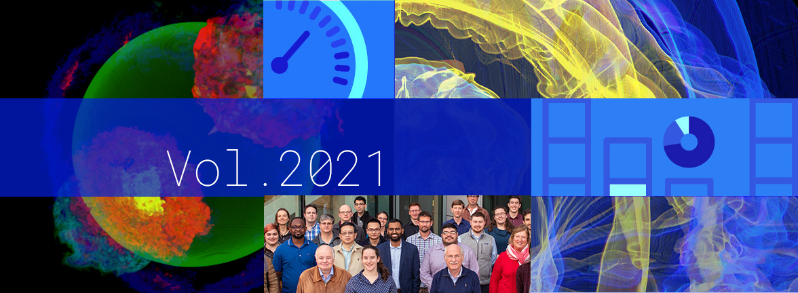

# Better Scientific Software: 2021 Highlights

**Hero Image:**
- [2021 Highlights]

#### Contributed by [Rinku Gupta](https://github.com/rinkug "Rinku Gupta GitHub Profile")

#### Publication date: January 10, 2022

2022 marks the beginning of the 5th year of Better Scientific Software (BSSw) since its inception in November 2017. The last few years have been an exciting journey. We have had opportunities to work with several new authors and collaborators who have resonated with our readers. We would like to thank our readers and collaborators from all over the world, who have been enthusiastic in sharing their experiences and contributions, for being a part of the BSSw community. While the world continues to work in hybrid mode, we are looking forward to a healthy and productive 2022! In this blog post, we list some of the interesting content from over the last year that was popular with our readers. Happy new year to the BSSw community!

### Better Skills:
- [An Introduction to Open Source Guides](https://bssw.io/items/an-introduction-to-open-source-guides), R. Gupta
- [Making Software: What Really Works, and Why We Believe It](https://bssw.io/items/making-software-what-really-works-and-why-we-believe-it), P. Wolfenbarger
- [Scaling Yourself as a Software Developer](https://bssw.io/items/scaling-yourself-as-a-software-developer), P. Grubel
- [The 10 Best Practices for Remote Software Engineering](https://bssw.io/items/the-10-best-practices-for-remote-software-engineering), R. Gupta
- [Software Sustainability Institute Guides](https://bssw.io/items/software-sustainability-institute-guides), P. Grubel
- [Producing a Webinar Series](https://bssw.io/items/producing-a-webinar-series), O. Marques

### Better Planning:
- [When Not to Use Agile in Scientific Software Development](https://bssw.io/blog_posts/when-not-to-use-agile-in-scientific-software-development), A. Dubey
- [Useful Practices for Software Engineering on Medium-Sized Distributed Scientific Projects](https://bssw.io/blog_posts/useful-practices-for-software-engineering-on-medium-sized-distributed-scientific-projects), K. Beattie and D. Gunter
- [Use of Software Metrics in Research Software](https://bssw.io/blog_posts/use-of-software-metrics-in-research-software), N. Eisty
- [Keep Interest on Technical Debt from Sinking Your Software Project](https://bssw.io/items/keep-interest-on-technical-debt-from-sinking-your-software-project), M. Miller
- [Exploring Best Practices for Scientific Computing](https://bssw.io/items/exploring-best-practices-for-scientific-computing), P. Grubel
- [Improving Team Practices with RateYourProject.org](https://bssw.io/blog_posts/improving-team-practices-with-rateyourproject-org), G. Watson
- [How Community Software Ecosystems Can Unlock the Potential of Exascale Computing](https://bssw.io/items/how-community-software-ecosystems-can-unlock-the-potential-of-exascale-computing), R. Gupta
- [The Contributions of Scientific Software to Scientific Discovery](https://bssw.io/blog_posts/the-contributions-of-scientific-software-to-scientific-discovery), K. Keahey and R. Gupta

### Better Development:
- [Working within Multiple Git Branches Simultaneously](https://bssw.io/items/working-within-multiple-git-branches-simultaneously), M. Miller
- [Kanban and Scrum: Making the Best of Both](https://bssw.io/items/kanban-and-scrum-making-the-best-of-both), R. Bartlett
- [Inclusive Naming Initiative](https://bssw.io/items/inclusive-naming-initiative), M. Miller
- [Things You Should Never Do, Part I](https://bssw.io/items/things-you-should-never-do-part-i), R. Bartlett
- [Executable Environments for Software, Data, and Publication](https://bssw.io/items/executable-environments-for-software-data-and-publication), J. Shuler
- [Coding Conventions](https://bssw.io/items/coding-conventions), R. Bartlett
- [Pull Request Size Matters](https://bssw.io/items/pull-request-size-matters), M. Miller

### Better Reliability:
- [GitHub Actions for Automation](https://bssw.io/items/github-actions-for-automation), M. Miller
- [Debugging: Books to Help You Get Started](https://bssw.io/items/debugging-books-to-help-you-get-started), R. Gupta
- [Practices for Productive Software Development in Kokkos](https://bssw.io/blog_posts/practices-for-productive-software-development-in-kokkos), N. Ellingwood and S. Rajamanickam
- [E4S: Extreme-Scale Scientific Software Stack](https://bssw.io/blog_posts/e4s-extreme-scale-scientific-software-stack), S. Shende, M. Heroux and H. Willenbring
- [HPC and the Lab Manager](https://bssw.io/blog_posts/hpc-and-the-lab-manager), C. Graziani
- [Reflecting on Our Community: The SC21 BoF on Software Engineering and Reuse in Modeling, Simulation, and Data Analytics for Science and Engineering](https://bssw.io/blog_posts/reflecting-on-our-community-the-sc21-bof-on-software-engineering-and-reuse-in-modeling-simulation-and-data-analytics-for-science-and-engineering), D. Bernholdt et al.

### Better Performance:
- [An Introductory Resource for High-Performance Computing](https://bssw.io/items/an-introductory-resource-for-high-performance-computing), R. Gupta
- [A Gentle Introduction to GPU Programming](https://bssw.io/blog_posts/a-gentle-introduction-to-gpu-programming), M. Russo and A. Myers

### Better Collaboration:
- [NSF-Sponsored 2021 BSSw Fellows](https://bssw.io/blog_posts/nsf-sponsored-2021-bssw-fellows), H. A. Nam
- [A Look at Software-Focused Topics at SIAM CSE21](https://bssw.io/blog_posts/a-look-at-software-focused-topics-at-siam-cse21), BSSw Community
- [Encouraging Effective Retrospective Strategies for Team Projects](https://bssw.io/blog_posts/encouraging-effective-retrospective-strategies-for-team-projects), L. Sorg
- [Experiences from the 2021 BSSw.io Community BOF](https://bssw.io/blog_posts/experiences-from-the-2021-bssw-io-community-bof), R. Gupta, A. Maddhuri and D. Stevens
- [2020 BSSw Fellows: Projects and Perspectives](https://bssw.io/blog_posts/2020-bssw-fellows-projects-and-perspectives), H. A. Nam, D. Rouson, N. Eisty and C. Rubio-Gonzalez
- [Effectively Integrating Interns into Research Teams](https://bssw.io/blog_posts/effectively-integrating-interns-into-research-teams), J. Lofstead
- [Software Team Experiences and Challenges: A Report from Day 1 of the 2021 Collegeville Workshop on Scientific Software](https://bssw.io/blog_posts/software-team-experiences-and-challenges-a-report-from-day-1-of-the-2021-collegeville-workshop-on-scientific-software), C. Balos et al.
- [Best Practices for HPC Software Developers: The First Five Years of the Webinar Series](https://bssw.io/blog_posts/best-practices-for-hpc-software-developers-the-first-five-years-of-the-webinar-series), O. Marques and D. Bernholdt
- [Software Team Experiences and Challenges: A Report from Day 2 of the 2021 Collegeville Workshop on Scientific Software](https://bssw.io/blog_posts/software-team-experiences-and-challenges-a-report-from-day-2-of-the-2021-collegeville-workshop-on-scientific-software), K. Beattie et al.
- [An Introduction to National RSE Organizations](https://bssw.io/items/an-introduction-to-national-rse-organizations), R. Gupta
- [Cultural Approaches to Improved Software Teams: A Report from Day 3 of the 2021 Collegeville Workshop on Scientific Software](https://bssw.io/blog_posts/cultural-approaches-to-improved-software-teams-a-report-from-day-3-of-the-2021-collegeville-workshop-on-scientific-software), M. Heroux et al.

### Building a better scientific software community through your contributions

We welcome your interest in joining the the BSSw community in raising awareness of the importance of good software practices to scientific productivity.  The BSSw site provides a venue to share information and experiences on scientific software issues.   If you have experience or expertise that can help other scientific software teams, we encourage you to [contribute to the BSSw site](https://bssw.io/pages/what-to-contribute-content-for-better-scientific-software).  We welcome original articles, blog posts, curated links (brief articles that highlight other web-based content), and [event announcements](https://bssw.io/events).

### Author bio
Rinku Gupta is the Editor-in-Chief of the Better Scientific Software site. She has been a part of the high-performance scientific community for two decades and is a researcher in the field of high-performance fault tolerance, resiliency, middleware libraries and programming models. She is passionate about her work in the area of developer productivity and software sustainability; her current focus lies in partnering with the computational science community on these topics to design better scientific software.

<!---
Publish: yes
Track: community
Pinned: no
RSS Update: 2022-01-10
Topics: projects and organizations
--->

