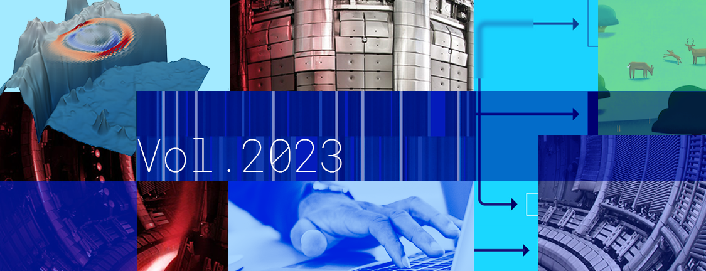

# Better Scientific Software: 2023 Highlights

**Hero Image:**
- [2023 Highlights]

#### Contributed by [Rinku Gupta](https://github.com/rinkug "Rinku Gupta GitHub Profile")

#### Publication date: January 09, 2024

Entering the threshold of 2024, we mark the eighth year in the BSSw.io journey, extending our heartfelt appreciation to the vibrant BSSw.io community. Your steadfast support enables BSSw.io to serve as a hub for disseminating knowledge on software sustainability, productivity, and quality. This platform thrives on the diverse contributions from an ever-expanding international community, providing unique perspectives on the challenges, strategies, and best practices within the realm of scientific software.

The past year has seen a wealth of contributions, with insightful articles and perspectives enriching our collaborative community. This spirit of collaboration spurred us to introduce a new topic, delving into the world of research software engineers (RSEs). This specific inclusion aims to offer more nuanced perspectives on RSEs, highlighting the impact of these professionals in the broader context of scientific software development. This addition, alongside the existing wealth of content, aims to enhance the reader experience, providing a more comprehensive view of the ever-changing landscape of scientific software development.

Within this blog post, we shine a spotlight on articles and blogs that showcase the depth and breadth of knowledge shared on BSSw.io during the past year. As we embrace the opportunities that 2024 brings, we encourage further collaboration, innovation, and exploration of emerging trends in scientific software development.

To our dedicated contributors, readers, and supporters, your unwavering commitment is the cornerstone of BSSw.io's success. Happy New Year to the entire BSSw.io community! May this year usher in continued growth and collaboration in advancing the field of better scientific software.

### Better Skills:
* [Thank you from the BSSw.io Editorial Team!](https://bssw.io/blog_posts/thank-you-from-the-bssw-io-editorial-team), The BSSw.io Editorial Team.
* [INTERSECT: Training for Research Software Engineering](https://bssw.io/blog_posts/intersect-training-for-research-software-engineering), J. Carver et al.
* [Best Practices for HPC Software Developers Webinar Series](https://bssw.io/items/best-practices-for-hpc-software-developers-webinar-series), O. Marques.
* [Better Scientific Software Tutorial Site](https://bssw.io/items/better-scientific-software-tutorial-site), D. Stevens.
* [How Open Source Tooling Is Changing the Way Professional Researchers Learn to Code](https://bssw.io/blog_posts/how-open-source-tooling-is-changing-the-way-professional-researchers-learn-to-code), J. S. Lowndes.
* [Busy != Productive](https://bssw.io/blog_posts/busy-productive), R. Underwood.
* [Lessons Learned Transitioning from Experimental to Computational Science](https://bssw.io/blog_posts/lessons-learned-transitioning-from-experimental-to-computational-science), J. O'Neal.

### Better Planning:
* [Secure Software Programming Practices and Development](https://bssw.io/blog_posts/secure-software-programming-practices-and-development), N. Sukhija.
* [SOLID Design Principles](https://bssw.io/items/solid-design-principles), R. Bartlett.
* [Training Materials for Research Software Engineering at INTERSECT](https://bssw.io/items/training-materials-for-research-software-engineering-at-intersect), R. Gupta.
* [Fear of Large Codes](https://bssw.io/blog_posts/fear-of-large-codes), F. Rizzi.
* [Software Sustainability Matrix](https://bssw.io/items/software-sustainability-matrix), R. Bartlett.
* [Enabling Complex Scientific Applications](https://bssw.io/blog_posts/enabling-complex-scientific-applications), A. Reinarz et al.
* [When is worse better?](https://bssw.io/items/when-is-worse-better), M. Miller.
* [Scientific Software Teams Collegeville Workshop 2021: Special Issue of IEEE CiSE](https://bssw.io/items/scientific-software-teams-collegeville-workshop-2021-special-issue-of-ieee-cise), R. Gupta.
* [US Federal Government Effort to Champion Adoption of Memory Safe Languages](https://bssw.io/items/us-federal-government-effort-to-champion-adoption-of-memory-safe-languages), R. Bartlett.

### Better Development:
* [OpenSSF Best Practices Badge Program](https://bssw.io/blog_posts/openssf-best-practices-badge-program), R. Bartlett.
* [How to Write a Git Commit Message](https://bssw.io/items/how-to-write-a-git-commit-message), D. Stevens.
* [Color Oracle: Enhancing Software Accessibility for Color-Blind Users](https://bssw.io/items/color-oracle-enhancing-software-accessibility-for-color-blind-users), D. Stevens.
* [Long-Term Software Gardening Strategies for Cultivating Scientific Development Ecosystems](https://bssw.io/blog_posts/long-term-software-gardening-strategies-for-cultivating-scientific-development-ecosystems), D. Bunten et al.
* [Developer Documenting Done Right](https://bssw.io/items/developer-documenting-done-right), R. Gupta.

### Better Reliability:
* [Summer of Reproducibility: Exposing Students to Research Advancing Practical Reproducibility](https://bssw.io/blog_posts/summer-of-reproducibility-exposing-students-to-research-advancing-practical-reproducibility), S. Lieggi et al.
* [Smart Libraries: 30+ Practices, 20+ Years...Still Relevant](https://bssw.io/items/smart-libraries-30-practices-20-years-still-relevant), M. Miller.
* [Google Guidance on Code Review](https://bssw.io/items/google-guidance-on-code-review), R. Bartlett.
* [Science as Amateur Software Development](https://bssw.io/items/science-as-amateur-software-development), D. Stevens.
* [Supporting Reproducibility and Replicability Initiatives](https://bssw.io/items/supporting-reproducibility-and-replicability-initiatives), R. Gupta.
* [What is Peer Code Review?](https://bssw.io/items/what-is-peer-code-review), R. Bartlett.

### Better Performance:
* [I/O Sleuthing: Digging into Storage Performance](https://bssw.io/blog_posts/i-o-sleuthing-digging-into-storage-performance), R. Latham.
* [Containers for Deploying Workflow Systems and Application Codes](https://bssw.io/blog_posts/containers-for-deploying-workflow-systems-and-application-codes), K. Vahi.
* [Improving Application Performance by Optimizing I/O](https://bssw.io/blog_posts/improving-application-performance-by-optimizing-i-o), R. Arora.
* [The Turing Way: Reproducible and Ethical Science](https://bssw.io/items/the-turing-way-reproducible-and-ethical-science), J. Brown et al.
* [Julia's Value Proposition for Better Scientific Software](https://bssw.io/blog_posts/julia-s-value-proposition-for-better-scientific-software), W. Godoy.

### Better Collaboration:
* [US Federal Government Effort to Champion Adoption of Memory Safe Languages](https://bssw.io/items/us-federal-government-effort-to-champion-adoption-of-memory-safe-languages), M. Miller.
* [All In for Maintainers DEI Resource Hub](https://bssw.io/items/all-in-for-maintainers-dei-resource-hub), D. Stevens.
* [Persistent Identifiers for Software in Scientific Computing](https://bssw.io/items/persistent-identifiers-for-software-in-scientific-computing), R. Gupta.
* [The Future of Research Software Engineers in the United States: Special Issue in CiSE](https://bssw.io/blog_posts/the-future-of-research-software-engineers-in-the-united-states-special-issue-in-cise), J. Carver et al.
* [Surveys to Understand Developer Health and Happiness](https://bssw.io/blog_posts/surveys-to-understand-developer-health-and-happiness), V. Sochat.
* [Is Project Management Killing your Software Product?](https://bssw.io/items/is-project-management-killing-your-software-product), R. Gupta.
* [A Collection of Open Source Software Maintainer Guides](https://bssw.io/items/a-collection-of-open-source-software-maintainer-guides), D. Stevens.
* [Where and How to Publish CSE Software?](https://bssw.io/items/where-and-how-to-publish-cse-software), D. Ibanez.
* [NumFOCUS: A Fiscal Sponsor of Scientific Software](https://bssw.io/blog_posts/numfocus-a-fiscal-sponsor-of-scientific-software), A. Terrel.
* [The Anatomy of a Central RSE Team](https://bssw.io/blog_posts/the-anatomy-of-a-central-rse-team), M. Bluteau.
* [Guidebook for Inclusive Scientific Meetings](https://bssw.io/items/guidebook-for-inclusive-scientific-meetings), D. Stevens.

### Building a better scientific software community through your contributions

The BSSw site remains an open platform for sharing information and experiences related to scientific software issues. If you possess expertise or experiences that can benefit other scientific software teams, we encourage you to [contribute to the BSSw site](https://bssw.io/pages/what-to-contribute-content-for-better-scientific-software). Whether through original articles, blog posts, curated links that highlight web-based content, or [event announcements](https://bssw.io/events), your contributions play a crucial role in fostering a collaborative and supportive environment.

Thank you for being an integral part of the BSSw community. Here's to another year of shared knowledge, collaboration, and advancements in better scientific software. We look forward to your continued contributions in 2024!

### Author bio
Rinku Gupta is the Editor-in-Chief of the Better Scientific Software site. She has been a part of the high-performance scientific community for two decades and is a researcher in the field of high-performance fault tolerance, resiliency, middleware libraries and programming models. She is passionate about her work in the area of developer productivity and software sustainability; her current focus lies in partnering with the computational science community on these topics to design better scientific software.

<!---
Publish: yes
Track: community
Pinned: no
RSS Update: 2024-01-08
Topics: projects and organizations
--->

