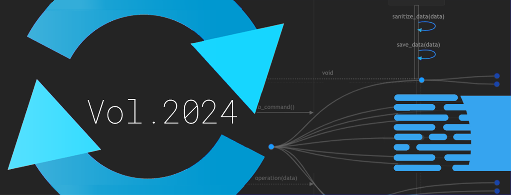

# Better Scientific Software: 2024 Highlights

**Hero Image:**
- [2024 Highlights]

#### Contributed by [Rinku Gupta](https://github.com/rinkug "Rinku Gupta GitHub Profile")

#### Publication date: January 13, 2025

As we close out 2024 and look ahead to 2025, it’s a great time to reflect on another year of growth and progress for the BSSw.io community. 
This year, we’ve continued to build on our shared mission of improving software sustainability, productivity, and quality. 
Thanks to the ongoing contributions from our community, BSSw.io remains a trusted resource for those striving to make scientific software better.
In this blog post, we highlight articles and blogs that demonstrate the wide-ranging expertise shared on BSSw.io over the past year.
While the journey to better software can sometimes feel like exploring a complex puzzle with only a few pieces at first, we’ve made significant strides by learning from each other, sharing insights, and helping to piece it all together. 
As we move into 2025, we’re excited to keep up the momentum, face new challenges, and maybe even write some flawless code (hey, we can dream!).
Here’s to another year of collaboration, growth, and making software better together. Happy New Year to the entire BSSw community—let’s make 2025 even more awesome!

### Better Planning:
* [Effective Metrics for Measuring and Enhancing Sustainability in Scientific Software](https://bssw.io/blog_posts/effective-metrics-for-measuring-and-enhancing-sustainability-in-scientific-software), A. Malviya-Thakur and G. Watson.
* [Framing User Experience (UX) Across the Scientific Software Lifecycle](https://bssw.io/blog_posts/framing-user-experience-ux-across-the-scientific-software-lifecycle), D. Paine.
* [Technical Properties of Sustainable Software](https://bssw.io/blog_posts/technical-properties-of-sustainable-software), R. A. Bartlett.
* [Guide to Securing Scientific Software](https://bssw.io/items/guide-to-securing-scientific-software), P. Grubel.
* [Debunking the Myth That Upfront Requirements Are Infeasible for Scientific Computing Software](https://bssw.io/items/debunking-the-myth-that-upfront-requirements-are-infeasible-for-scientific-computing-software), R. Gupta.
* [Reflecting on Our Community: The SC23 BoF on Scientific Software and the People Who Make it Happen: Building Communities of Practice](https://bssw.io/blog_posts/reflecting-on-our-community-the-sc23-bof-on-scientific-software-and-the-people-who-make-it-happen-building-communities-of-practice), D. E. Bernholdt, R. Speck, A. O’Cais et al.
* [Perspectives on Memory-Safe Languages](https://bssw.io/items/perspectives-on-memory-safe-languages), M. C. Miller.
* [Generating Software Bill of Materials (SBOMs) in Scientific Software](https://bssw.io/blog_posts/generating-software-bill-of-materials-sboms-in-scientific-software), W. Hart.
* [Resources for Open Source Program Offices](https://bssw.io/items/resources-for-open-source-program-offices), P. Grubel.
  
### Better Development:
* [Diátaxis: A Systematic Approach to Technical Documentation Authoring](https://bssw.io/items/diataxis-a-systematic-approach-to-technical-documentation-authoring), K. Beattie.
* [C++ Core Guidelines](https://bssw.io/items/c-core-guidelines), R. A. Bartlett.
* [Manual Work is a Bug](https://bssw.io/items/manual-work-is-a-bug), R. A. Bartlett.
* [How to Write a Git Commit Message](https://bssw.io/items/how-to-write-a-git-commit-message), D. Stevens.
* [Visually Communicating Elements of Software Design](https://bssw.io/blog_posts/visually-communicating-elements-of-software-design), R. Mudafort.
* [Security Misconfigurations in Kubernetes Configuration Files](https://bssw.io/blog_posts/security-misconfigurations-in-kubernetes-configuration-files), A. Rahman.
* [Jupyter4Science: Better Practices for Using Jupyter Notebooks for Science](https://bssw.io/items/jupyter4science-better-practices-for-using-jupyter-notebooks-for-science), N. Brewer.

### Better Reliability:
* [Technical Debt in Practice: How to Find It and Fix It](https://bssw.io/items/technical-debt-in-practice-how-to-find-it-and-fix-it), R. A. Bartlett.
* [Discontinuing a Research Software Project](https://bssw.io/blog_posts/discontinuing-a-research-software-project), M. C. Miller.
* [Practical Reproducibility: Building a More Robust Research Ecosystem](https://bssw.io/blog_posts/practical-reproducibility-building-a-more-robust-research-ecosystem), K. Keahey and M. Richardson.
* [The New ACM Conference on Reproducibility and Replicability (ACM REP)](https://bssw.io/blog_posts/the-new-acm-conference-on-reproducibility-and-replicability-acm-rep), J. Lofstead. 
* [Portability is Reliability](https://bssw.io/items/portability-is-reliability), M. C. Miller.
* [Come for Syntax, Stay for Speed, and Understand Bugs in Julia Programs](https://bssw.io/blog_posts/come-for-syntax-stay-for-speed-and-understand-bugs-in-julia-programs), A. Rahman.
* [Code-Review.org: An Online Tutorial to Improve Your Code Review Skills](https://bssw.io/blog_posts/code-review-org-an-online-tutorial-to-improve-your-code-review-skills), H. Kershaw.

### Better Collaboration:
* [Creating a Career Path for Research Software Engineers](https://bssw.io/items/creating-a-career-path-for-research-software-engineers), R. Gupta.
* [Getting Started with the RSE Movement within Your Organization: A Guide for Individuals](https://bssw.io/items/getting-started-with-the-rse-movement-within-your-organization-a-guide-for-individuals), K. Beattie.
* [Thank You from the BSSw.io Editorial Team!](https://bssw.io/blog_posts/thank-you-from-the-bssw-io-editorial-team), The BSSw.io Editorial Team.
* [Bettering Software (and Science) through Improved Communication](https://bssw.io/blog_posts/bettering-software-and-science-through-improved-communication), H. Bourbeau et al.
* [2023 BSSw Fellows: Projects and Perspectives](https://bssw.io/blog_posts/2023-bssw-fellows-projects-and-perspectives), E. Gonsiorowski, N. Brewer, M. Cohen, et al.
* [Launch of the High Performance Software Foundation](https://bssw.io/blog_posts/launch-of-the-high-performance-software-foundation), C. Trott and T. Gamblin.
* [Introducing the Consortium for the Advancement of Scientific Software (CASS)](https://bssw.io/blog_posts/introducing-the-consortium-for-the-advancement-of-scientific-software-cass), D. E. Bernholdt, P. Carns, A. Dubey, et al.
* [A Collection of Guidance and Templates for Open-source Software (OSS) Projects](https://bssw.io/items/a-collection-of-guidance-and-templates-for-open-source-software-oss-projects), P. Grubel.
* [Research Software Engineers in HPC (RSE-HPC-2023): A Summary of the SC23 Workshop](https://bssw.io/blog_posts/research-software-engineers-in-hpc-rse-hpc-2023-a-summary-of-the-sc23-workshop), C. Ferenbaugh, S. Gesing, S. Hettrick, and D. S. Katz

### Better Performance:
* [Balancing Productivity, Portability and Performance in CFD](https://bssw.io/items/balancing-productivity-portability-and-performance-in-cfd), M. C. Miller. 
* [The Turing Way: Reproducible and Ethical Science](https://bssw.io/items/the-turing-way-reproducible-and-ethical-science), J. Brown and M. C. Miller.

### Better Skills:
* [Identifying the Foundational Competencies of a Research Software Engineer](https://bssw.io/blog_posts/identifying-the-foundational-competencies-of-a-research-software-engineer), J. Cohen, F Löffler, et al.
* [Numerical Recipes Books](https://bssw.io/items/numerical-recipes-books), M. C. Miller.
* [Formal Course Resources for Learning about HPC](https://bssw.io/items/formal-course-resources-for-learning-about-hpc), M. C. Miller.
* [Best Practices for HPC Software Developers Webinar Series](https://bssw.io/items/best-practices-for-hpc-software-developers-webinar-series), O. Marques and D. E. Bernholdt.
* [What Science Says Is the Best Font](https://bssw.io/items/what-science-says-is-the-best-font), M. C. Miller.
  
### Building a better scientific software community through your contributions

The BSSw site remains an open platform for sharing information and experiences related to scientific software issues. If you possess expertise or experiences that can benefit other scientific software teams, we encourage you to [contribute to the BSSw site](https://bssw.io/pages/what-to-contribute-content-for-better-scientific-software). Whether through original articles, blog posts, curated links that highlight web-based content, or [event announcements](https://bssw.io/events), your contributions play a crucial role in fostering a collaborative and supportive environment.

A huge thank you to each and every one of you for making the BSSw community what it is. 
With another year ahead, we’re excited to continue learning, collaborating, and pushing the boundaries of what’s possible in scientific software. 
We can’t wait to see what we’ll accomplish together—your insights and contributions are what make it all happen!

### Author bio
Rinku Gupta is the Editor-in-Chief of the Better Scientific Software site. She has been a part of the high-performance scientific community for two decades and is a researcher in the field of high-performance fault tolerance, resiliency, middleware libraries and programming models. She is passionate about her work in the area of developer productivity and software sustainability; her current focus lies in partnering with the computational science community on these topics to design better scientific software.

<!---
Publish: yes
Track: community
Pinned: no
RSS Update: 2025-01-13
Topics: projects and organizations
--->
