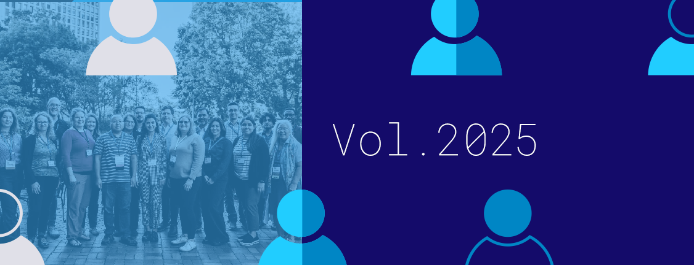

# Better Scientific Software: 2025 Highlights

**Hero Image:**
- [2025 Highlights]

#### Contributed by [Rinku Gupta](https://github.com/rinkug "Rinku Gupta GitHub Profile")

#### Publication date: January 09, 2026

As we wrap up 2025, we want to take a moment to celebrate the people who make BSSw.io what it is: our contributors, readers, and supporters from around the world. 
This year brought another wave of thoughtful articles, practical insights, and shared experiences focused on improving software sustainability, productivity, and quality across the scientific software ecosystem. 
The generosity of our community in openly sharing successes, challenges, and lessons learned continues to be the heart of BSSw.io. 
In this blog post, we highlight a selection of content from 2025 that especially resonated with our readers and reflects the evolving ways we build and sustain scientific software together. 
Thank you for being part of this journey with us. 
We are excited to carry this energy into the year ahead. Happy New Year to the entire BSSw community.

## Better Planning:
* [Evaluation of Research Software: The CDUR Procedure](https://bssw.io/items/evaluation-of-research-software-the-cdur-procedure), P. Grubel.
* [Sustaining MPICH: 30+ Years of High-Performance Computing Software](https://bssw.io/blog_posts/sustaining-mpich-30-years-of-high-performance-computing-software), K. Raffenetti.
* [User Experience Engineering in the Lifecycle of Scientific Software](https://bssw.io/blog_posts/user-experience-engineering-in-the-lifecycle-of-scientific-software), C. O'Donnell and D. Paine.
* [User Experience Design (UXD) in the Lifecycle of Scientific Software](https://bssw.io/blog_posts/user-experience-design-uxd-in-the-lifecycle-of-scientific-software), S. Poon, R. Deshmukh and D. Paine.
* [What's in a Browser?](https://bssw.io/items/what-s-in-a-browser), M. C. Miller.
* [Sunsetting Open Source Projects: Dos and Don’ts](https://bssw.io/items/sunsetting-open-source-projects-dos-and-don-ts), K. Beattie.
* [Growing Resilient Scientific Software Ecosystems: Introducing the Software Gardening Almanack](https://bssw.io/blog_posts/growing-resilient-scientific-software-ecosystems-introducing-the-software-gardening-almanack),  D. Bunten, W. Davidson, and D. P. Way.
* [Technical Credit](https://bssw.io/items/technical-credit), R. A. Bartlett.
* [Creating An Offboarding Checklist for Technical Projects](https://bssw.io/items/creating-an-offboarding-checklist-for-technical-projects), K. Beattie.
* [Software Engineers and Scientific Software](https://bssw.io/blog_posts/software-engineers-and-scientific-software), R. A. Rubio.
* [Reflecting on Our Community: The SC24 BoF on Scientific Software and the People Who Make it Happen: Building Communities of Practice](https://bssw.io/blog_posts/reflecting-on-our-community-the-sc24-bof-on-scientific-software-and-the-people-who-make-it-happen-building-communities-of-practice),  D. E. Bernholdt, J.  C. Carver, I. A. Cosden et al.
  
## Better Development:
* [AI Tools Enable New Modes of Scientific Software Engagement](https://bssw.io/items/ai-tools-enable-new-modes-of-scientific-software-engagement), M. A. Heroux.
* [Design Systems To Help Amplify Development of Usable Scientific Software Interfaces](https://bssw.io/blog_posts/design-systems-to-help-amplify-development-of-usable-scientific-software-interfaces), D. Paine.
* [AI Tools Cause Shift in Which Skills are Important](https://bssw.io/items/ai-tools-cause-shift-in-which-skills-are-important), M. A. Heroux.
* [Is AI the New Rubber Duck and Will It Replace Human Coders](https://preview.bssw.io/items/is-ai-the-new-rubber-duck-and-will-it-replace-human-coders), K. Beattie.
* [Don't Package Your Libraries, Write Packageable Libraries](https://bssw.io/items/don-t-package-your-libraries-write-packageable-libraries), P. Grubel.
* [How Investing in Documentation Makes Even a Single-Developer Project Better](https://bssw.io/blog_posts/how-investing-in-documentation-makes-even-a-single-developer-project-better), J. Frye.
  
## Better Reliability:
* [Technical Debt in Practice: How to Find It and Fix It](https://bssw.io/items/technical-debt-in-practice-how-to-find-it-and-fix-it), R. Bartlett.
* [Discontinuing a Research Software Project](https://bssw.io/blog_posts/discontinuing-a-research-software-project), M. C. Miller.
* [Practical Reproducibility: Report from the Community Workshop](https://bssw.io/blog_posts/practical-reproducibility-report-from-the-community-workshop), K. Keahey and D. E. Bernholdt.
* [AI Coding Agents: What Works and What Doesn't](https://bssw.io/items/ai-coding-agents-what-works-and-what-doesn-t), R. A. Bartlett.
* [Developing Coding Standards and Practices for Sustainable Software Development](https://bssw.io/blog_posts/developing-coding-standards-and-practices-for-sustainable-software-development), M. K. Bhardwaj.
* [Best Practices for Multi-Project Continuous Integration and Deployment](https://bssw.io/blog_posts/best-practices-for-multi-project-continuous-integration-and-deployment), R. M. Richard. 
  
## Better Collaboration:
* [The Better Scientific Software Fellowship at US-RSE'25](https://bssw.io/blog_posts/the-better-scientific-software-fellowship-at-us-rse-25), A. Lavely.
* [USRSE'25 Conference Recap: Code, Practices, and People](https://bssw.io/blog_posts/usrse-25-conference-recap-code-practices-and-people), C. Maimone, J. Gafur, and P. Shan.
* [Give Thanks!](https://bssw.io/blog_posts/give-thanks),  A. Herring.
* [Lasting Efficiencies and Lifelong Learning](https://bssw.io/blog_posts/lasting-efficiencies-and-lifelong-learning), H. Bourbeau and Sustainable Horizons Institute.
* [Building Better Proposals, Enabling Best Research](https://bssw.io/blog_posts/building-better-proposals-enabling-best-research), H. Bourbeau and Sustainable Horizons Institute.
* [Smarter Software Development](https://bssw.io/blog_posts/smarter-software-development), H. Bourbeau and Sustainable Horizons Institute.
* [Bridging the Language Gap Between RSEs and SERs](https://bssw.io/items/bridging-the-language-gap-between-rses-and-sers), R. Gupta.
* [Reducing Code Review Anxiety in Open Sourcing](https://bssw.io/blog_posts/reducing-code-review-anxiety-in-open-sourcing), H. Bourbeau and Sustainable Horizons Institute.
* [Applications Open for the 2026 BSSw Fellowship Program](https://bssw.io/blog_posts/applications-open-for-the-2026-bssw-fellowship-program), E. Gonsiorowski.
* [Ten Simple Rules for RSE–SE Researcher Collaboration](https://bssw.io/items/ten-simple-rules-for-rse-se-researcher-collaboration), R. Gupta.
* [2024 BSSw Fellows: Projects and Perspectives](https://bssw.io/blog_posts/2024-bssw-fellows-projects-and-perspectives),  E. Gonsiorowski, D. Bunten, D. Jarecka et al.
* [Conscious Reviewing: A Commitment to Our Community](https://bssw.io/blog_posts/conscious-reviewing-a-commitment-to-our-community),  M. Taufer and A. Dubey.
* [Team Learning for Better Scientific Software](https://bssw.io/blog_posts/team-learning-for-better-scientific-software), O. B. Newton.
* [Research Software Engineers in HPC (RSE-HPC-2024): A Summary of the SC24 Workshop](https://bssw.io/blog_posts/research-software-engineers-in-hpc-rse-hpc-2024-a-summary-of-the-sc24-workshop), C. Ferenbaugh, S. Gesing and S. Hettrick.
* [Better Scientific Software: 2024 Highlights](https://bssw.io/blog_posts/better-scientific-software-2024-highlights), R. Gupta.
* [Why We Need Research on Research Software Engineering](https://bssw.io/items/why-we-need-research-on-research-software-engineering), R. Gupta.
* [Building and Sustaining a Community Resource for Best Practices in Scientific Software: The Story of BSSw.io](https://bssw.io/items/building-and-sustaining-a-community-resource-for-best-practices-in-scientific-software-the-story-of-bssw-io), R. Gupta.
* [Ethical Source Licensing](https://bssw.io/items/ethical-source-licensing), M. C. Miller.

## Better Performance:
* [Reproducibility in the Age of Approximate Computing](https://bssw.io/blog_posts/reproducibility-in-the-age-of-approximate-computing), H. Menon.
* [MPI Performance Guidelines](https://bssw.io/blog_posts/mpi-performance-guidelines), K. Raffenetti.
* [Applying the FAIR Principles to Computational Workflows](https://bssw.io/items/applying-the-fair-principles-to-computational-workflows), P. Grubel.

## Better Skills:
* [Best Practices for HPC Software Developers Webinar Series](https://bssw.io/items/best-practices-for-hpc-software-developers-webinar-series), O. Marques and D. E. Bernholdt.
* [Five Selfish Reasons to Work Reproducibly](https://bssw.io/items/five-selfish-reasons-to-work-reproducibly), P. Grubel.
* [HiRSE Seminar Series](https://bssw.io/items/hirse-seminar-series), C. Wyatt, R. Speck, and R. Caspart.
  
## Building a better scientific software community through your contributions

BSSw remains an open space for sharing ideas, experiences, and practical wisdom around scientific software. 
If you have something to share, whether an article, a blog post, a useful resource, or an event -- we welcome your contributions to the BSSw site and encourage you to join the conversation and [contribute](https://bssw.io/pages/what-to-contribute-content-for-better-scientific-software).

Thank you to everyone who makes this community thrive. 
As we move into another year, we’re excited to keep learning together, supporting one another, and shaping the future of scientific software..one contribution at a time.

## Author bio
Rinku Gupta is the Editor-in-Chief of the Better Scientific Software site. 
She has been a part of the high-performance scientific community for two decades and is a researcher in the field of high-performance fault tolerance, resiliency, middleware libraries and programming models. 
She is passionate about her work in the area of developer productivity and software sustainability; her current focus lies in partnering with the computational science community on these topics to design better scientific software.

<!---
Publish: yes
Track: community
Pinned: no
RSS Update: 2026-01-09
Topics: projects and organizations
--->
