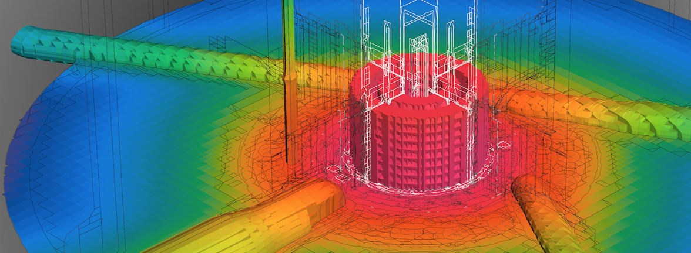

# Better Science through Software Testing

**Hero Image:**
- [High-flux isotope reactor]

#### Contributed by [Tom Evans](https://github.com/tmdelellis "Tom Evans GitHub Profile")

#### Publication date: February 2, 2018

*In November 2017, Tom Evans gave a webinar titled "[Managing Defects in HPC Software Development](https://ideas-productivity.org/resources/series/hpc-best-practices-webinars/#webinar012)" in the series [Best Practices for HPC Software Developers](https://ideas-productivity.org/resources/series/hpc-best-practices-webinars/).  In this article, Tom summarizes how the strategies he employs have helped his teams deliver better science.  Tom is a scientist at Oak Ridge National Laboratory; he leads the project "Coupled Monte Carlo Neutronics and Fluid Flow Simulation of Small Modular Reactors," part of the [DOE Exascale Computing Project](https://www.exascaleproject.org).*

 

One of the great challenges in computational science is the management of
software quality in a discovery-based endeavor.  A statement often expressed
is that software quality engineering (SQE) is incompatible with
research-driven activities.  However, science and engineering achieved through
computational modeling and simulation necessarily require software
applications.  The applications are the mechanism through which the science is
achieved.  As platform architectures have become more and more complex and
powerful, thus enabling more detailed physical and numerical models, the
complexity of the software applications has grown apace.  We are long past the
era when a single researcher could perform meaningful computational modeling
and simulation with a private, one-dimensional simulation.  Today's scientific
applications on HPC platforms are maintained by teams of developers across a
range of scientific disciplines and institutions, and they use a wide range of
third-party libraries in order to successfully achieve performance.  The
single app/single developer model is out of date.

To illustrate this situation, we consider a
simulation code that is used to model combustion.  Such an application will
have modules for atomistic chemistry, fluid flow, heat transfer, and radiative
transfer, all tightly coupled.  The fluid flow module itself may have several
models for both compressible and incompressible flows, multiphase, and so on.
Now, we assume that a researcher has implemented a new differencing scheme in
the incompressible flow solver.  Being a talented and diligent numerical
analyst, the researcher mathematically determines that the method should be second-order
accurate. The method is implemented, and flow verification problems yield
first-order convergence.  Now, we must answer the question, "Is this a code
bug or an error in analysis?"

SQE practiced in an agile manner appropriate for discovery, research-based
endeavors can help answer this question.  So, not only is SQE compatible with
research-driven software development, it is essential.  This is especially
true for parallel applications that model coupled physics because these are
much more difficult to design, test, and analyze than serial, single-physics
applications.

The SQE practices that we promote heavily are those that fit naturally into
iterative, agile software-development processes, since these are generally the
most effective workflows for scientific software in which the complete methods
and models are rarely known ahead of time.  The most effective practices are
those that catch defects as closely as possible to their introduction.  The
cost of fixing defects, whether they occur in requirements (choosing the wrong
model), implementation (code errors), optimization (algorithm selection such
as O(N) versus O(logN) in performant code), or elsewhere, rises dramatically
as a function of time of introduction.  Consider the following simple example. If a vague
requirement led a developer to embark on a 6-month effort to write a
compressible solver, when the client actually wanted an incompressible solver,
at delivery there would be a significant cost in fixing this problem resulting
from the misunderstood requirement.  Six months of developer time spent working on the wrong product could have
been avoided had the "defect" in requirements
been identified at the start.

Two methods that we use to help catch defects that occur in code construction
are unit tests and Design-by-Contract(TM) (DBC).  Used together, these methods
are effective at catching errors that make their way into code as it is
written.  These practices provide software verification as close to code
construction time as possible.  Thus, the overall cost of the software is reduced.  The webinar "[Managing Defects in HPC
Software Development](https://ideas-productivity.org/resources/series/hpc-best-practices-webinars/#webinar012)" illustrates the processes we use to integrate
unit testing and DBC into our daily code-development workflow.

<!---
Featured: 1
Publish: yes
Categories: reliability, planning
Topics: testing, design
Tags: bssw-blog-article
Level: 2
Prerequisites: default
Aggregate: none
--->
