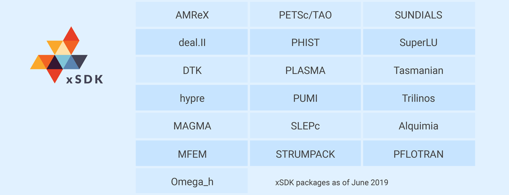

# Building Community through Software Policies

#### Contributed by [Piotr Luszczek](https://github.com/luszczek) and [Ulrike Meier Yang](https://github.com/ulrikeyang)

#### Publication date: August 12, 2019

**Hero Image:**

- 

It takes a whole community to build a sustainable ecosystem consisting of various independently developed software products that work well together. Providing a set of guidelines is an essential ingredient.  This article discusses community policies for long-term development of a sustainable software ecosystem for scalable high-performance libraries and applications. 

### Building a software community

The design of the Extreme-scale Scientific Software Development Kit (xSDK, see https://xsdk.info) has been
driven by the vision to provide  a collection of related
but highly diverse software products that enable and support the rapid
development of large, well-performing application codes. The
realization that software development is a community process was the initial
thought that guided the xSDK project. This approach may be partially attributed to the
interdisciplinary nature of computational science in general and to the xSDK's
founding team in particular. Furthermore, the race toward extreme-scale
computing became a true catalyst of the xSDK effort, with its focus on achieving
a productive and sustainable software environment.  We contrast this endeavor with
moonshot-like projects that achieve a narrowly defined goal, where any benefits
beyond the specific target are purely coincidental. By bringing together community-building
qualities and software-development practices, the xSDK is working to achieve
longevity by following a cohesive set of principled guidelines that now benefit
the broad efforts to make exascale computing a reality. The founding
packages that conformed to the initial set of community policies were few. Over
time, however, the number has grown and is now approaching 20, with new packages
joining every year (see the figure above).

### Basic design of community policies

At the onset of the xSDK project, it became clear that to achieve the seamless
coordination required to build a variety of software libraries---that are actually
developed independently at different institutions---required a set of guidelines.
To this end, the founding representatives of the xSDK member packages put
together an initial draft of xSDK community policies. This draft was a
result of lengthy discussions among software experts who all shared the goal of
overcoming incompatibilities among their respective software packages that 
hindered building and using the xSDK libraries in
combination with each other. Other benefits of these consistent policies include
better software quality, productivity, and sustainability.

The xSDK community guidelines (https://xsdk.info/policies) consist of two sets
of policies: (1) *mandatory policies* that affect software quality and ensure
compatibility among xSDK libraries and (2) *recommended policies* that affect
additional software quality and sustainability topics. The recommended policies
are not necessarily less important than the mandatory policies; instead,
recommended policies could be initially categorized as "recommended" to provide
existing members with time to achieve compatibility, and these policies could
become mandatory at a later time. An xSDK-compatible package is defined as a
package that satisfies all of the mandatory policies and can use or be used by at least
one other xSDK library.

### Allowing for gradual change

To keep the policies up to date and in line with new software developments, the
xSDK policy design process allows for policy evolution. The community at large
can propose amendments to existing policies as well as suggest new
policies. Proposals are then considered and voted on by the community at large
and members with existing xSDK packages. The procedure inherently provides a
balance between preserving compatibility and gradual obsolescence, as well as between
software engineering ideals and what is actually feasible. The latter leads to
recommended policies, which---again---are not necessarily less important than
mandatory policies but provide some members more time to achieve
compatibility before becoming required as policy.

### Community of communities

Any software effort will at some point involve interactions with users, and the
interactions will lead to a number of known outcomes, including various
bugs that range in severity as well as issues with the software features
themselves, where they can be too advanced or insufficient for the intended
purpose. Similar effects may be observed when the community-defining policies
are introduced to a wider audience. Hence,  feedback from the participating
teams becomes an important aspect for maintaining the relevance of the policies.

For that reason, the xSDK core development team reaches out to other groups to
seek additional input and commentary. An example of such outreach is the
involvement of application developers and staff members from leadership-class
computer facilities. Their feedback sometimes falls outside the prevailing views
of the library developers and has a potential for contributing new ideas and
out-of-the-box thinking. After discussion, some of this new feedback finds its way into the new community
policies' release, leading to an overall improved set of policies.

The xSDK team always welcomes feedback, which can be provided at
https://github.com/xsdk-project/xsdk-community-policies.

### Author bios

Ulrike Meier Yang leads the Mathematical Algorithms & Computing Group in the
Center for Applied Scientific Computing of Lawrence Livermore National
Laboratory. She leads the xSDK project in DOE's Exascale Computing
Project and the Linear Solvers topical area in the SciDAC FASTMath Institute;
she is a developer of the software library hypre. She earned her Ph.D. in computer
science from the University of Illinois at Urbana-Champaign. Her research
interests are numerical algorithms, parallel computing, and scientific software
design.

Piotr Luszczek is a research assistant professor at the Innovative Computing
Laboratory in the University of Tennessee. Piotr earned his Ph.D. in computer science from the University of
Tennessee, Knoxville. His research interests include benchmarking, numerical
linear algebra for high-performance computing, automatic performance tuning,
and stochastic performance models. He has over a decade of experience
developing HPC numerical software for large-scale, distributed-memory multicore
systems with hardware accelerators. Piotr serves as a co-PI on the ECP xSDK
project that aims to improve access to world-class software on exascale
machines.

<!---
Publish: yes
Track: experience
RSS update: 2019-08-12
Categories: Collaboration
Topics: projects and organizations
Tags: bssw-blog-article
Level: 2
Prerequisites: default
Aggregate: none
--->
