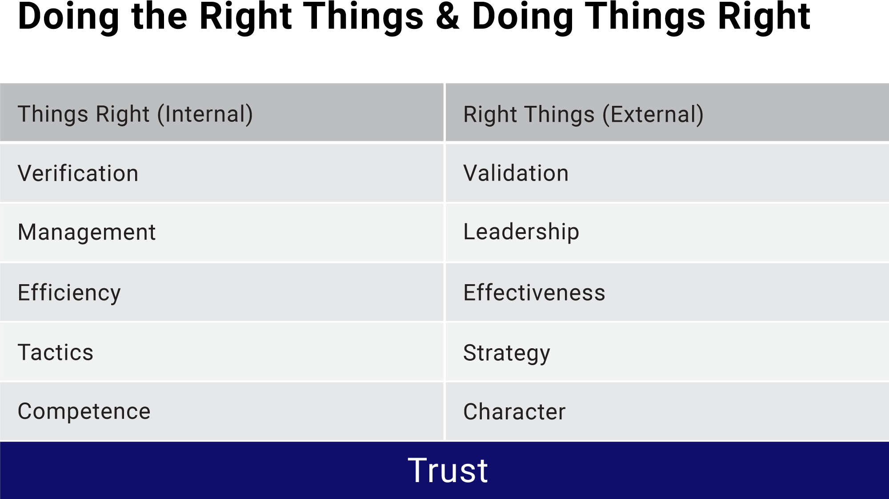

# Building Trusted Scientific Software

**Hero Image:**

 - 

#### Contributed by [Mike Heroux](https://github.com/maherou "Mike Heroux GitHub Profile")

#### Publication date: June 28, 2018

I have worked in the scientific software field for more than 30 years.  Long ago I learned the pithy phrase “Verification is doing things right, and validation is doing the right thing.”  I committed this phrase to memory in order to avoid confusion when the distinction between V & V mattered.  

### Pairing internal and external concerns

Verification focuses on internal concerns of a good software product such as unit testing, while validation focuses on the external, such as product relevance.   Which focus is most important?  Clearly, a product that does the wrong thing well (verified but not valid) is not useful.  When we consider the long lifespan of many scientific codes, however, a product that does the right thing poorly (valid but not verified) leads to high usage and maintenance costs and increases the risk of incorrect scientific results from undetected software errors.  In other words, both internal and external concerns are essential.

In recent years, I have come to appreciate that many other paired phrases acknowledge this internal-external complementarity.  The word pair efficient & effective has the same pithy phrase as V & V: “Efficiency is doing things right, and effectiveness is doing the right thing.”  The same substitution can be made for management & leadership and tactics & strategy.  

 
  

 
 

Other internal-external examples include coupling and cohesion, which are used to guide software design.  A software module should have high internal cohesion of its functions and data but only essential external coupling to other modules.  In another example, Fred Brooks illustrates the internal-external distinction in his statement “Scientists build in order to learn, and engineers learn in order to build.” A scientist seeks new scientific discovery, an external focus.  An engineer creates something, an internal focus.  Henry Ford highlighted the internal efficiency element of engineering when he said “An engineer can build for a nickel what any damn fool can build for a dollar.”

I find the internal-external complementarity framework useful in my planning and communication activities.  Furthermore, when assessing the status of project efforts, I think it is useful to look from both the internal and external perspectives, asking questions such as “Are we efficient and effective?”  Applying both perspectives to a scientific software product is beneficial because the skills required to address these complementary concerns are often distinct.  For example, when addressing software verification, we need software engineering skills and knowledge of good software testing practices.  When addressing validation, we need a domain scientist who is aware of how the software will be used to address scientific questions.

### Increasing trust through internal-external complementarities

Given the dual nature of internal-external complementarity, it might seem like our goal should be to balance our efforts so that both types of concerns are met.  However, I think a better approach is to consider advice from Steven M. R. Covey in his book *The Speed of Trust: The One Thing That Changes Everything*.  While his framework is more detailed, he argues that trust is our primary goal and that trust is a result of character and competence.  Character is who we are, doing the right things.  Competence is what we can do, doing things right.  

While Covey’s book focuses on human interactions and pursuits, I think a focus on trust is appropriate in the context of our scientific software efforts.  Therefore, while I think the internal-external complementarity framework is useful, we don’t want to strike a balance.  Instead, the real objective is increasing trust.  Internal-external complementarity frameworks help us build that trust.

Future blog posts will further explore these ideas.

<!---
Publish: yes
RSS update: 2018-06-28
Categories: skills
Topics: Personal productivity and sustainability
Tags: bssw-blog-article
Level: 2
Prerequisites: defaults
Aggregate: none
--->
