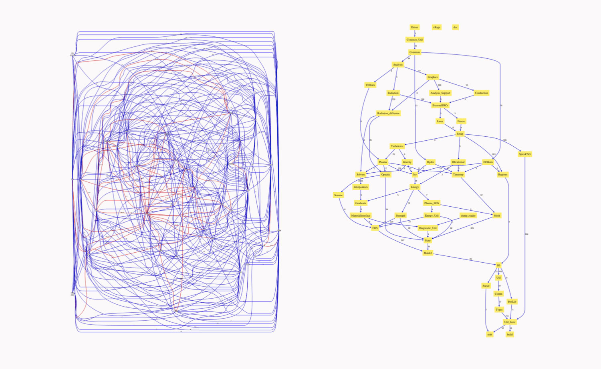

# Can You Teach an Old Code New Tricks?

#### Contributed by [Charles Ferenbaugh](https://github.com/cferenba "Charles Ferenbaugh GitHub Profile") 

#### Publication date: March 26, 2018

In January 2018, Charles Ferenbaugh presented a webinar titled “Bringing Best Practices to a Long-Lived Production Code” in the series Best Practices for HPC Software Developers on the IDEAS Productivity website. In this article, Charles explains challenges faced by the developers of long-lived production codes. Charles is a scientist at Los Alamos National Laboratory.

To view Charles's original webinar, and the full webinar series see the following links:

<a href="https://ideas-productivity.org/resources/series/hpc-best-practices-webinars/#webinar014" class="link-row">Bringing Best Practices to a Long-Lived Production Code</a>
<a href="https://ideas-productivity.org/resources/series/hpc-best-practices-webinars/" class="link-row">Series: Best Practices for HPC Software Developers</a>

  

There's a lot of interest in the scientific software community about how to adopt best practices and improve software quality.  In many cases, the discussion assumes (perhaps implicitly) that you’re starting a new project and a new code.  But what if you want to introduce best practices to an ongoing, years- or even decades-old project?  What if you already have a large and complex code base, a code team with well-established habits, and a user base using the code regularly?  While some projects have a history of good software practices, many others have major obstacles to quality:  hastily written software, minimal testing and documentation, and little or no software process.  A particular difficulty for such projects is a culture that thinks it is “getting along just fine, thank you” by doing what it’s always done.

Historically, many software projects have defined success as “just write the code, and write it fast.”  That definition can lead to some short-term benefits.  By writing code as rapidly as possible, a software project can quickly develop a capable code and build up a user base.  These actions allow the project staff to meet the next deliverable, write the next paper, or get the grant renewed.  Such a project can indeed “get along fine,” at least for a while.  But later on, the problems become evident.  The design is ad hoc, and the code is hard to understand.  New team members have a hard time coming on board and contributing.  The existing development team has difficulty maintaining the code, adding new features, or optimizing it to run on modern architectures.  In short, the project simply isn’t sustainable for the long term.

More recently, many projects have tried to introduce more sustainable development practices; but they often run into difficulties.  When a project has valued “write the code fast” from the beginning and has grown a culture around that value, the culture tends to affect many aspects of the project: 
*	How tasking, scheduling, and deliverables are decided
*	Which languages, programming models, and tools are used (or avoided)
*	How staffing is done (how many developers, and from what background)
*	How leadership is selected
*	How training and career development are done
*	How performance is evaluated

These choices become embedded in the project and reinforce each other, pushing the project in a certain direction.  This means that it’s difficult to make much progress in changing practices, unless the underlying values and culture can be changed and past choices can be reversed.

 

[xRage code dependency graphs: before (left) and after (right) untangling code dependencies]

 

Over the years at Los Alamos National Laboratory, we've seen several software quality initiatives that had minimal impact on our project practices, for many of the reasons described above.  But more recently, we’ve also seen management make conscious decisions to adjust their values and make significant changes in how the projects are run, enabling new and better development practices to take hold.  In one of our large multiphysics code projects, the development team has been given time and resources for major restructuring of the code base.  Build systems and version control are being modernized.  Unit testing and performance optimizations are being introduced.  The webinar "[Bringing Best Practices to a Long-Lived Production Code](https://ideas-productivity.org/resources/series/hpc-best-practices-webinars/#webinar014)" tells more of the story of these changes.

<!---
Publish: Yes
Track: experience
Topics: design, refactoring, software engineering
Pinned: no
--->
