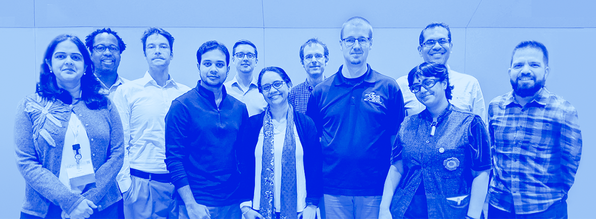
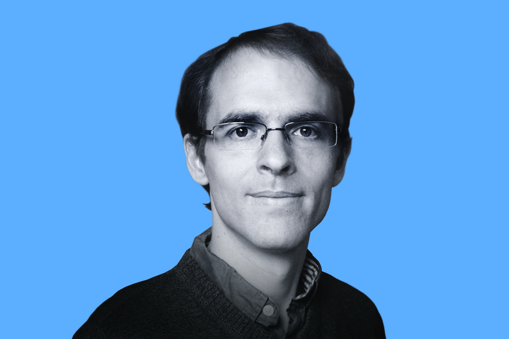
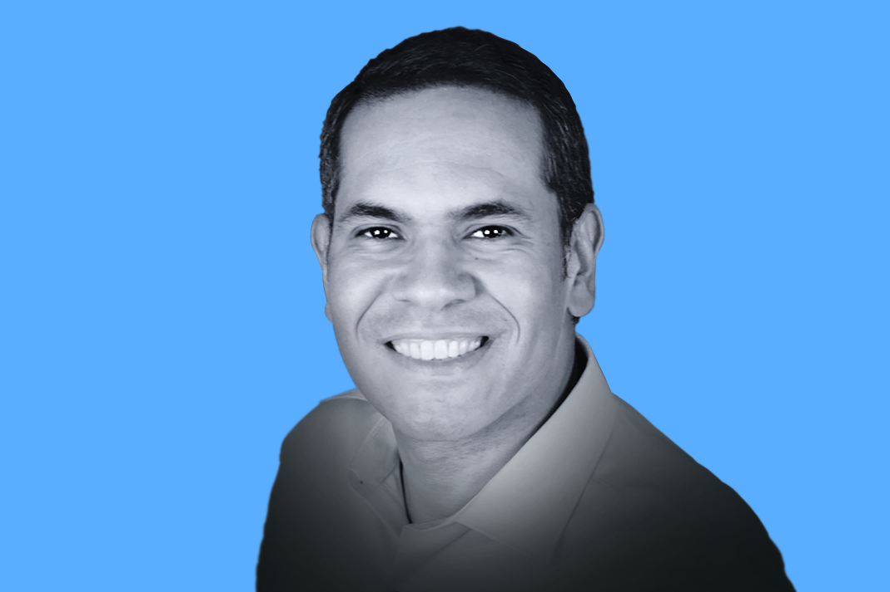
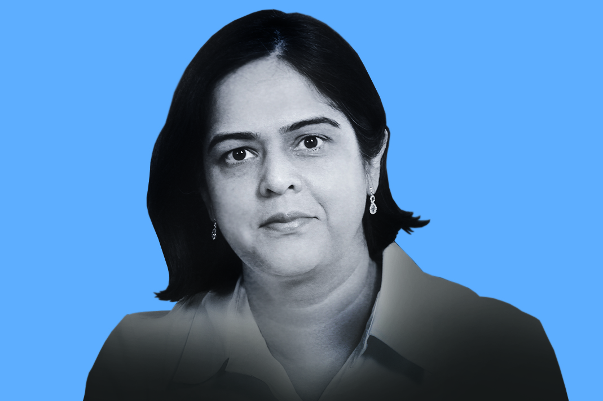
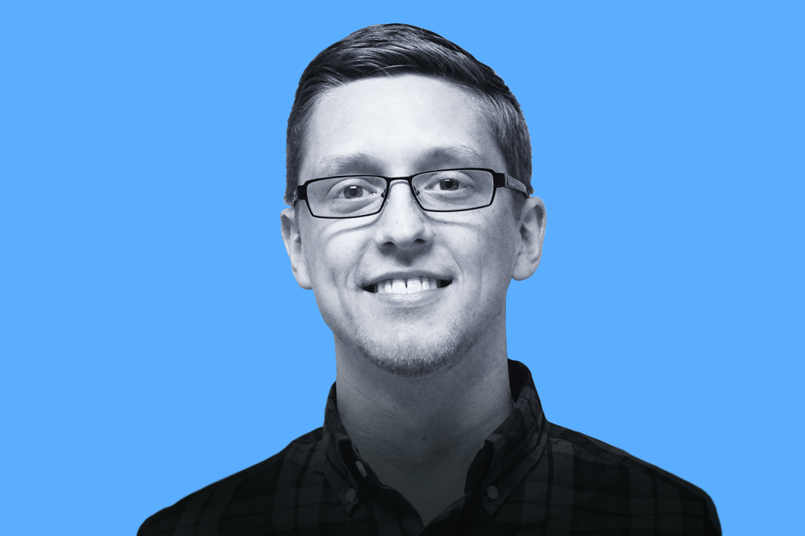

# 2019 BSSw Fellows Guide Developers through Each Stage of the Scientific Software Lifecycle

**Hero Image:**

- [2019 BSSw Fellows, 2020 BSSw Fellows and 2020 BSSw Honorable Mentions at the Exascale Computing Project Annual Meeting]

#### Contributed by [Hai Ah Nam](https://github.com/hnamLANL "Hai Ah Nam GitHub Profile"), [Rene Gassmoeller](https://github.com/gassmoeller "Rene Gassmoeller GitHub Profile"), [Ignacio Laguna](https://github.com/ilagunap "Ignacio Laguna GitHub Profile"), [Tanu Malik](https://github.com/TanuMalik "Tanu Malik GitHub Profile"), [Kyle Niemeyer](https://github.com/kyleniemeyer "Kyle Niemeyer GitHub Profile")

#### Publication date: July 17, 2020

BSSw Fellowships provide resources and community support to those who foster and promote practices, processes, and tools to improve developer productivity and software sustainability of scientific codes. 

During their tenure, 2019 BSSw Fellows have used their skills to create tutorials, webinars, and tools to guide developers through various stages of the scientific software lifecycle.  Here's more about what they have been up to.

### Fellows guide us through the social challenges of scientific software projects.
_Social skills matter for the development of user and developer communities._ 

BSSw Fellow Rene Gassmoeller created a series of guides and tutorials about managing the community around a scientific software project. Targeted at current and prospective software maintainers and community leaders, the tutorials teach this knowledge in small modules that are accessible to scientists. Thus, if you are currently leading or maintaining a scientific software project, or thinking about starting one, Rene's guides will help you navigate your scientific software project from inception to long-term sustainability. Learn more at [HPC Best Practices Webinar: Discovering and Addressing Social Challenges in the Evolution of Scientific Software Projects](https://bssw.io/events/webinar-discovering-and-addressing-social-challenges-in-the-evolution-of-scientific-software-projects) and [Scientific Software Projects and their Communities](https://bssw.io/blog_posts/scientific-software-projects-and-their-communities).

&nbsp;

  

  
Rene is an Assistant Project Scientist at The University of California, Davis's Earth and Planetary Sciences department.

  

_Perspectives on the BSSw Fellowship Program:_ When I started interacting with scientific software outside of my personal code, I realized that scientists who develop software face similar challenges across disciplines, and that a lot of these challenges have not been adequately solved so far. But I also noticed how much I could learn from the strategies that other maintainers have already developed. The BSSw Fellowship Program has given me the opportunity to extend these interactions and to make connections into fields I do not usually interact with. I hope my fellowship project has raised the awareness of how social skills matter for the development of user and developer communities around scientific software, and has some positive impact by helping maintainers navigate the social challenges of scientific software.

_Advice for new (prospective) BSSw Fellows:_ Plan on how to fit your fellowship project into your regular work! The BSSw Fellowship Program offers completely new perspectives and opportunities for collaborations, and you can gain valuable insights by connecting your discipline and background with the diverse community of BSSw.
 

### Fellows improve the reliability of scientific software through analyzing and debugging floating-point software.
_There is still much work to be done to make scientific applications more reliable in terms of correctness and numerical consistency._  

BSSw Fellow Ignacio Laguna developed tutorials on tools to debug and improve the reliability of scientific applications, with emphasis on floating-point software defects that are difficult to debug. Scientific software relies heavily on floating-point arithmetic, which replaces real numbers by finite precision numbers. Approximations occur at all levels, and programmers must deal with exceptional cases and sometimes hard to debug scenarios. With larger and more complex systems, e.g., using accelerators that do not fully implement the IEEE 754 floating-point standard, the need for such tools is becoming increasingly important to ensure the reliability of future scientific software. The tutorials present tools that can be used today (as opposed to tools that are in the research phase) to help programmers detect and fix abnormal floating-point behavior in GPUs, isolate compiler optimizations that can perturb the program output and/or trade performance for accuracy, understand the sensitivity of floating-point operations in the code, and possibly other issues. Learn more at [HPC Best Practices Webinar: Tools and Techniques for Floating-Point Analysis](http://ideas-productivity.org/events/hpc-best-practices-webinars/#webinar034) and [Tutorial on Floating-Point Analysis Tools](http://fpanalysistools.org/). 

&nbsp;

  

  
Ignacio is a Computer Scientist at The Center for Applied Scientific Computing at Lawrence Livermore National Laboratory.

  

_Perspectives on the BSSw Fellowship Program:_ My goal is to develop tools that impact real users working on production applications. I want to help programmers make their code more reliable and more efficient, not only in current HPC systems, but also on future systems.  I wanted to become a BSSw Fellow to the make the community more aware of the importance of software reliability, correctness, and numerical reproducibility in scientific software.  As a result of my project, I have been able to connect to a larger community of developers and potential users for my tools. The tutorials I co-organized were presented in several venues and some of the tools gained more interest from the community. There is still a lot to be done to make scientific applications more reliable in terms of correctness and numerical consistency. However, the BSSw fellowship enabled the dissemination of new ideas and tools to improve the current situation.

_Advice for new (prospective) BSSw Fellows:_ Plan as much as possible. My project was a tutorial. I learned good tutorials consume a significant amount of time in preparation and testing.

### Fellows reduce technical debt in scientific software development using reproducible containers.
_Technical debt is not necessarily bad, but unless paid off promptly it compounds, leading to increased costs, hidden debt, and irreproducible results, ultimately leading to abandoned ideas and reduced rates of innovation._ 

BSSw Fellow Tanu Malik developed activities to promote and disseminate the concept of technical debt among relevant communities. Experiments in systems research are challenging to reproduce; researchers have to choose between pursuing a fast-paced research agenda and developing well-organized, sufficiently-documented, and easily-reproducible systems. Like incurring fiscal debt, there are often tactical reasons to take on technical debt—such as deferring documentation, organization, refactoring, and unit tests when pursuing a new idea or meeting a conference deadline. Such debt is not necessarily bad, but unless paid off promptly, it compounds, leading to increased costs, hidden debt, and irreproducible results, ultimately leading to abandoned ideas and reduced rates of innovation. Her work focuses on dissemination of methods, tools, and environments in which experimentation and publication of results may accrue technical debt, but in which automated tools can be employed at any stage to pay off the debt, without passing it on to other involved parties. 

&nbsp;

 

  
Tanu is an Assistant Professor at DePaul University's School of Computing.

  

_Perspectives on the BSSw Fellowship Program:_ The BSSw Fellowship is a prestigious fellowship sponsored by the Department of Energy, which primarily focuses on high-impact ideas for scientific software productivity. The fellowship aims to bring together researchers in this emerging area and is very attractive. The fellowship has provided me with opportunities to connect with people working in containers in high-performance computing (HPC), and researchers who regularly face and solve performance-related bugs. I have learned about several new tools that are rapidly becoming part of a scientist’s data life cycle and existing gaps. I would like to positively impact the community by improving the scientific life cycle through methods from our project. 

_Advice for new (prospective) BSSw Fellows:_ The BSSw Fellowship provides a tremendous opportunity to connect with a diverse and very technical community. It is very important to understand the problems faced and position your work within the context of the existing work.  Engage, connect, and find productivity pain-points. 

### Fellows immerse you in software development best practices.
_We all benefit from developing more trustworthy, reusable, and sustainable scientific software._  

BSSw Fellow Kyle Niemeyer condensed and focused his 10-week course for Oregon State University graduate students on Software Development for Engineering Research into reusable bootcamp modules. The modules include hands-on lessons on version control, peer code review, open-source licensing and copyright, software and data citation, documentation, testing, parallel computing, and reproducible workflows. Kyle plans to deliver the workshop in the combustion and reacting-flows modeling community, and to make the modules openly available to the broader community. By educating researchers on both the importance of best practices, and then showing them in a hands-on fashion how to employ such tools, his efforts will help multiple research communities develop more trustworthy, reusable, and sustainable scientific software.  Learn more at [Research Software Development Modules](https://kyleniemeyer.github.io/research-software-dev-modules/) and [URSSI Winter School](https://github.com/si2-urssi/winterschool/blob/master/README.md).

&nbsp;

 

Kyle is an Assistant Professor at Oregon State University's School of Mechanical, Industrial, and Manufacturing Engineering.

  

_Perspectives on the BSSw Fellowship Program:_ My goal was (is) to develop modules for helping train researchers in best practices for software development, picking up after introductory lessons created by groups such as the Carpentries. I wanted to become a BSSw Fellow to help support the development of resources for teaching practical software development skills to researchers, particularly graduate students. This work will necessarily continue and evolve past my fellowship period, but the fellowship has helped me develop these resources and better connect with folks in the scientific software community.

_Advice for new (prospective) BSSw Fellows:_ Engage early and often with the BSSw/ECP team, and by extension researchers at the national laboratories. (Also, keep track of time. A year flies by quickly!)

### Learn more about the BSSw Fellowship program
BSSw Fellows are selected annually based on an application process that includes the proposal of a funded activity that promotes better scientific software. See more about the [BSSw Fellowship Program](https://bssw.io/fellowship) and work under way by the [2020 BSSw Fellows](https://bssw.io/blog_posts/introducing-the-2020-bssw-fellows). We will begin accepting applications for 2021 BSSw Fellowships during mid-August 2020. Register for the [BSSw mailing list](https://bssw.io/pages/receive-our-email-digest) to receive information.

### About the Photo
Pictured above are members of the BSSw Fellows community who attended the 2020 Annual Meeting of the DOE Exascale Computing Project. Left to right: Tanu Malik, Damian Rouson, David Rogers, Nasir Eisty, Kyle Niemeyer, Cindy Rubio-Gonzales, Rene Gassmoeller, David Boehme, Ignacio Laguna, Sumana Harihareswara, and Ivo Jimenez.

### Author bio
Hai Ah Nam is coordinator of the BSSw Fellowship Program, a member of the IDEAS-ECP team, and a computational physicist at Los Alamos National Laboratory. Her  background includes computational low-energy nuclear physics, large-scale scientific computing, and high-performance computing. She is leading LANL's Center of Excellence activities, helping  improve critical NNSA Advanced Simulation and Computing ([ASC](https://www.lanl.gov/projects/advanced-simulation-computing)) codes for advanced HPC architectures. She is an advocate for developer productivity and software sustainability and has been one of the organizers of the [DOE Performance, Portability and Productivity Annual Meetings](https://p3hpcforum2020.alcf.anl.gov/) since 2015.

<!---
Publish: yes
RSS update: 2020-07-17
Categories: collaboration
Topics: projects and organizations
Tags: bssw-blog-article
Level: 2
Prerequisites: default
Aggregate: none
--->
